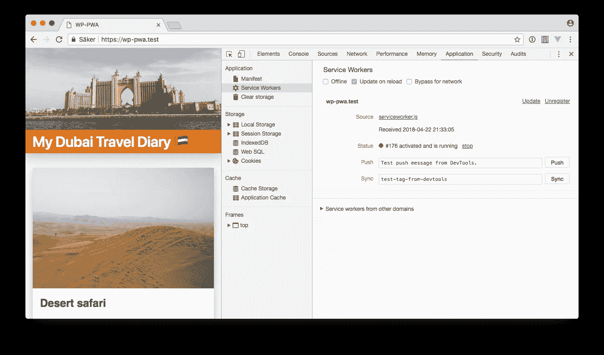
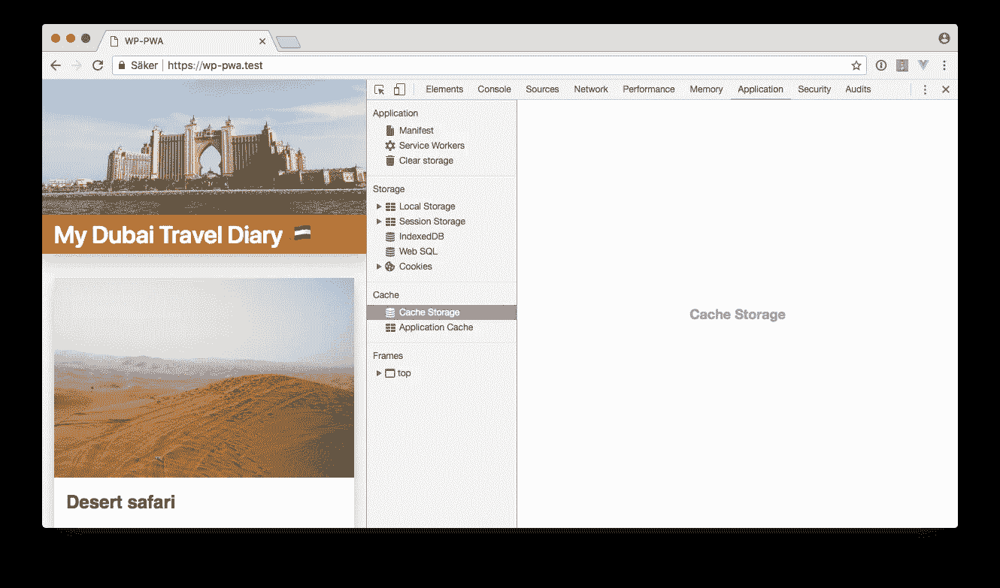
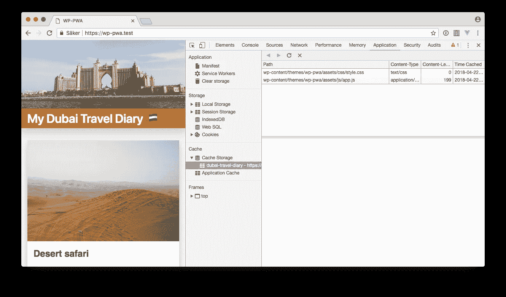
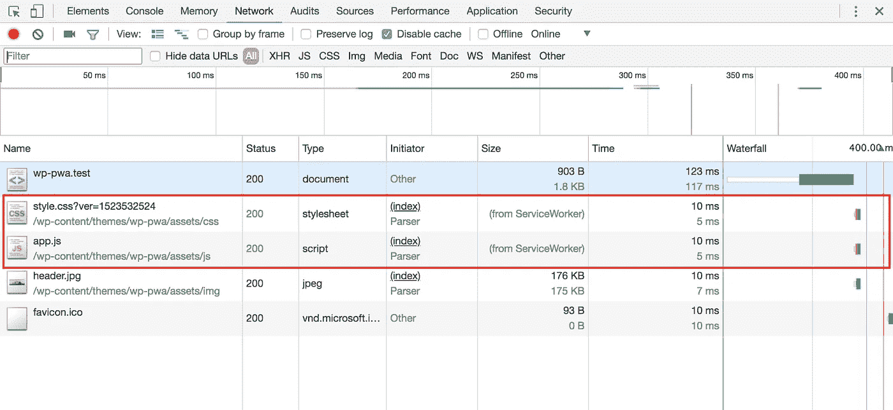
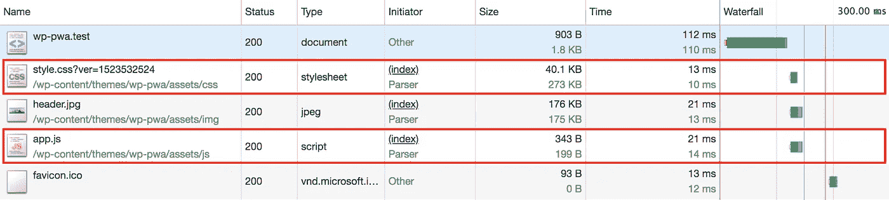
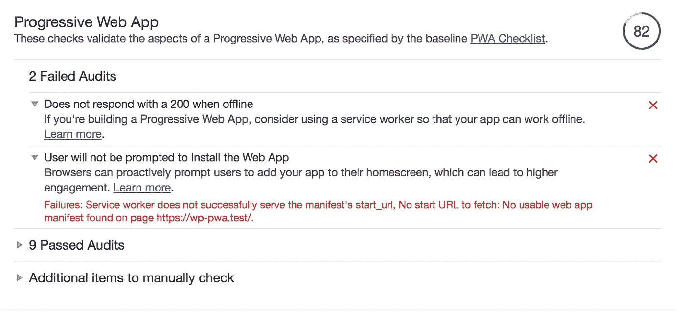
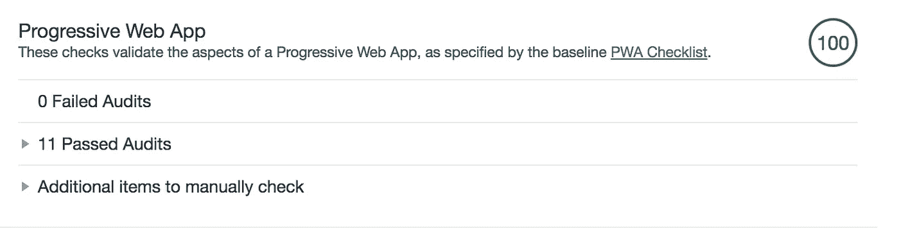

# 我正在做一个离线的第一个 WordPress PWA，第三部分

> 原文：<https://itnext.io/im-making-an-offline-first-wordpress-pwa-part-3-1ddf61891121?source=collection_archive---------2----------------------->

## 带工具箱的服务人员

这是这一系列博客帖子开始变得真正有趣的时候了！我们已经通过[让 HTTPS 在本地领域](https://medium.com/@stefanledin/im-making-an-offline-first-wordpress-pwa-part-1-6ae90ea672a4)上工作而温和地开始了。我们还创建了一个 manifest.json 文件。
但现在是时候开始真正的工作了，并深入研究服务人员，这是渐进式网络应用程序中最重要的组成部分。

## 但是什么是服务人员呢？

这听起来有点可怕，完全不可理解，就像这个行业的大多数事情一样。但就像那些事情一样，它们最终往往并不复杂。

> 服务人员是一个在后台运行的 JavaScript 文件，即使访问者已经离开网站，它也可以继续做事情。

这听起来可能有点可怕，尤其是因为我们已经被脸书和谷歌全天候跟踪。但是一个更加用户友好的使用领域是保持网络应用程序更新的可能性。假设你的 PWA 是一个待办事项列表。服务人员可以让它与数据库保持同步，而无需用户在浏览器中打开应用程序。

服务人员可以做的另一个例子是，您的 PWA 可以向用户发送推送通知。

> 但也许最重要的是，所有进出网络的请求和响应都要经过服务人员。

这意味着您可以用 JavaScript 操纵这些请求和响应。例如，如果您想将所有对扩展名为`.jpg`的文件的请求替换为类似于`funny.gif`的内容，服务人员允许您这样做。在这种情况下，请求会在服务人员处停止，甚至不会发送到网络。

一个更实际的例子是，服务人员可以管理一个专用于您的 PWA 的缓存，稍后我将回到这个例子。例如，`style.css`可以存储在那个缓存中。
由于所有网络请求都要经过服务工作者，它可以检查`style.css`是否已经存储在那里。在这种情况下，服务人员可以直接从那里返回样式表，而不是从服务器下载。

换句话说，通过减少网络请求的数量，服务人员可以对加载时间产生相当大的影响。

现在说够了。在这个小项目中，我的下一步是创建一个服务工作者，它将所有资产存储在一个缓存中。

[我之前写过](https://medium.com/@stefanledin/a-basic-service-worker-with-workbox-473fff5bbd9b)关于我试用 WorkBox 的时候。这是谷歌的一个库，它能以一种简单的方式为你管理缓存。

但我的第一个想法是在培训目的上从头开始编写自己的服务人员。serviceworke.rs 是一个很好的资源。

在这种情况下，在缓存中保存`style.css`的函数应该是这样的:

如您所见，您需要知道到`style.css`的确切路径，这可能还不是一个问题，但它将成为一个问题。由于我将使用优秀的 WordPress 插件[自动优化](https://wordpress.org/plugins/autoptimize/)来连接和缩小我的 JavaScript 和 CSS 文件，我不知道优化后的文件将被称为什么。

例如，优化文件可以这样命名:

```
./wp-content/cache/autoptimize/css/autoptimize_537ce15b533c7419959db13d757c910e.css
```

用正则表达式代替绝对路径可以解决这个问题。幸运的是，这可以通过 WorkBox 来完成。

```
workbox.routing.registerRoute(
  new RegExp('.*\.js'),
  workbox.strategies.networkFirst()
);
```

这就是我选择在这个项目中使用工具箱的原因。决定下来后，让我们开始工作吧！

## 创建并安装服务人员

第一步是注册服务工作者脚本。这是在“常规”JavaScript 文件中完成的。`app.js`既然如此。

`serviceworker.js`与所有常规的 WordPress 文件和`manifest.json`文件一起被创建在项目根目录下。

## 用 WorkBox 缓存 CSS 和 JavaScript 文件

WorkBox 让生活变得非常容易，至少在这种情况下。这些简单的代码行是实现我的目标所需要的一切:

首先导入工作箱脚本本身，然后注册一个“路径”。`registerRoute`函数的第一个参数是一个正则表达式，它将捕获所有的`.js`和`.css`文件。我可能会对此进行调整，使其仅捕获来自`/cache/autoptimize/`目录的文件，但我将在以后看到这一点。

第二个参数是我们选择应用于这些文件的策略。那么这种情况下的策略是什么呢？这是您选择处理网络请求的方式。
我选择了`cacheFirst()`策略，这意味着服务工作者应该直接从缓存中提供文件。这当然需要将文件存储在缓存中。如果没有，服务人员将照常从服务器下载。

也有像`networkOnly()`这样做完全相反的策略。缓存将被忽略，文件将总是通过网络从服务器下载。但是因为我想让网站尽可能的快和可靠，即使是在不稳定的连接上，我会选择`cacheFirst()`策略。

该策略将设置对象作为参数。目前唯一相关的设置是应该创建的缓存的名称。这个博客看起来像是我迪拜之旅的日记，因此得名`dubai-travel-diary`

## 有用吗？

重要的是要记住，当你第一次访问 PWA 时，它就像一个普通的网站。服务人员在第一次访问时安装，因此在第二次访问时生效。

您可以打开开发者工具，点击**应用**选项卡，查看服务人员是否处于活动状态。在左侧的面板中，有一个名为**维修工人**的菜单项。



但是如果你点击**缓存**，你会看到它是空的！`dubai-travel-diary`缓存不是应该在吗？



不，不是第一次来的时候。第二次访问网站后，文件才会出现在那里。(不，你不能只是重新加载网站，你必须在一个新的标签页/窗口中再次打开它。)



如果您切换到**网络**选项卡，您可以看到文件不再通过网络下载。由于服务工作器的存在，它们被从本地缓存中提供。



这是没有维修人员的情况:



## 灯塔报告

有了这个，灯塔报告中的 PWA 评分从 73 分提高到了 82 分！



这给我们留下了以下问题:

*   脱机时不响应 200
*   不会提示用户安装 web 应用程序

事实上，这两个问题都可以一蹴而就。

## 缓存首页

通过注册另一个将影响首页的路由，即`/`路径，它也将被存储在缓存中。

至少在最初，我会使用`cacheFirst()`策略，但是使用`networkFirst()`可能更合适，因为这是一个博客。我当然希望用户能在新的博客文章发表后立即看到它们。

但是现在是实验的时候了！也许`backgroundSync`可以用在某些方面？也许我应该重新构建主题，使其遵循[应用程序外壳模型](https://developers.google.com/web/fundamentals/architecture/app-shell)，并且用 JavaScript 将博客文章加载到静态模板中？

## 100% PWA

可能性有很多，这将在本系列的下一部分中探讨！可喜的是，该博客已经在灯塔报告中获得 100 PWA 分！



以前的零件:

*   第一部分:HTTPS
*   [第二部分:Manifest.json](https://medium.com/@stefanledin/im-making-an-offline-first-wordpress-pwa-part-2-b313659bfc9c)