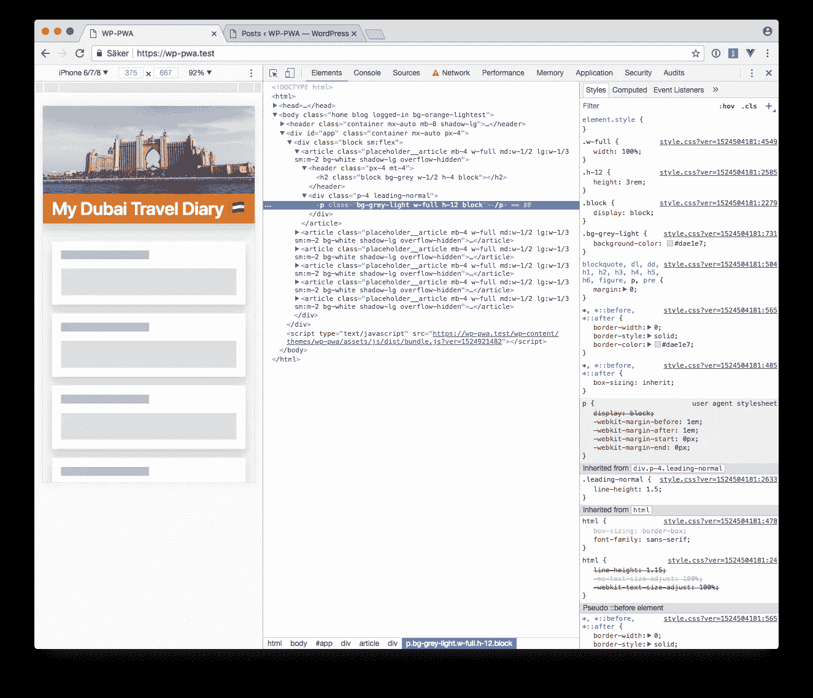
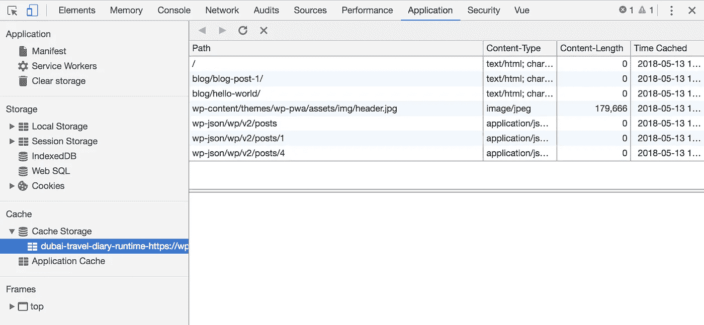
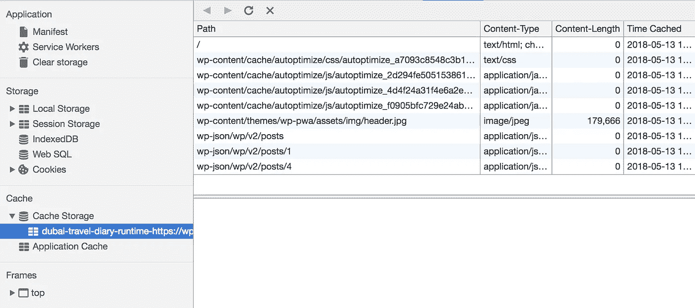

# 我正在做一个离线的第一个 WordPress PWA，第 6 部分

> 原文：<https://itnext.io/im-making-an-offline-first-wordpress-pwa-part-6-1f4beea6e641?source=collection_archive---------5----------------------->

## 单页应用程序

该系列由以下部分组成:

> [第一部分——HTTPS](/im-making-an-offline-first-wordpress-pwa-part-1-6ae90ea672a4)
> 
> [第二部分——manifest . JSON](/im-making-an-offline-first-wordpress-pwa-part-2-b313659bfc9c)
> 
> [第 3 部分——带工具箱的服务人员](/im-making-an-offline-first-wordpress-pwa-part-3-1ddf61891121)
> 
> [第 4 部分—应用外壳模型](/im-making-an-offline-first-wordpress-pwa-part-4-be2d06e6ff28)
> 
> [第 5 部分—先离线](/im-making-an-offline-first-wordpress-pwa-part-5-e3293faefb88)
> 
> [第 6 部分——单页 App](/im-making-an-offline-first-wordpress-pwa-part-6-1f4beea6e641) (本部分)
> 
> [第 7 部分—优化](/im-making-an-offline-first-wordpress-pwa-part-7-5d1ee68ec6bd)

在前一部分，我其实达到了我的目的，至少部分达到了。博客的首页离线工作，由于应用程序外壳模型和服务人员的缓存，几乎可以立即加载。

然而，换句话说，个人博客文章的页面需要改进。目前，它们的工作就像任何普通的页面一样，如果用户离线或网络连接不稳定，这就不好了。

我的第一个想法是按照我在头版上做的那样去做。服务器端呈现的模板将仅由占位符组成，这些占位符在客户端被替换为真实内容。



但是我后来意识到这种方法没有任何好处。假设有两篇带有以下 URL 的博客文章:

```
/blog/hello-world/
/blog/blog-post-1/
```

为了将这些保存在缓存中，就像首页一样，我可以将它添加到服务人员中:

```
workbox.routing.registerRoute(/\/blog\/.+/, workbox.strategies.staleWhileRevalidate());
```

问题是服务人员会将这些博客帖子视为缓存中的两个不同对象。当然它们是不同的，但是根据应用外壳模型，它们应该共享相同的模板。缓存中应该有三个对象:

1.  模板
2.  第一篇博客文章的 JSON 数据
3.  第二篇博文的 JSON 数据

但是客户端渲染的结果如下:

1.  第一篇博客文章的 HTML(占位符)
2.  第二篇博客文章的 HTML(占位符)
3.  第一篇博客文章的 JSON 数据
4.  第二篇博文的 JSON 数据

这是它在开发人员工具中的外观:



首页，两个博客帖子，一个标题图像，以及所有帖子和两个个人的 JSON 数据。

我有两个选择，因为这没有意义:

1.  遵循我的原则，将单个博客帖子切换到常规的服务器端渲染。
2.  违背我的原则，完全押在客户端渲染上，用 Vue 组件做 SPA(单页应用)。

违反了我的原则，我已经做了，所以我可以(和应该吗？)继续那样做。毕竟，这只是一个实验🤷🏼‍♂️

## SPA PWA

我喜欢这些首字母缩略词让我感觉多么聪明！

无论如何，在 Vue 路由器的帮助下，我可以相当容易地将博客转换成 SPA。

[](https://router.vuejs.org) [## 简介| Vue 路由器

### Vue.js 的官方路由器。

router.vuejs.org](https://router.vuejs.org) 

我不会详细说明它是如何工作的，但我可以简单描述一下它是如何制作的。

## index.php

该文件或多或少只包含以下内容:

```
<div id="app">
  <router-view></router-view>
</div>
```

`<router-view>`将被替换为当前路线应该显示的 Vue 组件。

## app.js

这是所有活动发生的地方。最重要的事情发生在第 8-17 行之间。

组件`index`应该显示在首页，当单个帖子被访问时，`singlePostContainer`正在被使用。

和以前一样，`index`组件从 JSON API 用 AJAX 加载所有博客文章。`singlePostContainer`做完全一样的事情，当然是为了一个帖子。

## serviceworker.js

这种新的解决方案意味着服务人员需要在缓存中存储以下内容:

1.  首页的模板(根据应用外壳模型的“外壳”)
2.  CSS，JavaScript 和图像。(JS 文件负责大部分渲染工作)
3.  博客文章的 JSON 数据。

`serviceworker.js`已按以下方式更新:

```
// The latest blog posts
workbox.routing.registerRoute('/wp-json/wp/v2/posts', workbox.strategies.networkFirst());// A single blog post
workbox.routing.registerRoute(/\/wp-json\/wp\/v2\/posts\/.+/, workbox.strategies.staleWhileRevalidate());
```

使用`networkFirst()`策略是因为我希望用户总是能够获得所有最新博客文章的最新列表。如果用户离线，它们将作为后备从缓存中提供。

单个博客帖子在发布后可能不会更新太多，所以这就是我对它们使用`staleWhileRevalidate()`策略的原因。这意味着服务工作人员将从缓存中获取 JSON 数据，还会发出网络请求并在后台更新缓存。换句话说，博文会在第二次访问时立即加载。

我还激活了 WordPress 插件[自动优化](https://wordpress.org/plugins/autoptimize/)来优化 CSS/JS 文件。我已经向服务人员添加了以下内容，以便将这些文件缓存到:

```
workbox.routing.registerRoute(/wp-content\/cache\/autoptimize\/.+/, workbox.strategies.cacheFirst());
```

我在这里使用`cacheFirst()`策略，因为这些文件永远不会被更新。如果我对我的任何文件进行了更改，自动优化将为优化后的文件赋予一个全新且唯一的名称(见下面的截图)。

这是所有更改后缓存的样子:



如您所见，它包含一个 HTML 文件、几个 CSS/JS 文件、一个标题图像和 JSON 数据。一旦新的自动优化文件被存储，删除旧的自动优化文件当然很好，但那是另一次冒险。

完整的服务人员如下所示:

这是这个系列的最后一部分吗？我的目标现在完全实现了:博客是一个离线工作的 PWA！但是仍然有一些可以调整的地方。Developer tools 中的性能审计给出了以下分数，这不是很讨人喜欢:


如果你像我一样，经常用#perfmatters 这样的标签发微博，这个项目就不会这样结束。所以我想我会在第 7 部分见到你！