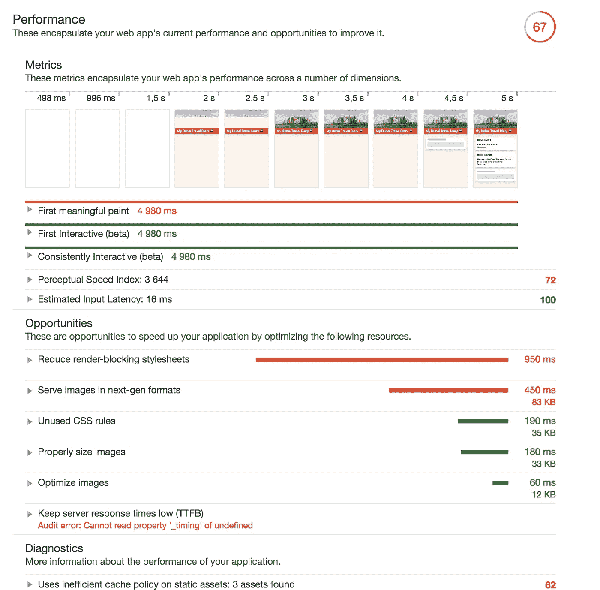
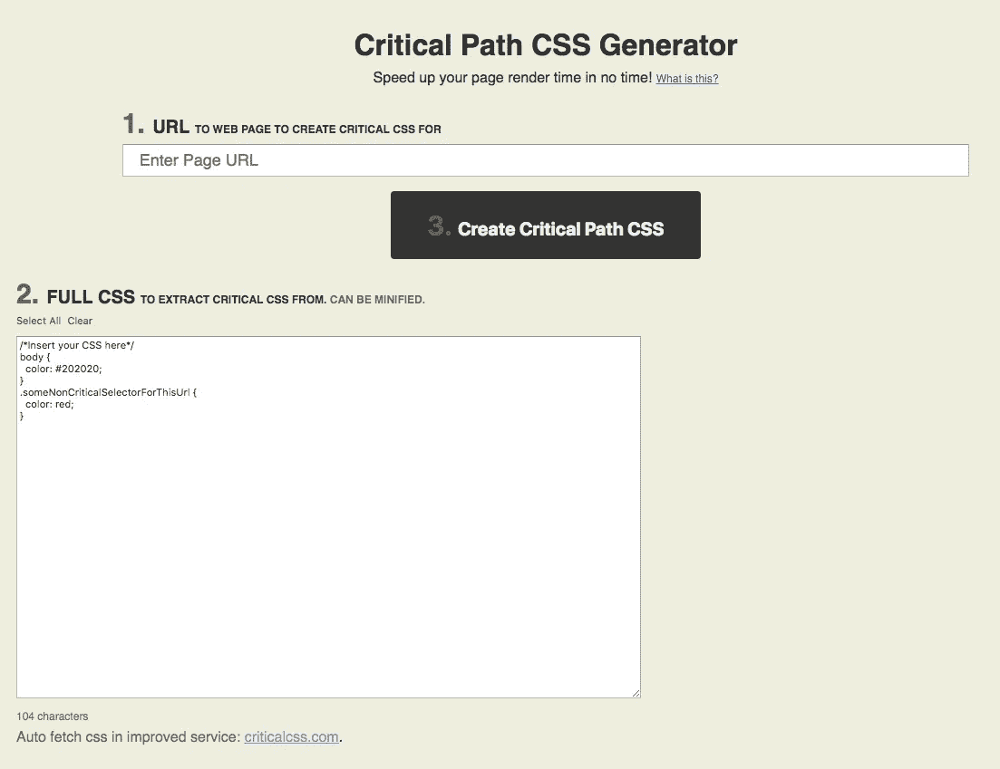
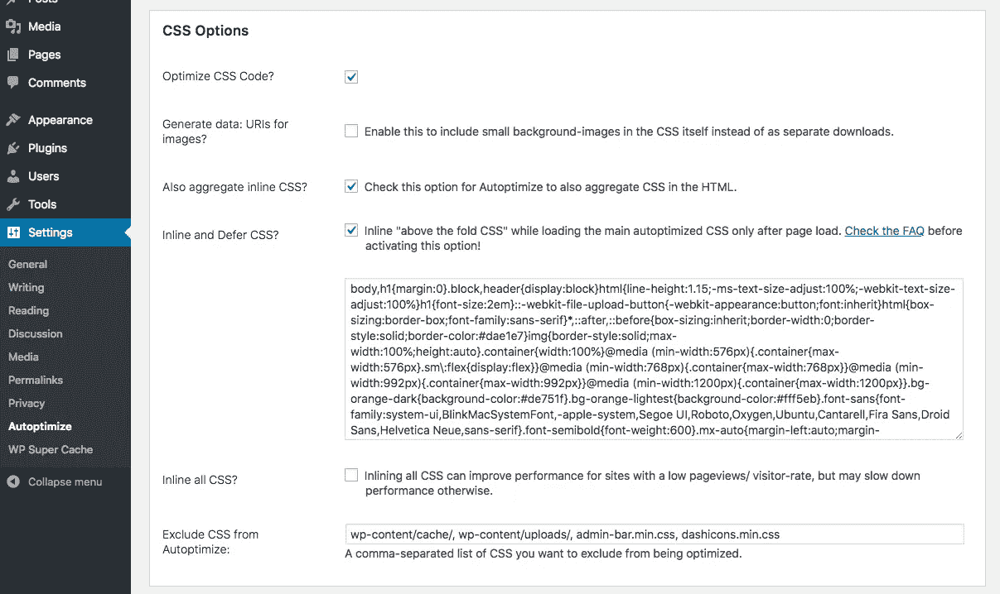
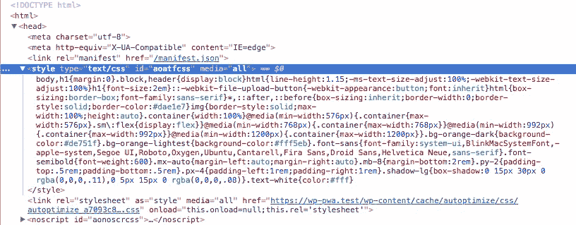
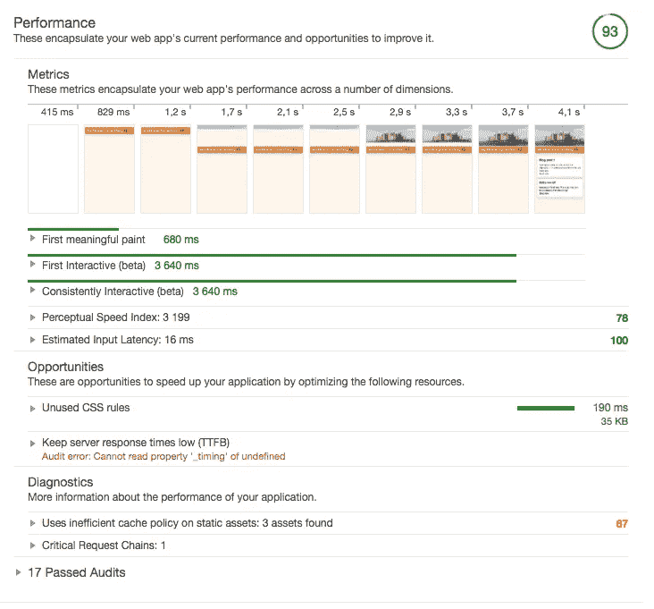

# 我正在制作一个离线的第一个 WordPress PWA，第 7 部分

> 原文：<https://itnext.io/im-making-an-offline-first-wordpress-pwa-part-7-5d1ee68ec6bd?source=collection_archive---------5----------------------->

## 最佳化

我以前说过，过分依赖客户端渲染违背了我的原则。据说(？)从 SEO 的角度来看，如果服务器端呈现的 HTML 看起来像这样，那就没关系了:

```
<body>
  <div id="app"></div>
</body>
```

但是从性能的角度来看，这更糟糕，因为在站点上渲染像素需要更长的时间。浏览器应该解析 HTML，构建 DOM，下载渲染阻塞样式表，稍后还要下载脚本。

> 浏览器在执行 JavaScript 代码之前有很多事情要做。在普通的安卓手机上，这需要更长的时间。

但是 JS 框架已经在这里了，这让我很有兴趣看看我能以多快的速度写这个博客。*(我会忽略这样一个事实，即实际上存在渲染 Vue 的解决方案。JS 和 React 在服务器上。)*

## 情况

Chrome Developer tools 的性能审计如下所示:



67/100 分，无任何优化

在站点开始渲染之前的两秒钟根本不是一个好数字。你更希望在稳定的 3G 连接下，网站能在三秒钟内感觉到或多或少的满载。

根据报告，呈现阻塞样式表是最关键的问题。

> 减少呈现阻塞样式表

## 自动优化将解决一切

我之前已经放弃了几次 WordPress 插件[自动优化](https://wordpress.org/plugins/autoptimize/)。它实际上是我最喜欢的插件之一，因为它以一种简单的方式解决了多个问题。

自动优化将为你缩小 HTML，JavaScript 和 CSS。它还会将`defer`属性添加到`<script>`标签中，并将它们移动到 HTML 文档的底部。

但是自动优化真正强大的地方在于它可以帮助你进行“折叠以上”的优化。它在`<head>`中注入关键的 CSS 并延迟加载样式表。
你需要自己做的“唯一一件事”就是生成关键 CSS，但这可以通过在线工具[关键路径 CSS 生成器](https://jonassebastianohlsson.com/criticalpathcssgenerator/)相当简单地完成。



将生成的 CSS 复制并粘贴到自动优化的设置页面:



开发人员工具中的结果如下所示:



当我多次重新加载页面并确保服务人员更新了缓存时，我在性能审计中获得了以下分数:



93/100 的客户端渲染应用程序！但我怀疑这有点异想天开。这个博客只有两个帖子，每个帖子都包含几个句子。在现实生活中，博客上肯定会有大量的图片。对加载速度有很大影响并会增加 JavaScript 执行等待时间的图片…

但是我将把这个故事留到以后再讲，并在这里结束这个系列。感谢您花时间通读这个系列，我希望您已经学到了一些东西。我当然有！

以前的零件:

*   第一部分:HTTPS
*   第二部分:Manifest.json
*   [第 3 部分:带工具箱的服务人员](https://medium.com/@stefanledin/im-making-an-offline-first-wordpress-pwa-part-3-1ddf61891121)
*   [第四部分:应用外壳模型](https://medium.com/@stefanledin/im-making-an-offline-first-wordpress-pwa-part-4-be2d06e6ff28)
*   [第五部分:先下线](https://medium.com/@stefanledin/im-making-an-offline-first-wordpress-pwa-part-5-e3293faefb88)
*   [第六部分:单页 App](/im-making-an-offline-first-wordpress-pwa-part-6-1f4beea6e641)