# 对不起，我把你想当然了……(证据)

> 原文：<https://itnext.io/im-sorry-openshift-i-ve-taken-you-for-granted-the-evidence-dd7a7d471fa1?source=collection_archive---------2----------------------->

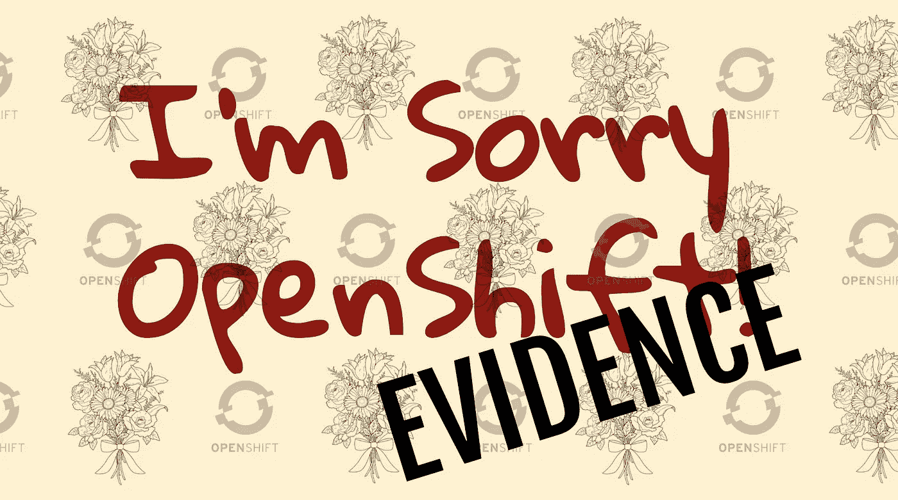

本文是旨在了解 Kubernetes 应用程序开发入门的两篇文章的第二部分。请看这里第一部分 [**对不起 OpenShift，我把你当成了**](https://medium.com/@graemecolman/im-so-sorry-openshift-i-ve-taken-you-for-granted-f36fb47ea4d9)

我写这篇文章是因为我与客户(我在 Red Hat 工作)就 Kubernetes 上的应用程序开发以及为什么 OpenShift 上的应用程序开发与众不同进行了多次讨论。

因此，我首先要让他们明白的是，Kubernetes 是 Kubernetes，OpenShift 是一个 Kubernetes 平台，就像 AK 或 EKS 是 Kubernetes 平台一样。这些平台都增加了针对其目标用户群的价值。一旦解决了这个问题，接下来的问题就是一个平台相对于另一个平台增加了什么价值。

所以，我想我应该以*的结论写一篇文章:“嘿，让你的代码在 AKS、EKS、DIY Kubernetes 或“另一个 Kubernetes 平台”* ***(我将把这个称为 AKP)*** *或在 OpenShift 上运行没有什么区别，答案是……它们都真的很容易！”*

所以，我想我应该在 AKP 和红帽 OpenShift 容器平台(OCP 或只是 OpenShift)上做一个非常简单的“Hello World”的例子，以探索任何差异和相似之处。

然而，在写这篇文章时，我意识到我已经习惯使用 OpenShift 很长时间了，并看到它成长为一个令人敬畏的平台，其价值超越了 Kubernetes 发行版。实际上，我认为 OpenShift 的成熟和简单是理所当然的，并强调了 OpenShift 的一些亮点。

这篇文章是一个关于我如何在两个平台上建立和运行我的“Hello World”的一步一步的客观指南(好吧，也许是一点点意见！).如果你想对同一件事有一个完全主观的看法，那么**我这里有另一个帖子** :) [[URL]]对于这个帖子，我会尽量坚持事实！

# 集群

所以我的“Hello World”需要集群。我没有走公共云路线，因为有些事情意味着要为计算、注册、网络、数据传输等付费。所以我选择了 Minikube[中的简单单节点集群工具](https://kubernetes.io/docs/tasks/tools/install-minikube/)(用于 AKP)和[代码就绪容器](https://developers.redhat.com/products/codeready-containers/overview)(用于我的 OpenShift 集群的 CRC)。这两个工具设置起来都很简单，但是确实需要笔记本电脑上的大量资源。

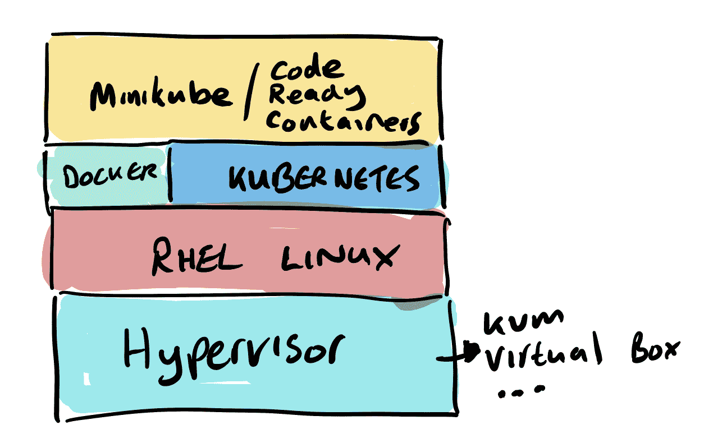

# 另一个 Kubernetes 平台(AKP)构建

流程如下…[流程步骤图]

# 第一步—构建我的容器映像

首先，我将把我们的“Hello World”部署到 minikube 中。所以我需要的是:

安装了 1 个对接器

安装了 2 个 Git

3-安装了 Maven(实际上我们在项目中使用了 mvnw 二进制文件，所以不一定需要它)

4-获取源代码:git 克隆[https://github.com/gcolman/quarkus-hello-world.git](https://github.com/gcolman/quarkus-hello-world.git)

我需要做的第一件事是创建 Quarkus 项目。如果你没有看过 Quarkus.io 网站，那么这简直太简单了。选择项目中需要的组件(RestEasy、Hibernate、亚马逊 SQS、Camel 等)。).通过选择这些组件，Quarkus 配置了一个 maven 原型，而我不需要做任何其他事情，然后它将整个事情推给 github，只需点击一个按钮。我知道你会对我构建“Hello World”项目的技能印象深刻，但点击按钮真的是我唯一的贡献，谢谢你。我爱夸库斯！

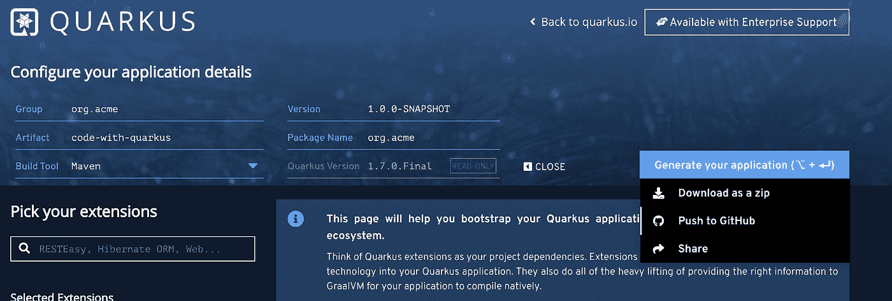

将我的 Hello World 构建成容器映像的最简单方法是使用 docker Quarkus maven 扩展，它将完成我的“Hello World”所需的一切。Quarkus 让它变得非常简单，只需添加“container-image-docker”扩展来添加从 maven 命令创建图像的功能。

**。/mvnw quar kus:add-extension-dex tensions = " container-image-docker "**

最后使用 maven 构建我的图像。这从我的源代码创建了一个容器映像，准备在我的本地容器运行时环境中运行。

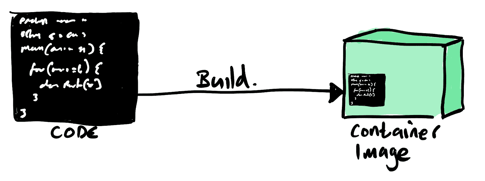

**。/mvnw-X clean package-dquarkus . container-image . build = true**

仅此而已。我准备使用 docker run 命令运行容器，映射端口 8080 以使我能够调用我的服务。

**docker run-I—RM-p 8080:8080 gcolman/quar kus-hello-world**

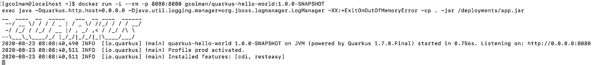

随着容器实例的运行，我只需要通过卷曲端点来测试我的 Hello 服务是否正在运行:

所以，这是非常甜蜜的，很好，很容易，刚刚工作！

# 第二步—将我的容器推送到容器映像存储库中。

我在本地容器存储中构建并存储了我的映像，但是如果我希望该映像在我的 AKP 环境中运行，我需要将我的映像存储在某个存储库中。Kubernetes 没有为我提供这些。我将使用 dockerhub，因为它有一个慷慨的免费层，这是大多数人都会使用的。

这相当简单，只需要你有一个 dockerhub 账户。

一个设置，把图像推送到 dockerhub。

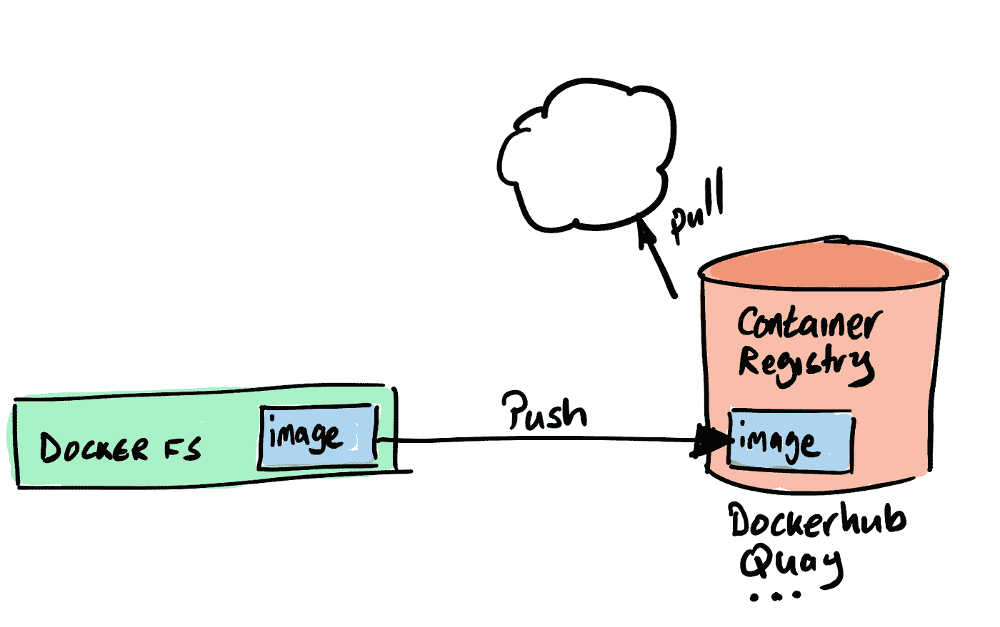

# 第三步——启动 Kubernetes

现在有很多方法来构建一个 kubernetes 配置来运行我的“Hello World ”,但我只想要最简单最省力的，因为我就是那种类型的人！

首先，启动我的 minikube 集群

**minikube 启动**

# 第四步—部署我的容器映像

我现在需要将我的代码和容器映像放入 kubernetes 配置中，我需要一个 pod 和部署定义，指向我的 dockerhub 容器映像。最简单的方法之一是运行指向容器映像的“创建部署”命令。

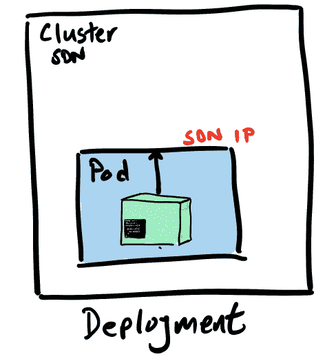

**kubectl 创建部署 hello-quar kus-image = gcolman/quar kus-hello-world:1 . 0 . 0-SNAPSHOT**

运行这个命令，我已经让我的 AKP 创建了一个部署配置，其中包括一个保存我的容器映像的 pod 规范。该命令还将配置应用于我的 minikube 集群，并创建了一个部署，该部署提取容器映像并在集群内的 pod 中运行。

# 第五步-创建对我的服务的访问

现在我已经部署了容器映像，我需要考虑如何配置对代码创建的 Restful 服务的外部访问。

有相当多的方法可以做到这一点。例如，我可以使用 expose 命令自动创建 Kubernetes 组件，如服务和端点，这就是我们将要做的。在我的例子中，我可以用下面的命令公开部署对象对象，以给出我们所需要的。

**kubectl expose 部署 hello-quar kus—type = node port—port = 8080**

在继续之前，让我快速看一下 expose 命令的“— type”。

当我们公开和创建运行服务所需的组件时，我们需要做的事情之一是将外部世界连接到位于内部软件定义网络中的 hello-quarkus 服务。**类型**参数允许我们创建和连接负载平衡器之类的东西，以将流量路由到网络中。

例如， **type=LoadBalancer** 将使一个自动配置的公共云负载平衡器能够插入到您的 Kubernetes 集群中。这很酷，但是请注意，这种配置将导致特定于公共云的配置，这种配置可能更难以跨环境跨 poK 实例移植。

在我的例子中，我使用的是 **type=NodePort** 。通过公开节点端口，我可以通过节点 ip:端口组合来访问服务。我需要这样做，因为我没有使用公共云，所以我需要做一些额外的步骤。我需要做的第一件事是部署一个负载平衡器，我将把一个 NGINX 负载平衡器直接部署到集群中。

# 第六步—安装负载平衡器

幸运的是，我正在使用 minikube，它具有一些平台特性，可以更容易地创建像 ingress 控制器这样的组件。Minikube 带有一个 Nginx 入口控制器，我只需要启用它，然后进行配置。

**minikube 插件启用入口**

我喜欢这种简单，它添加了一个 NGINX 入口控制器，在我的 minikube 集群中运行，只需一个命令！

**入口-nginx-控制器-69ccf5d9d8-j5gs9 1/1 运行 1 33m**

# 第七步—配置入口

所以，我现在需要配置我的 NGINX 入口控制器来接收 hello-quarkus。

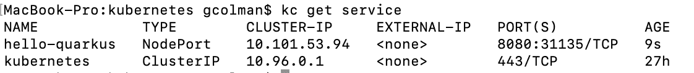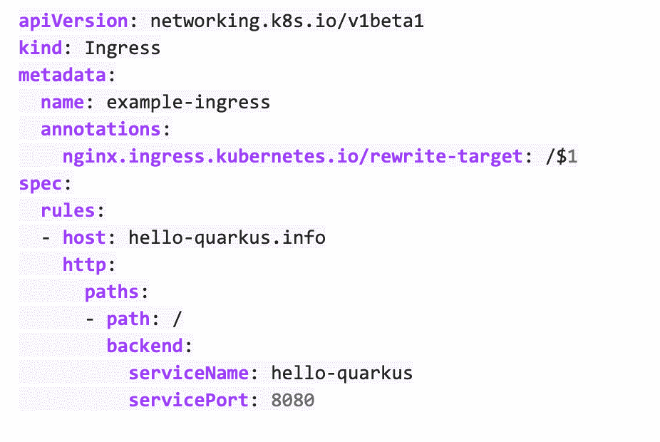

最后应用配置。

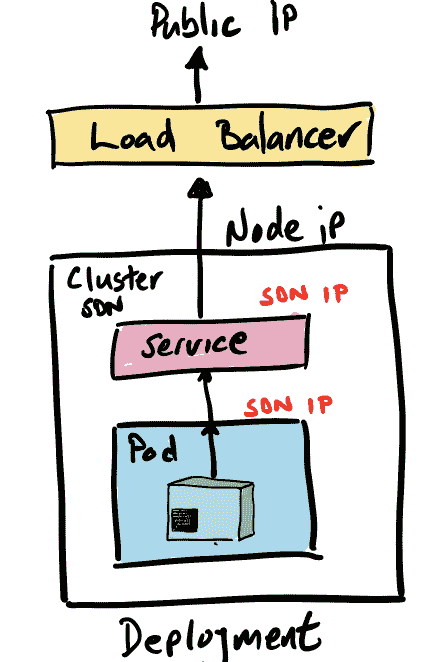

**ku bectl apply-f ingress . yml**

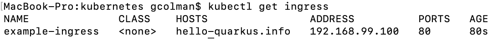

因为我在本地笔记本电脑上，所以我将把暴露的 ip 添加到我的/etc/ hosts 文件中，以将 http 请求定向到我的 minikube NGINX load balancer。

你好-quarkus.info

最后…现在你可以通过 NGINX 入口控制器作为外部服务访问 minikube 服务。

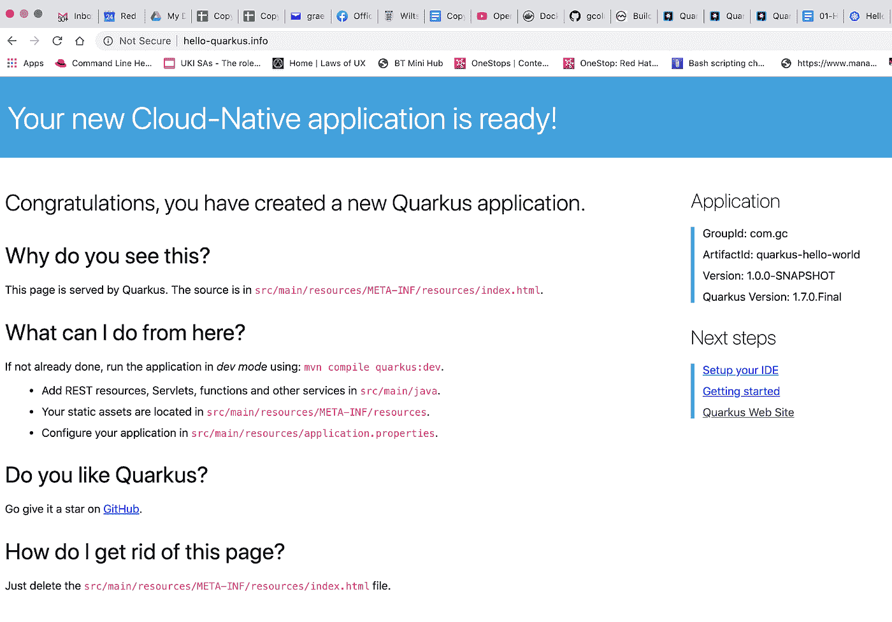

## 哇哦，那很简单，不是吗…不是吗？

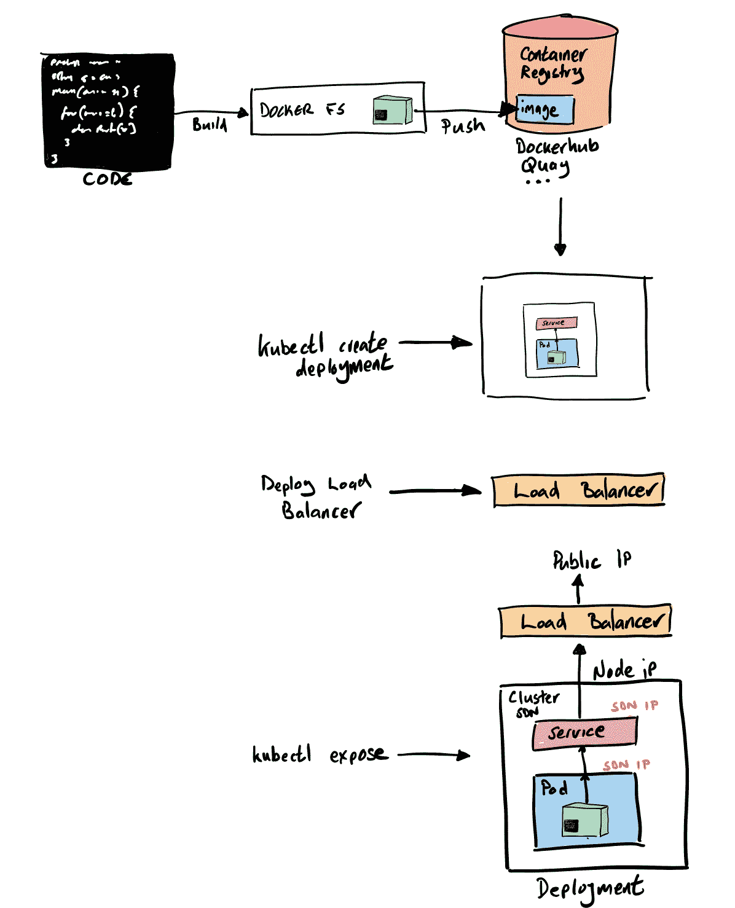

# 在 OpenShift(代码就绪容器)上运行

这里是我在 Red Hat OpenShift 容器平台(OCP)上部署相同代码的地方。

因此，在选择在 OpenShift 上运行我的示例时，类似于使用 minikube 的原因，我使用了代码就绪容器(CRC)形式的单节点本地 OpenShift 集群。这在过去被称为 minishift，它使用 OpenShift Origin 项目，CRC 是使用 Red Hat 支持的 OpenShift 容器平台的较新版本。

我在这个博客的**姐妹贴**中说，我从来没有打算让这个帖子成为“OpenShift 很棒”的文章，但是对不起， **OpenShift 很棒**！

我最初想说的是，在 OpenShift 上开发与在 Kubernetes 上开发没有什么不同，这在本质上是正确的，但在走过场的过程中，我忘记了 OpenShift 对开发人员有多友好。我喜欢简单，在 OpenShift 上建立并运行 hello world 的简单性让我无法不写这篇文章！

让我们来看看我需要经历的过程:

[[Openshift 过程]]]

等等，真的，…我不需要装 Docker？

**我不需要本地 git？**

**我不需要 Maven？**

**我不需要手动创建图像？**

**我不需要找图像库？**

**我不需要安装入口控制器？**

**我不需要配置 ingress？**

嗯，不，我不需要以上任何一个来启动和运行 OpenShift。下面是我经历的过程。

**步骤 1 —启动我的 OpenShift 集群**

我使用的是 Red Hat 的代码就绪容器，它本质上和 Minikube 一样，但是有一个完整的单节点 Openshift custer。

**华润创业**

**步骤 2——构建应用并将其部署到我的 OpenShift 集群中**

好了，这就是简单变得真实的地方。与所有 Kubernetes 发行版一样，有许多方法可以让应用程序在集群中运行。与我的 AKP 集群一样，我希望以最简单的方式启动并运行我的“Hello World”。

OpenShift 一直将自己定位为构建和运行容器应用程序的应用程序平台。构建容器一直是该平台不可或缺的一部分，因此有大量 Kubernetes 自定义资源可以提供帮助。

我将为我的 Hello World 使用 OpenShift 的源 2 图像(S2I)过程。S2I 有多种方法获取源代码(代码或二进制文件)并将源代码转换成在我的 OpenShift 集群中运行的容器映像。

我需要两样东西:

*   我在 git repo 中的源代码
*   构建所基于的构建器图像。

有许多受支持的和社区构建器映像，我将使用 OpenJDK 映像，因为，嗯，我正在构建一个 Java 应用程序！

我可以使用 OpenShift 开发人员控制台或命令行来启动 S2I 构建。我将使用 new-app 命令，指向构建器映像和我的源代码。

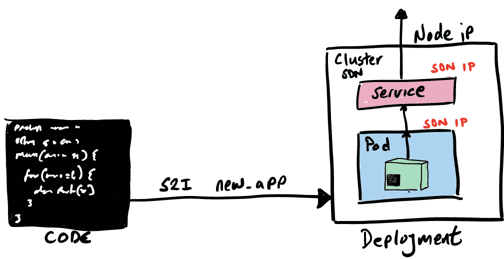

**oc new-app registry . access . red hat . com/ubi 8/open JDK-11:最新~ https://github . com/gcolman/quar kus-hello-world . git**

就这样，我的新应用就创建好了。S2I 进程:

*   创建了一个构建 pod 来为构建应用程序做“事情”
*   创建了 OpenShift 构建配置
*   将构建器映像放入 OpenShift 的内部 docker 注册表中。
*   在本地克隆了“Hello World”repo
*   看到有一个 maven pom，所以用 maven 编译了应用程序
*   用编译后的 java 应用程序创建了一个新的容器映像，并将这个容器映像推入内部容器注册中心
*   使用 pod 规范、服务规范等创建了 Kubernetes 部署。
*   开始部署容器映像。
*   移除了构建窗格。

这是很多东西，但要注意的关键是:所有的构建都发生在 OpenShift 内部，OpenShift 内部有一个 Docker 注册中心，这个过程创建所有的 Kubernetes 组件并在集群中运行它们。

如果我在运行 S2I 时查看控制台，我会看到一个构建窗格开始运行构建。

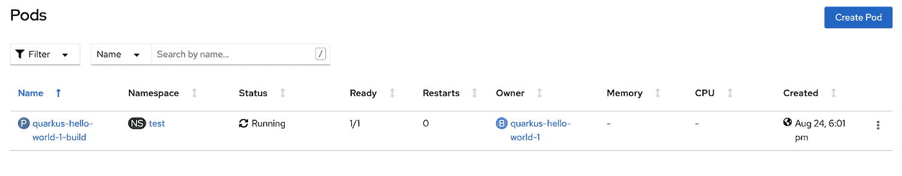

让我们看一下构建器 pod 日志，看看发生了什么。我能看到的第一件事是 maven 在做它的事情，为我的 java 构建引入依赖项。

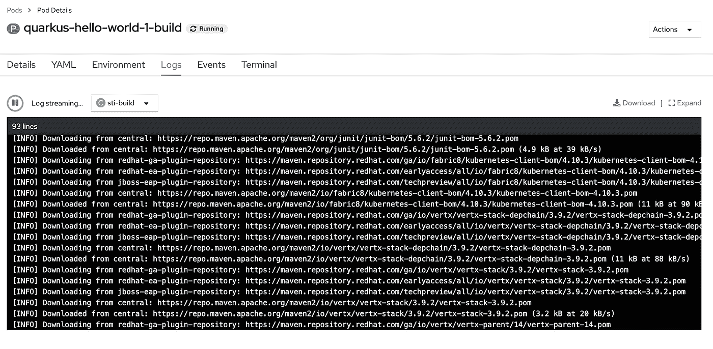

一旦 maven 构建完成，我可以看到容器映像构建正在进行，并最终将构建好的容器映像推入内部 repo。

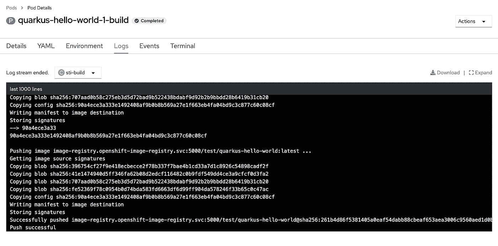

构建已完成！如果我查看我的群集，我会看到我的应用程序和服务正在运行！

oc 获取服务

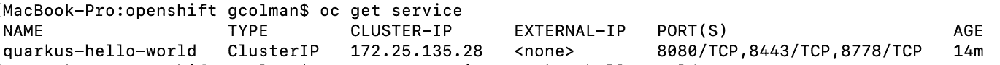

就是这样。一个命令。我需要做的另一件事是向外界公开服务。

**第三步——向外界公开服务**

与 AKP 的例子一样，我的 open shift“Hello World”需要一个路由器将外部流量定向到集群中我的服务。OpenShift 使这变得非常容易，不仅集群默认安装了 HAProxy 路由器组件(虽然这可以与 NGINX 之类的东西交换)，它还拥有自定义资源来配置被调用的路由，这类似于 plain old 中的 Ingress 对象。Kubernetes(事实上 OpenShift 路由极大地影响了 Ingress 设计，您可以在 OpenShift 中使用 Ingress 对象)，但是对于我们的“Hello World”和 OpenShift 中的几乎所有其他用例，我们将只使用路由。

要为“Hello World”创建可路由的 FQDN(是的，OpenShiift 有 DNS 来创建和路由服务),我们只需公开服务:

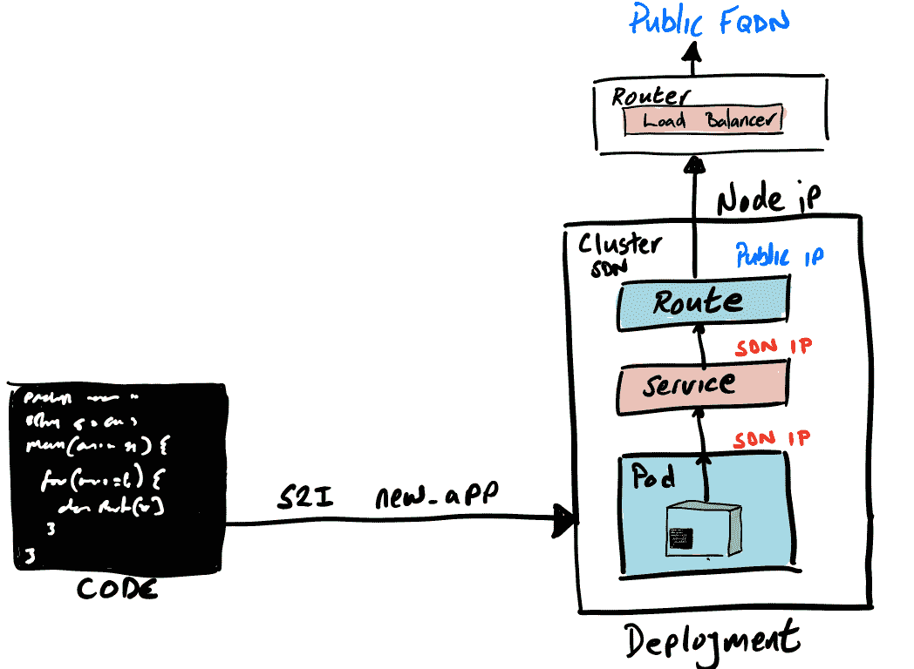

**oc 暴露服务 quarkus-hello-world**

如果我看一看创建的路线，我可以看到 FQDN 和其他路线的详细信息:

**oc 获取路线**

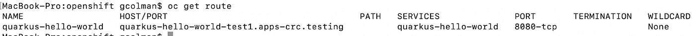

最后，从浏览器调用服务:

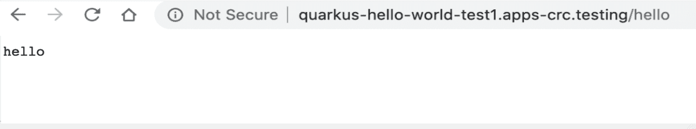

## 完成了。这很容易！

我喜欢 Kubernetes 和技术带来的一切，我也喜欢简单。现在，Kubernetes 被设计来使分布式的、可伸缩的容器变得非常简单，但是仍然不够简单，不能快速启动和运行。这就是 OpenShift 站出来为 Kubernetes 提供开发人员的地方。为了使 OpenShift 成为一个开发者友好的平台，已经投入了大量的精力，比如；S2I，ODI，开发者门户，OpenShift 操作框架，IDE 集成，开发者目录，Helm 集成，监控，…

希望你觉得这篇博文有趣并且有用。看看 [Red Hat Developers](https://developers.redhat.com/) 用 OpenShift 为开发者找到大量的资源、内容和满足感。