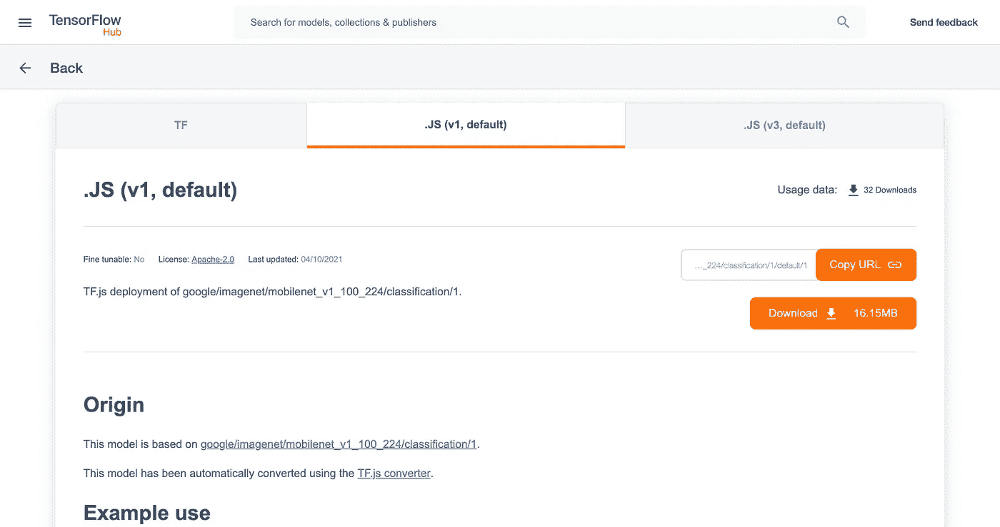

# 具有 NodeJS、TensorflowJS 和 MobileNet 模型的影像分类 API

> 原文：<https://itnext.io/image-classification-api-with-nodejs-tensorflowjs-and-mobilenet-model-45e3a79a5876?source=collection_archive---------2----------------------->


现在，通过 TensorFlow.js，开发人员可以使用 JavaScript 轻松运行机器学习模型。使用[预先训练的模型](https://github.com/tensorflow/tfjs-models/)，您可以轻松完成复杂的任务，不需要从头开始构建模型的知识。

TensorFlow.js 首次作为 web 浏览器的前端库。但是现在， [tfjs](https://github.com/tensorflow/tfjs) (又名 TensorFlow.js)支持在后端 JavaScript — Nodejs 中使用。这意味着您可以通过 Nodejs 而不是 Python 创建一个可以使用 TensorFlow 模型的 web 服务。

按照[这个示例代码](https://github.com/tensorflow/tfjs-models/tree/master/mobilenet#via-npm)，我们将构建一个包含 API 的 web 服务。API 将返回用户上传到服务器的图像的分类。

这个项目基于[这篇文章](https://levelup.gitconnected.com/tdd-with-typescript-and-jest-starter-project-cca94fd089f5)，需要你关于 Typescript，Nodejs，Express 的知识。

# 带有 express 的简单 web 服务

这部分的目标是创建一个 api 来处理文件上传到 expressjs 服务器。

结帐代码库:

```
$ git clone [https://github.com/hoangsetup/ts-jest-tdd-starter.git](https://github.com/hoangsetup/ts-jest-tdd-starter.git) ts-image-classification// Open project with VSCode
$ code ts-image-classification
```

安装依赖项:

```
$ npm install express express-fileupload -S// Install type definations, dev helper
$ npm install @types/express @types/express-fileupload nodemon -D
```

我用 [express-fileupload](https://www.npmjs.com/package/express-fileupload) 来处理上传文件，你可以用你喜欢的包。

快速申请:

```
// src/app.ts
import express from 'express';
import fileUpload from 'express-fileupload';
import controller from './image-classification/controller';const app = express();
app.use(fileUpload());app.post('/classify', controller.classifyImage);export default app;
```

这是一个简单的 express 应用程序，我们只有一条路线— `POST /classify`。这个文件中重要的事情是应用`fileUpload`中间件。

服务器:

```
// src/server.ts
import app from './app';const port = process.env.PORT || 3000;
app.listen(port, () => {
  console.log(`Server is listening on: ${port}`);
});
```

控制器:

```
// src/image-classification/controller.ts
import { Request, Response } from 'express';
import { UploadedFile } from 'express-fileupload';class Controller {
  async classifyImage(req: Request, res: Response) {
    const imageObject = req.files?.image as UploadedFile;
    res.json({ filename: imageObject.name });
  }
}export default new Controller();
```

使用 nodemon 监视和重启应用程序:

```
// nodemon.json
{
  "watch": [
    "src"
  ],
  "ext": "ts",
  "ignore": [
    "dist",
    "node_modules",
    ".git",
    "src/**/*.spec.ts"
  ],
  "exec": "ts-node ./src/server.ts"
}
```

现在，以监视模式启动服务器:

```
$ npx nodemon[nodemon] restarting due to changes...
[nodemon] starting `ts-node ./src/server.ts`
Server is listening on: 3000
```

尝试上传一个文件到服务，向`POST /classify`发送一个请求，请求体为`form-data`，其中包含一个关键字`image`:

```
$ curl --location --request POST 'localhost:3000/classify' \
--form 'image=@"/absolute_path_to_file/rabbit.png"'{"filename":"rabbit.png"}
```

# 带有 MobileNet 模型的 TFJS

安装依赖项:

```
$ npm install @tensorflow/tfjs @tensorflow/tfjs-node @tensorflow-models/mobilenet
```

*   @tensorflow/tfjs — [核心 TensorFlow.js 库](https://www.npmjs.com/package/@tensorflow/tfjs)
*   @ tensor flow/tfjs-node—[tensor flow . js node . js 扩展](https://www.npmjs.com/package/@tensorflow/tfjs-node)
*   @ tensor flow-models/mobilenet—[用于图像分类的 MobileNet 模型](https://github.com/tensorflow/tfjs-models/tree/master/mobilenet)是一个深度神经网络，经过训练可以[识别 1000 个不同的类别](https://github.com/tensorflow/tfjs-models/blob/master/mobilenet/src/imagenet_classes.ts)。

## 加载张量流模型

在 mobilenet 的自述文件中，下面的示例代码[用于加载模型。](https://github.com/tensorflow/tfjs-models/tree/master/mobilenet#via-npm)

```
import * as mobilenet from '@tensorflow-models/mobilenet';

// Load the model
const model = await mobilenet.load();
```

默认模型— [将加载 MobileNet_v1_1.0_224](https://github.com/tensorflow/models/blob/master/research/slim/nets/mobilenet_v1.md) 。模型由 [tfhub.dev](https://tfhub.dev/google/tfjs-model/imagenet/mobilenet_v1_100_224/classification/1/default/1) 提供。

我们可以通过向`load`函数提供 option 对象来决定加载哪个模型版本，如下图所示:

```
mobilenetModel = await mobilenet.load({
    version: 1 | 2,
    alpha?: 0.25 | .50 | .75 | 1.0,
    modelUrl?: string
    inputRange?: [number, number]
  }
)
```

## 从本地加载张量流模型

如果我们想使用自己创建的自定义模型，或者只是想在没有互联网连接的情况下提供服务。或者在我的例子中，`load`函数花了很多时间来下载模型，有时会出现`Timed out`错误。

对于这种情况，我们必须更新`load`函数的选项来触发文件系统加载器，而不是尝试使用 HTTP 请求加载器。

```
mobilenetModel = await mobilenet.load({
  version: 2,
  alpha: 1.0,
  modelUrl:
  'file://absolute_path_to_the_model/model.json',
});
```

从 [https://tfhub.dev](https://tfhub.dev) 中找到并下载模型，比如我们使用 [mobilenet_v1_100_224](https://tfhub.dev/google/tfjs-model/imagenet/mobilenet_v1_100_224/classification/1/default/1) 模型。



JS 的下载模型

将下载的模型提取到某个地方，然后将绝对路径更新为“file://absolute _ path _ to _ the _ model/model . JSON ”(需要 file:// protocol)。

## Mobilenet 分类

我们必须从图像缓冲区生成 Tensor3D。现在@tensorflow/tfjs-node 支持用`decodeImage`函数来完成，而不是通过“手动”来完成。

```
const tfimage = tfnode.node.decodeImage(imageBuffer) as tfnode.Tensor3D;
```

然后只需通过`tfimage`到`classify`函数加载移动网络模型

```
mobilenetModel.classify(tfimage);
```

我们不需要在对一幅图像进行分类时每次都加载模型。让我们将模型缓存到一个变量中。

完整代码:

`src/utils/mobilenet-classification.util.ts`

# 获得预测

这是本文的最后一部分，只是把所有的事情联系在一起。

在控制器中，让我们将上传的图像传递给`MobilenetClassifiction`实例的分类函数。

`src/controller.ts`

catch 块在分类的时候捕捉一些普通的错误，比如:图片太大或者上传的文件不是图片。

用一个简单的图片试试我们的服务:


cat.jpg—[图片来源](https://www.bbc.com/news/uk-england-stoke-staffordshire-52047832)

```
curl --location --request POST 'localhost:3000/classify' \
--form 'image=@"/Users/cat.lover/Downloads/cat.jpg"'
```

如果一切正常，下面的输出应该被打印到控制台(格式化)。

```
[
    {
        "className": "tabby, tabby cat",
        "probability": 0.4520637094974518
    },
    {
        "className": "tiger cat",
        "probability": 0.24747788906097412
    },
    {
        "className": "Egyptian cat",
        "probability": 0.10491712391376495
    }
]
```

第一个请求将花费更多的时间来加载模型。

# 摘要

正如您所看到的，TFJS 和预先训练的模型为 Javascript 开发人员提供了强大的力量。我们可以用最少的努力和 JS 代码行来创建一个复杂的机器学习任务的 webservice。

本文使用的源代码发布于 [Github](https://github.com/codetheworld-io/ts-image-classification) 。

感谢您的阅读！