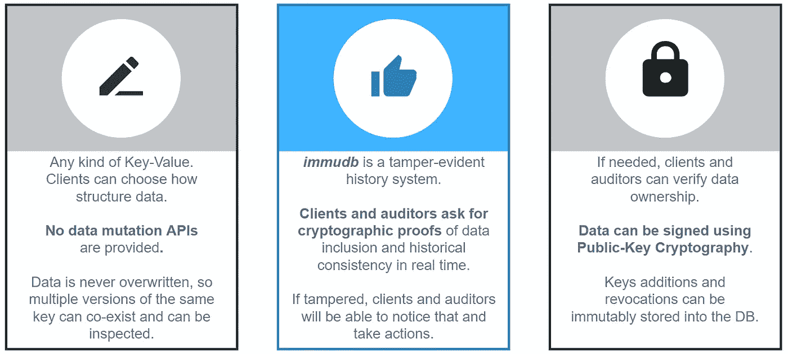
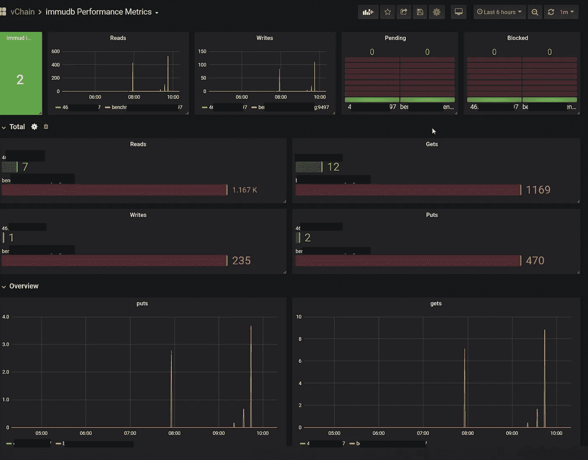

# immudb——开源不可变数据库

> 原文：<https://itnext.io/immudb-the-open-source-immutable-database-1f6e4bb5c79d?source=collection_archive---------3----------------------->

[immudb](https://github.com/codenotary/immudb) 是用于系统和应用程序的**轻量级、高速不可变数据库**。

使用 [immudb](https://github.com/codenotary/immudb) ，您可以跟踪交易数据库中敏感数据的变化，然后将这些变化永久记录在防篡改的 immudb 数据库中。

这可以让你保持一个不可磨灭的历史，比如说，你的借贷交易。

在 [Opvizor](https://www.opvizor.com) 中，我们已经使用 immudb 为 VMware vSphere 启用了不可变日志管理。

immudb 是在 [Apache v2.0 许可](https://github.com/codenotary/immudb/blob/master/LICENSE)下开源的，可以在这里找到(也有更全面的文档):

[https://github.com/codenotary/immudb](https://github.com/codenotary/immudb)


传统的事务日志很难扩展，并且不是不可变的。因此，没有办法确切知道您的数据是否已经受损。

您可以在此处找到示例视频:

[https://www.youtube.com/watch?v=rQ4iZAM14m0](https://www.youtube.com/watch?v=rQ4iZAM14m0)

# 它是如何工作的

因此，immudb 提供了**无与伦比的洞察力** **追溯到**您的敏感数据发生了什么，即使您的机密遭到破坏。immudb 通过在内部使用一个 **Merkle 树结构**来提供不变性的保证。

immudb 给你同样的**cyr photo graphic 验证**用 **SHA-256** 写的数据的完整性，就像经典的区块链一样，而没有与今天的区块链相关的成本和复杂性。

immudb 有 4 个主要优点:

1.  **immudb 是不可变的**。您只能添加记录，但**不能更改或删除记录**。
2.  存储在 immudb 中的数据是**加密一致且可验证的**，就像区块链一样，只是没有所有的复杂性并且速度很快。
3.  任何人都可以在分钟内用 immudb 启动**。无论是 node.js、Java、Python、Golang、。Net 或任何其他语言。它非常容易使用，您可以在几分钟内运行您的不可变数据库。**
4.  最后，immudb 是**开源**。你可以在内部或者在**云**中运行**，这是完全免费的。immudb 由 Apache 2.0 许可证管理。**

immudb 目前运行在 **Linux** 、 **FreeBSD** 、 **Windows** 和 **MacOS** 上，以及从它们衍生出来的其他系统，比如 **Kubernetes** 和 **Docker** 。

**immudb 高层**



# **入门**

您可以基于 GitHub 存储库中的 Docker 文件为最常见的架构构建 Docker 映像，也可以在 Dockerhub for Linux 上使用预构建的映像。

## 自己打造

```
docker build -t myown/immudb:latest -f Dockerfile . 
```

## immudb **Dockerhub**

```
docker run -it -d -p 3322:3322 -p 9497:9497 — name immudb codenotary/immudb:latest
```

# 独立二进制文件

如果您想自己构建**二进制文件**，只需[克隆这个 repo](https://github.com/codenotary/immudb) 并基于您的操作系统运行以下命令之一。

```
# Linux
GOOS=linux GOARCH=amd64 make immudb-static # macOS
GOOS=darwin GOARCH=amd64 make immudb-static # Microsoft Windows
GOOS=windows GOARCH=amd64 make immudb-static
```

然后，您可以运行 immudb 服务器

```
# run immudb in the foreground 
./immudb # run immudb in the background 
./immudb -d
```

**安装 immudb 作为服务**

安装服务时，请确保构建或下载 immudb 和 immuadmin 组件，并将其保存在同一工作目录中。

```
# install immudb service 
sudo ./immudb service immudb install # check current immudb service status 
sudo./immudb service immudb status# stop immudb service 
sudo./immudb service immudb stop# start immudb service 
sudo./immudb service immudb start
```

immud linux 服务使用以下默认值:

*   用户:immu
*   组:immu
*   配置:/etc/immudb
*   data: /var/lib/immudb
*   日志:/var/log/immudb
*   服务端口:3322 (immudb)，3323 (immugw)
*   普罗米修斯港口:9497

# 表演

由于 immudb 经常被比作 Amazon QLDB，我们使用一个简单的演示应用程序来写数据(没有使用任何不公平的优化)，进行了一次性能基准测试。

*   4 个 CPU 内核
*   英特尔至强处理器 E3–1275 V6 @ 3.80 GHz
*   64 GB 内存
*   （同 solid-statedisk）固态（磁）盘


# 普罗米修斯和格拉夫纳监测

immudb 有一个内置的 prometheus exporter，它默认在端口 9497 (:9497/metrics)发布所有度量。运行 Prometheus 实例时，可以像下面这样配置目标:

```
- job_name: 'immudbmetrics'
    scrape_interval: 60s
    static_configs:
         - targets: ['my-immudb-server:9497']
```

还有一个 Grafana 仪表盘:[https://grafana.com/grafana/dashboards/12026](https://grafana.com/grafana/dashboards/12026)



# 常见使用案例

我们已经从用户那里了解了以下使用案例:

*   使用 immudb 不变地存储对现有应用程序数据库的敏感数据库字段(信用卡或银行帐户数据)的每次更新
*   将 CI/CD 配方存储在 immudb 中，以保护构建和部署管道
*   将公共证书存储在 immudb 中
*   使用 immudb 作为数字对象校验和的附加哈希存储
*   存储防篡改的日志流(即审计日志)

[Opvizor](https://www.opvizor.com) —适用于 VMware vSphere 的不可变日志(syslog)解决方案

# immudb API 文档

您可以在此找到面向开发人员的快速入门指南:

[https://docs.immudb.io/master/jumpstart.html](https://docs.immudb.io/master/jumpstart.html)

这里还有一个 SDK 参考:[https://docs.immudb.io/master/sdks-api.html](https://docs.immudb.io/master/sdks-api.html)

# 没有程序员？

实际上，如果您不是程序员，但仍然想使用 immudb 只是为了在脚本中或周围玩玩，您可以使用 immuclient。

```
# Linux
GOOS=linux GOARCH=amd64 make immuclient-static # Microsoft Windows
GOOS=windows GOARCH=amd64 make immuclient-static
```

如果您不知道如何构建它，您可以使用下面的 Docker 命令和过程:

https://github.com/codenotary/immudb.git 的饭桶克隆

```
# Linux
docker run -it --rm -v $(pwd):/src golang:1.13-stretch sh -c 'cd /src && GOOS=linux GOARCH=amd64 make immuclient-static'# Microsoft Windows
docker run -it --rm -v $(pwd):/src golang:1.13-stretch sh -c 'cd /src && GOOS=windows GOARCH=amd64 make immuclient-static'
```

现在，您将在存储库文件夹中找到 immuclient 二进制文件——可以使用了。*。/immuclient - help* 为您提供了如何使用它的详细信息。

## 向 immudb 添加记录

```
# same system where immudb server is running
./immuclient safeset mykey myvalue# immudb server runs on a remote system
./immuclient -a <immudb-ip> safeset mykey myvalue
```

您会收到与此类似的内容:

```
./immuclient safeset k1 v1
index: 307
key: k1
value: v1
hash: 4a6a18172eba5a3ea49a3caf147ac405c874ed4c922cc7dafe0dce5ff85f35aa
time: 2020–05–13 04:01:30 -0400 EDT
verified: true
```

## 从 immudb 获取记录

```
# same system where immudb server is running
./immuclient safeget mykey# get the value history
./immuclient history mykey# immudb server runs on a remote system
./immuclient -a <immudb-ip> safeget mykey
```

safeGet 和 safeSet 命令也对值进行一致性检查。

现在，您可以存储任何类型的数据，如敏感数据库字段的内容、公共证书甚至配置文件。

让我们尝试使用本地 docker 文件，并确保我们的值中没有新行或特殊字符。

```
./immuclient safeset Dockerfile1 $(echo -n "$(cat Dockerfile)" | base64 -w 0)
```

要取回数据，您需要确保再次转换它。

因为 safeget 的输出不仅仅包含值，如下所示:

```
./immuclient safeget Dockerfile1
index:          309
key:            Dockerfile1
value:          RlJPTSBnb2xhbmc6MS4xMy1zdHJldGNoIGFzIGJ1aWxkCldPUktESVIgL3NyYwpDT1BZIC4gLgpSVU4gR09PUz1saW51eCBHT0FSQ0g9YW1kNjQgbWFrZSBpbW11YWRtaW4tc3RhdGljCkZST00gdWJ1bnR1OjE4LjA0Ck1BSU5UQUlORVIgdkNoYWluLCBJbmMuICA8aW5mb0B2Y2hhaW4udXM+CgpDT1BZIC0tZnJvbT1idWlsZCAvc3JjL2ltbXVhZG1pbiAvdXNyL2xvY2FsL2Jpbi9pbW11YWRtaW4KCkFSRyBJTU1VX1VJRD0iMzMyMiIKQVJHIElNTVVfR0lEPSIzMzIyIgoKRU5WIElNTVVBRE1JTl9JTU1VREItQUREUkVTUz0iMTI3LjAuMC4xIiBcCiAgICBJTU1VQURNSU5fSU1NVURCLVBPUlQ9IjMzMjIiIFwKICAgIElNTVVEQl9NVExTPSJmYWxzZSIgCgpSVU4gYWRkZ3JvdXAgLS1zeXN0ZW0gLS1naWQgJElNTVVfR0lEIGltbXUgJiYgXAogICAgYWRkdXNlciAtLXN5c3RlbSAtLXVpZCAkSU1NVV9VSUQgLS1uby1jcmVhdGUtaG9tZSAtLWluZ3JvdXAgaW1tdSBpbW11ICYmIFwKICAgIGNobW9kICt4IC91c3IvbG9jYWwvYmluL2ltbXVhZG1pbgoKVVNFUiBpbW11CkVOVFJZUE9JTlQgWyIvdXNyL2xvY2FsL2Jpbi9pbW11YWRtaW4iXQ==
hash:           dfca217e2d87dccb8fd3fe8c1b49e620cc4ece8dc9c9fc2384cb6f6c9617eddb
time:           2020-05-13 05:19:19 -0400 EDT
verified:       true
```

这个命令有点复杂

```
./immuclient safeget Dockerfile1 | grep "^value" | cut -d":" -f2 | xargs echo -n | base64 -di
```

就是这样—如此简单直接地存储防篡改数据，包括所有以前的状态(版本)。