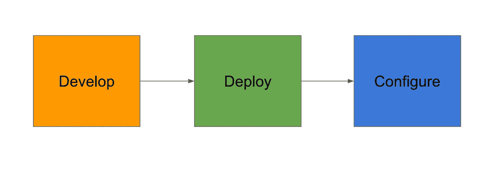
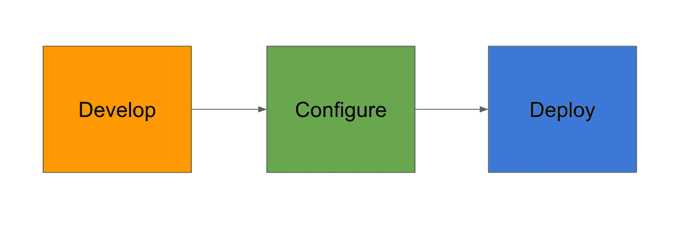

# 使用 Packer、Ansible 和 Terraform 的不可变基础设施

> 原文：<https://itnext.io/immutable-infrastructure-using-packer-ansible-and-terraform-7ca6f79582b8?source=collection_archive---------0----------------------->


奥利弗·帕斯克在 [Unsplash](https://unsplash.com?utm_source=medium&utm_medium=referral) 上的“五彩岩石地段”

不可变基础设施是关于不可变组件的，这些组件在基础设施创建后被重新创建和替换，而不是更新。不可变的基础设施减少了出错的地方。这有助于减少部署过程中的不一致性并提高可靠性。更新服务器可能会很漫长、痛苦，而且很容易出错。当不可变的基础设施需要更新时，新的服务器被提供预配置的映像，旧的服务器被销毁。我们创建一个为部署而构建的新机器映像，并使用它来创建新的服务器。在不可变基础设施中，我们将服务器创建过程之后的配置设置转移到构建过程。由于所有部署都是由新映像完成的，因此我们可以保留以前版本的历史记录，以防恢复到旧版本。这使我们能够减少部署时间、配置故障和大规模部署等。

**正常流量**



**不可变流程**



我们使用 terraform 来供应我们的服务器，然后在实例上进行配置管理。这增加了调配服务器的时间，因为我们必须等到配置完成。我们应该使用[封隔器](https://packer.io/)预先进行配置。打包程序有助于在映像创建期间将配置烘焙到机器映像中。这有助于在出现问题时创建相同的服务器。如果你是 packer 新手，请在这里阅读我关于 Packer 的博客。

在这篇文章中，我们将使用 Packer 烘焙一个 AMI，并在烘焙过程中使用 ansible 进行配置。我们将部署一个静态网站，就像我们在[这里](https://medium.com/@mitesh_shamra/deploying-website-on-aws-using-terraform-and-ansible-f0251ae71f42)所做的一样(代码可以在[这里](https://github.com/MiteshSharma/TerraformAnsibleWebsite)找到)。我们将使用相同的 ansible 代码在烘焙过程中使用 nginx 提供我们的静态网站。我们需要确保 nginx 在[系统 ctl](https://www.freedesktop.org/software/systemd/man/systemctl.html) 中启用，并且在每次启动时启动，以便它准备好立即处理。我们将在烘焙过程中为 AMI 分配标签。terraform 可以使用这个标记来标识最新的可用 AMI，并将其用于 EC2 实例创建。我们需要向 packer builder 提供子网 id，这样它就可以在创建 AMI 时使用这个子网 id。我们将把 terraform 代码分成两部分，一部分包含所有网络细节:创建 VPC、子网和其他网络细节。另一部分使用打包程序生成的 AMI 在我们的网络中生成 EC2 实例。

**步骤 1:使用 Terraform 建立网络**

在这一步中，我们将创建一个带有公共子网的 VPC，以及我们在所有 EC2 实例中用于 ssh 的密钥对。我们输出子网 id，我们需要把它放在 packer builder 中，使用它 packer 可以创建一个在这个 VPC 中使用的 AMI。

```
provider "aws" {
  access_key = "${var.access_key}"
  secret_key = "${var.secret_key}"
  region     = "${var.region}"
}#resources
resource "aws_vpc" "vpc" {
  cidr_block = "${var.cidr_block_range}"
  enable_dns_support   = true
  enable_dns_hostnames = true
  tags {
    "Environment" = "${var.environment_tag}"
  }
}resource "aws_internet_gateway" "igw" {
  vpc_id = "${aws_vpc.vpc.id}"
  tags {
    "Environment" = "${var.environment_tag}"
  }
}resource "aws_subnet" "subnet_public" {
  vpc_id = "${aws_vpc.vpc.id}"
  cidr_block = "${var.subnet1_cidr_block_range}"
  map_public_ip_on_launch = "true"
  availability_zone = "${var.availability_zone}"
  tags {
    "Environment" = "${var.environment_tag}"
    "Type" = "Public"
  }
}resource "aws_route_table" "rtb_public" {
  vpc_id = "${aws_vpc.vpc.id}"route {
      cidr_block = "0.0.0.0/0"
      gateway_id = "${aws_internet_gateway.igw.id}"
  }tags {
    "Environment" = "${var.environment_tag}"
  }
}resource "aws_route_table_association" "rta_subnet_public" {
  subnet_id      = "${aws_subnet.subnet_public.id}"
  route_table_id = "${aws_route_table.rtb_public.id}"
}resource "aws_key_pair" "ec2key" {
  key_name = "publicKey"
  public_key = "${file(var.public_key_path)}"
}
```

**步骤 2:在上面创建的网络中使用 packer 和 ansible 创建 AMI**

我们将使用 ansible 配置来安装 nginx 并设置静态页面。我们使用 systemctl 启用 nginx，因此当使用这个 AMI 创建 EC2 实例时，我们已经启动 nginx 并准备好处理传入的 HTTP 请求。

```
{
  "variables": {
    "aws_access_key": "{{env `AWS_ACCESS_KEY_ID`}}",
    "aws_secret_key": "{{env `AWS_SECRET_ACCESS_KEY`}}",
    "region": "us-east-2",
    "ssh_username": "ec2-user",
    "base_ami": "ami-0303c7b2e7066b60d",
    "instance_type": "t2.micro",
    "subnet_id": "subnet-0553e12f46221b5b7" // **Created during network terraform execution**
  },
  "builders": [
    {
      "type": "amazon-ebs",
      "access_key": "{{user `aws_access_key`}}",
      "secret_key": "{{user `aws_secret_key` }}",
      "region": "{{user `region` }}",
      "subnet_id": "{{user `subnet_id` }}",
      "source_ami": "{{user `base_ami`}}",
      "instance_type": "{{user `instance_type` }}",
      "ssh_username": "{{user `ssh_username`}}",
      "ami_name": "packer-base-{{timestamp}}",
      "associate_public_ip_address": true,
      "tags": {
        "Name": "Packer-Ansible" // **Tag used by terraform during instance creation**
      }
    }
  ],
  "provisioners": [
    {
      "type": "ansible",
      "playbook_file": "../ansible/playbook.yml"
    }
  ]
}
```

**步骤 3:使用 packer AMI 在网络内部设置 EC2 实例**

我们将使用数据资源读取网络状态文件，以便我们可以在实例创建期间使用网络创建的资源。

```
data "terraform_remote_state" "network" {
  backend = "local" config {
    path = "../networkTerraform/terraform.tfstate"
  }
}
```

接下来，我们需要找到最近创建的 AMI，它可以与我们创建的标记一起使用，以便可以在实例创建期间使用它。

```
data "aws_ami" "ec2-ami" {
  filter {
    name   = "state"
    values = ["available"]
  } filter {
    name   = "tag:Name"
    values = ["Packer-Ansible"]
  } most_recent = true
}
```

一旦我们有了所有这些信息，我们就可以在 EC2 实例创建期间简单地使用这些信息。

```
provider "aws" {
  access_key = "${var.access_key}"
  secret_key = "${var.secret_key}"
  region     = "${var.region}"
}data "aws_ami" "ec2-ami" {
  filter {
    name   = "state"
    values = ["available"]
  } filter {
    name   = "tag:Name"
    values = ["Packer-Ansible"]
  } most_recent = true
}data "terraform_remote_state" "network" {
  backend = "local" config {
    path = "../networkTerraform/terraform.tfstate"
  }
}module "securityGroupModule" {
  source   = "./modules/securityGroup"
  access_key  = "${var.access_key}"
  secret_key  = "${var.secret_key}"
  region   = "${var.region}"
  vpc_id   = "${data.terraform_remote_state.network.vpc_id}"
  environment_tag = "${var.environment_tag}"
}module "instanceModule" {
  source     = "./modules/instance"
  access_key    = "${var.access_key}"
  secret_key    = "${var.secret_key}"
  region        = "${var.region}"
  instance_ami  = "${data.aws_ami.ec2-ami.id}"
  vpc_id     = "${data.terraform_remote_state.network.vpc_id}"
  subnet_public_id = "${data.terraform_remote_state.network.public_subnets[0]}"
  key_pair_name  = "${data.terraform_remote_state.network.ec2keyName}"
  security_group_ids  = ["${module.securityGroupModule.sg_22}", "${module.securityGroupModule.sg_80}"]
  environment_tag  = "${var.environment_tag}"
}
```

一旦执行了这段代码，我们就输出分配给 EC2 实例的弹性 IP 地址。我们在浏览器中使用这个 IP 地址来确认我们的静态网站工作正常。


完整的代码可以在这个 git 资源库中找到:[https://github.com/MiteshSharma/ImmutableInfrastructure](https://github.com/MiteshSharma/ImmutableInfrastructure)

***PS:如果你喜欢这篇文章，请鼓掌支持。欢呼***