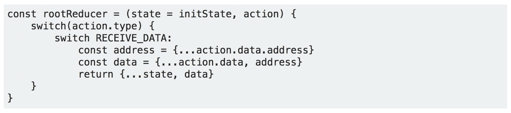
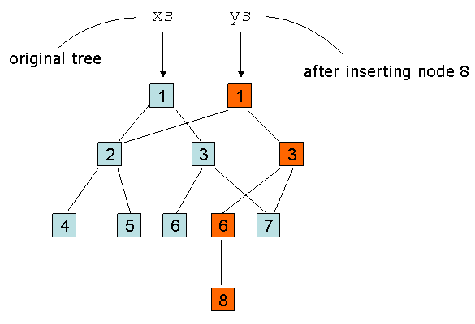

# 不可变 vs 不可变. js

> 原文：<https://itnext.io/immutable-vs-immutable-js-d524bf515bcd?source=collection_archive---------1----------------------->

> **不变性—** 可能是你在现代前端世界学习的第一件事。
> 
> **不变性—** 可能是你跟 Docker 学习的第一件事。
> 
> **不变性—** 可能是第一件…在函数式编程中。

但是不变性代表什么，**不可变数据**和**不可变. js** 有什么区别？


# 不变性代表什么？

只有两个**规则**定义了*“不变性”:*

> *–不要改变数据，如果必须的话–创建一个克隆并改变它。*
> 
> *–重复使用未改变的零件。只应更换已更换的零件。*

*这导致了不变性的 2 个**好处**:*

> *–如果数据发生了变化–那么，你知道，它已经发生了变化。但是你总是有新旧物品可以比较。*此启用超* ***易*** *和超* ***快*** *【浅】* ***比较*** *。**
> 
> *–你将永远拥有新旧物品。无论你执行多少次转换，源数据都是一样的。这代表功能纯度和理想效能。这个**使得测试**超级**容易**。*

# *“超级容易”！*

*这就是为什么每个人都喜欢不可变的数据-**它很容易处理**。或者说，说实话——不容易，但不*难*。*

*但是有一个问题——只要“结果”,不可变的工作方式，是每个人都喜欢的东西，过程，保持不变的方式，是没有人喜欢的东西。*

> *你和电脑都不行。*

*问题不在于不可变性，而在于 JavaScript 语言本身。它只是没有为这项任务提供“正确的”数据结构或一些语言特性(也称为“糖”)来简化这个过程。你知道-🤷‍♂️“JavaScript”。*

# *例子？*

*这是你不需要例子的事情。你只需要想一想。你必须做些什么来“实现”不变性？循序渐进。*

> *如何克隆一个对象？如何克隆一个数组？如何在数组中添加或删除元素，或者替换对象中的键？*

*怎么会？！轻松自如！您可以在任何与 redux 相关的文章或函数式编程备忘单中找到答案。*

**

*类似这样的东西*

*你总是可以使用像 **immer.js** 这样的库，使可变的不可变，隐藏 ES6 代理后面的所有“副本”。*

*[](https://hackernoon.com/introducing-immer-immutability-the-easy-way-9d73d8f71cb3) [## Immer 简介:不变性是最简单的方法

### 不可变的、结构上共享的数据结构是存储状态的一个很好的范例。尤其是在与事件源相结合时…

hackernoon.com](https://hackernoon.com/introducing-immer-immutability-the-easy-way-9d73d8f71cb3) 

> 我**想推荐**你去看看这个库，更好地了解 immer.js 到底在为什么而奋斗。**以及为什么**。

问题出在操作本身——你必须浪费十几个 CPU 周期来创建一个已存在的东西的克隆，然后浪费十几个 CPU 周期来让垃圾收集器消耗和*消化不再使用的*旧变量。

> 你得到的数据结构越复杂或越大，你花在管理它上的时间就越多。

> 实际上——这对于一个小的应用程序来说不是问题，但是有一天你的应用程序会成长起来——到那时做什么都晚了。

不要忘记，当您“管理”数据时，内存中会有您数据的 2 份(也许更多)副本。双倍内存消耗。太棒了。

# 不行吗？！

同时，对于不变性是语言的一部分的语言(例如“不是 JavaScript”)，这不是问题。不变性可能是他们天生的。

> 幸运的是，他们得到了“结构共享”。

结构共享是**存储**数据结构的一种方式。聪明的方法。

简而言之——如果您有一个 1000 个字符串的数组，并且想要在中间添加一个新的——您将创建一个`blueprint`；您必须从原始数组中获取 500 个元素，从新数组中获取 1 个元素，然后再从原始数组中获取 500 个元素。有了这个蓝图，你就可以构建数据，或者再次修改它。



红色—是一个“新”对象。

没有内存浪费，没有 CPU 时间从一个数组复制 1000 个元素到另一个。双赢！它应该具有的永恒性！

点击此处了解更多信息，快速浏览:

[](https://hackernoon.com/how-immutable-data-structures-e-g-immutable-js-are-optimized-using-structural-sharing-e4424a866d56) [## 如何优化不可变数据结构(例如，不可变. js)

### 最近我一直在学习一些使用 JavaScript 的函数式编程。我开始真正喜欢功能性的…

hackernoon.com](https://hackernoon.com/how-immutable-data-structures-e-g-immutable-js-are-optimized-using-structural-sharing-e4424a866d56) 

或者在这里，得到更完整的理解

[](https://medium.com/@dtinth/immutable-js-persistent-data-structures-and-structural-sharing-6d163fbd73d2) [## 不可变的. js，持久数据结构和结构共享

### 为什么要用 Immutable.js 而不是普通的 JavaScript 对象？

medium.com](https://medium.com/@dtinth/immutable-js-persistent-data-structures-and-structural-sharing-6d163fbd73d2) 

像 Lisp 和 Closure 这样的旧函数式语言太棒了！

# 但是这些都是 Lisp 和 Closure，我的 JavaScript 呢？

事实上，我们没有这样的结构或语言块，但是我们可以用 JavaScript 模拟这种行为。这已经做了很多次了。

> 不可变. js 是一个为 JavaScript 带来结构化共享的库。

唯一的问题是——仍然没有办法让这变得透明，我们必须通过复杂的 API 来访问或更改数据。

```
var map1 = Immutable.Map({a:1, b:2, c:3});   
var map2 = map1.set('b', 50);   
map1.get('b'); *// 2 *  
map2.get('b'); *// 50*
```

还是那句话——immutable . js 不是关于不变性的——它是关于不可变的数据结构，以使这种*不变性*快速和内存高效。

> 🤷‍♂️说实话——我不知道有谁喜欢使用 immutable.js API，或者 Baobab.js(可以打电话给这里的任何一个库)。API 太冗长。

对我们大多数人来说——“JavaScript”维护不变性的方式更容易被接受。

```
newState = {
  ...state, 
  data: [...state.data, ...somethingNew].filter(Boolean)
  someProp:1
};
```

只要这个代码对于一些简单的情况是*可接受的*(就像这样)，但是对于稍微复杂一点的情况是*不可接受的*，并且只要几乎不可能正确地**嵌套**所有那些`{...somepart}`——你就会使用 lodash.set 这样的“函数设置器”，或者爱上 immer。

但是在所有情况下，您将从旧数组中复制 1000 个元素到新数组中。

> 我们刚刚到达我们开始的地方
> 
> —浪费 CPU 和内存。

# 为什么没人用？

为什么 Immutable.js 会失败应该是显而易见的。你为什么要用它，为什么要爱它，这应该很明显。但是没有人这么做——也不喜欢使用它。

第一个问题是接口。“不可变的”API 对大多数开发人员来说有点陌生。而像 **immer** 或者 **seamless-immutable** 这样的库就是为了解决它而诞生的。例如，第二库可以使不可变看起来像普通的 JS，但是为数据提供了神奇的“getters”。

```
var array = Immutable([1,2,3]);
array.map(value => [value+2, value+4]);
// returns Immutable([ [ 3, 5 ], [ 4, 6 ], [ 5, 7 ] ])Immutable.flatMap(array, value => [value+2, value+4]);
// returns Immutable([ 3, 5, 4, 6, 5, 7 ])
```

注意:您可以用与从本机数组“获取”数据相同的方式“获取”数据。

[](https://github.com/rtfeldman/seamless-immutable) [## rtfeldman/无缝-不可变

### JavaScript 的不可变数据结构，向后兼容普通的 JS 数组和对象。…

github.com](https://github.com/rtfeldman/seamless-immutable) 

无缝-不可变就像一个 immer，但是用于结构共享。太棒了。

# ….我也应该吗？….

记住这是 Javascript，有些特性不是“特性”，而是特性的“仿真”。具体来说——`seamless-immutable`是有成本的(getter/setter 糖)，如果你没有庞大的数组或复杂(大)的数据结构——“标准”的方式会工作得更快。

问题出在“大 O 记数法”上。从 BigO 的角度来看，不可变格式比“原生”格式更好，只要它具有“较低的复杂性”。但是每一个`O(n)`实际上都是`c*O(n)` —一些`constant` x `prediction`时间复杂度会如何增长。

> 时间=常数*预测

在这种情况下 **c 相当大**，如果你有**小 n** — **忘记**关于不可变的. js，你不需要它。

> 低 C*O(较高)

不可变的. js 不是银弹——它是解决复杂情况的工具。小型数据集不需要 immutable.js。最后一个问题——小意味着什么？而且也不是那么好回答的。*