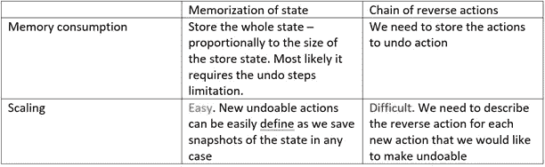
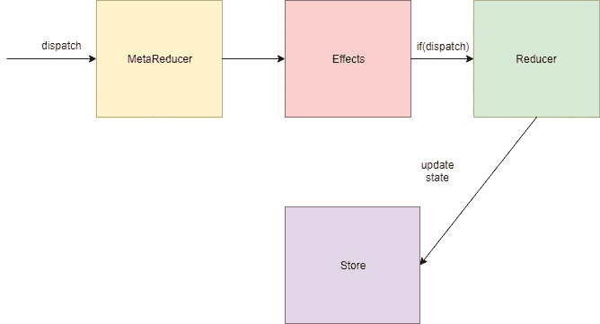
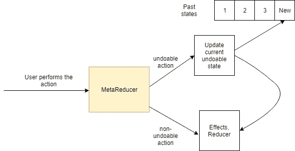

# 用 Undo-Redo 实现待办事项列表

> 原文：<https://itnext.io/implementing-a-todo-list-with-undo-redo-4b38958dbd05?source=collection_archive---------2----------------------->


为简单的待办事项列表应用程序添加撤销/重做支持

# 1.引言。

大多数需要撤销-重做特性的用例都与编辑器有关，无论是文本编辑器还是图形编辑器。为了简单起见，我将使用一个基于 Ngrx 的简单 todo，但是请相信我，如果您希望在应用程序中添加对历史的支持，您将很容易应用本文中的思想。

我们将开始实施，而不是从零开始。我已经准备了应用程序，我们将使用附加撤销重做。

这里有一个到存储库的链接:[存储库](https://github.com/Stioneq/todo-undo-redo-initial)

[Github 页面](https://stioneq.github.io/todo-undo-redo-initial/)

这里我们有一个基本的 Todo 功能:

1.  添加新项目
2.  更新现有项目
3.  移除项目。

和两个附加功能:

1.  更改应用主题
2.  增大/减小字体大小

所有项目数据和设置(字体、主题)都位于 Ngrx 存储中。

**让我们定义实现撤销-重做-待办事项的需求:**

1.我们想要撤销/重做想要的操作(添加、更新、删除、增加/减小字体大小)，但不想撤销/重做更改应用程序主题。

2.我们希望有快捷方式和按钮的工具提示撤销/重做。

工具提示应该描述我们撤销/重做什么样的操作。

# 2.定义

我考虑了两种撤销/重做实现方式:

1.  记住每个可以撤销的动作的整个状态。
2.  创建一个反向操作链。



两种方式的比较

对于本文，我决定使用第一种方法。

为了实现撤销/重做，我们需要在 Ngrx 中使用一个中间件层，它由元缩减器表示。

如图所示，当您调度一个动作时，该动作由元缩减器处理。



Ngrx 中的流量

这是一个元减速器结构的例子。它是一个高阶函数。

```
export function meta(reducer: [ActionReducer](https://ngrx.io/api/store/ActionReducer)<any>):[ActionReducer](https://ngrx.io/api/store/ActionReducer)<any> {return function([state](https://ngrx.io/api/store-devtools/StoreDevtools#state), action) {return reducer([state](https://ngrx.io/api/store-devtools/StoreDevtools#state), action);};}
```

# 3.履行

首先，生成撤销-重做模块。

```
ng g m undo-redo
```

并创建所需的 Ngrx 组件:

1.  动作(我们需要三个动作:撤销/重做/添加动作)
2.  减速器——我们处理的地方
3.  选择器
4.  最重要的一个是 Metareducer，它是我们处理存储当前状态的地方。

**可撤销状态:**

为了有一个一致的状态，让我们可以来回转换。

我们应该有过去状态、未来状态和当前状态:

```
export interface UndoableState {
  past: any[];
  present: any;
  future: any[];
}
```

值得注意的是，这不是我们将在 Ngrx 中使用的状态。它在元减速器中是必需的。



执行可撤销/不可撤销操作时的流程

如图所示，当我们执行一个可撤销的动作(一个可以撤销/重做的动作)时，meta reducer 通过向数组添加新的状态来更新过去的状态，然后它通过移动效果和 reducer 继续照常工作。

**可撤销动作:**

在开始实现元缩减器之前，让我们定义可用于撤销的动作及其结构。

```
export interface UndoableOperation {
  type: string;
  hint?: string;
}
```

该类型将用于跟踪我们应该撤消哪种操作。提示字段是为工具提示目的而定义的。

使用给定的接口，我们可以定义操作:

```
export const UNDOABLE_OPERATIONS: { type: string, hint?: string }[] = [
    {hint: 'Update todo', type: TodoActionTypes.*UPDATE*},
    {hint: 'Add todo', type: TodoActionTypes.*ADD*},
    {hint: 'Remove todo', type: TodoActionTypes.*DELETE*},
    {hint: 'Decrease font size', type: SettingsActionTypes.*DEC_FONT*},
    {hint: 'Increase font size', type: SettingsActionTypes.*INC_FONT*},
  ];
```

我们故意没有指定更改主题动作，因为我们不想让它不可撤销。

在编写 meta reducer 之前，我们需要做的最后一件事是定义需要持久化的状态键。我将把它们描述为这些键的路径。

```
const PERSISTENT_KEYS = ['todos', 'settings.fontSize'];
```

我们添加了 todos，因为我们想完全存储这个子状态。从设置，我们只需要保持字体大小。

**金属减速器**

现在我们已经准备好编写元缩减器了，让我们开始吧。

首先，我们初始化我们的不可撤销状态对象。最初，我们没有过去状态和未来状态，但是我们有一个通过调用 Init action 定义的父状态。

```
ActionReducer<any> {
  let states: UndoableState = {
    past: [],
    present: reducer(undefined, {type: '__INIT__'}),
    future: []
  };
```

Meta reducer 是一个高阶函数，所以我们需要返回一个函数:

```
return (state, action) => {
  const {past, present, future} = states;
  //...}
```

然后，我们定义如何处理传入操作的方式:

这是什么？

1.  如果动作不是撤销/重做类型，我们检查它是否在可撤销操作列表中，如果是，我们执行该动作并将结果存储到当前状态，并且我们还通过附加过去状态来更新过去状态的列表。
2.  我们使用 *extractState* 方法提取状态。正如你所记得的，我们已经定义了持久键数组，我们用它来减少在状态中存储不必要的字段。为了简单起见，我使用 lodash 函数

```
function extractState(state: AppState) {
  return pick(state, PERSISTENT_KEYS);
}
```

3.我们在最后执行添加操作，只是为了让撤销/重做按钮有工具提示。如果没有指定提示，我们传递动作的提示或动作的类型。

4.如果动作是不可撤销的，我们只需更新当前状态以保持其一致性。

让我们编写撤销和重做处理程序:

这很简单:

1.  对于撤销，我们只是通过获取最后一项并将其放置到当前来更新过去的状态。我们把现在转移到未来状态。
2.  对于重做，我们反之亦然

值得注意的是，我们使用合并状态，因为我们部分存储我们的状态。

```
function mergeStates(state: AppState, undoablePart) {
  const newState = cloneDeep(state);
  PERSISTENT_KEYS.forEach(key => set(newState, key, get(undoablePart, key)));
  return newState;
}
```

为了保持简单，我们还利用了 Lodash 中的 get 和 set。

让我们回顾一下元缩减器中的最终内容:

撤消-重做.元测试

# 4.首次使用

让我们通过添加撤销(ctrl-z)和恢复(ctrl-y)的快捷方式来更新我们的 todo 应用程序

我们需要在 app.component 中添加较小的更改:

```
@HostListener('window:keydown', ['$event']) keyDown(e: KeyboardEvent) {
  if (e.ctrlKey && e.code === 'KeyZ') {
    this.store.dispatch(new UndoAction());
  } else if (e.ctrlKey && e.code === 'KeyY') {
    this.store.dispatch(new RedoAction());
  }
}
```

但这还不够。我们还需要在我们的应用程序中启用元减速器。

```
StoreModule.*forRoot*(appReducer, {metaReducers: [undoredoMeta]})
```

现在，如果我们运行我们的应用程序，我们可以尝试撤销/重做操作。一切都很完美。

# 4.第二次使用

让我们添加撤销和重做按钮，并为它们添加工具提示。

注意:如果没有要撤消/重做的操作，则应禁用它们。

目前，我们只使用 meta reducer，没有办法跟踪我们必须撤销/重做的操作。但是我们已经实现了撤销/重做操作，所以让我们重用它们并定义状态:

```
export interface UndoredoState {
  undoActions: string[];
  redoActions: string[];
}
```

我们将只在这里存储工具提示。如果数组中没有元素，我们就不能撤销/重做。

让我们为撤销-重做编写一个缩减器:

在添加动作时，我们只需更新撤销动作并清除重做动作。

在重做动作时，我们更新撤销动作并取消第一个项目。

在撤销动作时，我们更新重做动作并弹出最后一项。

让我们添加一个选择器来提取撤销/重做操作:

```
import {UndoredoState} from './undo-redo-state';
import {createSelector} from '@ngrx/store';

const selectUndoredoState = (state: any) => state.undoredo;

export const getUndoAction = createSelector(
  selectUndoredoState,
  (state: UndoredoState) => state.undoActions.length > 0
    && state.undoActions[state.undoActions.length - 1]
);
export const getRedoAction = createSelector(
  selectUndoredoState,
  (state: UndoredoState) => state.redoActions.length > 0
    && state.redoActions[0]
);
```

最后，我们需要在撤销-重做模块中注册一个缩减器:

```
StoreModule.*forFeature*('undoredo', undoredoReducer)
```

并在 app.module 中导入此模块

```
imports: [
//...
  UndoRedoModule
],
```

现在，我们可以轻松地添加撤销/恢复按钮:

```
<mat-icon class="icon" [class.disabled]="!undoItem" [matTooltip]="undoItem" matRipple (click)="undo()" matRippleUnbounded="unbounded">
  undo
</mat-icon>
<mat-icon class="icon"  [class.disabled]="!redoItem" [matTooltip]="redoItem" matRipple (click)="redo()" matRippleUnbounded="unbounded">
  redo
</mat-icon>
```

为了提取 undoItem 和 redoItem，我们将使用选择器:

```
this.store.pipe(select(getUndoAction), takeUntil(this.unsubscribe$)).subscribe(undoItem => {
  this.undoItem = undoItem;
});
this.store.pipe(select(getRedoAction), takeUntil(this.unsubscribe$)).subscribe(redoItem => {
  this.redoItem = redoItem;
});
```

那就是。您可以使用按钮来撤销/重做，如果您将鼠标悬停在按钮上，您可以看到带有相应信息的工具提示。

# 最后

感谢您阅读这篇文章。我希望它是有用的。不要犹豫，提出问题，留下评论。

储存库与最终版本:[链接](https://github.com/Stioneq/todo-undo-redo)

[Github 页面](https://stioneq.github.io/todo-undo-redo)

**顺便说一句**:在评论中留下我们如何增加对设置动作类型的撤销支持。*改变 _ 主题？*