# 在外部系统中实现自动登录

> 原文：<https://itnext.io/implementing-an-automatic-login-in-outsystems-535d93e8f536?source=collection_archive---------7----------------------->

照片由[飞:D](https://unsplash.com/@flyd2069?utm_source=unsplash&utm_medium=referral&utm_content=creditCopyText) 在 [Unsplash](https://unsplash.com/s/photos/lock?utm_source=unsplash&utm_medium=referral&utm_content=creditCopyText)

我们继续探索 [Web API 的](https://developer.mozilla.org/en-US/docs/Web/API)。这一次，我们将关注[凭证管理](https://developer.mozilla.org/en-US/docs/Web/API/Credential_Management_API)。

> 凭证管理 API 允许网站存储和检索密码、公钥和联合凭证。这些功能允许用户无需输入密码即可登录，查看他们用于登录网站的帐户，以及在没有过期会话的显式登录流程的情况下恢复会话。
> 
> 该 API 允许网站直接与用户代理的密码系统交互，以便网站可以以统一的方式处理站点凭证，并且用户代理可以提供更好的凭证管理帮助。

本质上，凭证 API 公开了一些方法，让我们在外部系统中实现它们。

## 凭据存储

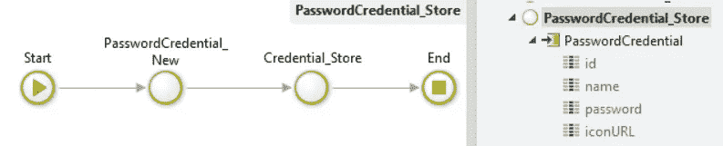

这将以编程方式触发保存密码浏览器对话框，并应在用户成功注册后立即使用。

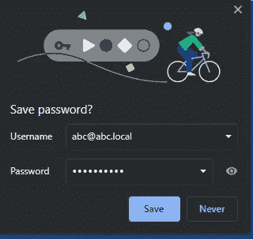

## 凭据获取

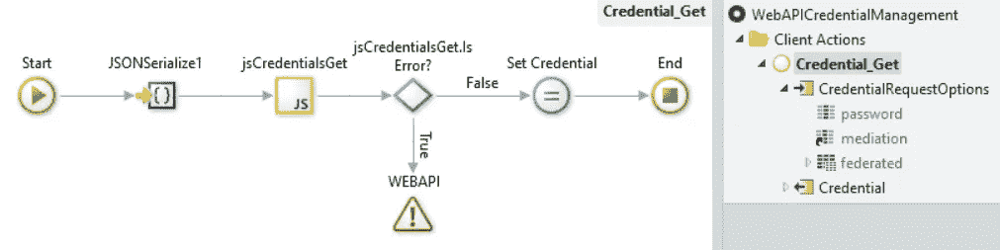

这将触发从浏览器读取与域相关联的可用凭证。根据(用户)中介参数，您有几个行为选项:

*静默* —如果该域只有一个凭据，则会自动检索该凭据。如果没有凭据或有多个凭据可用，则返回 null。

*可选* —如果有多个凭证可用，它会提示用户选择一个。如果没有，则返回 null。

*必填* —始终提示用户选择与域相关联的凭据。如果没有，则返回 null。

根据“*自动登录*”和“*提供保存密码*”的浏览器设置，此行为会有所变化。

## 防止静默访问

该方法关闭静默模式，直到用户明确登录。在你的应用程序注销后激活方法很有用，这样用户就不会自动再次登录。

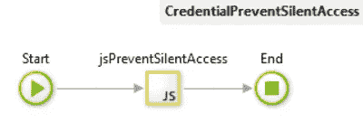

# 把所有的放在一起

登录页面似乎是触发自动登录的一个不错的选择。我们会用那个…

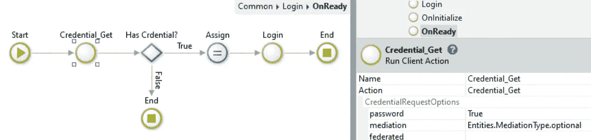

对于登录页面的 *OnReady* ，检查是否有任何存储的密码凭证与该域相关联。如果检索到凭据，您可以将用户名和密码传递给登录方法。

结果就是你每次访问这个页面都会自动登录。

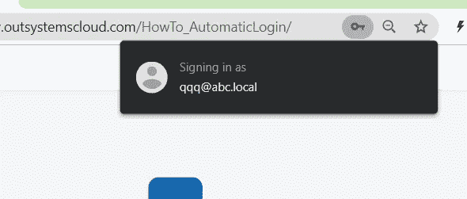

在本例中，我使用了“*可选的*”(用户)中介，因此，如果您像我一样，一个应用程序有多个用户，系统会提示您选择要使用哪个用户登录:

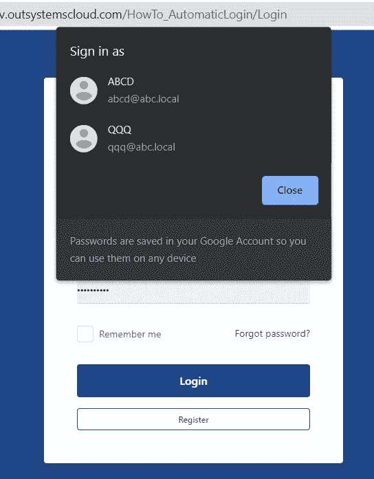

在客户端注销时，确保触发*防止静默访问*，这样用户就不会再次登录。

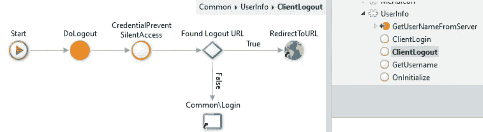

为了存储凭证，建议在注册后或成功登录后立即触发凭证。

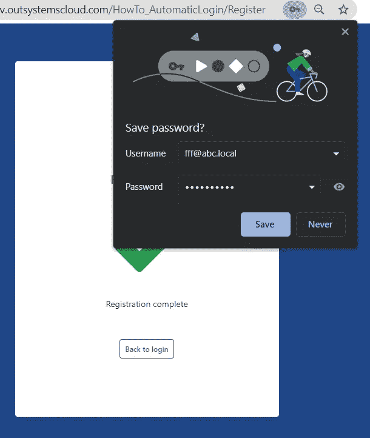

大概是这样的:

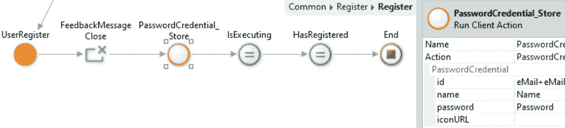

像往常一样，[凭证管理](https://www.outsystems.com/forge/component-overview/11499/web-api-credential-management)和[自动登录](https://www.outsystems.com/forge/component-overview/11500/how-to-automatic-login)都可以在铁匠铺上找到。

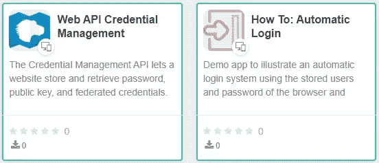

不，你只需要建立那些自动登录的应用程序！