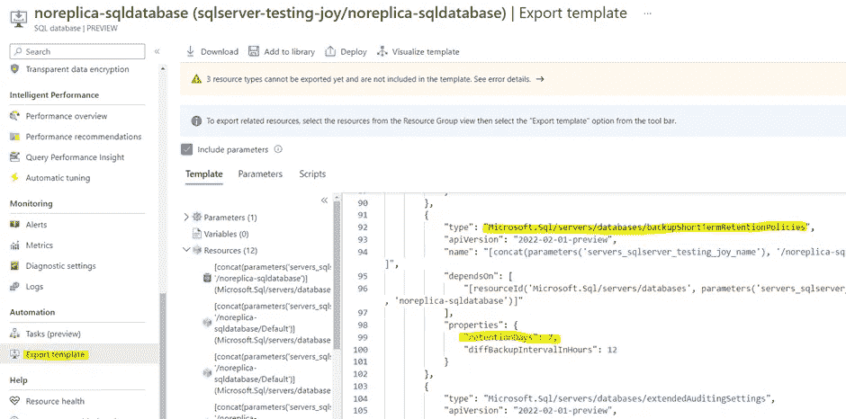
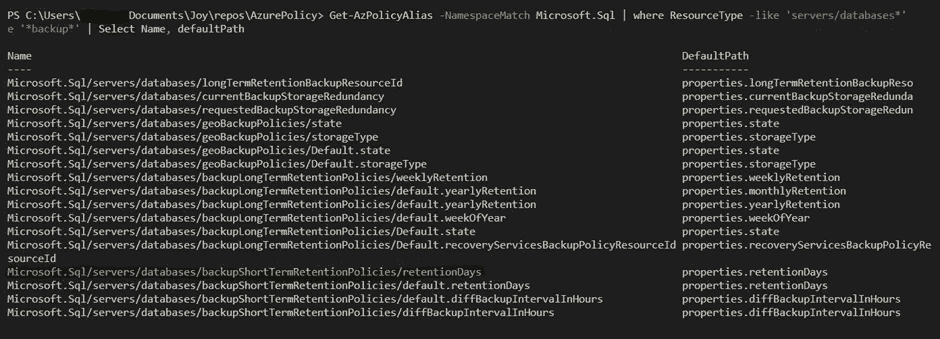
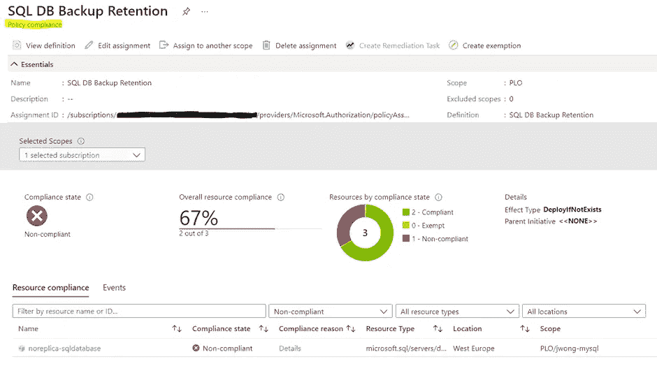
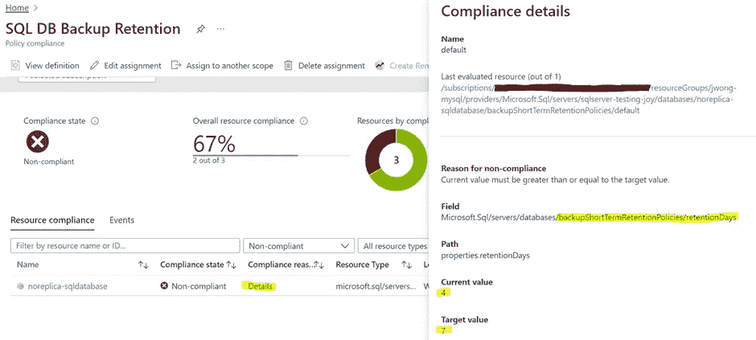
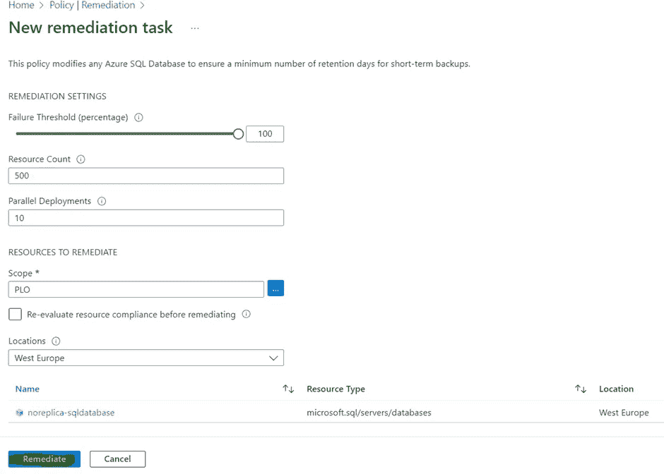
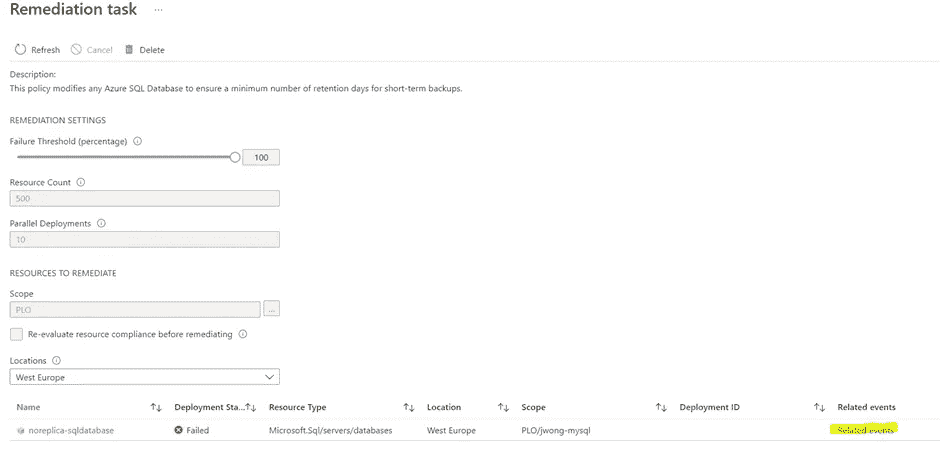
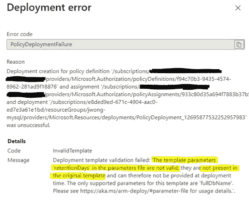
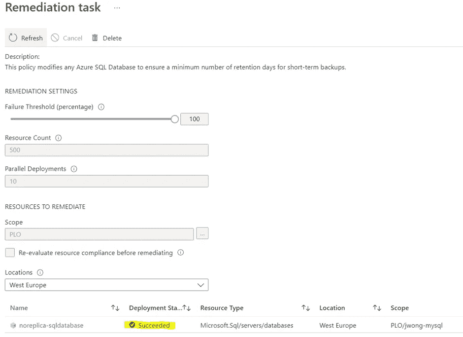
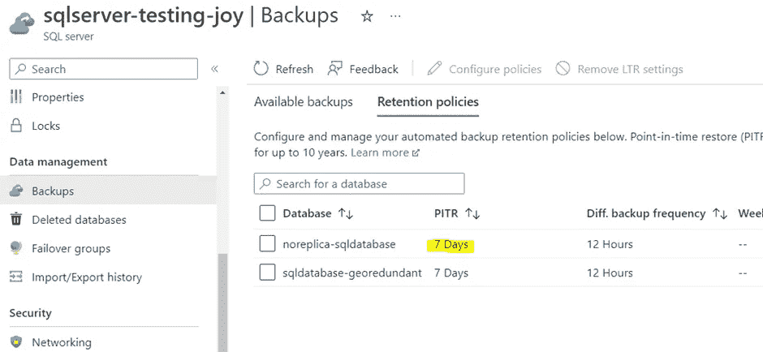

# 实施自定义 Azure 策略定义和故障排除[分步指南]

> 原文：<https://itnext.io/implementing-and-troubleshooting-a-custom-azure-policy-definition-1ab8d0634bb2?source=collection_archive---------0----------------------->

Azure Policy 是 Microsoft Azure 中的一个工具，它允许您管理 Azure 资源的使用，并强制执行组织标准以确保合规性。这在许多组织中至关重要，在 Azure 环境中有多个独立工作的开发团队，确保安全性、遵守数据法律和业务连续性可能是一项挑战。

# 这篇文章是写给谁的？

顾名思义，这是一个创建*自定义*策略的分步指南，它比使用微软*内置*策略更进了一步。因此，这篇文章假设你有一些关于 [Azure Policy](https://learn.microsoft.com/en-us/azure/governance/policy/overview) 的经验，并且熟悉基础知识。您应该已经知道策略定义、计划(定义集)和任务之间的区别。您还应该对[策略效果](https://learn.microsoft.com/en-us/azure/governance/policy/concepts/effects)有一些基本的了解，比如 Deny、Audit、Modify 和 DeployIfNotExists。理想情况下，您已经实现了一个简单的内置策略，如“允许的位置”，它限制了您的环境中可以部署资源的位置。我跳过了很多细节，但这里有一篇精彩的博客文章提供了一份精彩的政策入门指南。这是相当高的，并为门外汉提供了更广泛的原则/最佳实践。

本文记录了在我确定了我的组织想要实施的特定效果后，我实现自定义 Azure 策略的方法。从我确定我想要实施的特定政策开始，它就是一步一步的指南。在我们深入本文之前，先阅读一下关于[故障排除](https://learn.microsoft.com/en-us/azure/governance/policy/troubleshoot/general)的微软文档是有帮助的。

*开始之前的最后一点—如果您只是为了 SQL 数据库短期备份保留策略而来，请滚动到文章末尾！*

# 案例研究:对 Azure SQL 数据库强制执行 7 天的短期备份保留

为了让您了解这一过程，我将使用一个创建策略的示例来强制 Azure SQL 数据库至少保留 7 天的短期备份。预期的策略效果是 DeployIfNotExists，它补救不符合的资源。这通常是首选选项，而不是直接的“拒绝”(防止创建不合规的资源)或“审核”(如果资源不合规，则向您发出警报，但不对其采取任何措施)。

# 步骤 1:查找相似(或完全相同)政策的例子

没有必要在这里重新发明轮子；首先，尝试查找名为万维网的惊人发明，以检查是否有来自 Azure 的内置策略，或其他人已经建立的其他自定义策略。AzAdvertiser 是一个很棒的资源，它收集了大量的 Azure 政策，所有这些政策都经过了很好的整理和组织，以便你过滤相关的元数据。此外，如果有好心人写了一篇分享特定定制政策的博文或文章，请在 Google 上快速查看一下。

我没有找到完全符合我所寻找的内置策略，所以这是一个很好的例子来说明我从头开始创建自定义策略的过程。

在实际创建策略之前，我先在 Azure 中做一些调查工作。

# 步骤 2:创建 1-2 个资源，并检查在门户中何处设置策略实施的预期效果。稍后还需要这些资源来测试策略。

我创建了一个 SQL 数据库，它需要在 SQL 服务器中。这些都是通过在 Azure 门户中创建测试资源来完成的。

要在门户中配置短期备份策略，您必须导航到托管 SQL 数据库的 SQL server。

具体来说，它位于 SQL Server 下的“备份”>“保留策略”>“配置策略”下(1–35 天之间)。


此时，故意修改资源，使其不兼容。在我的例子中，我将把备份天数修改为 6 天，这样我就有合规和不合规的资源来进行比较和测试。

# 步骤 3:查看在“导出模板”下生成的 ARM 模板，以了解您想要实施的特定设置是在哪里定义的。

在我的例子中，它是子资源“Microsoft”下的属性设置“retentionDays”。SQL/服务器/数据库/backupshorttermtretentionpolicies”。

在 Azure 中， [SQL 数据库](https://learn.microsoft.com/en-us/azure/azure-sql/database/sql-database-paas-overview?view=azuresql)运行在 SQL 服务器内部。因此，这两种资源都可能包含在我的策略中。“retentionDays”属性同时位于门户中的 SQL 数据库和 SQL server 资源中(下面显示的示例是 SQL 数据库下的“导出模板”)，但我想直接定位数据库。在这种情况下，策略的目标资源类型将是“Microsoft”。SQL/服务器/数据库”。

*注意:您也可以选择以 Microsoft.Sql/servers,为目标，但是如果您这样做了，您的策略合规性概述会向您指出哪个服务器不合规，而不是哪个数据库不合规。后者是我想要的，所以我用 Microsoft.Sql/servers/databases.*



# 步骤 4:使用 PowerShell 命令“Get-AzPolicyAlias”检查控制后端资源的策略别名。

Azure 策略使用策略别名来引用资源类型属性。神奇的命令是[**Get-azpolicyalas**](https://learn.microsoft.com/en-us/powershell/module/az.resources/get-azpolicyalias?view=azps-9.0.1)，如果安装了 Azure PowerShell 模块，可以在 Windows 终端或 Visual Studio 代码终端运行。

您可以使用上面提到的命令列出所有策略别名，这有点大材小用。要缩小别名范围，请与 Microsoft 进行名称空间匹配。Sql:

get-azpolicyalas***-namespace match 微软。Sql***

然后，过滤掉所有与数据库相关的别名，并展开属性，以便获得一个更好的表:

get-AzPolicyAlias-namespace match Microsoft。SQL |***where resource type-like ' servers/databases * ' | Select-Object-expand property '别名' | Select Name，defaultPath***

最后但同样重要的是，找出与备份相关的别名:

get-AzPolicyAlias-namespace match Microsoft。SQL |***where resource type-like ' servers/databases * '****| Select-Object-expand property ' Aliases ' | where Name-like ' * backup * ' | Select Name，defaultPath*

*这是上面最后一个命令的输出，突出显示了有问题的别名:*

**

# *步骤 4b:如果您打算使用“修改”或“部署不存在”效果，还要检查预期效果的策略别名是否可修改。*

*在我的组织中，如果可能的话，我们更喜欢“修改”或“部署不存在”,因为它允许部署潜在不符合的资源并随后补救该资源，而不是“拒绝”,这可能会对您的用户产生反作用，因为您完全禁止创建该资源。*

*Modify 和 DeployIfNotExists 之间的区别在于，Modify 更容易实现，在某种程度上，就像切换开关或更改资源的属性。DeployIfNotExists 使用策略中的 ARM 模板部署资源(或子资源)来修复资源。最好使用 Modify，因为它实现起来不太复杂，但是并不是每个别名都可以修改，因此有时 DeployIfNotExists 是您唯一的选择。*

*长话短说，我想要强制执行的属性是不可修改的。我知道下面的命令没有返回任何结果。该命令基于步骤 4 中的命令。*

*get-AzPolicyAlias-namespace match Microsoft。SQL | Where resource type-like ' * servers/database * ' | Select-Object-expand property Aliases |***Where-Object { $ _ . default metadata . attributes-eq ' modified ' }***| Where Name-like ' * backup * ' | Select Name，DefaultPath*

**关于策略效果的说明:关于策略效果的决策不同于类似的资源，我们希望在 MySql 服务器上实施相同的备份保留策略。对于 MySQL 服务器，保留天数只能在创建资源时设置，并且在创建资源后不能更改。在这种情况下，审计或拒绝更有意义。**

# *第五步:写保单！*

*我们现在终于到了制定政策的阶段。策略定义基本上是一个 JSON 文档，它定义了所有必需的策略步骤。策略的结构记录在[这里](https://learn.microsoft.com/en-us/azure/governance/policy/concepts/definition-structure)。*

*实际上，您将找到一个(通常是内置的)策略定义，它与您试图实现的内容足够相似，就像这个[内置的](https://learn.microsoft.com/en-us/azure/azure-sql/database/policy-reference?view=azuresql)策略[这里的](https://github.com/Azure/azure-policy/blob/master/built-in-policies/policyDefinitions/SQL/GeoRedundant_SQLDatabase_AuditIfNotExists.json)关于启用长期地理冗余备份，将它们全部复制，并尝试在那里进行修改。*

*这就是我所做的，我还添加了一个额外的参数，即我希望保留我的保留策略的天数，因为我希望这可以很容易地参数化，并且在我们公司的策略发生变化时可以更改。*

*我的政策初稿是这样的:*

**(剧透警告，此草稿包含演示故障排除流程的错误。如果你在这里只是为了最终的工作政策，滚动到文章的结尾。)**

```
*{
    "properties": {
        "displayName": " SQL DB Backup Retention",
        "policyType": "custom",
        "mode": "Indexed",
        "description": "This policy modifies any Azure SQL Database to ensure a minimum number of retention days for short-term backups.",
        "metadata": {
            "version": "1.0.0",
            "category": "SQL"
        },
        "parameters": {
            "SqlDBBackupRetention.PolicyEffect": {
                "type": "string",
                "defaultValue": "AuditIfNotExists",
                "allowedValues": [
                    "AuditIfNotExists",
                    "DeployIfNotExists",
                    "Disabled"
                ],
                "metadata": {
                    "displayName": " SqlDBBackupRetention.PolicyEffect",
                    "description": "Enable or disable the execution of the policy"
                }
            },
            " SqlDBBackupRetention.RetentionDays": {
                "type": "integer",
                "defaultValue": 7,
                "metadata": {
                    "displayName": " SqlDBBackupRetention.RetentionDays",
                    "description": "Minimum number of days for short-term backup retention"
                }
            }
        },
        "policyRule": {
            "if": {
                "allOf": [
                    {
                        "field": "type",
                        "equals": "Microsoft.Sql/servers/databases"
                    },
                    {
                        "field": "name",
                        "notEquals": "master"
                    }
                ]
            },
            "then": {
                "effect": "[parameters(SqlDBBackupRetention.PolicyEffect')]",
                "details": {
                    "type": "Microsoft.Sql/servers/databases/backupShortTermRetentionPolicies",
                    "name": "default",
                    "existenceCondition": {
                        "anyOf": [
                            {
                                "field": "Microsoft.Sql/servers/databases/backupShortTermRetentionPolicies/retentionDays",
                                "greaterOrEquals": "[parameters(SqlDBBackupRetention.RetentionDays')]"
                            }
                        ]
                    },
                    "deployment": {
                        "properties": {
                            "mode": "incremental",
                            "template": {
                                "$schema": "https://schema.management.azure.com/schemas/2015-01-01/deploymentTemplate.json#",
                                "contentVersion": "1.0.0.0",
                                "parameters": {
                                    "fullDbName": {
                                        "type": "string"
                                    }
                                },
                                "resources": [
                                    {
                                        "name": "[concat(parameters('fullDbName'), '/default')]",
                                        "type": "Microsoft.Sql/servers/databases/backupShortTermRetentionPolicies",
                                        "apiVersion": "2014-04-01",
                                        "properties": {
                                            "retentionDays": "[parameters('retentionDays')]"
                                        }
                                    }
                                ]
                            },
                            "parameters": {
                                "fullDbName": {
                                    "value": "[field('fullName')]"
                                },
                                "retentionDays": {
                                    "value": "[parameters(SqlDBBackupRetention.RetentionDays')]"
                                }
                            }
                        }
                    }
                }
            }
        }
    },
    "type": "Microsoft.Authorization/policyDefinitions"
}*
```

# *步骤 6:创建您的策略定义，然后将它分配到期望的范围，最好包含您在步骤 2 中创建的测试资源。*

*你可以通过 Azure 门户的 Policy > Definitions >+Policy definition 来实现，也可以通过管道来实现。我不会讨论如何设置管道，因为这超出了本文的范围。也许这是下次的话题。*

*在测试策略时，我主要想验证两件事:*

1.  *政策正在正确地提高合规性*
2.  *期望的策略效果，即修改或部署不存在的策略是否正常工作*

*在分配期间，您还可以提供策略中定义的参数。在我的例子中，我将效果设置为 DeployIfNotExists，并将天数设置为 7 天。*

# *步骤 7:检查合规性*

*将策略分配给某个范围后，等待合规状态更新。这通常需要一段时间，如果是一项新任务，有时大约需要 10 分钟。*

**附注:对于您已经重复分配但未删除之前分配的保单，合规状态可能需要更长时间才能更新。Azure Policy 每 24 小时自动对策略合规性进行一次重新评估，对于已经评估过的策略，有时似乎没有重新评估，所以拿杯茶或做一些其他工作，或者如果你像我一样不耐烦，就删除分配并再次重新分配相同的策略进行重新评估。**

**

*对我来说，我的合规性表似乎运行良好，1 个不合规的数据库已被标记出来(我手动将备份天数更改为 4)。*

**

*在同一页面上，如果您单击“Compliance reason”下的“Details ”,您还将能够检查策略评估是否正确，这在我的情况下是正确的，因为已经选择了正确的策略别名。*

# *步骤 7:使用任务修正检查策略效果，部署不存在是否正常工作*

*一旦部署了策略，它将对所有创建的新资源生效。测试 Modify 或 DeployIfNotExists 效果是否正常工作的一个好方法是使用任务修正，它可以修复在策略生效之前创建的资源。*

*完成合规性评估后，单击策略平面中的“修复”选项。现在，您将为不符合的资源创建一个修正任务。单击要修复的策略定义。*

*为不合规的资源创建补救任务:*

**

# *步骤 8:策略修正故障排除*

*在我的案例中，修复任务失败了。这告诉我，我的策略中包含 ARM 模板的“部署”部分有问题。*

*为了找出问题所在，请打开修复任务，然后单击“相关事件”查看错误消息。*

****

*这表示我缺少一个名为 retentionDays 的参数，这个参数没有提供。是的，我忘了在部署参数中包括这一点:*

```
*"parameters": {
                "fullDbName": {
                          "type": "string"
                 },
                 "retentionDays": {
                          "type": "integer"
                 }
},*
```

*修正你的政策可能是一个相当重复的过程。它包括修改策略，再次部署和分配它，然后等待评估符合性，以便您可以恢复测试。*

*最后，上面的错误并不是我的政策唯一的错误。在修复上面的消息后，我在修复任务中遇到了另一个错误消息，这次是“无效的部署模板”。在困惑了几次之后，我终于想到，也许参数的“整数”类型是无效的，ARM 模板的正确类型是“int”。这记录在 ARM 模板的[数据类型](https://learn.microsoft.com/en-us/azure/azure-resource-manager/templates/data-types)页面中。*

```
*"parameters": {
               "fullDbName": {
                          "type": "string"
                },
                "retentionDays": {
                           "type": "int"
                }
},*
```

*修复任务最终成功了:*

**

*我返回到我创建的资源，SQL Server 页面中的保留策略确实反映了成功的更改:*

**

# *第九步:你的政策任务从此幸福生活！或者不是。一些最后的注释…*

*很好地完成了部署和测试策略的步骤。如果你已经做到了这一步，我希望你会发现这些步骤很有用，并且能够实现你自己的自定义 Azure 策略。*

*你可能会忍不住拍拍自己的背，忘记刚刚实施的政策。不幸的是，自定义策略确实需要维护，不像微软的内置策略，如果策略别名或 Azure 资源本身发生变化，就会维护和更新内置策略。因此，您应该注意为组织内的自定义策略创建策略维护计划。*

*另一个最后的提示是，如果你确信你已经撞上了一堵墙，检查这个[链接](https://github.com/azure/azure-policy#known-issues)，了解微软针对特定资源记录的已知问题。如果你在那里没有得到任何线索，开一个微软支持票(如果你的组织已经购买了支持计划)也是非常有见地的，因为他们通常会从从事该资源的开发团队那里找到更多。*

*我希望这篇文章对你有用！如果您对 Azure Policy 有进一步的问题或意见，请随时在 LinkedIn 上留言。*

*供参考的最终工作政策:*

```
*{
    "properties": {
        "displayName": "SQL DB Backup Retention",
        "policyType": "custom",
        "mode": "Indexed",
        "description": "This policy modifies any Azure SQL Database to ensure a minimum number of retention days for short-term backups.",
        "metadata": {
            "version": "1.0.0",
            "category": "SQL"
        },
        "parameters": {
            "SqlDBBackupRetention.PolicyEffect": {
                "type": "string",
                "defaultValue": "DeployIfNotExists",
                "allowedValues": [
                    "AuditIfNotExists",
                    "DeployIfNotExists",
                    "Disabled"
                ],
                "metadata": {
                    "displayName": "SqlDBBackupRetention.PolicyEffect",
                    "description": "Enable or disable the execution of the policy"
                }
            },
            "SqlDBBackupRetention.RetentionDays": {
                "type": "integer",
                "defaultValue": 7,
                "metadata": {
                    "displayName": "SqlDBBackupRetention.RetentionDays",
                    "description": "Minimum number of days for short-term backup retention"
                }
            }
        },
        "policyRule": {
            "if": {
                "allOf": [
                    {
                        "field": "type",
                        "equals": "Microsoft.Sql/servers/databases"
                    },
                    {
                        "field": "name",
                        "notEquals": "master"
                    }
                ]
            },
            "then": {
                "effect": "[parameters('SqlDBBackupRetention.PolicyEffect')]",
                "details": {
                    "type": "Microsoft.Sql/servers/databases/backupShortTermRetentionPolicies",
                    "name": "default",
                    "evaluationDelay": "AfterProvisioning",
                    "roleDefinitionIds": [
                        "/providers/microsoft.authorization/roleDefinitions/9b7fa17d-e63e-47b0-bb0a-15c516ac86ec",
                        "/providers/Microsoft.Authorization/roleDefinitions/056cd41c-7e88-42e1-933e-88ba6a50c9c3"
                    ],
                    "existenceCondition": {
                        "field": "Microsoft.Sql/servers/databases/backupShortTermRetentionPolicies/retentionDays",
                        "greaterOrEquals": "[parameters('SqlDBBackupRetention.RetentionDays')]"
                    },
                    "deployment": {
                        "properties": {
                            "mode": "incremental",
                            "template": {
                                "$schema": "https://schema.management.azure.com/schemas/2019-04-01/deploymentTemplate.json#",
                                "contentVersion": "1.0.0.0",
                                "parameters": {
                                    "fullDbName": {
                                        "type": "string"
                                    },
                                    "retentionDays": {
                                        "type": "int"
                                    }
                                },
                                "resources": [
                                    {
                                        "type": "Microsoft.Sql/servers/databases/backupShortTermRetentionPolicies",
                                        "name": "[concat(parameters('fullDbName'), '/default')]",
                                        "apiVersion": "2017-10-01-preview",
                                        "properties": {
                                            "retentionDays": "[parameters('retentionDays')]"
                                        }
                                    }
                                ]
                            },
                            "parameters": {
                                "fullDbName": {
                                    "value": "[field('fullName')]"
                                },
                                "retentionDays": {
                                    "value": "[parameters('SqlDBBackupRetention.RetentionDays')]"
                                }
                            }
                        }
                    }
                }
            }
        }
    },
    "type": "Microsoft.Authorization/policyDefinitions"
}*
```