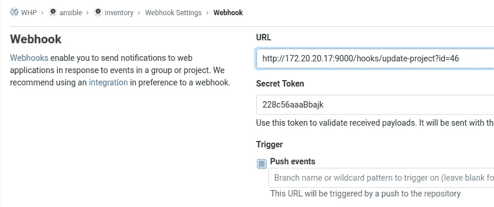

# 实施 AWX — Gitlab 集成

> 原文：<https://itnext.io/implementing-ansible-awx-gitlab-integration-52c98f113ad0?source=collection_archive---------1----------------------->

## 包括网钩。还有 Kubernetes。

Ansible AWX(或其商业对手，Red-Hat 的 Ansible Tower)是一个基于 Ansible 的 Web UI 驱动的企业部署自动化工具。Gitlab 是一个越来越受欢迎的基于 git 的存储库管理器，有很多附加选项。稍加修改，这两者真的可以发挥彼此的优势。

AWX 真的希望被部署到 Kubernetes 或类似的基于 docker 的编排解决方案中，如 open shift——只需阅读[文档](https://github.com/ansible/awx/blob/devel/INSTALL.md)。这意味着它希望遵循 K8s 的核心理念，尽可能做到无状态，这也意味着你应该将所有的剧本、库存和角色存储在其他地方——这就是 Gitlab 的用武之地。

老实说，我曾试图绕过 AWX 计划的部署场景一段时间，虽然它的工作，它远远不是最佳的。例如，我将一个非官方的基于 RPM 的 AWX 发行版部署到一个 CentOS VM 中，将附加的先决条件直接安装到它的 virtualenv 中，尝试修复各种路径以便 AWX 的 Ansible worker 可以找到它们，等等。但它并不优雅——它更像是一项黑客工作，这使得工作流程的任何升级或更改都是计划或执行的痛苦。

# **(随波逐流)**

更好的方法是将上述所有内容存储在一个源代码控制管理系统(SCM)中，比如 Gitlab。我现在的做法是将这些可行的部分分开:

*   比赛
*   角色
*   存货

每个角色应该是一个独立的 git 项目，因为它更容易被 Ansible Galaxy 插件共享和引用。库存进一步细化到生产、开发和归档库存(最后一项库存主要用于参考，因为 Ansible 库存可以作为 IaC 文档提供给有经验的人员)。

变化最大的是库存回购。一旦更改发布到 Gitlab，我们希望它通知 AWX 下载最新版本，这样我们就可以部署它了。剧本和角色也是如此(应该尽可能模块化、可插拔和可重用——你应该通过清单而不是剧本来描述特定的部署)。

# **定义项目**

首先，你要为剧、角色、库存创建合适的 Gitlab 项目(repos)。你也可以用同一个回购来交易和库存，但我喜欢把它们分开。角色应该放在单独的项目中，但是你可以通过 Gitlab 的组和子组来组织它们。

一旦我们有了这样的设置，我们应该在 AWX (SCM 类型 Git)添加库存和游戏作为项目。您必须在 Gitlab 中创建一个用户，该用户有权克隆代码并将其添加到 AWX。

完成这些之后，我们实际上可以开始在 AWX 定义库存和模板了(尽管它们现在相当静态)。对于每个库存，您可以定义一个同步源(在“源”选项卡下选择“来源于项目”)，对于每个模板，您可以指定一个播放。您输入的路径是相对于 git repo 的根路径(即`production/servers.yml`)。最后可以手动同步，看看有没有效果。

# **定义角色**

角色有些不同，因为它们实际上不需要自己的项目。Ansible 扮演角色的方式是在一个专门的`requirements.yml`文件中为您的剧本指定角色要求。这将由 AWX 自动读取并调用

```
ansible-galaxy install -r roles/requirements.yml
```

这意味着你应该让`roles/requirements.yml`在 SCM 项目中托管你的剧本(而不是在这个文件夹中有实际的角色，不久前我被指控有罪)，也就是说你的剧本文件夹结构看起来有点像这样:

```
|maintenance
|   |_________update.yml
|   |_________set_pass.yml
|   |_________common_packages.yml
|
|web-ops
|   |_________apache-php-mysql.yml
|   |_________nginx-php.yml
|
|database-ops
|   |_________restore.yml
|   |_________create.yml
|
|roles
|   |_________requirements.yml
```

虽然这只是一个例子，但是这里的想法是上面所有的都扮演参考角色(例如，安装 php、httpd、nginx 和 mysqld)，然后这些角色的来源由`requirements.yml`指定:

```
- src: git+https://gitlab.com/ansible/roles/httpd.git
  name: httpd- src: git+https://gitlab.com/ansible/roles/mysql.git
  name: mysql- src: git+https://gitlab.com/ansible/roles/nginx.git
  name: nginx- src: git+https://gitlab.com/ansible/roles/php.git
  name: php
```

同样，这些路径完全是虚构的，但是您明白了——我们没有在项目的 roles 目录下提供每个角色，而是定义了它们的 Gitlab repos，这样 AWX 就可以为您提取它们。

# 我答应了 webhooks。

所以，让我们有网钩。虽然您可以指定 AWX 按计划从 Gitlab 中拉出(或者手动……哎呀！)，当源代码发生变化时，AWX 刷新项目是非常有益的。我们将通过一个 webhook 来处理这个问题，它将在 git push 事件上触发，并随后触发 AWX 项目更新。

现在，Gitlab 项目支持现成的 webhooks，但它相当稀疏——您可以指定认证令牌和 URL。问题是，可以通过 API 调用触发 AWX 从 SCM 拉取，但是它希望它的参数包含在 HTTP 请求的正文中，而不是 URL 中(这是 Gitlab 唯一支持的)。所以我们需要在两者之间进行转换。

幸运的是，有一个方便的 Go 应用程序，你猜对了，叫做 [Webhook](https://github.com/adnanh/webhook) 。它解析各种请求参数并执行脚本作为输出。您可以轻松地编译该应用程序—它将提供一个可执行文件，默认情况下该文件将侦听端口 9000，解析传入的请求并执行适当的操作。

你猜怎么着？这使得它成为在 Docker / Kubernetes 环境下运行的主要嫌疑对象。您也可以跳过这一步，只进行自述文件中指定的常规安装:

```
go get github.com/adnanh/webhook
go build github.com/adnanh/webhook
```

如果你选择在 Docker 下运行，这里有一个 Docker 文件:

```
FROM golang:1.15
WORKDIR /go/src/RUN go get github.com/adnanh/webhook
RUN CGO_ENABLED=0 GOOS=linux go build github.com/adnanh/webhookFROM alpine:latest
WORKDIR /opt
RUN mkdir -p /opt/webhook/bin && \
mkdir -p /opt/webhook/scripts && \
apk --no-cache add curl
COPY --from=0 /go/src/webhook /opt/webhook/bin/
COPY scripts/ /opt/webhook/scriptsCMD ["/opt/webhook/bin/webhook",  "-hooks", "/opt/webhook/scripts/hook.json", "--verbose"]
```

此外，让我们用它来做一个 Kubernetes 部署，因为它非常简单:

```
apiVersion: apps/v1
kind: Deployment
metadata:
  name: webhook  
spec:
  selector:
    matchLabels:
      app: webhook
  replicas: 1
  template:
    metadata:
      labels:
        app: webhook
    spec:
      volumes:
        - name: webhook-confs
          configMap:
            name: webhook-confs
            defaultMode: 0777
      containers:
      - name: webhook
        image: netcomhr/webhook
        imagePullPolicy: Always       
        ports:
        - containerPort: 9000
        volumeMounts:
        - name: webhook-confs
          mountPath: /opt/webhook/scripts                    
---
apiVersion: v1
kind: Service
metadata:
  name: webhook
  namespace: misc
spec:  
  type: LoadBalancer  
  ports:
    - name: webhook-port
      port: 9000
      targetPort: 9000
      protocol: TCP
  selector:
    app: webhook
```

请注意，您可以通过拉我的预构建映像(`netcomhr/webhook`)来直接使用这个清单，或者您可以通过提供的 docker 文件来构建您自己的映像。

dockerfile 和 manifest 都引用了`/opt/webhook/scripts`目录中的脚本，特别是包含实际钩子定义的`hook.json`(这是 webhook 监听器的强制启动参数)。我将在这里提供一个配置(映射)示例:

```
---
apiVersion: v1
kind: ConfigMap
metadata:
  name: webhook-confs  
data: 
  hook.json: |
    [
      {
      "id": "update-project",
        "execute-command": "/opt/webhook/scripts/update-project.sh",
        "command-working-directory": "/opt/webhook/scripts/",
        "pass-arguments-to-command": [
          {
            "source": "url",
            "name": "id"
          },
          {
            "source": "header",
            "name": "X-Gitlab-Token"
          }
        ]
      }
    ]

  update-project.sh: |
    #!/bin/sh
    proj=$1
    secret="$2"
    if [ "$secret" == "228c56aaaBbajk" ]; then
        curl -qs \
            -d '{"extra_vars":{"target":"somehost"}}' \
            -H "Content-type: application/json" \
            -u <awx_user>:<awx_pass>  \
            --insecure \
            "https://awx.local/api/v2/projects/$proj/update/"
    fi
```

因此，`hook.json`将分析标题和 URL，并调用`update-project.sh`,向其传递两个参数——来自 URL 的 id 参数和 Gitlab 令牌——我们将在 Gitlab 中定义 webhook 时提供这两个参数。

该 id 必须是我们正在更新的 AWX 项目的 id。在 Gitlab 项目的 webhook 设置中，我们将指定如下内容:



172.20.20.17:9000 是 webhook 侦听器的示例地址，可以是独立的，也可以是在 K8s 下运行的。`update-project`URL 的一部分对应于`hooks.json`中的定义。id 参数和秘密令牌将被传递给`update-project.sh`。

在`update-project.sh`中，我们然后检查令牌(`if [ "$secret" == "228c56aaaBbajk" ]`)的有效性，并调用结构化的`curl`命令，该命令将使用 Gitlab 提供的 id 更新 AWX 项目。这是非常基本的安全检查，我相信可以改进，但这已经超出了现在的范围。

还要注意，除了运行简单的项目更新，您还可以在各种事件上从 Gitlab 调用 AWX 作业。在这种情况下，看一下`-d '{"extra_vars":{"target":"somehost"}}' \.` ，虽然这里根本不需要它(因为我们只是更新一个项目)，但如果您需要从模板运行一个作业，我提供它作为参考——这是向它提供(额外)变量的方式。

您还需要创建一个用户来更新 AWX 的项目，并为其提供一个简单的“更新”角色来更新相关的项目。然后调整 curl 请求的用户和密码:

```
-u <awx_user>:<awx_pass>  \
```

请不要使用您的管理员帐户。

最后，如果您不知道如何找到您的 AWX 项目的 id，只需从项目菜单中打开有问题的项目并查看 URL，它应该类似于:

[https://awx.local/#/projects/54?project _ search = page _ size:20；order_by:名称](https://awx.netcom.local/#/projects/47?project_search=page_size:20;order_by:name)

在这个例子中，我们的项目 id 是 54，所以来自 Gitlab 的 webhook 调用应该是:

[http://172 . 20 . 20 . 17:9000/hooks/update-project？id=54](http://172.20.20.17:9000/hooks/update-project?id=54)

# 从这里…

…只有天空才是极限。既然您现在有了从 Gitlab 调用 AWX 操作的基本框架，您可以扩展`hooks.json`来读取 Gitlab 的请求头、请求体或 URL 的各个部分，并执行您希望的任何操作。AWX 和 Gitlab 都有自己的 API，所以你可以混合搭配。当一个新的发布标签被创建时，你可以自动为你的应用提供整个机器集群的场景只有一步之遥！

嗯……实际上比一步多一点点，但是每条路都有起点。