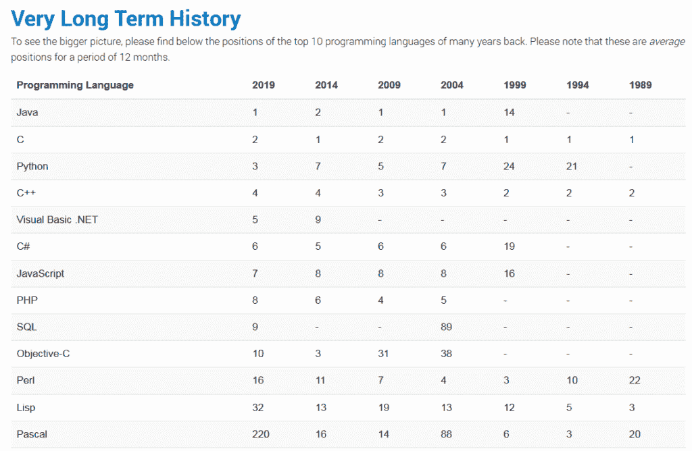
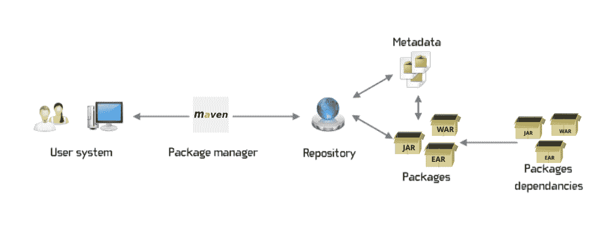
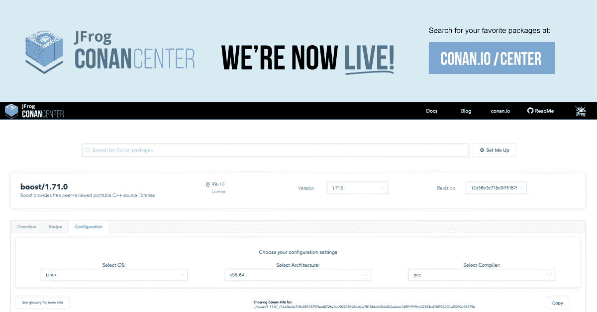
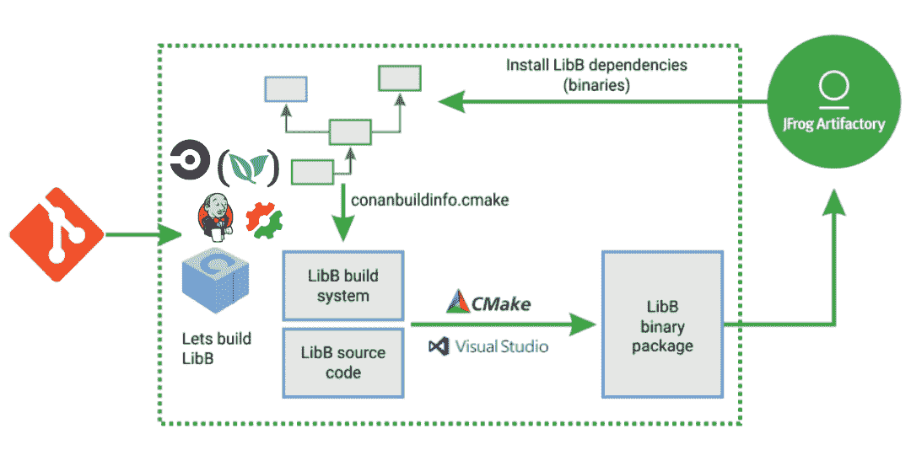

# 为 C 和 C++项目实现 DevOps

> 原文：<https://itnext.io/implementing-devops-for-c-and-c-projects-a8f9f33eb0a0?source=collection_archive---------3----------------------->

C 和 C++社区拥有世界上最广泛的代码库。许多在线编写和分享的算法都是用 c 语言完成的，它们必然是编程语言的“通用语言”。据估计有 450 万 C++程序员和 200 万 C 程序员，C 和 C++是世界上最流行的编程语言之一。他们有超过 40 年的历史，C 和 C++已经被用于构建各种类型的应用程序，从嵌入式系统，移动应用程序等等。C 和 C++也是最受欢迎的五种语言之一，并强调了它们今天仍然具有的影响力。

如今市场上有数百种编程语言，但说到性能，没有人能挑战 C 和 C++。大多数著名的软件巨头出于各种目的使用 C++作为他们的主要语言。谷歌、脸书、SAP、Adobe、甲骨文、PayPal、LinkedIn 等公司，以及汽车或制造业等整个行业。严重依赖这种语言的力量。C++被用在许多现实世界的应用中，例如游戏、基于 GUI 的应用、嵌入式系统、智能汽车、企业软件、机器人、编译器、操作系统等

开发人员总是在寻找借助现代工具和技术让 C 和 C++变得更快的方法。对于 C 和 C++，更快地发布构建是最大的关注点；直到引入柯南之后，这个社区才有了一个合适的软件包管理系统。

## **C 和 C++是开发者的首选**

*   根据今年四月 Tiobe 的十大语言排名，C 和 C++夺回了自己的位置，重新回到了榜首
*   在 IEEE Spectrum 的第五次年度顶级编程语言互动排名中，C 和 C++击败了所有其他被炒作的语言，保持了自己的排名。
*   我确实发现了美国独角兽公司最普遍的编程语言，并且发现 C 和 C++在名单上很突出。

## **什么是包管理器？**

包只不过是一个存档文件，其中包含软件的二进制文件、配置文件以及关于依赖关系、元数据、描述等的信息。包管理器有助于现有资源的有效重用，并节省大量重用他人代码的时间(作为二进制文件)。有了它，开发人员可以轻松地将所有依赖项作为一个包提升到软件开发生命周期中的下一个级别，并协作提高效率。

*典型的 Linux 包管理流程或架构如下所示，*

了解更多关于[包管理器](https://en.m.wikipedia.org/wiki/Package_manager)和[包管理系统](https://en.wikipedia.org/wiki/List_of_software_package_management_systems)

## **为什么要对 C 和 C++进行包管理？**

*   由于 C 和 C++二进制文件不能在一个平台上构建，也不能在其他不同的平台上重用，所以需要有一个包管理器
*   每次你重新构建一个二进制文件，你都有重新构建错误的风险
*   在版本控制系统中以 Git 的形式共享你的二进制文件是一个糟糕的做法，它会使你的签出时间变长，因此你需要一个包管理器
*   C 和 C++项目可能非常庞大，总是从源代码构建变得不可行，并且管理不同平台的所有二进制文件和库将非常困难，因此，二进制文件包管理对于扩展是必须的
*   C 和 C++在每一个平台上都有不同的编译器和不同的构建系统，包管理器已经成为一种必需品，它可以处理任何构建系统

## 柯南，C 和 C++包管理器

虽然有其他语言的包管理器，但 C 和 C++在很长一段时间内对此没有支持，这在社区中造成了许多问题，从开发运维及自动化的角度来看，这种语言被忽视了。

如前所述，在 C 和 C++中，实现二进制兼容性是复杂的，因为应用程序面向多种平台和配置，并且每个平台和配置都需要自己的二进制文件。[柯南中心](https://conan.io/center/)是一个开源的 C 和 C++包管理器，为开发者提供解决方案，减少二进制兼容性问题，同时支持所有主要系统。柯南帮助公司构建应用程序，并使它们跨平台的依赖性自动化。

Conan package manager，它是一个用于 C 和 C++的去中心化的包管理器，通过类似于 Git 的推拉模型，使开发者能够共享包。DevOps 已经成为柯南的现实，柯南使用“配方”，结构化的 python 脚本，概述了如何通过显式调用任何构建系统来构建库。为了管理不同的配置和 [ABI 兼容性](https://stackoverflow.com/questions/2171177/what-is-an-application-binary-interface-abi)，柯南使用“设置”，因此当设置改变时，柯南为相同的库生成修改的二进制版本。通过这种方式，柯南可以处理二进制文件，并帮助使用 C 和 C++的开发人员轻松地将已经构建好的二进制文件上传到 Artifactory 或 Bintray，这样就可以在团队之间高效地共享它们。

ConanCenter 是一个为流行的开源库寻找和分享 [C 和 C++ Conan 包](https://conan.io/center/)的地方。

ConanCenter 允许访问每个版本包的大量配置。

首先，选择操作系统、架构和编译器，深入研究可用的二进制文件，找到任意数量的配置选项。

## **C/c++项目开发运维**

C 和 C++项目的持续集成是很困难的，这是由于 C/C++和编译为本机代码过程的特定特征，头文件(甚至源文件)中的代码是内联的，并且静态和动态库的链接类型不同。

C 和 C++项目通常会面临升级依赖关系的问题，它会影响 CI 流程，并从这一点影响到整个 DevOps 流程。因此，OSS Conan 包管理器正在努力为它实现工具，并帮助 C/C++社区无缝地进行开发和自动化。

拥有一个得到良好支持的包管理系统意味着拥有一种公共语言和库，它们被所有标准操作系统上的所有重要编译器统一支持。柯南非常适合嵌入式，甚至裸机。这有助于管理依赖项和二进制文件，因此 DevOps 过程是平稳的和组织良好的。柯南正在帮助 C/C++项目拥抱 DevOps，现在有了 [Artifactory](https://jfrog.com/artifactory/) 对柯南 C/C++包管理器的支持以及与 Jenkins 的良好集成，为 C 和 C++项目定义有效和自动化的 DevOps 工作流是可行的。这将有效地支持和管理二进制文件的创建、测试和重用，这对于用 C 和 C++开发的典型大型项目，以及多平台、编译器和配置的二进制文件生成和重用至关重要。Conan 可以和许多其他技术一起使用来加速你的 C/C++应用，比如 OpenShift。您可以使用 Artifactory 轻松对接 C++应用程序并简化部署。

**入门** [**柯南**](https://conan.io/) **，面向开发者的 C/C++包管理器。**