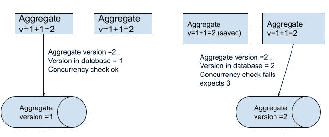
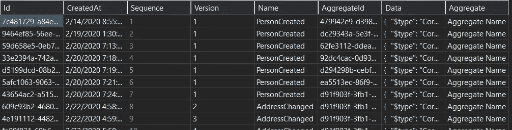

# 在 C#中实现事件存储

> 原文：<https://itnext.io/implementing-event-store-in-c-8a27138cc90?source=collection_archive---------0----------------------->

这是怎么回事？

在寻找 Event Sourcing 实现中 EventStore 的例子时，你可能会发现很多，理论上非常详细，但缺乏实际实现。在这篇文章中，我的目标是解释如何实现简单而健壮的事件存储，测试它，以及根据我自己的经验，你会遇到哪些陷阱。

这里介绍的事件存储将在中实现。NET 核心，C#和 MS SQL LocalDB 服务器作为数据库。

包含工作解决方案的完整项目可在我的 [github](https://github.com/bolicd/eventstore) 上获得

***事件采购简介***

我不会详细讨论什么是事件采购，因为这个主题在网上的许多书籍和文章中都有涉及。

相反，在考虑实现一个实际的事件存储时，我将把重点放在什么是重要的。但是，尽管如此，我将快速总结事件采购背后的主要思想和主要挑战。

*骨料被认为是一个由骨料根代表的整体。从概念上讲，聚合是以整体形式加载和保存的。(埃文斯，2001 年)。*

事件源是一种软件架构模式，它规定应用程序的状态应该作为事件序列持久化。活动采购的主要优势是:

*   *可审核性* —由于状态是由事件序列构成的，因此可以提取从请求到当前日期的详细日志
*   *预测/查询* —有可能在不同的时间框架内重建状态，因为我们从一开始就有所有的事件。例如，可以检查一年前的银行账户状态。这也允许生成一些我们在启动系统时从未想过的查询/报告，因为所有的数据都在事件中。
*   *插入数据时的性能* —由于 EventStore 是带有乐观锁定的 append only 存储，我们希望发生的死锁(或并发异常)会少得多。此外，不再运行在多个表中插入数据图表事务。
*   *平面数据库结构* —我们通常使用 1 个(或最多 2 个表)作为事件存储。在这两种情况下，它都是非规范化形式，使用某种形式的弱序列化字段来存储事件的有效负载，例如 JSON。这意味着在向数据库添加新字段时，不需要将它们添加到任何表中——只需调整事件并添加所需字段，就可以将其保存到 JSON 中。这允许更快的写入端开发时间

与每种模式一样，我们必须意识到局限性/挑战。如果使用不当，事件源可能会弊大于利。因此，我们应该牢记的主要挑战是:

*   *存储增长* —由于数据存储仅追加，表将无限增长。这可以通过使用快照或保留策略来缓解。
*   *重放事件* —如果用于构建聚合的事件数量很大，则在重建聚合的当前状态时可能会导致一些性能问题。这可以通过使用快照来缓解。
*   *事件版本控制和事件处理* —当改变现有事件，或添加/删除特征时，必须有一个映射旧事件的代码，因为它用于将状态重建到实际状态。这意味着，如果某个功能被否决，其代码不能被删除，因为它用于重建当时的状态。这个挑战有点难以克服，但可以减轻。

***事件存储注意事项***

事件存储的要求如下:

*   它是仅追加的，这意味着没有仅更新插入
*   它应该存储聚合状态，并允许按保存顺序提取给定聚合的事件。
*   它应该使用乐观并发检查:乐观并发检查不使用数据库级别的锁定，因此降低了死锁的风险。相反，并发检查是在保存时进行的。

***乐观并发检查***

当插入到存在多个客户端的数据库中时，可能会发生 2 个或更多客户端尝试修改同一个聚合的情况。因为我们不使用悲观并发检查，所以不会有锁和等待，但是检查本身会在尝试持久保存实际数据时应用。

为了说明问题，让我们考虑一个例子:

假设有两个请求想要修改同一个名为 aggregate 的聚合。*应该在数据库级实现并发检查。*

1.  它们都将从为 1 的事件存储中获取当前版本
2.  保存第一个聚合，第二个聚合版本设置为 2
3.  在这种情况下，第二个聚合将无法通过并发检查，因为它的版本是 2，而预期的版本是 3。这表示数据自读取后已被更改。在这种情况下，保存第二个聚合应该会因并发异常而失败。

使用聚合版本的乐观检查示例

**数据库模式**

事件存储将是一个表，*仅追加*，这允许每个集合的版本跟踪，并在数据库级别实现并发检查。

带有数据 JSON 字段的事件存储表的 SQL(这是事件有效负载被序列化的地方):

事件存储的 SQL 示例表

AggregateId 和 Version 是用于并发检查的两个字段。我们用这两个字段创建唯一的索引。AggregateId 是我们聚合的 Id，可以是我们想要的任何值(因此它被定义为 string)。根据域的不同，它可以是 GUID、int 或两者的组合，这并不重要。

请注意，AggregateId 被定义为 nvarchar(250)

在数据库级别上，对表的 Version 和 AggregateId 字段强制使用唯一索引

利用这一点，我们可以确保永远不会保存相同的 aggregate id/版本组合。相反，数据库会引发唯一索引检查失败异常。 ***这是一个暂时性的错误*** ，意味着可以(也应该)在客户端实现重试机制(见重试模式)。

**范例项目简介**

项目是使用。网芯 3.1。

项目架构是分层的，并具有控制反转。

图层:

*   **RestAPI** —包含 DTO 和 REST 控制器定义的 Web API
*   **基础设施** —工厂、数据库模型和存储库实现在此定义
*   **核心** —包含业务逻辑以及聚合的存储库接口。这个项目没有引用任何其他项目或任何其他第三方库(除了战术 DDD nuget 这是纯 C#代码)

其他项目:

*   **数据库迁移** —用于初始化数据库的迁移项目
*   **EventStoreTests** —测试项目，演示事件存储的集成测试

对于核心业务逻辑，只有一个名为 **Person** 的聚合和两个域事件:

1.  *人员创建* —人员创建时发布此事件
2.  *AddressChanged* —当给定人员的地址改变时，发布此事件

如何设置和运行项目可以在 github 资源库的 readme 文件中找到。

**事件存储实现**

让我们看一下实现事件存储的实际代码。我在这里只放代码片段，而完整功能的项目可以在我的 [github](https://github.com/bolicd/eventstore) 上找到。

*事件存储库*的接口可以定义为:

接口定义了两种方法。

*   ***SaveAsync*** 方法用于将聚合持久化为事件流。集合本身被描述为域事件的集合，具有唯一的名称。
*   ***LoadAsync*** 方法使用 AggregateId 作为参数从事件存储中提取聚合，并将其作为事件数组发出。该数组可用于加载聚合。

*IEntityId* 和 *IDomainEvent* 都是从一个[战术 DDD nuget](https://www.nuget.org/packages/TacticalDDD/) 中导入的，这个我强烈推荐给 C#中的 DDD。这两个都是简单的接口，标记了 *EntityId* 类和 *DomainEvent* 类。

让我们分析一下这两种方法的实际实现:

**持续事件**

为了将聚合持久化到 EventStore 中，我们需要 3 个参数:

1.  *聚合 Id* —这是聚合的 Id。在我们的例子中，它将是实现 *IEntityId* 接口的类
2.  *OriginatingVersion* —这是正在保存的聚合版本。一旦保存的版本增加 1。如前所述，这用于开放式并发检查
3.  *IReadOnlyCollection<IDomainEvent>*—这是需要持久化到数据库中的事件的实际列表。每个事件都作为新行保存。

*实现 SaveAsync*

此方法的完整实现可以在 EventStoryRepository.cs 文件中找到。

首先，使用提供的参数创建插入查询。为此，我们使用 micro ORM [Dapper](https://www.nuget.org/packages/Dapper/) ，它允许使用@符号映射参数。

参数名称(例如@Name)与对象特性匹配并被映射。这就是为什么在下一行中，*创建了一个匿名对象列表，其属性与 query 中定义的属性相同。*

属性包括:

*   **聚合** -这是一个聚合的字符串名称。
*   **创建日期** —是创建事件的日期/时间
*   **数据** —这是事件负载，序列化为 JSON 字符串。使用提供的 jsonSettings 将完整事件序列化到 JSON 中。
*   **Id** —这可以是任何类型的 Id。对于这个例子，我使用了 Guid。
*   **名称** —这是实际的事件名称
*   **聚合 Id** —这是聚合的 Id。使用此字段，可以过滤给定聚合的事件。
*   **版本** —给定集合的每次增量。用于开放式并发检查。

然后，使用以下方法将事件列表映射到实际查询:

> 等待连接。ExecuteAsync(查询，列表事件)；

这行代码使用 Dapper ORM 中的 *ExecuteAsync* 方法，该方法将使用查询字符串中定义的参数映射 *listOfEvents* 属性，并创建实际的查询。

当以这种方式持久化时，每个事件都作为新行持久化在 EventStore 表中，并带有实际事件的数据有效负载。它看起来是这样的:

每个事件都作为新行保存在数据库中。每个聚合和序列的版本更改总是递增的

检查数据列时，这是有效载荷:

> {
> "$type ":"核心。person . domain events . person created，Core "，
> " PersonId ":" d91f 903 f-3fb 1–4b 68–9a 59-c 1818 c 94 f 104 "，
> "名字":" damir6 "，
> "姓氏":" bolic7 "，
> " created at ":" 2020–02–20t 07:24:54.0490305 z "
> }

该事件的有效负载实际上是从 PersonCreated 事件映射而来的，该事件是在创建新人员时发出的:

创建新的人员集合时，将发布此域事件

DomainEvent 类可以定义如下:

基本上，CreatedAt 是基于 DDD 战术 nuget 的 IDomainEvent 添加的。

**装载骨料**

使用 AggregateId 加载聚合。对于给定的 aggregate，加载所有事件，然后使用这些事件构造 Aggregate，进而在内存中生成新的 Aggregate 对象。

使用 SQL 查询加载聚合，作为使用*事件存储库的事件列表。LoadAsync()* 方法。当事件从 JSON 反序列化并转换为 DomainEvent 对象时，真正的奇迹发生了:

选择聚合的所有事件，并将它们转换为域事件

正如我们所看到的，事件被提取为对象的 EventStoreDao 列表，然后使用 *TransformEvent* 方法将其转换为*域事件*:

这里，事件 *eventSelected 的实际有效载荷。数据*被反序列化为对象，然后被转换为 *IDomainEvent* 接口。*注意，如果转换失败，它将返回 null。*

一旦获取了域事件列表，就可以构建人员集合。

**测试**

测试事件存储并不难。

对于单元测试，它定义了可以被模仿的接口 *IEventStore* 。

对于集成测试，可以使用内存数据库。在示例项目中， [*LocalDB*](https://docs.microsoft.com/en-us/sql/database-engine/configure-windows/sql-server-express-localdb?view=sql-server-ver15) 用于测试和实际项目中。这位于*eventstoregintegrationtests . cs*文件中。

**总结**

这篇博客的目的是用具体的例子展示如何用 C#实现简单的事件存储。为此，我们使用了一些 DDD 概念，如集合、存储库、实体和值对象。

本博客包含的示例项目旨在简单演示这里定义的原则。