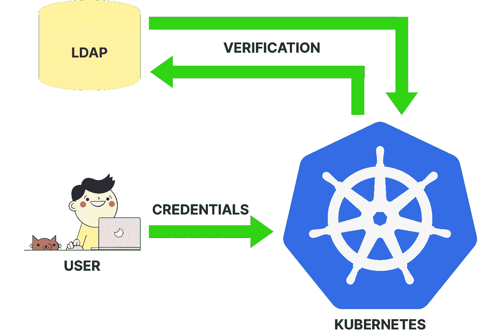
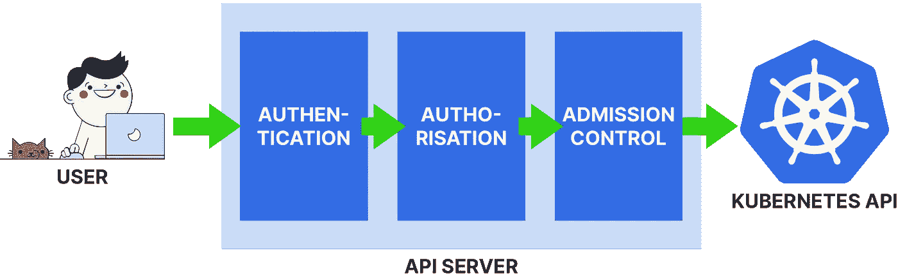
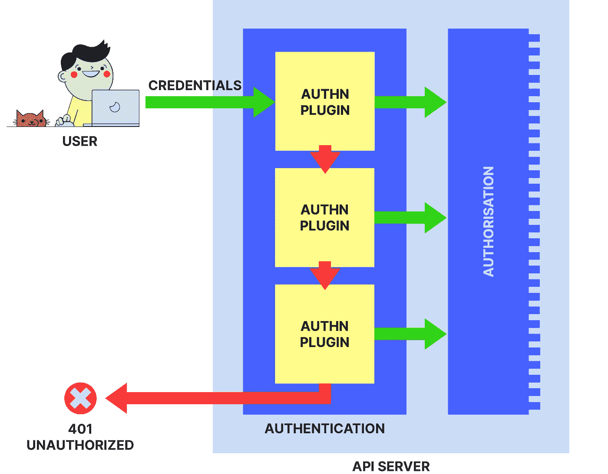
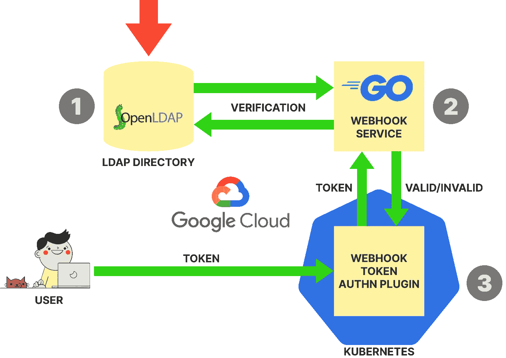
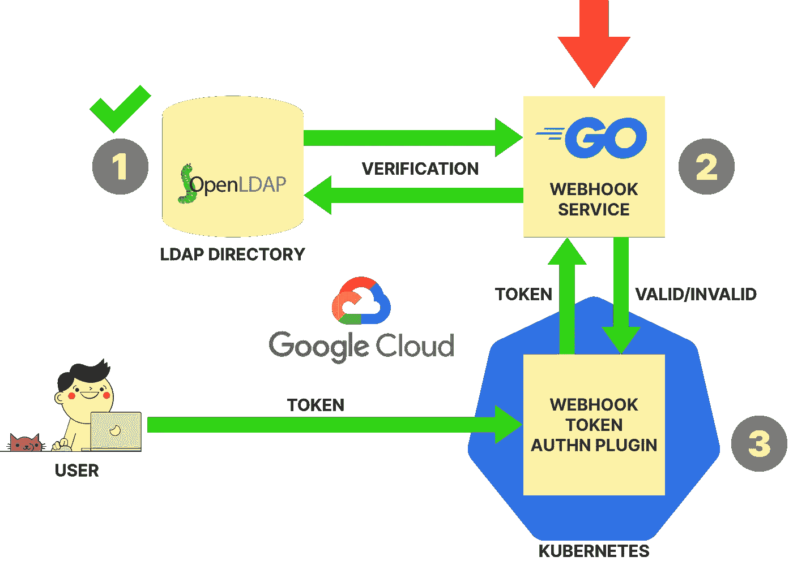
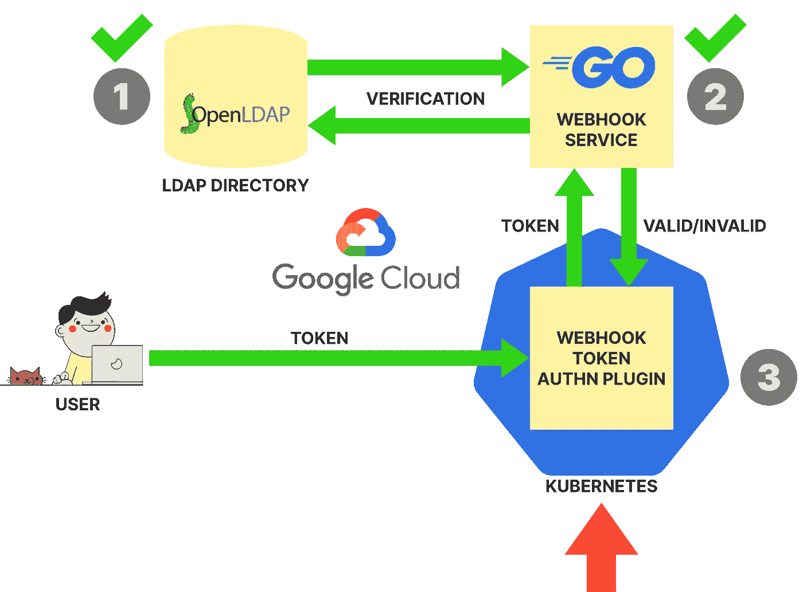
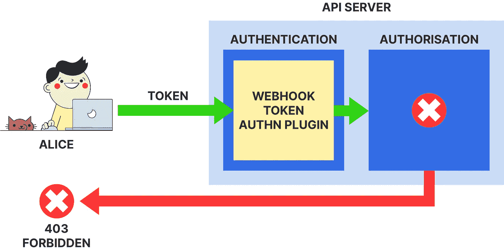
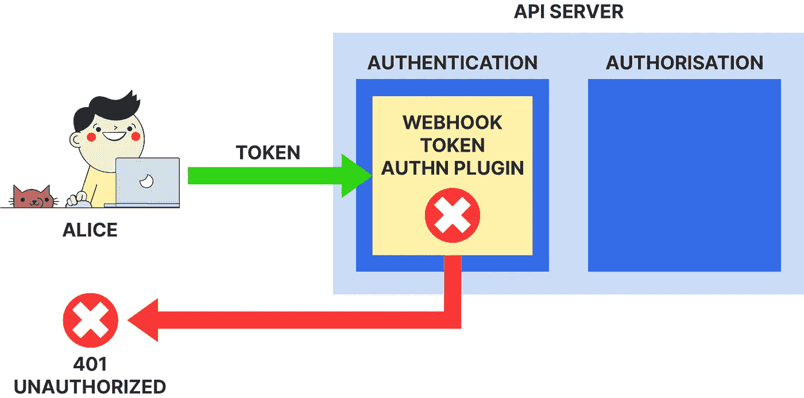

# 为 Kubernetes 实现 LDAP 认证

> 原文：<https://itnext.io/implementing-ldap-authentication-for-kubernetes-732178ec2155?source=collection_archive---------0----------------------->

本文展示了如何使用 [Webhook 令牌](https://kubernetes.io/docs/reference/access-authn-authz/authentication/#webhook-token-authentication)认证插件为 Kubernetes 实现 [LDAP 认证](https://connect2id.com/products/ldapauth/auth-explained)。这篇文章包括一个教程，带你从零到完整的系统，一步一步的指示。不需要事先了解 Kubernetes 认证。

在本教程中，您将从头开始设置一个 LDAP 目录、一个 webhook 服务和一个 Kubernetes 集群。你将所有组件部署到[谷歌云平台(GCP)](https://cloud.google.com/) 。最终，您将拥有一个完全可用的 Kubernetes 集群，用户可以使用他们的 LDAP 凭证访问它。

> 这篇文章的前一个版本已经发表在 learnk8s.io 上。

# 内容

*   [**简介**](#bfce)
*   [**Kubernetes API 访问**](#a4ab)
*   [**认证**](#59be)
*   [**教程概述**](#bc98)
*   [教程**先决条件**教程](#ed12)
*   [**第一步:创建 LDAP 目录**](#6c69)
*   [**第二步:创建 webhook 服务**](#96d3)
*   [**步骤 3:创建 Kubernetes 集群**](#a94a)
*   [**第四步:测试 LDAP 认证**](#15eb)
*   [**清理**](#cb95)
*   [**结论**](#2bf4)

# 介绍

Kubernetes 支持几种开箱即用的[认证方法](https://kubernetes.io/docs/reference/access-authn-authz/authentication/)，比如 [X.509 客户端证书](https://kubernetes.io/docs/reference/access-authn-authz/authentication/#x509-client-certs)、[静态 HTTP 承载令牌](https://kubernetes.io/docs/reference/access-authn-authz/authentication/#static-token-file)，以及 [OpenID Connect](https://kubernetes.io/docs/reference/access-authn-authz/authentication/#openid-connect-tokens) 。

然而，Kubernetes 也允许实现定制的身份验证方法。这些可能是已经用于组织中现有应用程序和服务的身份验证方法。这使得 Kubernetes 能够与现有的认证基础设施无缝集成。

在企业中广泛使用的认证方法之一是 [LDAP 认证](https://connect2id.com/products/ldapauth/auth-explained)。

> LDAP 代表 [**轻量级目录访问协议**](https://en.wikipedia.org/wiki/Lightweight_Directory_Access_Protocol) ，是一种[目录服务](https://en.wikipedia.org/wiki/Directory_service)(类似于 DNS)，通常用作组织中凭证和其他用户信息的中心来源。

LDAP 身份验证意味着用户凭证集中保存在 LDAP 服务器(称为 LDAP 目录)中，使用 LDAP 身份验证的应用程序通过查询该 LDAP 目录来验证所提供的用户凭证。这意味着用户可以在多个应用程序和服务中重复使用相同的凭据，并且可以在整个组织的一个中心位置管理所有凭据。

在本文的教程部分，您将为 Kubernetes 集群实现 LDAP 身份验证。这意味着:



所有用户的凭据都保存在外部 LDAP 目录中并进行管理。当用户访问 Kubernetes 时，他们会在其 Kubernetes 请求中包含一个由这些凭证组成的令牌。然后，LDAP 身份验证实现通过对照 LDAP 目录检查包含的凭据来验证这些令牌。

*在进入实践部分之前，让我们回顾一下关于如何访问 Kubernetes API 的一些理论，特别是身份验证。*

# Kubernetes API 访问

对 Kubernetes API 的每个请求在 API 服务器中都要经过三个阶段:**认证**、**授权**和**准入控制**:



每个阶段都有明确的目的:

*   [**认证**](https://kubernetes.io/docs/reference/access-authn-authz/authentication/) 检查发出请求的用户是否是 Kubernetes 集群的合法用户。
*   [**授权**](https://kubernetes.io/docs/reference/access-authn-authz/authorization/) 检查用户是否有权执行所请求的 Kubernetes API 操作。
*   [**准入控制**](https://kubernetes.io/docs/reference/access-authn-authz/admission-controllers/) 对请求执行各种附加的可配置验证和变异。

请求可以在每个阶段被拒绝，只有成功通过所有三个阶段的请求才由 Kubernetes API 处理。

*因为本教程是关于认证的，所以让我们仔细看看认证阶段。*

# 证明

在内部，认证阶段由一系列[认证插件](https://kubernetes.io/docs/reference/access-authn-authz/authentication/#authentication-strategies)组成:



传入的请求按顺序传递给每个身份验证插件。每个身份验证插件都会尝试验证请求中的凭据:

*   如果认证插件成功验证了凭证，则剩余的认证插件被短路，并且请求直接进行到授权阶段。
*   如果一个身份验证插件无法验证凭证，请求将被传递给链中的下一个身份验证插件。
*   如果没有一个认证插件可以验证凭证，则该请求将被拒绝，并显示一个 [**401 未授权**](https://developer.mozilla.org/en-US/docs/Web/HTTP/Status/401) HTTP 状态代码。

> 旁注: [**401 未授权**](https://developer.mozilla.org/en-US/docs/Web/HTTP/Status/401) 状态码是[长期以来的误称](https://stackoverflow.com/a/6937030/4747193)，因为它表示认证错误，而不是顾名思义的授权错误。授权错误的 HTTP 状态代码是 [**403 禁止**](https://developer.mozilla.org/en-US/docs/Web/HTTP/Status/403) 。

让我们仔细看看认证插件。

## 认证插件

首先，这里有两个关于认证插件的重要事实:

*   认证插件被编译成 [kube-apiserver](https://kubernetes.io/docs/reference/command-line-tools-reference/kube-apiserver/) 二进制文件。这意味着，它们有一个固定的集合，你不能从头开始开发你自己的认证插件。但是，您可以将自己的身份验证逻辑注入到一些现有的身份验证插件中(这是您在本教程中将会做的)。
*   当 API 服务器启动时，可以有选择地启用认证插件，命令行标志指向 [kube-apiserver](https://kubernetes.io/docs/reference/command-line-tools-reference/kube-apiserver/) 二进制文件。更改启用的身份验证插件集需要重新启动 API 服务器。可以启用任意数量的认证插件及其组合。

那么有哪些认证插件呢？

以下是 Kubernetes v1.18 中未被否决的认证插件的完整列表:

1.  [**静态令牌文件**](https://kubernetes.io/docs/reference/access-authn-authz/authentication/#static-token-file)
2.  [**X.509 客户证书**](https://kubernetes.io/docs/reference/access-authn-authz/authentication/#x509-client-certs)
3.  [**OpenID 连接令牌**](https://kubernetes.io/docs/reference/access-authn-authz/authentication/#openid-connect-tokens)
4.  [**认证代理**](https://kubernetes.io/docs/reference/access-authn-authz/authentication/#authenticating-proxy)
5.  [**Webhook 令牌**](https://kubernetes.io/docs/reference/access-authn-authz/authentication/#webhook-token-authentication)
6.  [**服务账户令牌**](https://kubernetes.io/docs/reference/access-authn-authz/authentication/#service-account-tokens)
7.  [**自举令牌**](https://kubernetes.io/docs/reference/access-authn-authz/authentication/#bootstrap-tokens)

> 直到 Kubernetes v1.16，还有 [**静态密码文件**](https://kubernetes.io/docs/reference/access-authn-authz/authentication/#static-password-file) 认证插件(实现 [HTTP 基本认证](https://tools.ietf.org/html/rfc7617))，现在[已弃用](https://v1-16.docs.kubernetes.io/docs/setup/release/notes/#deprecations-and-removals)。

让我们对这些认证插件进行简单分类，并讨论每个插件的作用。

以下是**完全实现的认证插件**，这意味着它们实现了特定的认证方法:

*   [**静态令牌文件**](https://kubernetes.io/docs/reference/access-authn-authz/authentication/#static-token-file) **:** 允许使用静态定义的 [HTTP 承载令牌](https://swagger.io/docs/specification/authentication/bearer-authentication/)进行认证。
*   [**X.509 客户端证书**](https://kubernetes.io/docs/reference/access-authn-authz/authentication/#x509-client-certs) **:** 允许使用由静态定义的证书颁发机构(CA)签名的 X.509 客户端证书进行身份验证。
*   [**OpenID 连接令牌**](https://kubernetes.io/docs/reference/access-authn-authz/authentication/#openid-connect-tokens) **:** 允许使用外部 OpenID 连接身份提供者颁发的 [OpenID 连接](https://openid.net/connect/)令牌进行身份验证。

接下来是**框架认证插件**，也就是说它们本身不实现任何认证逻辑，但是允许你注入自己的认证逻辑:

*   [**认证代理**](https://kubernetes.io/docs/reference/access-authn-authz/authentication/#authenticating-proxy) **:** 允许在 Kubernetes 集群前配置一个代理服务器，执行用户请求的认证，并将认证的请求转发给 Kubernetes。
*   [**Webhook 令牌**](https://kubernetes.io/docs/reference/access-authn-authz/authentication/#webhook-token-authentication) **:** 允许定义一个外部 Webhook 服务，该服务由 webhook 令牌认证插件调用，用于验证用户在其请求中包含的 [HTTP 承载令牌](https://swagger.io/docs/specification/authentication/bearer-authentication/)。

最后，以下是**系统认证插件**，这意味着它们仅用于系统目的，而不用于人类集群用户的认证:

*   [**服务账户令牌**](https://kubernetes.io/docs/reference/access-authn-authz/authentication/#service-account-tokens) **:** 处理 [Kubernetes 服务账户](https://kubernetes.io/docs/tasks/configure-pod-container/configure-service-account/)的请求认证。
*   [**引导令牌**](https://kubernetes.io/docs/reference/access-authn-authz/authentication/#bootstrap-tokens) **:** 仅在 kubeadm 等工具进行集群引导期间使用，用于临时认证来自 Kubernetes 系统组件的请求。

实际上，您永远不需要直接处理**系统认证插件** ( [服务帐户令牌](https://kubernetes.io/docs/reference/access-authn-authz/authentication/#service-account-tokens)和[引导令牌](https://kubernetes.io/docs/reference/access-authn-authz/authentication/#bootstrap-tokens))，因为它们只由 Kubernetes 本身或集群创建工具使用。

如果任何一个**完全实现的认证插件** ( [静态令牌文件](https://kubernetes.io/docs/reference/access-authn-authz/authentication/#static-token-file)、 [X.509 客户端证书](https://kubernetes.io/docs/reference/access-authn-authz/authentication/#x509-client-certs)、 [OpenID 连接令牌](https://kubernetes.io/docs/reference/access-authn-authz/authentication/#openid-connect-tokens))实现了您想要的认证方法，您可以开箱即用。否则，您可以使用一个**框架认证插件** ( [认证代理](https://kubernetes.io/docs/reference/access-authn-authz/authentication/#authenticating-proxy)和 [Webhook 令牌](https://kubernetes.io/docs/reference/access-authn-authz/authentication/#webhook-token-authentication))来实现您想要的认证方法。

在本文的教程部分，您将使用 [**Webhook 令牌**](https://kubernetes.io/docs/reference/access-authn-authz/authentication/#webhook-token-authentication) 身份验证插件实现 LDAP 身份验证。

*让我们仔细看看您在教程中将构建什么。*

# 教程概述

以下是您将在本教程中构建的完整系统:


该系统包括三个主要组件(编号如上):

1.  LDAP 目录:这是管理所有用户信息的中心。LDAP 目录完全独立于 Kubernetes，它可能存在于 Kubernetes 集群之前(在为 Kubernetes 实现 LDAP 身份验证的实际场景中，LDAP 目录很可能已经存在并用于其他应用程序)。您将使用 [OpenLDAP](https://www.openldap.org/) 作为您的 LDAP 目录实现。
2.  **Webhook 服务:**这是处理来自 Kubernetes API 服务器中的 [Webhook 令牌](https://kubernetes.io/docs/reference/access-authn-authz/authentication/#webhook-token-authentication)认证插件的令牌验证请求的 Webhook 服务。为此，webhook 服务与 LDAP 目录进行交互。您将在 [Go](https://golang.org/) 中实现该服务。
3.  **Kubernetes 集群:**这是向用户提供 LDAP 认证的 Kubernetes 集群。它启用了 Webhook 令牌身份验证插件，并配置为与上述 webhook 服务一起工作。您将使用 [kubeadm](https://kubernetes.io/docs/setup/production-environment/tools/kubeadm/create-cluster-kubeadm/) 创建这个集群。

您将把所有这些组件部署到 [**谷歌云平台(GCP)**](https://cloud.google.com/) 。

> 为本教程创建的 GCP 资源超过了 [GCP 免费等级](https://cloud.google.com/free)，因此将产生费用。这些费用不应超过每小时 0.10 美元(即每天 2.40 美元)。如果你[创建了一个新的 GCP 账户](https://cloud.google.com/)，你将获得 300 美元的信用点数，可以用于本教程。

Webhook 令牌认证插件期望 Kubernetes 请求包含一个 [HTTP 承载令牌](https://swagger.io/docs/specification/authentication/bearer-authentication/)。在您将要构建的系统中，该令牌具有以下形式:

```
username:password 
```

在这个令牌中，`username`是发出请求的用户的用户名，`password`是保存在 LDAP 目录中的相应密码。

> 在现实场景中，这个令牌也应该用 [Base64](https://en.wikipedia.org/wiki/Base64) 编码(或类似的编码)，以允许用户名或密码中有特殊字符。

例如，如果有一个名为爱丽丝的用户，在 LDAP 目录中保存了用户名`alice`和密码`alicepassword`，那么爱丽丝的令牌就是`alice:alicepassword`。为了访问 Kubernetes 集群，Alice 将把这个令牌作为 HTTP 承载令牌包含在她的 Kubernetes 请求中。

让我们看一下如果 Alice 提出这样的请求会发生的步骤:

1.  Webhook 令牌认证插件接收请求并提取令牌`alice:alicepassword`。
2.  Webhook 令牌身份验证插件将令牌提交给 webhook 服务进行验证。
3.  webhook 服务解释令牌并从中提取用户名部分(`alice`)和密码部分(`alicepassword`)。
4.  webhook 服务查询 LDAP 目录以检查`alice`和`alicepassword`是否是 Alice 的正确用户名和密码。
5.  webhook 服务将该查询的结果传递回 Webhook 令牌认证插件。
6.  Webhook 令牌身份验证插件根据 webhook 服务的响应接受或拒绝请求。

现在你应该对你将在教程中构建什么有一个粗略的想法。

*接下来，让我们确保您的机器已准备好执行任务。*

# 教程的先决条件

以下是本教程的先决条件列表:

*   [**GCP 账号和命令行工具**](#ebf9)
*   [**Go 工具**](#257d)
*   [**LDAP 客户端工具**](#17f4)

## GCP 帐户和命令行工具

由于系统将在[谷歌云平台(GCP)](https://connect2id.com/products/ldapauth/auth-explained) 上运行，你需要一个 GCP 账户。您还需要`[gcloud](https://cloud.google.com/sdk/gcloud)`命令行工具来管理您的 GCP 帐户中的 GCP 资源，

如果你还没有 GCP 账户，你可以在 GCP 网站上创建一个。如果你创建了一个新帐户，你将获得价值 300 美元的积分，可以用于本教程。

接下来，如果您还没有这样做，您需要在您的机器上安装`[gcloud](https://cloud.google.com/sdk/gcloud)`命令行工具。`gcloud`是[谷歌云 SDK](https://cloud.google.com/sdk) 的一部分。您可以按如下方式[安装 Google Cloud SDK](https://cloud.google.com/sdk/docs/downloads-interactive) :

```
**$ curl https://sdk.cloud.google.com | bash**
```

之后，重启你的外壳，`gcloud`应该就能正确安装了。

如果您刚刚安装了`gcloud`，您必须使用以下命令对其进行初始化:

```
**$ gcloud init**
```

上面的命令带你通过一个交互式对话框，允许你用各种默认值配置`gcloud`工具。

> 在该对话中，确保设置一个[默认计算区域和区域](https://cloud.google.com/compute/docs/regions-zones/)。

你还必须确保在你当前的 [GCP 项目](https://cloud.google.com/resource-manager/docs/creating-managing-projects)中启用了[谷歌计算引擎 API](https://cloud.google.com/compute/) :

```
**$ gcloud services enable compute.googleapis.com**
```

作为最后一项检查，您可以通过运行以下命令来验证`gcloud`是否设置正确:

```
**$ gcloud compute instances list**
```

如果这个命令没有错误地完成，那么您就已经设置好了。

## Go 工具

您将在 Go 中实现 webhook 服务，因此您需要能够编译 Go 源代码。这可以通过在机器上安装 Go 工具来实现。

在 **macOS** 上，您可以使用:

```
**$ brew install go**
```

在 **Linux** 上，您可以使用以下命令序列安装 Go 工具(如 [Go 文档](https://golang.org/doc/install#tarball)中所述):

```
**{
  wget** [**https://dl.google.com/go/go1.14.linux-amd64.tar.gz**](https://dl.google.com/go/go1.14.linux-amd64.tar.gz) **sudo tar -C /usr/local -xzf go1.14.linux-amd64.tar.gz
  echo "PATH=$PATH:/usr/local/go/bin" >>~/.bash_profile &&
    . ~/.bash_profile
}**
```

您可以使用以下命令验证 Go 的安装:

```
**$ go version**
```

## LDAP 客户端工具

您需要从本地机器与 LDAP 目录进行交互。这可以通过一组名为`ldapsearch`、`ldapadd`和`ldapmodify`的 LDAP 客户端工具来完成，等等。

在 **macOS** 上，这些工具是默认安装的，所以你不需要做任何事情。

在 **Linux** 上，这些工具是由`[ldap-utils](https://wiki.debian.org/LDAP/LDAPUtils)`包提供的，你可以按如下方式安装:

```
**$ sudo apt-get install ldap-utils**
```

您可以使用以下命令验证您的计算机上是否安装了 LDAP 客户端工具:

```
**$ ldapsearch -VV**
```

*你现在已经准备好开始学习教程了，所以让我们开始吧！*

# 步骤 1:创建 LDAP 目录

您将从创建 LDAP 目录开始，该目录将作为您组织中所有用户信息的中心来源:



> 对于本教程，LDAP 目录是按需创建的。然而，在您实施 Kubernetes LDAP 身份验证的真实场景中，您的组织中可能已经有一个 LDAP 目录，并将其用于其他应用程序和服务。在这种情况下，您可以跳过这一步，直接从教程的 [**步骤 2**](#96d3) 开始。

要设置 LDAP 目录，您需要在您的 GCP 帐户的 [GCP 虚拟机实例](https://cloud.google.com/compute/docs/instances)上安装 [OpenLDAP](https://www.openldap.org/) 。

让我们从创建必要的 GCP 基础设施开始。

## 创建基础设施

首先，您需要创建一个新的 [**GCP VPC 网络和子网**](https://cloud.google.com/vpc/docs/vpc) ，您将在其中创建所有其他 GCP 资源:

```
*# VPC network* **$ gcloud compute networks create k8s-authn-vpc \
    --subnet-mode custom** *# Subnet* **$ gcloud compute networks subnets create k8s-authn-subnet \
    --network k8s-authn-vpc \
    --range 10.0.0.0/16**
```

接下来，创建 [**GCP 虚拟机实例**](https://cloud.google.com/compute/docs/instances) ，稍后您将在其中部署 OpenLDAP:

```
**$ gcloud compute instances create authn \
    --subnet k8s-authn-subnet \
    --machine-type n1-standard-1  \
    --image-family ubuntu-1804-lts \
    --image-project ubuntu-os-cloud**
```

> 上面的命令在您之前刚刚创建的子网`k8s-authn-subnet`中创建了一个名为`authn`的 VM 实例。

您刚刚创建的实例既有一个*内部* IP 地址(可以从运行该实例的 VPC 网络内部访问)又有一个*外部* IP 地址(可以从 VPC 网络外部访问，比如从您的本地机器)。

在本教程中，您将需要多次引用这些 IP 地址，因此将它们保存在环境变量中，如下所示:

```
**$ AUTHN_EXTERNAL_IP=$(gcloud compute instances describe authn \
    --format='value(networkInterfaces[0].accessConfigs[0].natIP)')
$ AUTHN_INTERNAL_IP=$(gcloud compute instances describe authn \
    --format='value(networkInterfaces[0].networkIP)')**
```

接下来，创建下面的 [**GCP 防火墙规则**](https://cloud.google.com/vpc/docs/firewalls) ，使该实例可以从同一个 GCP 子网中的其他实例和您的本地机器访问:

```
**$ gcloud compute firewall-rules create allow-internal-and-admin \
    --network k8s-authn-vpc \
    --allow icmp,tcp,udp \
    --source-ranges 10.0.0.0/16,$(curl checkip.amazonaws.com)**
```

> 上述防火墙规则允许来自子网中所有其他实例(IP 地址范围`10.0.0.0/16`)和您的本地机器(IP 地址由`curl`确定)的所有流量进入您的子网中的所有实例。如果您本地机器的公共 IP 地址发生了变化，您可以用`[*gcloud compute firewall-rules update*](https://cloud.google.com/sdk/gcloud/reference/compute/firewall-rules/update)`命令更新防火墙规则。

现在，您应该能够从本地计算机连接到该实例。尝试通过 SSH 登录到实例，如下所示:

```
**$ gcloud compute ssh root@authn**
```

*如果登录成功，那么您就准备好将 OpenLDAP 部署到这个实例了。*

## 安装 OpenLDAP

安装 OpenLDAP 是通过安装`[slapd](https://packages.ubuntu.com/bionic/slapd)`包来完成的。为了便于 OpenLDAP 的配置，您将预置这个包的一些设置，您可以使用下面的命令来完成(确保您仍然登录到实例):

```
**$ cat <<EOF | debconf-set-selections** slapd slapd/password1 password adminpassword
slapd slapd/password2 password adminpassword
slapd slapd/domain string mycompany.com
slapd shared/organization string mycompany.com **EOF**
```

现在，安装`slapd`包，如下所示:

```
**$ apt-get update
$ apt-get install -y slapd**
```

就这样，OpenLDAP 现在应该已经启动并运行，而且配置正确。您可以再次从实例中注销:

```
**$ exit**
```

*下一步是将一些数据放入 LDAP 目录中。*

## 创建 LDAP 用户条目

目前，您的 LDAP 目录是空的。让我们通过创建一个初始用户条目来改变这种情况。该条目应对应于名为 Alice 的用户，并包含以下信息:

*   名字:爱丽丝
*   **姓氏:**仙境
*   **组:** `dev`
*   **用户名:**
*   **密码:**

如您所见，这定义了关于 Alice 的一些基本信息(姓名、组成员)，以及 Alice 的凭证(用户名`alice`和密码`alicepassword`)。

> 这些是 Alice 在本教程结束时能够向 Kubernetes 集群进行身份验证的凭证。

要在 LDAP 目录中创建一个条目，必须用 [**LDAP 数据交换格式(LDIF)**](https://en.wikipedia.org/wiki/LDAP_Data_Interchange_Format) 格式来表示。为此，将以下信息保存在名为`alice.ldif`的文件中:

```
dn: cn=alice,dc=mycompany,dc=com
objectClass: top
objectClass: inetOrgPerson
gn: Alice
sn: Wonderland
ou: dev
cn: alice
userPassword: alicepassword
```

> 如果您以前没有使用过 LDAP，LDIF 格式可能会显得奇怪。一般来说，LDIF 条目由一个标识符`dn`(专有名称)和一组属性组成，例如`gn`(名)`sn`(姓)`ou`(组织单位)`cn`(通用名)和`userPassword`。

要在 LDAP 目录中创建这个条目，您可以使用`ldapadd`工具(您确保已经安装在[先决条件](#17f4)中)，如下所示:

```
**$ ldapadd -H ldap://"$AUTHN_EXTERNAL_IP" \
    -x -D cn=admin,dc=mycompany,dc=com -w adminpassword \
    -f alice.ldif**
```

该命令应该通过显示一条消息`adding new entry "cn=alice,dc=mycompany,dc=com"`来确认条目已经被添加。

为了仔细检查条目是否已经添加，让我们从 LDAP 目录中查询它。这可以用`ldapsearch`工具来完成:

```
**$ ldapsearch -LLL -H ldap://"$AUTHN_EXTERNAL_IP" \
    -x -D cn=admin,dc=mycompany,dc=com -w adminpassword \
    -b dc=mycompany,dc=com \
    cn=alice**
```

这应该会打印出以下输出:

```
dn: cn=alice,dc=mycompany,dc=com
objectClass: top
objectClass: inetOrgPerson
givenName: Alice
sn: Wonderland
ou: dev
cn: alice
userPassword:: YWxpY2VwYXNzd29yZA==
```

答对了，这正是您刚刚添加的条目(唯一的区别是密码已经被 LDAP 目录进行了 [Base64 编码](https://en.wikipedia.org/wiki/Base64))。因此，Alice 的用户条目现在确实保存在 LDAP 目录中。

至此，您已经成功地安装了一个 LDAP 目录，并为 Alice 添加了一个用户条目。

*这就完成了教程的第一步。*

# 步骤 2:创建 webhook 服务

在此步骤中，您将创建 webhook 服务，该服务将侦听来自 Webhook 令牌身份验证插件的令牌验证请求，并通过查询 LDAP 目录来验证令牌:



要实现这个服务，你需要知道 Webhook 令牌认证插件是如何工作的，所以让我们从一些解释开始。

## 了解 Webhook 令牌认证插件

[Webhook 令牌](https://kubernetes.io/docs/reference/access-authn-authz/authentication/#webhook-token-authentication)认证插件要求 Kubernetes API 请求包含一个 [**HTTP 承载令牌**](https://swagger.io/docs/specification/authentication/bearer-authentication/) 。HTTP 承载令牌在 HTTP 请求的`Authorization`报头中设置如下:

```
Authorization: Bearer <TOKEN>
```

当 Webhook 令牌身份验证插件收到这样的请求时，它会从标头中提取令牌，并以 JSON 格式将其包装在一个 *TokenReview* 对象中。

JSON 格式的 [**TokenReview**](https://kubernetes.io/docs/reference/generated/kubernetes-api/v1.18/#tokenreview-v1-authentication-k8s-io) 对象如下所示:

```
{
  "apiVersion": "authentication.k8s.io/v1",
  "kind": "TokenReview",
  "spec": {
    "token": "<TOKEN>"
  }
}
```

然后，Webhook 令牌认证插件将 TokenReview 对象作为一个 **HTTPS 邮报**请求提交给 webhook 服务。

> TokenReview 对象是 Webhook 令牌身份验证插件和 webhook 服务之间的“通用语言”。

webhook 服务接收 TokenReview 对象并从中提取令牌。它的任务是验证这个令牌的有效性。如何完成这种验证完全取决于 webhook 服务，并且取决于实现的身份验证方法。

在令牌被验证之后，webhook 服务设置 TokenReview 对象的*状态*字段，并在对初始请求的响应中将其返回给 Webhook 令牌认证插件。

TokenReview 对象的 [**状态**](https://kubernetes.io/docs/reference/generated/kubernetes-api/v1.18/#tokenreviewstatus-v1-authentication-k8s-io) 字段包含两个重要字段:

*   `authenticated`:表示令牌是否有效的布尔值。
*   `user`:仅当令牌有效且包含一个 *UserInfo* 对象时设置。

[**UserInfo**](https://kubernetes.io/docs/reference/generated/kubernetes-api/v1.18/#userinfo-v1-authentication-k8s-io) 对象包含一组关于发出请求的用户的识别信息，包括用户名和任何组成员资格(该信息将在 API 服务器的授权阶段使用，以检查用户是否有权执行所请求的操作)。如何确定用户信息完全取决于 webhook 服务。

当 [**Webhook 令牌**](https://kubernetes.io/docs/reference/access-authn-authz/authentication/#webhook-token-authentication) 认证插件收到 Webhook 服务的响应时，它根据返回的 TokenReview 对象的 Status 字段中的信息处理请求。也就是说，如果令牌有效，它就接受请求，如果令牌无效，它就拒绝请求。

*唷，这听起来很拗口——但要点是 webhook 服务监听来自 Webhook 令牌认证插件的令牌审查请求，然后验证包含的令牌。*

既然您已经知道了 Webhook 令牌认证插件是如何工作的，下一步就是实现一个合适的 webhook 服务。

## 实现 webhook 服务

您的目标是用形式为`username:password`的令牌实现 LDAP 认证。因此，简而言之，您的 webhook 服务必须检查令牌的`username`和`password`部分是否对应于 LDAP 目录中的实际用户。如果是，令牌有效，否则无效。

您将在 Go 中实现这个 webhook 服务(您马上就会明白为什么使用 Go 来完成这个任务是有意义的)。

首先为 webhook 服务的源代码创建一个新目录:

```
**$ mkdir k8s-ldap-authentication
$ cd k8s-ldap-authentication**
```

然后，安装您的实施所需的以下 Go 软件包:

```
**$ go get github.com/go-ldap/ldap
$ go get k8s.io/api/authentication/v1**
```

下面你可以找到 webhook 服务的完整源代码。继续并将它保存在上面创建的目录中的一个名为`main.go`的文件中:

> 你也可以在 GitHub 上的[**Wei bel/k8s-LDAP-authentic ation**](https://github.com/weibeld/k8s-ldap-authentication)中找到这个代码。

让我们简单地浏览一下这个源代码。

实施包括三个核心功能:

*   `**main**`:创建一个 HTTPS 服务器。
*   `**handler**`:处理 HTTPS 请求。
*   `**ldapSearch**`:执行 LDAP 查询。

下面解释了这些功能。

`**main**`功能建立一个 HTTPS 服务器。此 HTTPS 服务器侦听来自 Webhook 令牌身份验证插件的令牌查看请求。HTTPS 服务器使用`handler`函数来处理这些请求。

`**handler**`函数处理 HTTPS 服务器收到的请求。所有这些请求都应该是 TokenReview 请求，即主体中带有 TokenReview 对象的 HTTPS POST 请求。`handler`功能执行以下步骤:

1.  提取 POST 请求的主体，它应该是 JSON 格式的 TokenReview 对象。
2.  将 TokenReview JSON 对象解码为内部 TokenReview 对象表示。
3.  将 TokenReview 对象中包含的令牌解析为其`username`和`password`部分。
4.  向 LDAP 目录发出请求，检查提取的`username`和`password`是否有效。该请求尝试使用给定的`username`和`password`从 LDAP 目录中检索用户条目。如果成功，这意味着凭证是正确的，因此令牌是有效的。
5.  根据令牌是否有效设置 TokenReview 对象的[状态](https://kubernetes.io/docs/reference/generated/kubernetes-api/v1.18/#tokenreviewstatus-v1-authentication-k8s-io)字段。如果令牌有效，则`authenticated`字段被设置为`true`，而`user`字段被设置为一个 [UserInfo](https://kubernetes.io/docs/reference/generated/kubernetes-api/v1.18/#userinfo-v1-authentication-k8s-io) 对象，该对象是根据上一步中检索到的用户条目构建的。
6.  将 TokenReview 对象编码回 JSON，并将其包含在对 Webhook 令牌身份验证插件的响应中。

`**ldapSearch**`函数实现 LDAP 目录请求，该请求在上面的`handler`函数的第四步中执行。`ldapSearch`功能执行以下步骤:

1.  建立到 LDAP 目录的连接。
2.  使用 LDAP 管理员用户凭据验证 LDAP 目录。
3.  使用给定的`username`和`password`查询 LDAP 目录中的用户条目。这是一个 [LDAP 搜索](https://en.wikipedia.org/wiki/Lightweight_Directory_Access_Protocol#Search_and_Compare)请求，它类似于您之前使用`ldapsearch`命令行工具执行的请求。
4.  处理 LDAP 请求的响应。如果响应为空，则凭证无效，`ldapSearch`函数返回`nil`。如果响应非空，则凭证有效，并且`ldapSearch`函数返回一个由检索到的条目中的信息构造的 [UserInfo](https://kubernetes.io/docs/reference/generated/kubernetes-api/v1.18/#userinfo-v1-authentication-k8s-io) 对象。

程序的参数作为**命令行参数**传递。命令行参数的顺序是:

1.  LDAP 目录的 IP 地址
2.  HTTPS 服务器私钥
3.  HTTPS 服务器证书

因此，webhook 服务的命令行界面如下所示:

```
main <ip> <key> <cert>
```

> **现在，对于上面的问题:为什么使用 Go 来实现这一点是有益的？**
> 
> 考虑一下包`k8s.io/api/authentication/v1`。这个包是直接从 [Kubernetes 源代码](https://github.com/kubernetes/api/blob/master/authentication/v1/types.go)导入的(Kubernetes 也是用 Go 写的)。该包包含代码中使用的 TokenReview 和 UserInfo 对象的类型定义。这意味着您不必自己定义这些类型，但是您可以重用 Kubernetes 源代码中的现有定义。这极大地简化了您的实现，并使其更加可靠，因为类型定义保证是正确的。
> 
> 合并部分 Kubernetes 源代码的能力使得 Go 成为实现 Kubernetes 相关应用程序的一个非常好的选择。

## 部署 webhook 服务

既然已经实现了 webhook 服务，下一步就是部署它。对于本教程，您将把 webhook 服务部署到已经运行 LDAP 目录的同一个实例上。

从编译源代码开始，如下所示:

```
**$ GOOS=linux GOARCH=amd64 go build main.go**
```

> 上面的命令[交叉编译](https://golangcookbook.com/chapters/running/cross-compiling/)AMD64 Linux 机器的代码，该代码对应于您将部署它的 VM 实例的架构。

上面的命令创建了一个名为`main`的静态链接二进制文件。要部署此二进制文件，请将其上传到您现有的 GCP 虚拟机实例:

```
**$ gcloud compute scp main root@authn:~**
```

然后，登录到实例:

```
**$ gcloud compute ssh root@authn**
```

现在您需要创建一个 HTTPS 服务器私有密钥和证书，它们将作为命令行参数传递给 webhook 服务。您可以使用以下命令来完成此操作:

```
**$ openssl req -x509 -newkey rsa:2048 -nodes \
    -subj "/CN=localhost" \
    -keyout key.pem \
    -out cert.pem**
```

> 上面的命令创建了一个[自签名证书](https://en.wikipedia.org/wiki/Self-signed_certificate)。这对于本教程来说已经足够了，但是在现实世界中，您应该使用由证书颁发机构(CA)签名的证书。

上面的命令在实例的当前工作目录中创建了两个名为`key.pem`和`cert.pem`的文件，它们分别对应于 HTTPS 服务器的私钥和证书。

现在，您已经为启动 webhook 服务做好了一切准备。您可以使用以下命令来完成此操作:

```
**$ ./main localhost key.pem cert.pem \
    &>/var/log/k8s-ldap-authentication.log &**
```

请注意该命令的以下内容:

*   第一个命令行参数(LDAP 目录的 IP 地址)被设置为`localhost`，因为 LDAP 目录与 webhook 服务运行在同一个主机上。
*   第二个和第三个命令行参数被设置为您刚刚在上面创建的私钥和证书文件。
*   所有输出都被重定向到日志文件。
*   webhook 服务作为后台进程执行，因此您可以从实例中注销，而无需停止 webhook 服务。

您的 webhook 服务现在已经启动并正在运行，因此您可以从实例中注销:

```
**$ exit**
```

下一步是测试你的 webhook 服务是否像预期的那样工作。

## 测试 webhook 服务

为了测试您的 webhook 服务，您将从本地计算机执行一些 TokenReview 请求。这模拟了 webhook 服务在生产中从 Kubernetes API 服务器中的 Webhook 令牌身份验证插件接收的请求。

在名为`tr.json`的文件中保存以下 [TokenReview](https://kubernetes.io/docs/reference/generated/kubernetes-api/v1.18/#tokenreview-v1-authentication-k8s-io) 对象:

```
{
  "apiVersion": "authentication.k8s.io/v1",
  "kind": "TokenReview",
  "spec": {
    "token": "alice:alicepassword"
  }
}
```

上面的 TokenReview 对象包含令牌`alice:alicepassword`。请注意，这包括您在本教程的[步骤 1](#6c69) 中保存在 LDAP 目录中的 Alice 用户条目的用户名和密码。

这意味着，`alice:alicepassword`是一个有效的令牌，webhook 服务应该成功验证它！

要测试它，请执行以下请求:

```
**$ curl -k -X POST -d @tr.json https://"$AUTHN_EXTERNAL_IP"**
```

> 上述命令使用主体数据中的 TokenReview 对象对 webhook 服务执行 HTTPS POST 请求。

响应应该是一个 JSON 对象，打印出来应该是这样的:

```
{
  "kind": "TokenReview",
  "apiVersion": "authentication.k8s.io/v1beta1",
  "metadata": {
    "creationTimestamp": null
  },
  "spec": {
    "token": "alice:alicepassword"
  },
  **"status": {
    "authenticated": true,
    "user": {
      "username": "alice",
      "uid": "alice",
      "groups": [
        "dev"
      ]
    }
  }**
}
```

> 您可以通过将输出管道化到`[jq](https://stedolan.github.io/jq/)`[工具](https://stedolan.github.io/jq/)来美化 JSON 响应，如下所示:`curl ... | jq`。

答对了，这是您提交的同一个 TokenReview 对象，带有一个附加的[状态](https://kubernetes.io/docs/reference/generated/kubernetes-api/v1.18/#tokenreviewstatus-v1-authentication-k8s-io)字段。在这个状态字段中，`authenticated`字段被设置为`true`，而`user`字段被设置为一个 [UserInfo](https://kubernetes.io/docs/reference/generated/kubernetes-api/v1.18/#userinfo-v1-authentication-k8s-io) 对象，该对象包含一些关于 Alice 的用户信息，比如她的用户名和组成员。

这意味着，您的 webhook 服务成功验证了令牌！

*让我们也测试提交无效令牌的相反情况。*

修改`tr.json`文件中的 TokenReview 对象，如下所示:

```
{
  "apiVersion": "authentication.k8s.io/v1",
  "kind": "TokenReview",
  "spec": {
 **"token": "alice:WRONGalicepassword"**  }
}
```

令牌的密码部分现在不包含爱丽丝的真实密码，这意味着它不是一个有效的令牌。

因此，webhook 服务应该认为这个令牌是无效的。

要测试它，请提出以下请求:

```
**$ curl -k -X POST -d @tr.json https://"$AUTHN_EXTERNAL_IP"**
```

JSON 响应现在应该是这样的:

```
{
  "kind": "TokenReview",
  "apiVersion": "authentication.k8s.io/v1",
  "metadata": {
    "creationTimestamp": null
  },
  "spec": {
    "token": "alice:WRONGalicepassword"
  },
  **"status": {
    "user": {}
  }**
}
```

同样，响应由您提交的相同 TokenReview 对象组成，并添加了一个[状态](https://kubernetes.io/docs/reference/generated/kubernetes-api/v1.18/#tokenreviewstatus-v1-authentication-k8s-io)字段。但是，这一次状态字段为空。特别是，没有设置`authenticated`字段。

这意味着 webhook 服务判定令牌无效！

> 在 Go 中，布尔值的默认值是`false`。因此，如果`authenticated`字段丢失，Kubernetes 会以同样的方式解释它，就好像它被显式设置为`false`。

至此，您已经实现并部署了一个 webhook 服务，并测试了它是否正常工作。

*本教程的第 2 步到此结束。*

# 步骤 3:创建 Kubernetes 集群

在这一步中，您将创建 Kubernetes 集群，该集群将向用户提供 LDAP 身份验证:



您将在 GCP 基础设施上使用 [kubeadm](https://kubernetes.io/docs/setup/production-environment/tools/kubeadm/create-cluster-kubeadm/) 创建这个集群。在本教程中，您将只创建一个单节点集群，即只包含一个节点的集群。因此，该节点将同时充当主节点和工作节点。这允许您使用更少的 GCP 资源(从而节省资金)。

> 在实际场景中，您很少使用单节点集群。然而，对于本教程来说，这已经足够了，因为重点是配置 Webhook 令牌认证插件。无论群集中有多少个节点，此过程都是相同的。

## 准备基础设施

首先，为您的单节点集群创建一个新的 GCP 虚拟机实例:

```
**$ gcloud compute instances create k8s \
    --subnet k8s-authn-subnet \
    --machine-type e2-medium \
    --image-family ubuntu-1804-lts \
    --image-project ubuntu-os-cloud**
```

将此实例的外部 IP 地址保存在一个环境变量中(因为您以后会需要它):

```
**$ K8S_EXTERNAL_IP=$(gcloud compute instances describe k8s \
    --format='value(networkInterfaces[0].accessConfigs[0].natIP)')**
```

然后，登录到实例:

```
**$ gcloud compute ssh root@k8s**
```

因为您将使用 [kubeadm](https://kubernetes.io/docs/setup/production-environment/tools/kubeadm/create-cluster-kubeadm/) 创建这个集群，所以您必须在实例上安装 kubeadm 和 Docker。您可以通过直接在实例上执行以下命令集来实现这一点:

```
**{** *# Register Kubernetes package repository* **apt-get update
  apt-get install -y apt-transport-https curl
  curl** [**https://packages.cloud.google.com/apt/doc/apt-key.gpg**](https://packages.cloud.google.com/apt/doc/apt-key.gpg) **|
    apt-key add -
  echo "deb** [**https://apt.kubernetes.io/**](https://apt.kubernetes.io/) **kubernetes-xenial main" \
    >/etc/apt/sources.list.d/kubernetes.list** *# Install kubeadm and Docker* **apt-get update
  apt-get install -y docker.io kubeadm
}**
```

安装完成后，您可以再次从实例中注销:

```
**$ exit** 
```

*您的基础设施现在已经可以安装 Kubernetes 了。*

## 创建配置文件

理论上，您可以立即开始安装 Kubernetes。但是您不希望仅仅创建一个普通的集群，而是要创建一个使用自定义 LDAP 身份验证方法的集群。为此，您首先需要创建一些配置。

特别是，您需要创建以下两个配置文件:

*   **Webhook 令牌配置文件:**这是 Webhook 令牌认证插件的配置文件。其中包含了 webhook 服务的 URL。这个配置文件必须被传递给 [kube-apiserver](https://kubernetes.io/docs/reference/command-line-tools-reference/kube-apiserver/) 二进制文件的`--authentication-token-webhook-config-file`标志。其格式在 [Kubernetes 文档](https://kubernetes.io/docs/reference/access-authn-authz/authentication/#webhook-token-authentication)中定义。
*   **kubeadm 配置文件:**这是一个用于 kubeadm 的[配置文件](https://kubernetes.io/docs/reference/setup-tools/kubeadm/kubeadm-init/#config-file)。在您的例子中，它将包含 kubeadm 在 kube-apiserver 二进制文件上设置`--authentication-token-webhook-config-file`标志的指令。kubeadm 配置文件被传递给`[kubeadm init](https://kubernetes.io/docs/reference/setup-tools/kubeadm/kubeadm-init/)`命令的`--config`标志。

您将在本地计算机上创建这两个配置文件，然后将它们上传到实例。

***让我们从 Webhook 令牌配置文件开始。***

您可以使用以下命令在本地机器上创建 [Webhook 令牌配置文件](https://kubernetes.io/docs/reference/access-authn-authz/authentication/#webhook-token-authentication):

```
**$ cat <<EOF >webhook-config.yaml** apiVersion: v1
kind: Config
clusters:
  - name: authn
    cluster:
      server: https://$AUTHN_INTERNAL_IP
      insecure-skip-tls-verify: true
users:
  - name: kube-apiserver
contexts:
- context:
    cluster: authn
    user: kube-apiserver
  name: authn
current-context: authn **EOF**
```

该配置文件中的`server`字段包含 webhook 服务的 URL(`https://$AUTHN_INTERNAL_IP`)。这就是 Webhook 令牌身份验证插件知道将令牌查看请求发送到哪里的方式。

> webhook 服务 URL 使用相应 GCP 虚拟机实例的内部 IP 地址。这是因为 Kubernetes 集群和 webhook 服务运行在同一个 GCP VPC 网络中。在这种情况下，实例必须使用它们的内部 IP 地址相互通信。

上述配置文件中的`insecure-skip-tls-verify`字段禁止 webhook 令牌认证插件验证 Webhook 服务的 HTTPS 服务器证书。这是必要的，因为您的 webhook 服务使用自签名证书(如前所述，在现实场景中，您应该使用正确签名的证书，因此不应该设置`insecure-skip-tls-verify`字段)。

Webhook 令牌配置文件中的其他字段没有任何内在含义，主要是为了满足配置文件格式的要求(该格式也用于 [kubeconfig](https://kubernetes.io/docs/tasks/access-application-cluster/configure-access-multiple-clusters/) 文件)。

现在可以将 Webhook 令牌配置文件上传到单节点 Kubernetes 集群的实例，如下所示:

```
**$ gcloud compute scp webhook-config.yaml root@k8s:/root**
```

***接下来，我们来处理 kubeadm 配置文件。***

您可以使用以下命令在本地机器上创建 [kubeadm 配置文件](https://kubernetes.io/docs/reference/setup-tools/kubeadm/kubeadm-init/#config-file):

```
**$ cat <<EOF >kubeadm-config.yaml**
apiVersion: kubeadm.k8s.io/v1beta2
kind: ClusterConfiguration
apiServer:
  extraVolumes:
    - name: authentication-token-webhook-config-file
      mountPath: /etc/webhook-config.yaml
      hostPath: /root/webhook-config.yaml
  extraArgs:
    authentication-token-webhook-config-file: /etc/webhook-config.yaml
  certSANs:
    - $K8S_EXTERNAL_IP
**EOF**
```

以上是类型为 [ClusterConfiguration](https://pkg.go.dev/k8s.io/kubernetes/cmd/kubeadm/app/apis/kubeadm/v1beta2?tab=doc#ClusterConfiguration) 的 kubeadm 配置文件。它包含一个`[apiServer](https://pkg.go.dev/k8s.io/kubernetes/cmd/kubeadm/app/apis/kubeadm/v1beta2?tab=doc#APIServer)`字段，允许为 Kubernetes API 服务器定义自定义设置。

上述配置中的`apiServer`字段包含三个子字段:`extraVolumes`、`extraArgs`和`certSANs`。让我们简要讨论一下其中每一项的含义:

*   `[**extraVolumes**](https://pkg.go.dev/k8s.io/kubernetes/cmd/kubeadm/app/apis/kubeadm/v1beta2?tab=doc#ControlPlaneComponent)` **:** 该字段定义 API 服务器 Pod 中的自定义 [Kubernetes 卷](https://kubernetes.io/docs/concepts/storage/volumes/)(kube ADM 启动 Kubernetes 控制平面组件作为 Pod)。这个卷将 Webhook 令牌配置文件(您刚刚上传到 GCP 虚拟机实例上的`/root/webhook-config.yaml`)挂载为 Pod 中的`/etc/webhook-config.yaml`。这意味着 Webhook 令牌配置文件将位于 API 服务器 Pod 中的`/etc/webhook-config.yaml`。
*   `[**extraArgs**](https://pkg.go.dev/k8s.io/kubernetes/cmd/kubeadm/app/apis/kubeadm/v1beta2?tab=doc#ControlPlaneComponent)` **:** 该字段允许为 [kube-apiserver](https://kubernetes.io/docs/reference/command-line-tools-reference/kube-apiserver/) 二进制文件定义额外的命令行标志。上面的配置定义了值为`/etc/webhook-config.yaml`的`--authentication-token-webhook-config-file`标志，它是 Webhook 令牌配置文件(作为一个卷安装在那里)。此标志启用 API 服务器中的 Webhook 令牌身份验证插件，并根据指定的 Webhook 令牌配置文件进行设置。
*   `[**certSANs**](https://pkg.go.dev/k8s.io/kubernetes/cmd/kubeadm/app/apis/kubeadm/v1beta2?tab=doc#APIServer)` **:** 该字段允许为 API 服务器证书定义额外的主题替换名称(San)。上述配置将 GCP 虚拟机实例的外部 IP 地址定义为附加 s an。这对于从 GCP VPC 网络外部(例如从您的本地机器)访问集群是必要的。原因是，在这些情况下，您必须使用运行 API 服务器的 GCP 虚拟机实例的外部 IP 地址(而不是其内部 IP 地址，默认情况下，它作为 SAN 包含在证书中)。否则，在本地机器上验证 API 服务器证书将会失败。

现在，将 kubeadm 配置文件上传到实例，如下所示:

```
**$ gcloud compute scp kubeadm-config.yaml root@k8s:~**
```

*现在所有的配置都已就绪，您已经准备好创建集群了！*

## 创建集群

在下面的内容中，您将创建 Kubernetes 集群，对其应用一些基本设置，并使其可以从您的本地机器上访问。

首先登录到实例:

```
**$ gcloud compute ssh root@k8s**
```

然后，使用`[kubeadm init](https://kubernetes.io/docs/reference/setup-tools/kubeadm/kubeadm-init/)`命令和刚才创建的 kubeadm 配置文件安装 Kubernetes，如下所示:

```
**$ kubeadm init --config kubeadm-config.yaml**
```

这个命令完成后，您的单节点 Kubernetes 集群就启动并运行了。在实例上的`/etc/kubernetes/admin.conf`处还有一个 [kubeconfig 文件](https://kubernetes.io/docs/concepts/configuration/organize-cluster-access-kubeconfig/)(包含一个管理员用户的凭证)，您可以使用它从实例访问带有 kubectl 的集群。

然而，当您的集群运行时，它还没有完全发挥作用。要使您的集群可用，您必须执行以下附加步骤:

*   **解开主节点**
*   **安装 CNI 插件**

默认情况下，Kubernetes 集群的主节点有一个 [**污点**](http://w) ，它阻止将工作负载 pod 调度给它们。但是，由于您有一个单节点集群，主节点同时也是一个工作节点，因此工作负载单元必须在其上运行。因此，从主节点中删除相应的污点，如下所示:

```
**$ kubectl --kubeconfig /etc/kubernetes/admin.conf \
    taint node k8s node-role.kubernetes.io/master:NoSchedule-**
```

接下来，用 kubeadm 创建的集群没有默认安装的 [**CNI 插件**](https://github.com/containernetworking/cni) 。如果没有 CNI 插件，你的集群的节点就是`NotReady`，新的 Pods 不能被调度并且停留在`Pending`状态。您可以在集群中安装[纤毛 CNI 插件](http://of)，如下所示:

```
**$ kubectl apply --kubeconfig /etc/kubernetes/admin.conf \
-f https://raw.githubusercontent.com/cilium/cilium/1.7.0/install/kubernetes/quick-install.yaml**
```

您的群集现在完全正常，您可以从实例中注销:

```
**$ exit**
```

下一步是让您的集群**可以从您的本地机器**访问。为此，将 kubeadm 从实例创建的 kubeconfig 文件下载到本地机器:

```
**$ gcloud compute scp root@k8s:/etc/kubernetes/admin.conf .**
```

您需要对这个 kubeconfig 文件做一点修改，使它在您的本地机器上可用:这个 kubeconfig 文件中的 API 服务器 URL 包含运行您的集群的 GCP VM 实例的*内部* IP 地址。但是，这个 IP 地址不能从您的本地机器访问，您需要用实例的*外部* IP 地址来替换它。您可以使用以下命令来完成此操作:

```
**$ kubectl --kubeconfig admin.conf \
    config set-cluster kubernetes \
    --server https://"$K8S_EXTERNAL_IP":6443**
```

现在，您可以使用这个 kubeconfig 文件从本地机器访问集群。例如:

```
**$ kubectl --kubeconfig admin.conf get nodes**
```

> 请注意，到目前为止，您发出的所有 Kubernetes 请求都使用了`admin.conf` kubeconfig 文件中的管理员凭证。这些凭证由一个客户端证书和私钥组成，这意味着相应的请求由 [X.509 客户端证书](https://kubernetes.io/docs/reference/access-authn-authz/authentication/#x509-client-certs)身份验证插件(kubeadm 默认启用)处理。这意味着，您还没有触发 [Webhook 令牌](https://kubernetes.io/docs/reference/access-authn-authz/authentication/#webhook-token-authentication)认证插件和 LDAP 认证方法。

至此，您已经设置好了系统的所有组件。唯一缺少的是测试您的定制 LDAP 身份验证方法是否按预期工作。

*您将在接下来的练习中完成。*

# 步骤 4:测试 LDAP 身份验证

在最后一步中，您将测试您的定制 Kubernetes LDAP 身份验证方法是否按预期工作。以下是您的系统目前的情况:


让我们概括一下您在本教程中创建的内容:

*   Kubernetes 集群使用 Webhook 令牌身份验证插件提供 LDAP 身份验证。
*   webhook 服务侦听来自 Kubernetes 群集中的 Webhook 令牌身份验证插件的 TokenReview 请求。
*   一个 LDAP 目录，包含爱丽丝的用户条目(用户名`alice`和密码`alicepassword`)。

如果您的 LDAP 身份验证方法按预期工作，那么 Alice 现在应该能够通过在她的请求中包含 HTTP 承载令牌`alice:alicepassword`来访问 Kubernetes 集群。

让我们看看这是否可行！

## 测试访问

要轻松地在 Kubernetes 请求中包含 HTTP 承载令牌，您可以将带有该令牌的用户条目添加到 kubeconfig 文件中。要将带有令牌`alice:alicepassword`的 Alice 的用户条目添加到 kubeconfig 文件中，请执行以下命令:

```
**$ kubectl --kubeconfig admin.conf \
    config set-credentials alice --token alice:alicepassword**
```

现在，每当您为带有`--user alice`标志的 kubectl 命令选择这个用户条目时，kubectl 将自动在请求中包含`alice:alicepassword`作为 HTTP 承载令牌(而不是默认使用的 kubeconfig 文件中 admin 用户条目的密钥和证书)。

请求中出现这个 HTTP 承载令牌将导致请求被 Webhook 令牌身份验证插件处理，这意味着您的定制 LDAP 身份验证方法将被执行。

让我们面对现实，用爱丽丝的令牌提出一个请求:

```
**$ kubectl --kubeconfig admin.conf --user alice get nodes**
```

输出应该是:

```
Error from server (Forbidden): nodes is forbidden: User "alice" cannot list resource "nodes" in API group "" at the cluster scope
```

**哎呀...！**

这是否意味着您的自定义身份验证方法不起作用？😰

不，别担心！您刚刚陷入了 99%开始尝试 Kubernetes 身份验证的人都会陷入的陷阱。

**此错误与身份验证无关。**

但是经过授权。

请求正确地通过了认证阶段，但是随后被授权阶段拒绝。事情是这样的:



> 您可以通过将 kubectl 命令的详细程度增加到`-v 4`来确认响应代码是 [**403 禁止**](https://developer.mozilla.org/en-US/docs/Web/HTTP/Status/403) 。如果请求在认证阶段被拒绝，状态代码将是 [**401 未授权**](https://developer.mozilla.org/en-US/docs/Web/HTTP/Status/401) 。

您可以通过错误消息中的指示器`Forbidden`看到请求成功通过了身份验证阶段，该指示器指示了一个 [*403 禁止*](https://developer.mozilla.org/en-US/docs/Web/HTTP/Status/403) 状态代码(用于授权错误)，以及 Alice ( `alice`)的用户名已被识别的事实(这是您保存在 LDAP 目录中的 Alice 的用户名，已经由您的 webhook 服务确定并返回到 Kubernetes API 服务器)。

授权阶段拒绝请求的原因是用户`alice`没有权限执行`[list nodes](https://kubernetes.io/docs/reference/generated/kubernetes-api/v1.18/#list-node-v1-core)`操作(默认情况下，用户没有权限在 Kubernetes 中执行*任何*操作)。您可以通过创建适当的 [ClusterRole](https://kubernetes.io/docs/reference/generated/kubernetes-api/v1.18/#clusterrole-v1-rbac-authorization-k8s-io) 和 [ClusterRoleBinding](https://kubernetes.io/docs/reference/generated/kubernetes-api/v1.18/#clusterrolebinding-v1-rbac-authorization-k8s-io) 来授予 Alice 对`[list nodes](https://kubernetes.io/docs/reference/generated/kubernetes-api/v1.18/#list-node-v1-core)`操作的权限，从而进行更改，如下所示:

```
*# Create ClusterRole* **$ kubectl --kubeconfig admin.conf \
    create clusterrole alice --resource nodes --verb list**
*# Create ClusterRoleBinding* **$ kubectl --kubeconfig admin.conf \
    create clusterrolebinding alice --clusterrole alice --user alice**
```

> 请注意，以上请求是使用 kubeconfig 文件中 admin 用户的凭证发出的(没有使用`--user alice`标志)，该用户拥有执行以上操作的权限。

现在，用户`alice`拥有`[list nodes](https://kubernetes.io/docs/reference/generated/kubernetes-api/v1.18/#list-node-v1-core)`操作的权限，所以让我们再次执行同样的请求:

```
**$ kubectl --kubeconfig admin.conf --user alice get nodes**
```

宾果，现在请求成功了！

因此，Alice 可以使用令牌`alice:alicepassword`访问集群！

让我们概括一下刚刚发生的事情。

在 LDAP 目录中保存了一个用户名为`alice`和密码为`alicepassword`的用户条目。当 Alice 用令牌`alice:alicepassword`向 Kubernetes 发出请求时，Webhook 令牌认证插件将这个令牌提交给 webhook 服务进行验证。webhook 服务查询 LDAP 目录以检查`alice`和`alicepassword`是否属于 LDAP 目录中的实际用户，并将响应返回给 Webhook 令牌认证插件。基于这些信息，Webhook 令牌认证插件对请求进行认证。

这将授予 Alice 使用令牌`alice:alicepassword` *访问集群的权限，而无需您在 Kubernetes 本身*中配置该权限。保存该令牌信息的唯一位置是 LDAP 目录。

到目前为止，一切似乎都很顺利！但是让我们做另一个测试。

## 更改密码

假设 Alice 想要更改保存在 LDAP 目录中的密码。这种情况下会发生什么？旧令牌是否仍然允许她访问群集？新令牌是什么？

我们来测试一下。要修改 LDAP 条目，您必须以 [LDIF 格式](https://en.wikipedia.org/wiki/LDAP_Data_Interchange_Format)创建一个修改规范。要更改 Alice 的密码，请将以下规范保存在名为`modify.ldif`的文件中:

```
dn: cn=alice,dc=mycompany,dc=com
changetype: modify
replace: userPassword
userPassword: newpassword
```

> 上面的 LDIF 修改规范将 Alice 的用户条目中的密码更新为`newpassword`。

然后使用以下命令在 LDAP 目录中应用更改:

```
**$ ldapmodify -H ldap://"$AUTHN_EXTERNAL_IP" \
    -x -D cn=admin,dc=mycompany,dc=com -w adminpassword \
    -f modify.ldif**
```

爱丽丝的密码现在已经改成了`newpassword`。直觉上，这将意味着旧令牌`alice:alicepassword`必须是无效的，而新的有效令牌必须是`alice:alicepassword`，对吗？我们来测试一下。

让我们先测试一下，如果 Alice 试图用旧令牌`alice:alicepassword`访问集群会发生什么。

为此，提出以下请求(旧令牌`alice:alicepassword`仍然保存在 kubeconfig 文件中):

```
**$ kubectl --kubeconfig admin.conf --user alice get pods nodes**
```

输出应该是:

```
error: You must be logged in to the server (Unauthorized)
```

宾果，如你所料，请求被拒绝了。事情是这样的:



> 通过将 kubectl 命令的详细程度增加到`*-v 4*`，可以看到响应是 [**401 未授权**](https://developer.mozilla.org/en-US/docs/Web/HTTP/Status/401) 。401 未授权状态码表示认证错误(而不是授权错误，顾名思义)。

这一次，请求在身份验证阶段被 Webhook 令牌身份验证插件拒绝(您可以通过指示器`Unauthorized`看到，它指示一个 *401 未授权*状态代码，并且在错误消息中没有用户名)。

原因是您的 webhook 服务将`alice:alicepassword`视为无效令牌，因为 LDAP 目录中没有用户名为`alice`和密码为`alicepassword`的用户条目。

这正是你所期望的！

现在，让我们测试如果 Alice 用新令牌`alice:newpassword`发出请求会发生什么。

您可以更改 kubeconfig 文件中 Alice 条目的令牌，如下所示:

```
**$ kubectl --kubeconfig admin.conf \
    config set-credentials alice --token alice:newpassword**
```

从现在开始，当选择 Alice 的用户条目时，kubectl 将在请求中使用新的令牌`alice:newpassword`。

现在，用这个新令牌发出请求:

```
**$ kubectl --kubeconfig admin.conf --user alice get nodes**
```

宾果，现在请求成功了！

因此，`alice:newpassword`是新的有效令牌，爱丽丝可以用它来访问集群。

让我们概括一下刚刚发生的事情。

您在 LDAP 目录中更改了 Alice 的密码，这立即使 Alice 用来访问 Kubernetes 集群的旧令牌`alice:alicepassword`失效，并启动了新令牌`alice:newpassword` *。*

所有这些都发生在你没有改变 Kubernetes 本身的情况下。您所做的唯一更改是在 LDAP 目录中，它完全独立于 Kubernetes。

***您成功验证了您的 LDAP 身份验证方法能够正常工作。恭喜你！***

***教程到此结束。***

如果您愿意，可以继续试验您的集群。例如，您可以在 LDAP 目录中创建额外的用户，并在 Kubernetes 集群中授予他们不同的权限。

完成后，请确保清理所有 GCP 资源，您可以在下面找到相关说明。

# 清理

当您使用完集群和 LDAP 目录后，删除您为本教程创建的所有 GCP 资源是非常重要的。否则，你的下一张 GCP 账单上可能会有不必要的费用！

您可以使用以下命令删除在本教程中创建的所有 GCP 资源:

```
**{
  gcloud compute instances delete authn k8s
  gcloud compute firewall-rules delete allow-internal-and-admin
  gcloud compute networks subnets delete k8s-authn-subnet
  gcloud compute networks delete k8s-authn-vpc
}**
```

# 结论

首先，祝贺你坚持到了最后！这是相当多的工作。您成功地为 Kubernetes 实现了定制的 LDAP 身份验证方法。你建立了一个由几个运动部件组成的系统:

*   一个通用的 LDAP 目录，您可以在其中集中管理组织中所有用户的信息和凭证。
*   一个 **webhook 服务**监听来自 Kubernetes API 服务器中 webhook 令牌认证插件的令牌验证请求。webhook 服务通过查询 LDAP 目录来检查收到的令牌是否有效。
*   一个 **Kubernetes 集群**，配置为使用 Webhook 令牌认证插件为其用户提供 LDAP 认证。

LDAP 身份验证方法允许用户使用保存在 LDAP 目录中的凭证向 Kubernetes 进行身份验证。这意味着用户不需要一个单独的用户帐户。相反，他们可以重复使用他们可能也用于您组织中的其他应用程序和服务的相同凭据。

这也意味着可以在一个地方管理所有用户的凭证。对凭证的任何更改都会立即在所有使用 LDAP 身份验证的应用程序和服务中生效(Kubernetes 集群就是其中之一)。

本文展示了如何使用 [Webhook 令牌](https://kubernetes.io/docs/reference/access-authn-authz/authentication/#webhook-token-authentication)身份验证插件为 Kubernetes 实现特定的 LDAP 身份验证方法。然而，LDAP 身份验证只是您可以为 Kubernetes 实现的许多身份验证方法之一。您可以在 webhook 服务中放置任何您想要的逻辑，从而实现不同的认证方法(您可以用[认证代理](https://kubernetes.io/docs/reference/access-authn-authz/authentication/#authenticating-proxy)认证插件做同样的事情)。

对于您选择实现的任何身份验证方法，设置 webhook 服务和配置 Webhook 令牌身份验证插件的基本机制都是相同的。本文向您展示了这些基本机制，您应该能够使用这些知识来实现您的用例所需的任何特定的身份验证方法。

*快乐的 Kubernetes 工程！*