# 用 Ara 框架在 GatsbyJS 中实现微前端

> 原文：<https://itnext.io/implementing-microfrontends-in-gatsbyjs-using-ara-framework-a95ee79cc0e7?source=collection_archive---------3----------------------->

本文原载于 [Ara 博客](https://ara-framework.github.io/website/blog/2019/08/17/gatsby-js)。

[GatsbyJS](https://www.gatsbyjs.org/) 是创建静态网站最流行的框架。在软件行业，静态站点生成器的概念并不是最近才出现的，但是由于 JavaScript 技术最近的发展和 [JAMstack](https://jamstack.org) 的引入，它变得越来越流行。

GatsbyJS 使我们能够提供快速可靠的网站，这些网站可以在任何云提供商处轻松、廉价地托管，例如， [Zeit](https://zeit.co/) 、 [Netlify](https://www.netlify.com/) ，以及其他一些使这一任务变得更容易的服务。

# JAMstack 和 AWS Lambda

JAMstack 的主要特点是仅在构建期间按需提供计算资源来生成静态页面，通常使用无服务器 CI/CD 工具，如 [CircleCI](https://circleci.com/) 或 [Travis CI](https://travis-ci.org/) ，这使我们无需管理专用服务器。

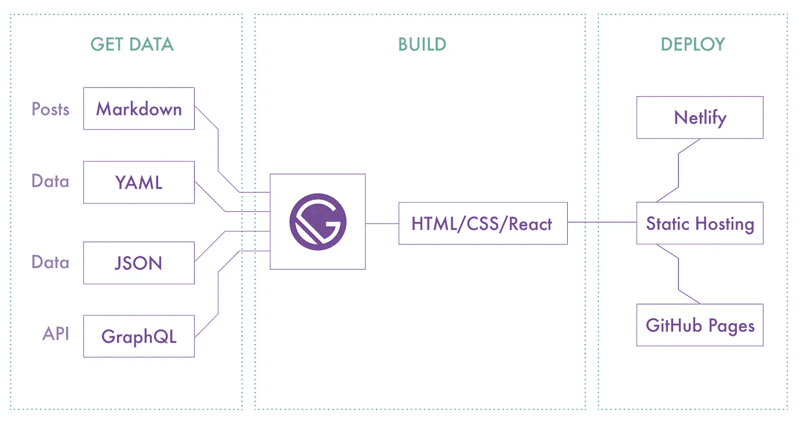

盖茨比解释图

[AWS Lambda](https://aws.amazon.com/lambda/) 以类似的方式工作，它运行由 webhook 触发的功能，通常使用 Lambda 与 API Gateway、SNS、SQS 等其他 AWS 服务集成。

根据这个前提，我们可以部署一个 lambda 函数，它可以在 S3 桶中生成和存储 HTML，或者为什么不部署一个 lambda 函数，它可以按需呈现 HTML。

# 微前端在这里扮演什么角色？

像微服务这样的微前端使团队能够独立开发和发布功能。

隔离级别使我们能够将不同的框架集成到同一个页面中。然而，这并不意味着我们应该任意混合框架，我们应该在公司范围内定义标准框架和库。

另一方面，前端技术发展很快，事实是在某些时候我们需要转移到另一个框架。因此，微前端让我们可以灵活地逐渐切换到另一个，而无需从头开始重建前端。

## 场景

我们可以想象一下，我们是一家媒体公司，有很多网站分布在世界各地，由不同的团队维护。我们喜欢 React，但在过去的几年里，我们爱上了 VueJs，所以它成了我们开发 UI 的标准库。

我们的产品团队想尝试一个新的媒体网站，JAMstack 适合这个解决方案，但是我们意识到当前的 VueJS 框架没有我们需要的必要特性。

然后我们发现盖茨比有我们需要的东西。但我们有另一个问题，新网站需要重用以前使用 VueJS 开发的一些视图，我们可以迁移这些视图来作出反应，但我们没有足够的时间，我们不想在未来维护这两个视图。

幸运的是，我们的一位成员最近读到了关于微前端的文章，并提出了建议。我们说:“为什么不呢，我们试试吧”。

# 什么是 Ara 框架？

Ara 是一个使用 [Airbnb 的 Hypernova 轻松开发和集成微前端的框架。](https://github.com/airbnb/hypernova)我们创建了一个名为 [*Nova*](https://github.com/ara-framework/ara-cli/wiki) 的基础架构来在服务器端包含 Nova 视图。你可以在这里阅读更多相关信息[。](https://github.com/ara-framework/ara-cli/wiki)

[](https://ara-framework.github.io/website/) [## Ara 框架使用 Airbnb Hypernova 轻松构建微前端

### 使用 Airbnb Hypernova 轻松构建微前端

使用 Airbnb hypernovara-framework . github . io 轻松构建微前端](https://ara-framework.github.io/website/) 

最近，我们带来了一个新概念，叫做 *Nova Bridge* ，我们将在本文中进行解释。

# 微前端

[Hypernova Lambda](https://github.com/ara-framework/hypernova-lambda) 是针对 AWS Lambda 的 [Airbnb 的 Hypernova](https://github.com/airbnb/hypernova) 的实现。Hypernova 是服务器端渲染 JavaScript 视图的服务，这些视图在浏览器上进行水合处理以使其动态，它也被称为通用渲染。

在 Ara 框架中，我们通常称 Nova 为 Hypernova 服务。

## 创建微前端(Nova)

我们需要安装 Ara CLI 来执行一些常见的任务，比如生成 nova 服务、在本地运行 hypernova lambda 以及为客户端脚本提供服务。

```
$ npm install -g ara-cli
```

安装 CLI 后，我们可以运行以下命令来生成新的 Nova 服务:

```
$ ara new:nova -t vue novas/global
```

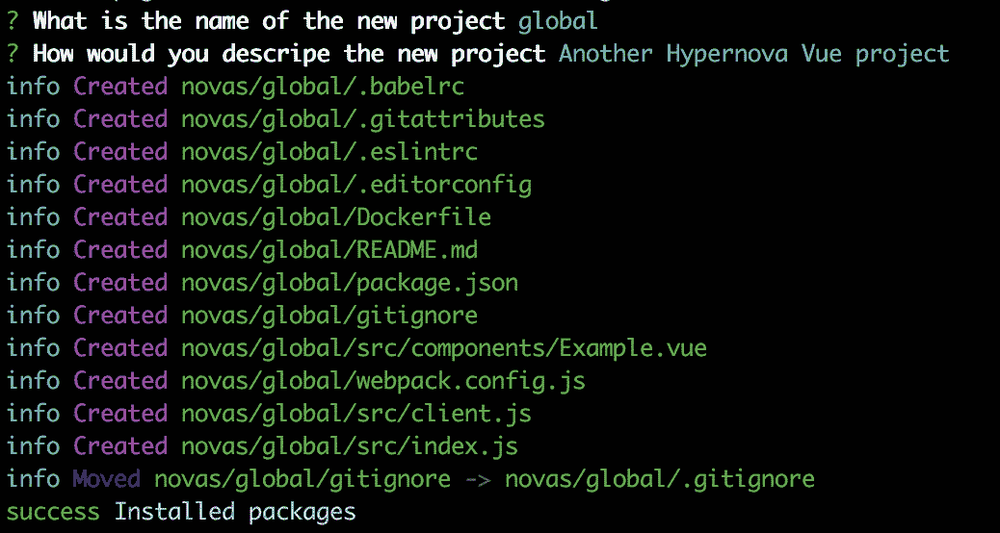

生成的项目包含一个基本设置。我们把它做得很简单。可定制。

**切入点:**

文件`src/index.js`包含 Hypernova 服务器的入口点。默认情况下，它使用 Express，但是我们稍后将实现 AWS Lambda。

**示例组件:**

`src/components/Example.vue`文件使用`title`道具渲染一个基本视图。

我们可以使用以下命令运行服务:

```
$ yarn dev
```

一旦 Hypernova 服务器运行，我们将看到下一条消息。

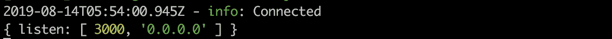

我们可以使用以下有效负载测试向`[http://localhost:3000/batch](http://localhost:3000/batch)`发出`POST`请求的服务:

```
{
  "uuid": {
    "name": "Example",
    "data": {
      "title": "Ara Framework"
    }
  }
}
```

回应应该是这样的:

```
{
    "success": true,
    "error": null,
    "results": {
        "uuid": {
            "name": "Example",
            "html": "<div data-hypernova-key=\"Example\" data-hypernova-id=\"cfd4b502-f9a4-4475-9168-233595ea4489\"><h1 data-server-rendered=\"true\">Ara Framework</h1></div>\n<script type=\"application/json\" data-hypernova-key=\"Example\" data-hypernova-id=\"cfd4b502-f9a4-4475-9168-233595ea4489\"><!--{\"title\":\"Ara Framework\"}--></script>",
            "meta": {},
            "duration": 11.534634,
            "statusCode": 200,
            "success": true,
            "error": null
        }
    }
}
```

我们可以注意到响应包含了为`Example`视图生成的 HTML。

## 实现超级新星 Lambda

首先，我们需要安装`hypernova-lambda`。

```
$ yarn add hypernova-lambda
```

我们需要修改入口点来使用`hypernova-lambda`。

src/index.js

我们还需要删除`webpack.config.js`中的`NodemonPlugin`

```
{
  ...
  plugins: [
    new VueLoaderPlugin(),
    new NodemonPlugin() // Remove Nodemon plugin
  ]
}
```

我们可以使用 CLI 在本地运行 lambda 函数:

```
$ ara run:lambda
```

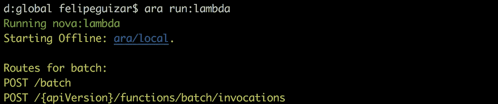

此外，我们可以使用 S3 本地服务器在本地提供客户端脚本:

```
$ ara run:lambda --asset
```

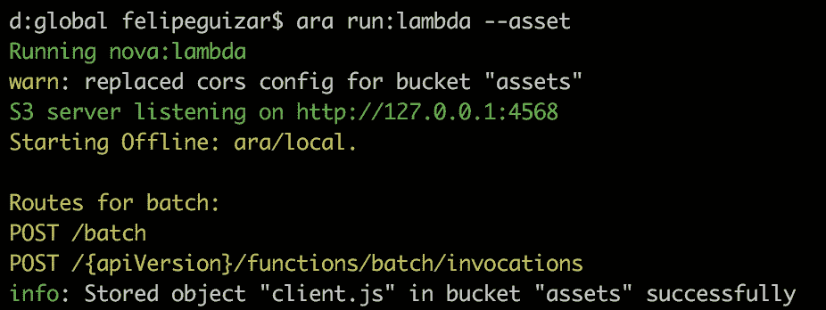

我们可以使用[http://127 . 0 . 0 . 1:4568/assets/client . js](http://127.0.0.1:4568/assets/client.js)访问客户端脚本

对于这个演示，我们将在本地测试 hypernova lambda。我不会讨论部署方法，这取决于您。

# 盖茨比项目

GatsbyJS 有自己的 CLI 来执行常见任务，如创建项目、运行开发服务器、构建网站等等。

首先，我们需要安装它:

```
$ npm install -g gatsby-cli
```

我们可以使用 CLI 创建一个新项目:

```
$ gatsby new gatsby-site
```

我们可以运行开发服务器:

```
$ yarn develop
```

该命令编译资产并在 [http://localhost:8000/](http://localhost:8000/) 上运行开发服务器

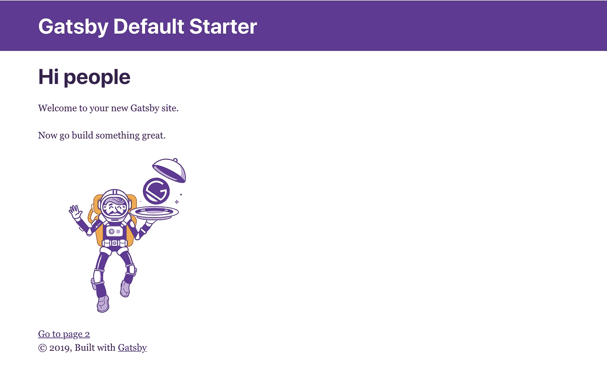

GatsbyJS 项目主页

我们已经运行了 Nova 服务和 Gatsby，是时候将我们的`Example`视图集成到 Gatsby 页面中了。

## 新星桥

Nova bridge 使我们能够使用任何视图库(如 React)来集成和渲染 Nova 视图。

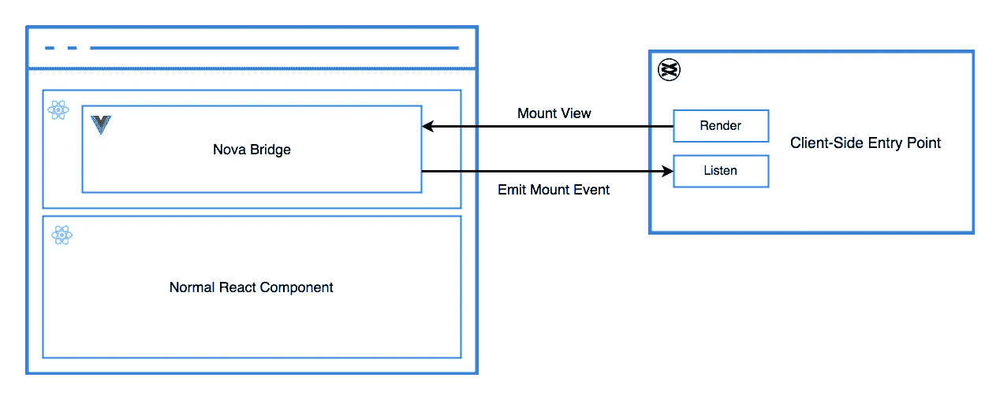

新星桥图

1.  Nova 桥发出一个`NovaMount`事件，通知 Nova 服务需要渲染和安装一个视图。
2.  客户端入口点侦听事件，并使用事件负载信息来呈现视图。
3.  客户端入口点在 Nova Bridge 占位符中装载呈现的视图。

## 实现 Nova 桥

我们需要安装[新星反应桥](https://github.com/ara-framework/nova-react-bridge):

```
$ yarn add nova-react-bridge
```

一旦安装了这个包，我们就可以在 React 组件中放置一个 Nova 视图。我们将在主页上呈现`Example`视图。

新星组件需要`name`和`data`道具

```
<Nova name="Example" data={{ title: 'Ara Framework' }} />
```

我们需要编辑文件`src/pages/index.js`。

我们还需要修改 Nova 服务中的客户端脚本来监听`NovaMount`事件并挂载视图。它位于`novas/global/src/client.js`

客户端入口点与服务器非常相似。它使用事件中的`name`和`id`来渲染和挂载视图。

最后，我们需要在`html.js`文件中添加入口点脚本。GatsbyJS 使用默认的 HTML 模板，所以我们需要复制并覆盖它。

```
$ cp .cache/default-html.js src/html.js
```

html . JSP

我们需要再次运行开发服务器

```
$ yarn develop
```

`Example`视图显示了带有文本“Ara Framework”的标题

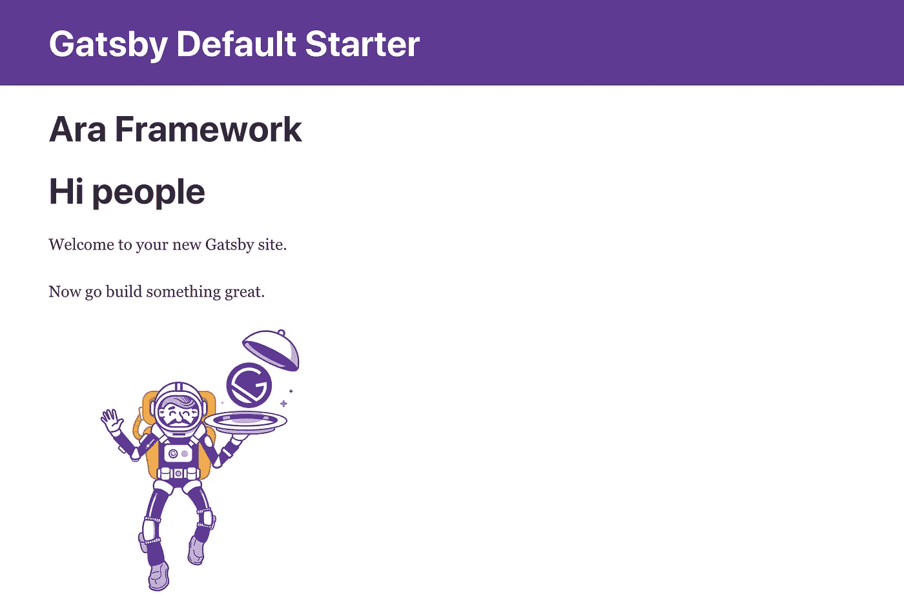

我知道`Example`视图很简单，让我们让它更具互动性

示例. vue

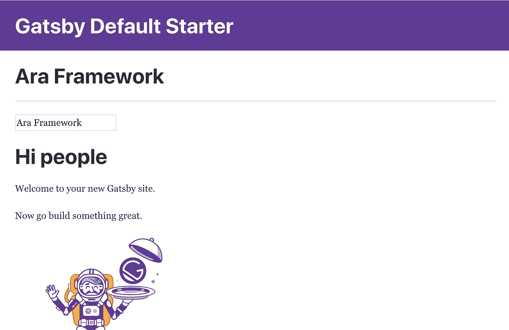

我们添加了一个输入控件来更改标题文本。所以让我们去生成我们的静态网站。

## 用 GatsbyJS 生成静态网站

首先，我们需要构建我们的 GatsbyJS 项目:

```
$ yarn build
```

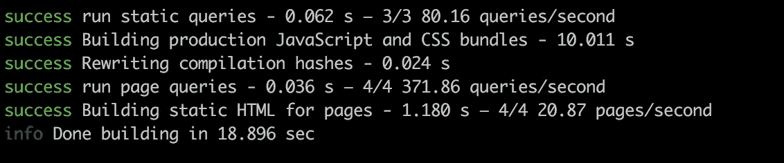

这个命令创建了一个名为`public`的文件夹，其中包含生成的文件。

我们可以使用 GatsbyJS CLI 运行一个服务器来使用静态文件:

```
$ yarn serve
```

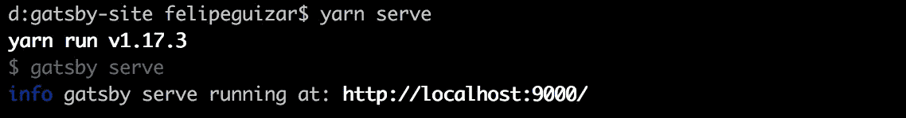

这个命令将在 [http://localhost:9000](http://localhost:9000) 上运行服务器。查看生成的 HTML，我们可以注意到 GatsbyJS 只呈现了占位符，没有呈现 Nova 视图。

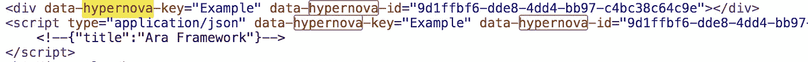

我们需要使用 [Nova Static](https://github.com/ara-framework/nova-static) 来包含 Nova 服务渲染的视图。

## 使用 Nova Static 包含 Nova 视图

[Nova Static](https://github.com/ara-framework/nova-static) 是 Ara 框架的一个工具部分，它使我们能够在静态 HTML 文件中包含 Nova 视图。

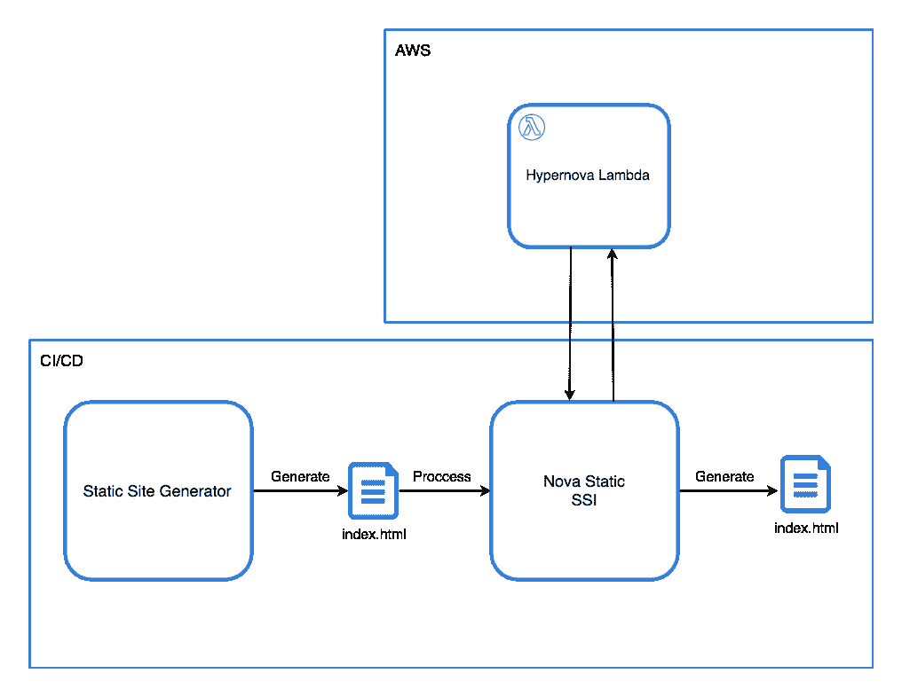

Nova 静态图

1.  静态站点生成器生成静态文件(HTML、CSS、JS 等)。
2.  Nova Static 读取 HTML 文件。
3.  Nova Static 解析并抓取 HTML，为 Nova 服务(Hypernova Lambda)创建一个请求负载。
4.  Nova Static 向 Nova 服务请求 Nova 视图。
5.  Nova 服务服务器端呈现视图并将它们发送回 Nova Static。
6.  Nova Static 用 Nova 服务呈现的 HTML 替换占位符(Transclusion)。
7.  Nova Static 用新的 HTML 文件替换 HTML 文件的内容。

## **安装 Nova Static**

Nova Static 是使用 GO 开发的，因此我们需要在 CI/CD 中使用一个安装了 Go 的容器。

我们可以安装可执行文件:

```
$ export GOPATH=~/go$ go get github.com/ara-framework/nova-static/nova-static$ go install github.com/ara-framework/nova-static/nova-static$ export PATH="$PATH:$GOPATH/bin"
```

运行命令`nova-static`时可执行文件应该是可用的，我们接下来将使用它。

## **运行新星静态**

首先，我们需要定义一些环境变量:

`HYPERNOVA_BATCH`是向 Nova 服务请求视图的端点。

```
$ export HYPERNOVA_BATCH=http://localhost:3000/batch
```

`STATIC_FOLDER`是包含静态文件的文件夹

```
/* Relative path from the gatsby project */
$ export STATIC_FOLDER=./public
```

一旦环境变量被导出，我们可以运行`nova-static`命令。

```
$ nova-static
```

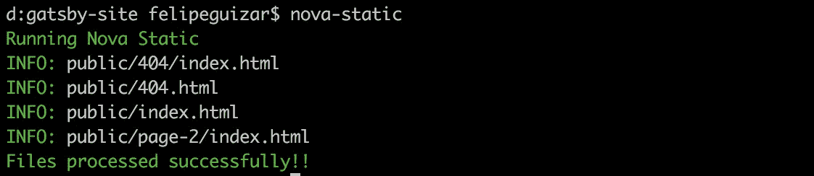

运行服务器时，我们可以注意到 Nova 视图包含在静态文件中。

```
$ yarn serve
```

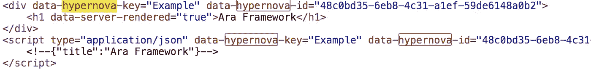

当我们禁用浏览器中的 JavaScript 时，也会呈现 Nova 视图。你可以在 Chrome 中使用这个[扩展](https://chrome.google.com/webstore/detail/quick-javascript-switcher/geddoclleiomckbhadiaipdggiiccfje?hl=en)。

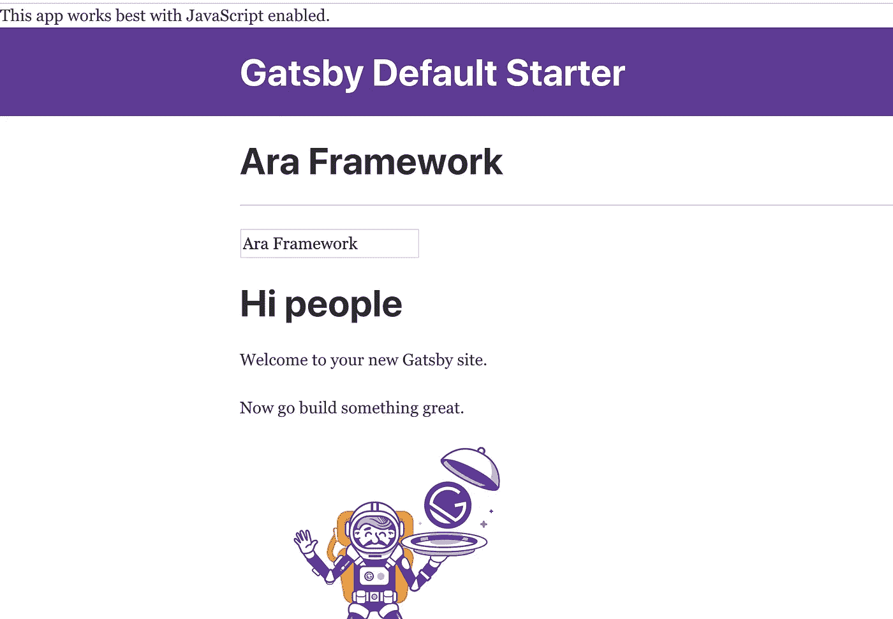

Gatsby 的另一个特点是客户端路由。页面在浏览器中交付后，用户无需从静态文件服务器加载页面即可浏览页面。

让我们将`Example`添加到`page-2`页面中。

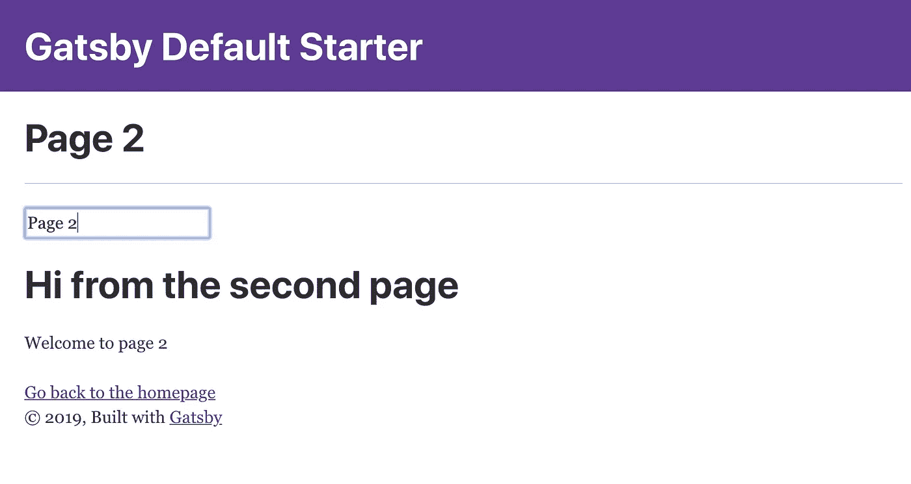

我们可以注意到 Nova 视图也是在导航到另一个页面后挂载的。每次需要挂载 Nova 视图时，Nova Bridge 都会发出`NovaMount`事件。在这种情况下，每次 React 都会挂载一个 Nova 组件。

# 结论

使用 AWS Lambda 的 Nova 服务是实现 JAMStack 架构的好伙伴。我们可以在构建期间使用它们来呈现 HTML，并将它们包含到任何静态站点生成器(Jekyll、Next、Nuxt 等)生成的页面中。

Nova Bridge 为我们提供了在运行时集成 Nova 视图的灵活性。在这个演示中，我们安装了 VueJS 视图，但是我们可以交付从其他团队开发和部署的独立的 React 视图。

[](https://github.com/marconi1992/ara-gatsby-demo) [## 马可尼 1992/阿拉-盖茨比-德莫

### 安装 GatsbyJS 项目的依赖项 gatsby-site $ yarn 安装安装 novas 服务的依赖项 novas/global…

github.com](https://github.com/marconi1992/ara-gatsby-demo)