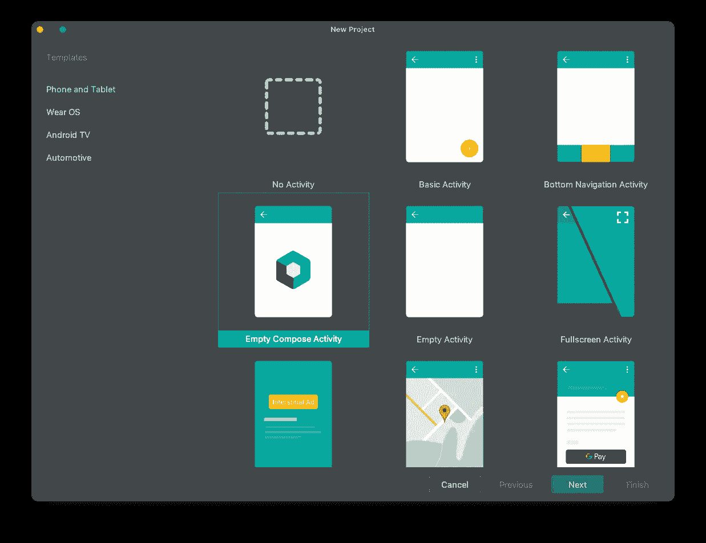
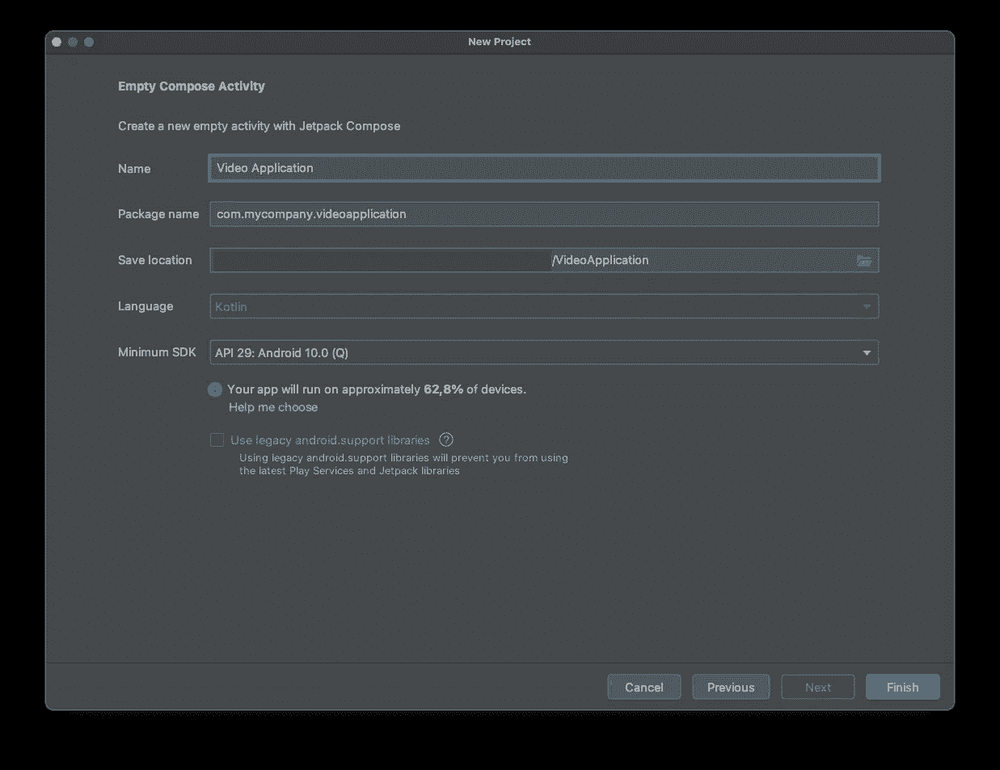
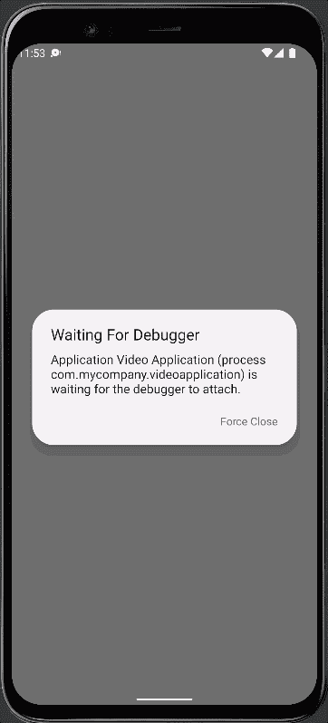

# 在 Android Jetpack Compose 上实现视频播放

> 原文：<https://itnext.io/implementing-video-playback-on-android-jetpack-compose-f73b437560ea?source=collection_archive---------1----------------------->

## ExoPlayer 的实践教程


梅森·金巴罗夫斯基在 [Unsplash](https://unsplash.com?utm_source=medium&utm_medium=referral) 上拍摄的照片

作为一名 Android 开发人员，您可能会遇到必须在 Jetpack Compose 应用程序中实现视频播放的任务。我也有同样的情况，开始研究这个话题，并找到了一个很好的解决方案，我在本教程中介绍了这个方案。

在研究这个话题时，我遇到了两个解决方案:

1.  [MediaPlayer](https://developer.android.com/guide/topics/media/mediaplayer) 和
2.  [ExoPlayer](https://developer.android.com/guide/topics/media/exoplayer)

我决定使用 ExoPlayer，因为对我来说，它似乎是更灵活、功能更丰富的框架。此外，我得到的印象是这个框架被更广泛地使用，因此我能够找到更多关于它的例子和讨论。

已经有很多容易找到的教程了，但是即使是最新的教程也使用了已经被废弃的代码。我以此为起点，更新了不推荐的部分。然后，我像往常一样去掉了所有不必要的和令人分心的部分，提出了最简单的工作解决方案。

结果是一个最新的、功能齐全的 Android Jetpack Compose 应用程序，它获取一个视频文件的 URL，并在应用程序中显示该视频。

让我们从在 Android Studio 中创建新项目开始，并选择“空撰写活动”。



新项目

像往常一样，我们需要为新的应用程序填写所有必要的位。



新项目

作为第一步，我们需要在`build.gradle`中添加对 ExoPlayer 的依赖:

```
implementation 'com.google.android.exoplayer:exoplayer:2.18.1'
```

接下来，我创建了一个名为`VideoView`的新的可组合组件。这个视图封装了所有与 ExoPlayer 相关的代码。

如您所见，需要添加的内容非常少。考虑到您的特定用例，您可能需要在这里或那里添加一些东西。在本教程的后面会有更多的介绍。

```
@Composable
fun VideoView(videoUri: String) {
    val context = LocalContext.current

    val exoPlayer = ExoPlayer.Builder(LocalContext.current)
        .build()
        .also { exoPlayer ->
            val mediaItem = MediaItem.Builder()
                .setUri(videoUri)
                .build()
            exoPlayer.setMediaItem(mediaItem)
            exoPlayer.prepare()
        }

    DisposableEffect(
        AndroidView(factory = {
            StyledPlayerView(context).apply {
                player = exoPlayer
            }
        })
    ) {
        onDispose { exoPlayer.release() }
    }
}
```

让我们在这里停留一会儿，看看这段代码。

有四点需要提一下。

1.  我们需要通过调用构建器`ExoPlayer.Builder`并提供当前的`LocalContext`来设置我们的 ExoPlayer 实例`exoPlayer`
2.  之后，我们通过使用带有`MediaItem.Builder()`的构建器模式从 URI 的视频中创建`mediaItem`
3.  然后我们创建一个做两件事的`DisposableEffect`。当我们的可组合组件显示出来时，它将从我们的`exoPlayer`实例中创建`StyledPlayerView`。然后，当视图被释放时，它将释放我们的`exoPlayer`-实例。

请查看本文末尾的参考资料部分，我在那里提供了一些关于 Jetpack Compose 副作用的链接，特别是关于 DisposableEffect 的链接。

让我们把我们的`MainActivity`换成使用`VideoView`。最终结果如下所示:

```
class MainActivity : ComponentActivity() {
    override fun onCreate(savedInstanceState: Bundle?) {
        super.onCreate(savedInstanceState)
        setContent {
            VideoApplicationTheme {
                Surface(
                    modifier = Modifier.fillMaxSize(),
                    color = MaterialTheme.colors.background
                ) {
                    VideoView(videoUri = "https://storage.googleapis.com/exoplayer-test-media-0/BigBuckBunny_320x180.mp4")
                }
            }
        }
    }
}
```

您也可以使用预览，然后需要进行如下更改:

```
@Preview(showBackground = true)
@Composable
fun DefaultPreview() {
    VideoApplicationTheme {
        VideoView(videoUri = "https://storage.googleapis.com/exoplayer-test-media-0/BigBuckBunny_320x180.mp4")
    }
}
```

启动应用程序的一切都已就绪。等等！

几乎所有你可能已经发现的事情。尝试像这样启动应用程序将导致异常:

```
E/LoadTask: Unexpected exception loading stream
      java.lang.SecurityException: Permission denied (missing INTERNET permission?)
        at java.net.Inet6AddressImpl.lookupHostByName(Inet6AddressImpl.java:150)
        at java.net.Inet6AddressImpl.lookupAllHostAddr(Inet6AddressImpl.java:103)
        at java.net.InetAddress.getAllByName(InetAddress.java:1152)
        at com.android.okhttp.Dns$1.lookup(Dns.java:41)
```

因为我们试图从互联网访问视频，我们首先需要允许我们的应用程序访问互联网。

下面一行需要添加到文件`AndroidManifest.xml`(在`app/manifests`下)

```
<uses-permission android:name="android.permission.INTERNET"></uses-permission>
```

该文件如下所示:

```
<?xml version="1.0" encoding="utf-8"?>
<manifest xmlns:android="http://schemas.android.com/apk/res/android"
    package="com.mycompany.videoapplication">

    <uses-permission android:name="android.permission.INTERNET"></uses-permission>

    <application
        android:allowBackup="true"
        android:icon="@mipmap/ic_launcher"
        android:label="@string/app_name"
        android:roundIcon="@mipmap/ic_launcher_round"
        android:supportsRtl="true"
        android:theme="@style/Theme.VideoApplication">
        <activity
            android:name=".MainActivity"
            android:exported="true"
            android:label="@string/app_name"
            android:theme="@style/Theme.VideoApplication">
            <intent-filter>
                <action android:name="android.intent.action.MAIN" />

                <category android:name="android.intent.category.LAUNCHER" />
            </intent-filter>
        </activity>
    </application>

</manifest>
```

让我们启动应用程序，你应该看到如下所示的视频播放。



视频回放

希望一切都如其所愿。如果没有，请在评论中告诉我。

正如我所承诺的，我将为您提供更多的信息，告诉您如何使用几个配置选项来定制代码以满足您的潜在需求。

以下是一些您可能会觉得有用的用例:

1.  自动启动视频
2.  隐藏控件
3.  重复视频
4.  更改纵横比

您可以在视图加载后立即自动启动视频

```
exoPlayer.playWhenReady = true
```

就是这样。没什么好说的了。继续下一个。

如果您不想显示播放器的控件，您可以通过在`SyledPlayerView`的设置中添加两行来隐藏它们。

```
StyledPlayerView(context).apply {
        hideController()
    useController = false

    player = exoPlayer
}
```

`exoPlayer`-实例也可以配置为无限重复播放视频。

```
exoPlayer.repeatMode = Player.REPEAT_MODE_ALL
```

作为最后一个提示，对我来说也是非常重要的一个提示，纵横比也可以通过在`exoPlayer`-实例中设置它来更改。下面的代码将视频填充并裁剪到视图中。

```
exoPlayer.videoScalingMode = C.VIDEO_SCALING_MODE_SCALE_TO_FIT_WITH_CROPPING
```

我真诚地希望这篇教程对你有所帮助。请在评论中让我知道你是如何喜欢它的，尤其是如果在你尝试它的时候有任何代码被否决。

感谢您的阅读！

*   如果你喜欢这个，请[在 Medium](https://twissmueller.medium.com/) 上跟随我
*   给我买杯咖啡让我继续前进
*   支持我和其他媒体作者[在这里注册](https://twissmueller.medium.com/membership)

[](https://twissmueller.medium.com/membership) [## 通过我的推荐链接加入媒体

### 阅读托拜厄斯·维斯缪勒(Tobias Wissmueller)的每一个故事(以及媒体上成千上万的其他作家)。您的会员费直接…

twissmueller.medium.com](https://twissmueller.medium.com/membership) 

## 资源

*   [ExoPlayer](https://exoplayer.dev)
*   [ExoPlayer GitHub](https://github.com/google/ExoPlayer)
*   [Jetpack 中的 Media3 ExoPlayer 作曲让 Snapchat 成为焦点](https://medium.com/backyard-programmers/media3-exoplayer-in-jetpack-compose-to-make-snapchat-spotlight-75e384e2ef56)
*   [使用 ExoPlayer 进行流媒体播放](https://developer.android.com/codelabs/exoplayer-intro#0)
*   [作曲中的副作用](https://developer.android.com/jetpack/compose/side-effects#disposableeffect)
*   [一次性效果:需要清理的效果](https://developer.android.com/jetpack/compose/side-effects#disposableeffect)