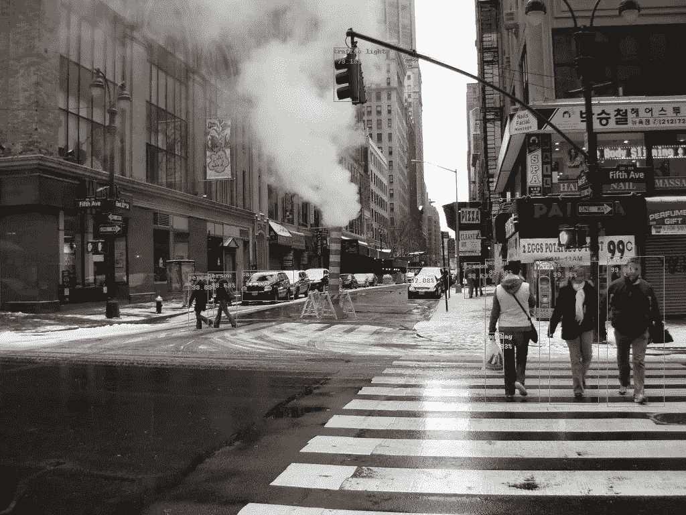
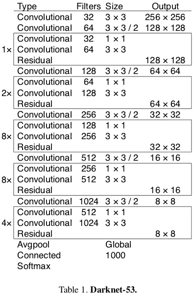
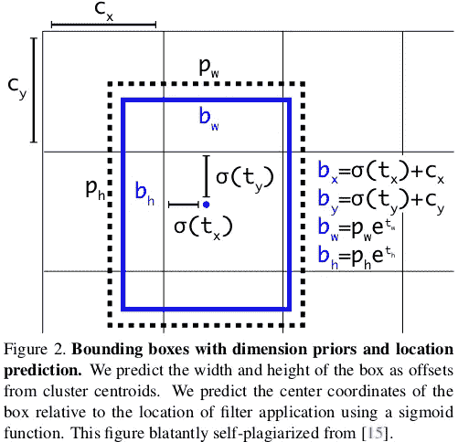

# 在 Tensorflow (TF-Slim)中实现 YOLO v3

> 原文：<https://itnext.io/implementing-yolo-v3-in-tensorflow-tf-slim-c3c55ff59dbe?source=collection_archive---------0----------------------->

# 关于作者:

*我是* [***无可挑剔的联合创始人兼 CEO。AI***](http://www.impeccable.ai?utm_campaign=Medium&utm_source=medium&utm_medium=link&utm_term=yolov3) *。我以前的经历包括为微软工作，作为 ML 工程师处理 AI/ML 问题。*

*在无可挑剔。人工智能我们正在建立一个人工智能开发平台(它也有一个笔记本的空间！)来帮助开发 AI 产品的团队更快地工作，更好地协作。我们采用横向方法，提供“智能助手”工具，并提供最大的灵活性。我们知道我们的客户——他们领域的专家——确切地知道该做什么和如何做。*



带有检测对象的演示图像。

我想分享我的代码以及我在实现它时遇到的一些问题的解决方案。

我不会过多关注与实现无关的方面。我假设你熟悉 CNN 的，对象检测，YOLO v3 架构等。以及 Tensorflow 和 TF-Slim 框架。如果没有，从相应的论文/教程入手可能会更好。我不会解释每一行是做什么的，而是给出工作代码，解释我偶然发现的一些问题。

运行这个检测器所需的所有代码和一些演示可以在我的 GitHub [repo](https://github.com/mystic123/tensorflow-yolo-v3) 中找到。我在 Ubuntu 16.04、Tensorflow 1.8.0 和 CUDA 9.0 上进行了测试。

该职位的组织结构如下:

1.  设置
2.  Darknet-53 层的实现
3.  YOLO v3 检测层的实现
4.  转换预先训练的可可重量
5.  后处理算法的实现
6.  摘要

# 1.设置

我想以类似于 Tensorflow `models` [存储库](https://github.com/tensorflow/models)的方式组织代码。我使用 TF-Slim，因为它让我们定义公共参数，如激活函数、批处理规范化参数等。作为全局变量，这使得定义神经网络更快。

我们从`yolo_v3.py`文件开始，在这里我们将放置初始化网络的函数以及加载预训练权重的函数。

在文件顶部的某个地方添加必要的常量(由 YOLO 的作者调整)。

```
_BATCH_NORM_DECAY = 0.9
_BATCH_NORM_EPSILON = 1e-05
_LEAKY_RELU = 0.1
```

YOLO v3 将输入归一化到范围 0 内..1.检测器中的大多数层在卷积后立即进行批量归一化，没有偏差并使用泄漏 ReLU 激活。定义一个小参数范围来处理这种情况是很方便的。在不使用 BN 和 LReLU 的层中，我们需要隐式地定义它。

```
# transpose the inputs to NCHW
if data_format == 'NCHW':
    inputs = tf.transpose(inputs, [0, 3, 1, 2])

# normalize values to range [0..1]
inputs = inputs / 255

# set batch norm params
batch_norm_params = {
    'decay': _BATCH_NORM_DECAY,
    'epsilon': _BATCH_NORM_EPSILON,
    'scale': True,
    'is_training': is_training,
    'fused': None,  # Use fused batch norm if possible.
}

# Set activation_fn and parameters for conv2d, batch_norm.
with slim.arg_scope([slim.conv2d, slim.batch_norm, _fixed_padding], data_format=data_format, reuse=reuse):
    with slim.arg_scope([slim.conv2d], normalizer_fn=slim.batch_norm, normalizer_params=batch_norm_params,
                        biases_initializer=None, activation_fn=lambda x: tf.nn.leaky_relu(x, alpha=_LEAKY_RELU)):
        with tf.variable_scope('darknet-53'):
            inputs = darknet53(inputs)
```

我们现在准备定义暗网-53 层。

# 2.Darknet-53 层的实现。

在 YOLO v3 论文中，作者提出了称为 Darknet-53 的新的、更深层次的特征提取器架构。顾名思义，它包含 53 个卷积层，每个卷积层后面都有批量标准化层和泄漏 ReLU 激活。缩减像素采样是由 conv 图层通过`stride=2`完成的。



资料来源:YOLO v3 纸

在我们定义卷积层之前，我们必须认识到作者的实现使用固定填充，与输入大小无关。为了实现相同的行为，我们可以使用下面的函数(我稍微修改了代码，在这里找到了)。

```
@tf.contrib.framework.add_arg_scope
def _fixed_padding(inputs, kernel_size, *args, mode='CONSTANT', **kwargs):
    *"""
    Pads the input along the spatial dimensions independently of input size.

    Args:
      inputs: A tensor of size [batch, channels, height_in, width_in] or
        [batch, height_in, width_in, channels] depending on data_format.
      kernel_size: The kernel to be used in the conv2d or max_pool2d operation.
                   Should be a positive integer.
      data_format: The input format ('NHWC' or 'NCHW').
      mode: The mode for tf.pad.

    Returns:
      A tensor with the same format as the input with the data either intact
      (if kernel_size == 1) or padded (if kernel_size > 1).
    """* pad_total = kernel_size - 1
    pad_beg = pad_total // 2
    pad_end = pad_total - pad_beg

    if kwargs['data_format'] == 'NCHW':
        padded_inputs = tf.pad(inputs, [[0, 0], [0, 0],
                                        [pad_beg, pad_end], [pad_beg, pad_end]], mode=mode)
    else:
        padded_inputs = tf.pad(inputs, [[0, 0], [pad_beg, pad_end],
                                        [pad_beg, pad_end], [0, 0]], mode=mode)
    return padded_inputs
```

`_fixed_padding`沿高度和宽度尺寸输入适当数量的 0(当`mode='CONSTANT'`时)。我们稍后也会用到`mode='SYMMETRIC'`。

现在我们可以定义`_conv2d_fixed_padding`函数了:

```
def _conv2d_fixed_padding(inputs, filters, kernel_size, strides=1):
    if strides > 1:
        inputs = _fixed_padding(inputs, kernel_size)
    inputs = slim.conv2d(inputs, filters, kernel_size, stride=strides, padding=('SAME' if strides == 1 else 'VALID'))
    return inputs
```

Darknet-53 模型是由一些具有 2 个 conv 层和快捷方式连接的块构建而成，然后是下采样层。为了避免样板代码，我们定义了`_darknet_block`函数:

```
def _darknet53_block(inputs, filters):
    shortcut = inputs
    inputs = _conv2d_fixed_padding(inputs, filters, 1)
    inputs = _conv2d_fixed_padding(inputs, filters * 2, 3)

    inputs = inputs + shortcut
    return inputs
```

最后，我们有了 Darknet-53 模型所需的所有构件:

```
def darknet53(inputs):
    *"""
    Builds Darknet-53 model.
    """* inputs = _conv2d_fixed_padding(inputs, 32, 3)
    inputs = _conv2d_fixed_padding(inputs, 64, 3, strides=2)
    inputs = _darknet53_block(inputs, 32)
    inputs = _conv2d_fixed_padding(inputs, 128, 3, strides=2)

    for i in range(2):
        inputs = _darknet53_block(inputs, 64)

    inputs = _conv2d_fixed_padding(inputs, 256, 3, strides=2)

    for i in range(8):
        inputs = _darknet53_block(inputs, 128)

    inputs = _conv2d_fixed_padding(inputs, 512, 3, strides=2)

    for i in range(8):
        inputs = _darknet53_block(inputs, 256)

    inputs = _conv2d_fixed_padding(inputs, 1024, 3, strides=2)

    for i in range(4):
        inputs = _darknet53_block(inputs, 512)

    return inputs
```

本来最后一个块之后还有 global avg pool layer 和 softmax，但是 YOLO v3 都不用(所以实际上我们是 52 层而不是 53 层；) )

# 3.YOLO v3 检测层的实现。

由 Darknet-53 提取的特征被导向检测层。检测模块由分组在块中的一定数量的 conv 层、上采样层和具有线性激活函数的 3 个 conv 层构成，在 3 个不同的尺度上进行检测。先说写辅助函数`_yolo_block`:

```
def _yolo_block(inputs, filters):
    inputs = _conv2d_fixed_padding(inputs, filters, 1)
    inputs = _conv2d_fixed_padding(inputs, filters * 2, 3)
    inputs = _conv2d_fixed_padding(inputs, filters, 1)
    inputs = _conv2d_fixed_padding(inputs, filters * 2, 3)
    inputs = _conv2d_fixed_padding(inputs, filters, 1)
    route = inputs
    inputs = _conv2d_fixed_padding(inputs, filters * 2, 3)
    return route, inputs
```

来自块中第 5 层的激活然后被路由到另一个 conv 层并被上采样，而来自第 6 层的激活被传送到`_detection_layer`，我们现在要定义它:

```
def _detection_layer(inputs, num_classes, anchors, img_size, data_format):
    num_anchors = len(anchors)
    predictions = slim.conv2d(inputs, num_anchors * (5 + num_classes), 1, stride=1, normalizer_fn=None,
                              activation_fn=None, biases_initializer=tf.zeros_initializer())

    shape = predictions.get_shape().as_list()
    grid_size = _get_size(shape, data_format)
    dim = grid_size[0] * grid_size[1]
    bbox_attrs = 5 + num_classes

    if data_format == 'NCHW':
        predictions = tf.reshape(predictions, [-1, num_anchors * bbox_attrs, dim])
        predictions = tf.transpose(predictions, [0, 2, 1])

    predictions = tf.reshape(predictions, [-1, num_anchors * dim, bbox_attrs])

    stride = (img_size[0] // grid_size[0], img_size[1] // grid_size[1])

    anchors = [(a[0] / stride[0], a[1] / stride[1]) for a in anchors]

    box_centers, box_sizes, confidence, classes = tf.split(predictions, [2, 2, 1, num_classes], axis=-1)

    box_centers = tf.nn.sigmoid(box_centers)
    confidence = tf.nn.sigmoid(confidence)

    grid_x = tf.range(grid_size[0], dtype=tf.float32)
    grid_y = tf.range(grid_size[1], dtype=tf.float32)
    a, b = tf.meshgrid(grid_x, grid_y)

    x_offset = tf.reshape(a, (-1, 1))
    y_offset = tf.reshape(b, (-1, 1))

    x_y_offset = tf.concat([x_offset, y_offset], axis=-1)
    x_y_offset = tf.reshape(tf.tile(x_y_offset, [1, num_anchors]), [1, -1, 2])

    box_centers = box_centers + x_y_offset
    box_centers = box_centers * stride

    anchors = tf.tile(anchors, [dim, 1])
    box_sizes = tf.exp(box_sizes) * anchors
    box_sizes = box_sizes * stride

    detections = tf.concat([box_centers, box_sizes, confidence], axis=-1)

    classes = tf.nn.sigmoid(classes)
    predictions = tf.concat([detections, classes], axis=-1)
    return predictions
```

该层根据以下等式转换原始预测。因为每个尺度上的 YOLO v3 检测不同大小和纵横比的对象，所以传递`anchors`参数，该参数是每个尺度的 3 元组(高度、宽度)的列表。锚需要为数据集定制(在本教程中，我们将为 COCO 数据集使用锚)。只需将这个常量添加到`yolo_v3.py`文件的顶部。

```
_ANCHORS = [(10, 13), (16, 30), (33, 23), (30, 61), (62, 45), (59, 119), (116, 90), (156, 198), (373, 326)]
```



资料来源:YOLO v3 纸

我们需要一个小的助手函数`_get_size`，它返回输入的高度和宽度:

```
def _get_size(shape, data_format):
    if len(shape) == 4:
        shape = shape[1:]
    return shape[1:3] if data_format == 'NCHW' else shape[0:2]
```

如前所述，我们需要实现 YOLO v3 的最后一个构件是上采样层。YOLO 检测器使用双线性上采样方法。为什么不能直接用 Tensorflow API 的标准`tf.image.resize_bilinear`方法？原因是，到今天为止(TF 1 . 8 . 0 版本)，所有的上采样方式都使用*常量* pad 模式。YOLO 作者报告和 PyTorch 中的标准填充方法是*边缘*(填充模式的良好比较可在此处找到[)。这一微小的差异对检测有重大影响(并花费了我几个小时的调试时间)。](http://scikit-image.org/docs/dev/auto_examples/transform/plot_edge_modes.html)

为了解决这个问题，我们将用 1 个像素和`mode='SYMMETRIC'`手动填充输入，这相当于*边缘*模式。

```
# we just need to pad with one pixel, so we set kernel_size = 3
inputs = _fixed_padding(inputs, 3, 'NHWC', mode='SYMMETRIC')
```

整个`_upsample`功能代码看起来如下:

```
def _upsample(inputs, out_shape, data_format='NCHW'):
    # we need to pad with one pixel, so we set kernel_size = 3
    inputs = _fixed_padding(inputs, 3, mode='SYMMETRIC')

    # tf.image.resize_bilinear accepts input in format NHWC
    if data_format == 'NCHW':
        inputs = tf.transpose(inputs, [0, 2, 3, 1])

    if data_format == 'NCHW':
        height = out_shape[3]
        width = out_shape[2]
    else:
        height = out_shape[2]
        width = out_shape[1]

    # we padded with 1 pixel from each side and upsample by factor of 2, so new dimensions will be
    # greater by 4 pixels after interpolation
    new_height = height + 4
    new_width = width + 4

    inputs = tf.image.resize_bilinear(inputs, (new_height, new_width))

    # trim back to desired size
    inputs = inputs[:, 2:-2, 2:-2, :]

    # back to NCHW if needed
    if data_format == 'NCHW':
        inputs = tf.transpose(inputs, [0, 3, 1, 2])

    inputs = tf.identity(inputs, name='upsampled')
    return inputs
```

更新:感谢 [Srikanth Vidapanakal](https://www.linkedin.com/in/srikanth-vidapanakal-7463b18/) ，我查了一下 darknet 的源代码，发现上采样的方法是最近邻，不是双线性。我们不再需要填充图像了。更新的代码已经在我的回购中可用。

固定`_upsample`功能代码如下:

```
def _upsample(inputs, out_shape, data_format='NCHW'):
    # tf.image.resize_nearest_neighbor accepts input in format NHWC
    if data_format == 'NCHW':
        inputs = tf.transpose(inputs, [0, 2, 3, 1])

    if data_format == 'NCHW':
        new_height = out_shape[3]
        new_width = out_shape[2]
    else:
        new_height = out_shape[2]
        new_width = out_shape[1]

    inputs = tf.image.resize_nearest_neighbor(inputs, (new_height, new_width))

    # back to NCHW if needed
    if data_format == 'NCHW':
        inputs = tf.transpose(inputs, [0, 3, 1, 2])

    inputs = tf.identity(inputs, name='upsampled')
    return inputs
```

上采样激活沿着通道轴与来自 Darknet-53 层的激活连接。这就是为什么我们需要回到`darknet53`功能，在第四和第五下采样层之前返回 conv 层的激活。

```
def darknet53(inputs):
    *"""
    Builds Darknet-53 model.
    """* inputs = _conv2d_fixed_padding(inputs, 32, 3)
    inputs = _conv2d_fixed_padding(inputs, 64, 3, strides=2)
    inputs = _darknet53_block(inputs, 32)
    inputs = _conv2d_fixed_padding(inputs, 128, 3, strides=2)

    for i in range(2):
        inputs = _darknet53_block(inputs, 64)

    inputs = _conv2d_fixed_padding(inputs, 256, 3, strides=2)

    for i in range(8):
        inputs = _darknet53_block(inputs, 128)

    route1 = inputs
    inputs = _conv2d_fixed_padding(inputs, 512, 3, strides=2)

    for i in range(8):
        inputs = _darknet53_block(inputs, 256)

    route2 = inputs
    inputs = _conv2d_fixed_padding(inputs, 1024, 3, strides=2)

    for i in range(4):
        inputs = _darknet53_block(inputs, 512)

    return route1, route2, inputs
```

现在我们准备定义检测器模块。让我们回到`yolo_v3`函数，在 slim arg 作用域下添加以下几行:

```
with tf.variable_scope('darknet-53'):
    route_1, route_2, inputs = darknet53(inputs)

with tf.variable_scope('yolo-v3'):
    route, inputs = _yolo_block(inputs, 512)
    detect_1 = _detection_layer(inputs, num_classes, _ANCHORS[6:9], img_size, data_format)
    detect_1 = tf.identity(detect_1, name='detect_1')

    inputs = _conv2d_fixed_padding(route, 256, 1)
    upsample_size = route_2.get_shape().as_list()
    inputs = _upsample(inputs, upsample_size, data_format)
    inputs = tf.concat([inputs, route_2], axis=1 if data_format == 'NCHW' else 3)

    route, inputs = _yolo_block(inputs, 256)

    detect_2 = _detection_layer(inputs, num_classes, _ANCHORS[3:6], img_size, data_format)
    detect_2 = tf.identity(detect_2, name='detect_2')

    inputs = _conv2d_fixed_padding(route, 128, 1)
    upsample_size = route_1.get_shape().as_list()
    inputs = _upsample(inputs, upsample_size, data_format)
    inputs = tf.concat([inputs, route_1], axis=1 if data_format == 'NCHW' else 3)

    _, inputs = _yolo_block(inputs, 128)

    detect_3 = _detection_layer(inputs, num_classes, _ANCHORS[0:3], img_size, data_format)
    detect_3 = tf.identity(detect_3, name='detect_3')

    detections = tf.concat([detect_1, detect_2, detect_3], axis=1)
    return detections
```

# 4.转换预先训练的可可重量

我们定义了探测器的结构。要使用它，我们必须要么在我们自己的数据集上训练它，要么使用预训练的权重。COCO 数据集上预先训练的重量可供公众使用。我们可以使用以下命令下载它:

```
wget [https://pjreddie.com/media/files/yolov3.weights](https://pjreddie.com/media/files/yolov3.weights)
```

这个二进制文件的结构如下:

前 3 个 int32 值是头信息:主版本号、次版本号、subversion 号，后面是 int64 值:训练时网络看到的图像数。在它们之后，有 62 001 757 个 float32 值，它们是每个 conv 和批规范层的权重。重要的是要记住，它们是以行主格式保存的，这与 Tensorflow(列主)使用的格式相反。

## 那么，我们应该如何从这个文件中读取权重呢？

我们从第一层 conv 开始。大多数卷积层紧接着批标准化层。在这种情况下，我们需要先读取批范数层的 4* `num_filters`权值:gamma，beta，移动均值和移动方差，然后是 conv 层的`kernel_size[0] * kernel_size[1] * num_filters * input_channels`权值。

在相反的情况下，当 conv 层后面没有批范数层时，我们需要读取`num_filters`偏差权重，而不是读取批范数参数。

下面开始写`load_weights`函数的代码。它有两个参数:图中变量的列表和二进制文件的名称。

我们从打开文件开始，跳过前 5 个 int32 值，并将其他所有内容作为列表读取:

```
def load_weights(var_list, weights_file):
    with open(weights_file, "rb") as fp:
        _ = np.fromfile(fp, dtype=np.int32, count=5)

        weights = np.fromfile(fp, dtype=np.float32)
```

然后我们将使用两个指针，第一个遍历变量列表`var_list`，第二个遍历加载了变量的列表`weights`。我们需要检查当前处理的层之后的层的类型，并读取适当数量的值。在代码中，`i`将在`var_list`上迭代，而`ptr`将在`weights`上迭代。我们将返回一个`tf.assign`操作列表。我简单地通过比较图层的名称来检查图层的类型。(我承认有点丑，但是我不知道有什么更好的做法。这种方法似乎对我有用。)

```
ptr = 0
i = 0
assign_ops = []
while i < len(var_list) - 1:
    var1 = var_list[i]
    var2 = var_list[i + 1]
    # do something only if we process conv layer
    if 'Conv' in var1.name.split('/')[-2]:
        # check type of next layer
        if 'BatchNorm' in var2.name.split('/')[-2]:
            # load batch norm params
            gamma, beta, mean, var = var_list[i + 1:i + 5]
            batch_norm_vars = [beta, gamma, mean, var]
            for var in batch_norm_vars:
                shape = var.shape.as_list()
                num_params = np.prod(shape)
                var_weights = weights[ptr:ptr + num_params].reshape(shape)
                ptr += num_params
                assign_ops.append(tf.assign(var, var_weights, validate_shape=True))

            # we move the pointer by 4, because we loaded 4 variables
            i += 4
        elif 'Conv' in var2.name.split('/')[-2]:
            # load biases
            bias = var2
            bias_shape = bias.shape.as_list()
            bias_params = np.prod(bias_shape)
            bias_weights = weights[ptr:ptr + bias_params].reshape(bias_shape)
            ptr += bias_params
            assign_ops.append(tf.assign(bias, bias_weights, validate_shape=True))

            # we loaded 2 variables
            i += 1
        # we can load weights of conv layer
        shape = var1.shape.as_list()
        num_params = np.prod(shape)

        var_weights = weights[ptr:ptr + num_params].reshape((shape[3], shape[2], shape[0], shape[1]))
        # remember to transpose to column-major
        var_weights = np.transpose(var_weights, (2, 3, 1, 0))
        ptr += num_params
        assign_ops.append(tf.assign(var1, var_weights, validate_shape=True))
        i += 1return assign_ops
```

就是这样！现在，我们可以通过执行如下代码行来恢复模型的权重:

```
with tf.variable_scope('model'):
    model = yolo_v3(inputs, 80)model_vars = tf.global_variables(scope='model')
assign_ops = load_variables(model_vars, 'yolov3.weights')sess = tf.Session()
sess.run(assign_ops)
```

对于将来的使用，使用 tf.train.Saver 导出权重并从检查点加载可能会容易得多。

# 5.后处理算法的实现

我们的模型返回一个形状张量:

```
batch_size x 10647 x (num_classes + 5 bounding box attrs)
```

数字 10647 等于总和 507 +2028 + 8112，这是在每种尺度上检测到的可能物体的数量。描述边界框属性的 5 个值代表`center_x, center_y, width, height`。在大多数情况下，处理两个点的坐标更容易:左上和右下。让我们将检测器的输出转换成这种格式。

这个函数非常简单:

```
def detections_boxes(detections):
    center_x, center_y, width, height, attrs = tf.split(detections, [1, 1, 1, 1, -1], axis=-1)
    w2 = width / 2
    h2 = height / 2
    x0 = center_x - w2
    y0 = center_y - h2
    x1 = center_x + w2
    y1 = center_y + h2

    boxes = tf.concat([x0, y0, x1, y1], axis=-1)
    detections = tf.concat([boxes, attrs], axis=-1)
    return detections
```

我们的探测器通常会多次探测到同一物体(中心和大小略有不同)。在大多数情况下，我们不想保留所有这些仅相差少量像素的检测。这个问题的标准解决方案是非最大抑制。此处提供了该方法的详细描述[。](https://www.coursera.org/learn/convolutional-neural-networks/lecture/dvrjH/non-max-suppression)

我们为什么不用 Tensorflow API 的`tf.image.non_max_suppression`函数呢？有两个主要原因。首先，在我看来，每个类执行 NMS 要好得多，因为我们可能会遇到这样的情况，两个不同类的对象高度重叠，全局 NMS 将抑制其中一个盒子。第二，有人在抱怨这个功能慢，因为还没有优化。

让我们实现 NMS 算法。首先，我们需要一个函数来计算两个边界框的 IoU(交集/并集):

```
def _iou(box1, box2):
    b1_x0, b1_y0, b1_x1, b1_y1 = box1
    b2_x0, b2_y0, b2_x1, b2_y1 = box2

    int_x0 = max(b1_x0, b2_x0)
    int_y0 = max(b1_y0, b2_y0)
    int_x1 = min(b1_x1, b2_x1)
    int_y1 = min(b1_y1, b2_y1)

    int_area = (int_x1 - int_x0) * (int_y1 - int_y0)

    b1_area = (b1_x1 - b1_x0) * (b1_y1 - b1_y0)
    b2_area = (b2_x1 - b2_x0) * (b2_y1 - b2_y0)

    iou = int_area / (b1_area + b2_area - int_area + 1e-05)
    return iou
```

现在我们可以写`non_max_suppression`函数的代码了。我使用 NumPy 库进行快速向量运算。

```
def non_max_suppression(predictions_with_boxes, confidence_threshold, iou_threshold=0.4):
    *"""
    Applies Non-max suppression to prediction boxes.* ***:param*** *predictions_with_boxes: 3D numpy array, first 4 values in 3rd dimension are bbox attrs, 5th is confidence* ***:param*** *confidence_threshold: the threshold for deciding if prediction is valid* ***:param*** *iou_threshold: the threshold for deciding if two boxes overlap* ***:return****: dict: class -> [(box, score)]
    """*
```

它需要 3 个参数:YOLO v3 检测器的输出、置信度阈值和 IoU 阈值。该函数的主体如下所示:

```
conf_mask = np.expand_dims((predictions_with_boxes[:, :, 4] > confidence_threshold), -1)
predictions = predictions_with_boxes * conf_mask

result = {}
for i, image_pred in enumerate(predictions):
    shape = image_pred.shape
    non_zero_idxs = np.nonzero(image_pred)
    image_pred = image_pred[non_zero_idxs]
    image_pred = image_pred.reshape(-1, shape[-1])

    bbox_attrs = image_pred[:, :5]
    classes = image_pred[:, 5:]
    classes = np.argmax(classes, axis=-1)

    unique_classes = list(set(classes.reshape(-1)))

    for cls in unique_classes:
        cls_mask = classes == cls
        cls_boxes = bbox_attrs[np.nonzero(cls_mask)]
        cls_boxes = cls_boxes[cls_boxes[:, -1].argsort()[::-1]]
        cls_scores = cls_boxes[:, -1]
        cls_boxes = cls_boxes[:, :-1]

        while len(cls_boxes) > 0:
            box = cls_boxes[0]
            score = cls_scores[0]
            if not cls in result:
                result[cls] = []
            result[cls].append((box, score))
            cls_boxes = cls_boxes[1:]
            ious = np.array([_iou(box, x) for x in cls_boxes])
            iou_mask = ious < iou_threshold
            cls_boxes = cls_boxes[np.nonzero(iou_mask)]
            cls_scores = cls_scores[np.nonzero(iou_mask)]

return result
```

差不多就是这样。我们实现了 YOLO v3 工作所需的所有功能。

# 6.摘要

在教程 [repo](https://github.com/mystic123/tensorflow-yolo-v3) 中你可以找到运行检测的代码和一些演示脚本。检测机支持 NHWC 和 NCHW 两种数据格式，因此您可以轻松选择哪种格式在您的机器上运行更快。

如果你有任何问题，请不要犹豫与我联系。

我计划撰写本教程的下一部分，在其中我将展示如何在自定义数据集上训练(微调)YOLO v3。

感谢阅读。请通过鼓掌和/或分享让我知道你是否喜欢它！:)