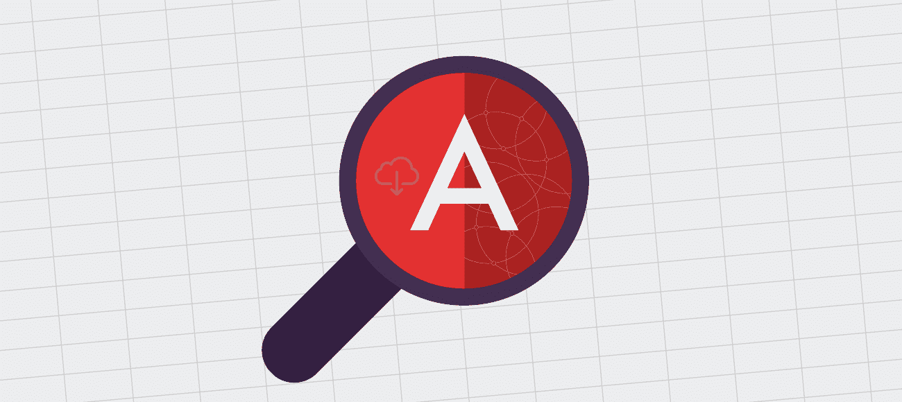
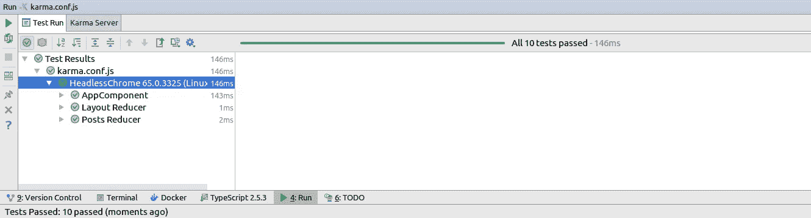

# 测试的重要性以及为什么您应该现在就开始测试您的减速器…

> 原文：<https://itnext.io/importance-of-testing-and-why-you-should-start-with-testing-your-reducers-now-e4acee0efaa5?source=collection_archive---------6----------------------->



图片来自 rangle.io

> [点击这里在 LinkedIn 上分享这篇文章](https://www.linkedin.com/cws/share?url=https%3A%2F%2Fitnext.io%2Fimportance-of-testing-and-why-you-should-start-with-testing-your-reducers-now-e4acee0efaa5%3Futm_source%3Dmedium_sharelink%26utm_medium%3Dsocial%26utm_campaign%3Dbuffer)

如果你想成为顶尖的 Angular(单页应用程序)工匠，你需要训练自己，从编写测试开始。这真的很重要，因为在今天的 web 开发中，有一种将业务逻辑从服务器端转移到客户端的趋势。

在数据库即服务、功能即服务、邮件即服务、认证即服务等时代。，我们倾向于拥有**胖客户端**和**锡服务器**。

正因为如此，我们需要小心我们的业务逻辑，我们必须编写大量的测试来覆盖它。

在现实世界中，每个人都试图尽可能快地迭代，经常忘记写测试。一段时间后，编写测试和重构变得困难甚至不可能。这就是我们的应用程序开始崩溃的地方，这通常会导致失败。

在 Angular (angular-cli)中，我们有可能在每个组件中编写单元测试，并为整个应用程序编写端到端测试。

每个组件的单元测试(组件 app.component.spec.ts 旁边的测试文件)有助于显示组件是否正在编译以及它有哪些依赖关系。这是由 Angular CLI 自动生成的。

端到端测试可以验证我们软件的行为，它们就像验收测试一样，通常由 QA 团队编写。

我们不会关注上面提到的测试，因为我看到了使用它们的许多优点和缺点。这不是本文的主题；我们现在就跳过它们。

作为顶级工匠，我们将:

*   使用 NgRx 库进行我们的状态管理(甚至是 UI 状态)
*   避免组件中的本地状态
*   有很多愚蠢的成分
*   仅在路线下有智能组件

如果我们遵循上面的规则，我们所有的业务逻辑将被隔离并存储在 reducers 中，这将使我们的应用程序可测试和可预测。

说到创建减压器、动作和效果，我强烈推荐使用 **ngrx/schematics** 库，因为用它们我们会为减压器和效果生成规格文件。作为优秀的工匠，我们需要珍惜时间。

对于 showcase，让我们构建一个小应用程序。

```
# install or update angular-cli
npm install @angular/cli -g# generate app
ng new ngrx-starter && cd ngrx-starter# install ngrx dependencies
npm install [@ngrx](http://twitter.com/ngrx)/{store,effects,store-devtools} --save
npm install [@ngrx/schematics](http://twitter.com/ngrx/schematics) --save-dev# tell angular-cli to use ngrx schematics
ng set defaults.schematics.collection=[@ngrx/schematics](http://twitter.com/ngrx/schematics)# generate store 
ng generate store State --root --statePath store --module app.module.ts# generate reducers and actions
ng generate reducer Layout -g true --flat false --reducers store/index.ts
ng generate action Layout -g true --flat falseng generate reducer Posts -g true --flat false --reducers store/index.ts
ng generate action Posts -g true --flat false
```

在 layout.reducer 中，我们将存储应用程序范围的布局信息。例如:mega 菜单是否打开，侧边栏是否可见等。

在每个特性缩减器中，我们将存储与特性相关的 UI 事件，如加载、创建等。


让我们创建两个布局同步动作:

```
**import** { Action } **from '@ngrx/store'**;

**export enum** LayoutActionTypes {
  *LayoutSidebarVisibleAction* = **'[Layout] Sidebar Visible Action'**,
  *LayoutMegaMenuOpenAction* = **'[Layout] Mega Menu Open Action'** }

**export class** LayoutSidebarVisible **implements** Action {
  **readonly type** = LayoutActionTypes.*LayoutSidebarVisibleAction*;

  **constructor**(**public readonly payload**: **boolean**) {}
}

**export class** LayoutMegaMenuOpen **implements** Action {
  **readonly type** = LayoutActionTypes.*LayoutMegaMenuOpenAction*;

  **constructor**(**public readonly payload**: **boolean**) {}
}

**export type** LayoutActions =  LayoutSidebarVisible | LayoutMegaMenuOpen;
```

我们将在 layout.reducer 中捕获它们

```
**import** * **as** la **from '../../actions/layout/layout.actions'**;

**export interface** State {
  **sidebarVisible**: **boolean**;
  **megaMenuOpen**: **boolean**;
}

**export const** initialState: State = {
  **sidebarVisible**: **true**,
  **megaMenuOpen**: **false** };

**export function** *reducer*(state = initialState, action: la.LayoutActions): State {
  **switch** (action.**type**) {

    **case** la.LayoutActionTypes.*LayoutSidebarVisibleAction*:

      **return** { ...state, **sidebarVisible**: action.**payload** };

    **case** la.LayoutActionTypes.*LayoutMegaMenuOpenAction*:

      **return** { ...state, **megaMenuOpen**: action.**payload** };

    **default**:
      **return** state;
  }
}
```

现在我们要为它们编写测试:

```
**import** { *reducer*, initialState } **from './layout.reducer'**;

**import** * **as** la **from '../../actions/layout/layout.actions'**;

*describe*(**'Layout Reducer'**, () => {
  *describe*(**'unknown action'**, () => {
    *it*(**'should return the initial state'**, () => {
      **const** action = {} **as any**;

      **const** result = *reducer*(initialState, action);

      *expect*(result).toBe(initialState);
    });
  });

  *describe*(**'LayoutSidebarVisible action'**, () => {
    *it*(**'should set sidebar visibility to false'**, () => {

      **const** action = **new** la.LayoutSidebarVisible(**false**);

      **const** result = *reducer*(initialState, action);

      *expect*(result).toEqual({... initialState, **sidebarVisible**: action.**payload**});
    });
  });

  *describe*(**'LayoutMegaMenuOpen action'**, () => {
    *it*(**'should set Mega Menu visibility to true'**, () => {

      **const** action = **new** la.LayoutMegaMenuOpen(**true**);

      **const** result = *reducer*(initialState, action);

      *expect*(result).toEqual({... initialState, **megaMenuOpen**: action.**payload**});
    });
  });
});
```

如果你正在使用 WebStorm，你可以通过点击右键菜单轻松运行测试。spec 文件并运行它，您也可以对覆盖率做同样的事情。

如果您更喜欢使用 npm 脚本，可以使用命令来完成

```
npm test
```

***如果你想从 WebStorm 运行整个测试套件，你可以点击 karma.conf.js 上的 run，然后选择 Run…***



让我们对 posts.actions 做同样的事情

```
**import** { Action } **from '@ngrx/store'**;

**export enum** PostsActionTypes {
  *GetPostsAction* = **'[Posts] Get Posts Action'**,
  *GetPostsActionSuccess* = **'[Posts] Get Posts Success Action'**,
  *GetPostsActionFail* = **'[Posts] Get Posts Fail Action'** }

**export class** GetPosts **implements** Action {
  **readonly type** = PostsActionTypes.*GetPostsAction*;
}

**export class** GetPostsSuccess **implements** Action {
  **readonly type** = PostsActionTypes.*GetPostsActionSuccess*;

  **constructor**(**public readonly payload**: **any**) {}
}

**export class** GetPostsFail **implements** Action {
  **readonly type** = PostsActionTypes.*GetPostsActionFail*;

  **constructor**(**public readonly payload**: **any**) {}
}

**export type** PostsActions = GetPosts | GetPostsSuccess | GetPostsFail;
```

和柱子。减速器

```
**import** * **as** pa **from '../../actions/posts/posts.actions'**;

**export interface** State {
  **posts**?: **any**;
  **loading**?: **boolean**;
}

**export const** initialState: State = {

};

**export function** *reducer*(state = initialState, action: pa.PostsActions): State {
  **switch** (action.**type**) {

    **case** pa.PostsActionTypes.*GetPostsAction*:

      **return** { ...state, **loading**: **true**, **posts**: [] };

    **case** pa.PostsActionTypes.*GetPostsActionSuccess*:

      **return** { ...state, **loading**: **false**, **posts**: action.payload };

    **case** pa.PostsActionTypes.*GetPostsActionFail*:

      **return** { ...state, **loading**: **false**, **posts**: [] };

    **default**:
      **return** state;
  }
}
```

测试 posts.reducer 看起来像:

```
**import** { *reducer*, initialState } **from './posts.reducer'**;
**import** * **as** pa **from '../../actions/posts/posts.actions'**;

*describe*(**'Posts Reducer'**, () => {
  *describe*(**'unknown action'**, () => {
    *it*(**'should return the initial state'**, () => {
      **const** action = {} **as any**;

      **const** result = *reducer*(initialState, action);

      *expect*(result).toBe(initialState);
    });
  });

  *describe*(**'GetPostsAction action'**, () => {
    *it*(**'should set loading to true'**, () => {
      **const** action = **new** pa.GetPosts();

      **const** result = *reducer*(initialState, action);

      *expect*(result).toEqual({ ...initialState, **loading**: **true**, **posts**: []});
    });
  });

  *describe*(**'GetPostsActionSuccess action'**, () => {
    *it*(**'should set loading to false and fetch posts'**, () => {
      **const** posts = [{ **post**: **'Title'** }];
      **const** action = **new** pa.GetPostsSuccess(posts);

      **const** result = *reducer*(initialState, action);

      *expect*(result).toEqual({ ...initialState, **loading**: **false**, **posts**: posts });
    });
  });

  *describe*(**'GetPostsActionFail action'**, () => {
    *it*(**'should set loading to false and set posts to empty'**, () => {
      **const** action = **new** pa.GetPostsFail(**'Unable to load posts'**);

      **const** result = *reducer*(initialState, action);

      *expect*(result).toEqual({ ...initialState, **loading**: **false**, **posts**: [] });
    });
  });
});
```

所有这些完成后，我们将通过我们的哑组件使用角度指令实现每个标志的行为，如*ngIf，*ngFor，ngClass，style 等。

```
*ngIf="sidebarVisible"
[ngClass]={'loading': loading}
[ngClass]={'mega-menu-open': megaMenuOpen }
....[ngClass]={'loading': loading}
[ngClass]={'mega-menu-open': megaMenuOpen }
....
```

**我们假设所有的生态系统(Angular & NgRx)都经过了良好的测试。**

# 奖金

如果你觉得每次运行测试都要打开新浏览器很烦人，我们可以通过编辑 karma.conf.js 从 Chrome 切换到 Chrome headless 模式

```
**browsers**: [**'ChromeHeadless'**],
**customLaunchers**: {
  **ChromeHeadless**: {
    **base**: **'Chrome'**,
    **flags**: [
      **'--headless'**,
      **'--disable-gpu'**,
      *// Without a remote debugging port, Google Chrome exits immediately.* **'--remote-debugging-port=9222'**,
    ],
  }
},
**singleRun**: **true // run test suite only once**
```