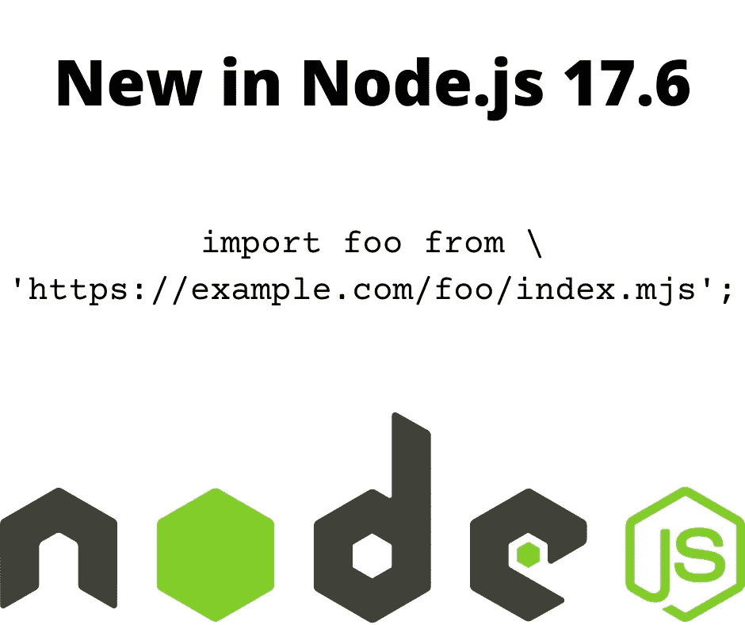

# 在 Node.js 中通过 HTTP/HTTPS 导入 ES6 模块

> 原文：<https://itnext.io/importing-an-es6-modules-over-http-https-in-a-node-js-225ffba8c3fc?source=collection_archive---------1----------------------->

## 通过 HTTP/HTTPS 导入模块即将到来，这需要重新考虑安全模型



作者图片，使用 Node.js 徽标

在 Node.js 17.6.0 中，一个实验性的新特性允许我们从 HTTP 或 HTTPS URL 导入 T2 模块。这将消除 Node.js 和 Deno 之间的一个差异，Deno 允许使用 HTTPS 导入包。此外，浏览器中的 ES6 模块允许通过 HTTPS 导入模块。直到现在，Node.js 团队还不允许这样做，理由是安全问题。

这个通过 HTTP 或 HTTPS 导入模块的新功能是一个高度实验性的特性。这有很多严重的安全隐患，我个人也有疑虑。然而，[对这个特性](https://github.com/nodejs/node/pull/36328)的拉请求围绕这个问题的几个方面有很多讨论。由于没有阅读整个对话，我不得不相信 Node.js 技术团队已经考虑了我所担心的问题。

首先，我们来解释一下 HTTP 导入是关于什么的:

```
import example from 'https://example.com/path/to/index.mjs';  example('Hello, world!');
```

换句话说，这是关于直接导入通过 HTTPS 或 HTTP 检索的 Node.js 模块。

该特性在版本 17.6.0 中被添加到 Node.js 中。文档已经可以在:[https://nodejs.org/api/esm.html#https-and-http-imports](https://nodejs.org/api/esm.html#https-and-http-imports)获得

# 背景和一些疑虑

在我们更深入地使用这个特性之前，我们先来谈谈理论。相关拉取请求位于:[https://github.com/nodejs/node/pull/36328](https://github.com/nodejs/node/pull/36328)

我对这个想法有两个担心:

1.  显而易见的是安全性——显然很多人都同意这一点——正如我们将看到的，由于安全问题，实现非常有限。我们习惯于使用 npm/yarn 存储库，虽然已经有安全入侵通过该存储库，但我们仍然每天都在大规模地使用它。
2.  通过拥有一个公共的包存储库，包的可发现性得到了极大的增强

关于安全问题，wperron 的评论是这样说的:

> *从 npm 导入并不一定比从原始 URL 导入更安全，所以让我们努力使整个生态系统更安全，不管包是如何导入的。*

一个 HTTP 请求容易受到"*中间人*"攻击，入侵者会提供一个伪造的包服务器版本。HTTPS 至少不受这个问题的影响。但是我预见到了你在网络服务器上找到的随机资料的可信度问题。

但是，读了 wperron 的评论，我意识到我没有考虑过这个问题，它可能是不准确的。比如`import foo from 'https://example.com/path/to/index.mjs';`和下面有多大区别:

```
$ npm init -y 
$ npm install https://example.com/path/to --save
```

尽管 npm/yarn 的设计主要是为了从 npm/yarn 存储库中获取包，但是它支持的可能的包 URL 有很长的列表。例如，我经常使用 GitHub URL 对我的包的测试版本运行代码。而且很有可能有人会公布一个 HTTPS 网址来安装一个软件包。

换句话说，`import .. from 'https://...'`和`npm install https://...`都在从 HTTPS 的服务器上抓取 Node.js 代码。有什么区别？

wperron 的评论继续讨论了通过 npm/yarn 存储库传播的各种安全违规。恶意软件一再通过存储库传播。这显然是一个问题，但它也证明了 npm/yarn 存储库没有提供很多安全保证。

我所说的包可发现性是什么意思？虽然 npm/yarn 存储库有缺陷，但这是发现哪些包可用的好方法。你想要一个 Node.js 甚至前端 JavaScript 包？前往`npmjs.com`并搜索。

如果 Node.js 社区脱离了 npm/yarn 存储库，那么我们如何发现哪些包是可用的呢？我们会依赖搜索引擎来寻找包裹吗？我不认为这是一个好的解决方案，我认为最好有一个专门为 Node.js/Deno/Browser.的 JavaScript 包做广告的网站

# 用示例测试 HTTPS/HTTP 导入

好吧，在那个理论之后我们需要着手一些代码。

我在 https://github.com/robogeek/example-es6-nodejs-package[创建了一个简单的包，这是一个纯 ES6 模块。](https://github.com/robogeek/example-es6-nodejs-package)

这是一小段代码，具有简单的功能，因此我们可以通过 HTTP/HTTPS `import`语句关注可用性。`lib/main.mjs`要展示的第一个功能是:

```
export default function hello(message) {
     console.log(`main Hello ${message}`); 
}
```

目的是典型的 *Hello World* 示例，这样我们可以很快看到 HTTPS 导入技术是否有效。

因为这是一个实验性的特性，所以可以使用命令行选项`--experimental-network-imports`来启用它，如下所示:

```
$ node --experimental-network-imports example.mjs
```

从文档来看，这个客户端代码似乎可以工作:

```
import example from 'https://github.com/robogeek/example-es6-nodejs-package/lib/index.mjs'; 
// ALTERNATE using the raw file 
// import example from 'https://raw.githubusercontent.com/robogeek/example-es6-nodejs-package/main/lib/main.mjs';example('World!');
```

但是，这会导致错误:

```
$ node --experimental-network-imports index.mjs 
node :internal/errors:465
 ErrorCaptureStackTrace(err);
 ^ Error [ERR_NETWORK_IMPORT_BAD_RESPONSE]: import 'https://github.com/robogeek/example-es6-nodejs-package/lib/index.mjs' received a bad response: HTTP response returned status code of 404 ###### Using the alternate
$ node --experimental-network-imports index.mjs 
node :internal/errors:465 
ErrorCaptureStackTrace(err); 
^ 
RangeError [ERR_UNKNOWN_MODULE_FORMAT]: Unknown module format: null for URL [https://raw.githubusercontent.com/robogeek/example-es6-nodejs-package/main/lib/main.mjs](https://raw.githubusercontent.com/robogeek/example-es6-nodejs-package/main/lib/main.mjs)
```

嗯，除了检索到的模块有问题之外，我不确定这是怎么回事。

我们可以用`curl`命令检查是否可以通过 HTTPS 检索模块源代码:

```
$ curl -f https://raw.githubusercontent.com/robogeek/example-es6-nodejs-package/main/lib/main.mjs 
export default function hello(message) {
     console.log(`main Hello ${message}`); 
}
```

事实上，模块源在 HTTPS 上空被正确地恢复了。您可以使用`-v`选项再次运行该命令，以查看 HTTP 对话的详细信息。需要注意的一个细节是 GitHub 使用了 HTTP/2。需要注意的下一个细节是，HTTPS 导入功能只适用于 HTTP/1，不适用于 HTTP/2。根据文档，对 HTTP/2 和 HTTP/3 的支持正在进行中。

因此，我们需要一个不同的 HTTP 或 HTTPS 服务器。另一种方法是安装本地 web 服务器，如下所示:

```
$ npm install @compodoc/live-server --save 
... 
$ npx @compodoc/live-server 
Serving "/home/david/Projects/nodejs/example-es6-nodejs-package" at http://127.0.0.1 : 8080 
Ready for changes
```

这将启动一个本地 web 服务器，甚至可以为 HTTPS 和各种高级功能进行配置。在此默认模式下运行，它通过 HTTP 从本地目录提供文件。

换句话说，出于测试目的，切换到本地服务器上的 URL。

```
$ node --experimental-network-imports index.mjs 
main Hello World!
```

使用这个 URL，通过 HTTP 导入 Node.js 模块非常有效。

解决了这个问题之后，让我们进一步探索一下，看看我们还能做些什么，或者我们还会遇到哪些错误。

# 这能装一整包吗？

导入单个文件很好，也很有用，但是当然我们几乎总是使用复杂的包。这些文件以一个`package.json`开头，可以很容易地拥有一打或一百个单独的 JavaScript 文件。

但是，HTTPS 导入的 Node.js 文档显示了一个以文件名结尾的 URL，比如`http://127.0.0.1:8080/lib/main.mjs`。我们可以用`package.json`实现的所有高级特性呢？我们会因为 HTTP/HTTPS 而忽略这一切吗？

在示例包中有一个`package.json`。如果我们把客户端改成这样会怎么样？

```
// THIS FAILS 
import example from 'http://127.0.0.1:8080/package.json'; 
// AS DOES THIS 
// import example from 'http://127.0.0.1:8080';  
example('World!');
```

使用 HTTP 或 HTTPS URL，我想知道如何让 Node.js 清楚地检索整个包。URL 应该直接引用`package.json`，还是应该引用`package.json`的父 URL？

```
$ node  --experimental-network-imports index.mjs
node:internal/errors:465 
ErrorCaptureStackTrace(err); 
^ 
RangeError [ERR_UNKNOWN_MODULE_FORMAT]: Unknown module format: null for URL http://127.0 .0 .1:8080/package.json
```

不幸的是，这个例子导致了这个错误。文档没有说明是否支持使用 HTTP/HTTPS 上的`package.json`来标识整个包。

# 我们可以从通过 HTTP/HTTPS 加载的模块中加载其他代码吗？

使用`package.json`的目的是我们是否可以通过 HTTP/HTTPS 导入一个复杂的包。

文档说，通过 HTTP/HTTPS 加载的模块不能访问不是通过 HTTP/HTTPS 加载的模块。据推测，安全分析发现了一个漏洞，这个漏洞被这个需求所封闭。

若要使用从本地文件加载的数据或资源，请将它们作为数据传递。为了理解这意味着什么，我在示例模块中添加了另一个函数:

```
export default function hello(message) {
     console.log(`main Hello ${message}`); 
} export function configure(settings) {
     console.log(`We're being configured with `, settings); 
}
```

然后，在使用该模块的客户端应用程序中，我们可以创建第二个名为`config.mjs`的文件，其中包含:

```
export const settings = {
     type: 'mysql',
     port: 3360 
};
```

我们可以这样重写客户端程序:

```
import {
      default as example,
     configure 
} from 'http://127.0.0.1:8080/lib/main.mjs'; 
import { settings } from './config.mjs'; example('World!'); /* const settings = {
     type: 'mysql',
     port: 3360 }; 
*/ 
configure(settings);
```

现在，我们有了一个数据对象，它既可以内联创建，也可以从本地模块加载。

执行脚本时，我们会得到这样的结果:

```
$ node --experimental-network-imports index.mjs
main Hello World! 
We're being configured with { type: 'mysql', port: 3360 }
```

这很简单，我们可以向远程加载的模块中的函数提供一些数据。

# 试图通过 HTTP/HTTPS 导入复杂的 Node.js 模块

但是，让我们尝试使用一个复杂的 Node.js 模块。远程加载的模块本身可以加载远程加载模块的本地模块吗？在`example-es6-nodejs-package`存储库中，有另一个模块文件`api.mjs`，它包含:

```
export function echo(message) {
     return message; 
}
```

它是用来模仿 API 的。`echo`函数只是返回给定的数据。

然后在`main.mjs`中添加这个:

```
import * as _api from './api.mjs'; 
export const api = _api; 
// ALTERNATIVE: 
// export * from './api.mjs';
```

这是一个典型的局部引用，我们会在模块之间进行引用。`echo`函数作为名为`api`的对象的一部分导出。

在客户端程序中:

```
import {
      default as example,
     configure,
     api 
} from 'http://127.0.0.1:8080/lib/main.mjs';  
... 
console.log(api.echo('Hello, world'));
```

这将尝试访问`api`对象中的函数。但是，这将失败，原因如下:

```
$ node --experimental-network-imports index.mjs 
node :internal/errors:465
 ErrorCaptureStackTrace(err);
 ^
 TypeError [ERR_INVALID_URL]: Invalid URL
     at new NodeError (node :internal/errors:372:5)
     at onParseError (node :internal/url:563:9)
     at new URL (node :internal/url:643:5)
     at ESMLoader.resolve (node :internal/modules/esm/loader:577:5)
     at processTicksAndRejections (node :internal/process/task_queues:96:5)
     at async ESMLoader.getModuleJob (node :internal/modules/esm/loader:250:7)
     at async ModuleWrap.<anonymous> (node :internal/modules/esm/module_job:81:21)
     at async Promise.all (index 0)
     at async link (node :internal/modules/esm/module_job:86:9) {
 input: './api.mjs',
 code: 'ERR_INVALID_URL' 
}
```

我们加载的模块有一个引用`./api.mjs`的`import`语句。加载的模块在我们的机器上执行，它可以访问远程文件系统，而不是只有 HTTP 访问权。当然，它不能访问这个文件，但它不应该能够计算出一个 HTTP 或 HTTPS 的网址吗？在这种情况下，从`http://127.0.0.1:8080/lib/main.mjs`到`http://127.0.0.1:8080/lib/api.mjs`是一个简单的计算。显然，当前的实现无法做到这一点。

一种解决方案是，在`main.mjs`中根本不加载`api.mjs`，然后在客户端程序中这样做:

```
import * as api from 'http://127.0.0.1:8080/lib/api.mjs';
```

然后程序正常工作:

```
$ node  --experimental-network-imports index.mjs
main Hello World!
We're being configured with { type: 'mysql', port: 3360 }
Hello, world
```

另一个有效的组合是`main.mjs`包含这个:

```
import * as _api from 'http://localhost:8080/lib/api.mjs'; 
export const api = _api;
```

这需要`main.mjs`知道它将通过这个 URL 被访问。通过这种改变，可以改变客户端程序来做到这一点:

```
import {
      default as example,
     configure,
     api 
} from 'http://127.0.0.1:8080/lib/main.mjs'; 
```

然后“api”由`main.mjs`管理，而不是在客户端程序中。并且，当这个被执行时，它正确地工作。

另一个实验是导入通过其他方式安装的模块，例如从`node_modules`安装。在`main.mjs`中，我们可以添加以下内容:

```
... 
import * as mime from 'mime-types';  
... 
export function mimetype(mt) {
     return mime.lookup(mt); 
}
```

我们可以使用任何第三方软件包，这是我随机选择的一个。这是对正常情况下从`node_module`导入的模块的引用。这意味着我们必须运行以下命令:

```
$ npm install mime-types --save
```

然后，在客户端程序中，我们进行以下更改:

```
import {
      default as example,
     configure,
     api,
     mimetype 
} from 'http://127.0.0.1:8080/lib/main.mjs';console.log(mimetype('foo.json'));
```

我们添加了一个新的函数`mimetype`，它返回并向`mime-types`包请求信息。

我们可以尝试运行客户端程序，但会得到以下错误消息:

```
$ node --experimental-network-imports index.mjs
  node:internal/errors:465
     ErrorCaptureStackTrace(err);
     ^
  TypeError [ERR_INVALID_URL_SCHEME]: The URL must be of scheme file
```

换句话说，`import .. 'mime-types';`命令是不允许的。我们回头参考 Node.js 文档，其中说:

> *这些模块不能访问未超过* `*http:*` *或* `*https:*` *的其他模块。*

`mime-types`的这个进口不符合那个要求。

# 远程加载的 Node.js 模块可以读取文件吗？

另一个要做的安全测试是从 HTTP 或 HTTPS URL 导入的模块是否可以使用像`fs`这样的内部包。为了测试这一点，让我们尝试读取一个文件。

在`main.mjs`中添加以下内容:

```
import { promises as fsp, default as fs } from 'fs'; 
... 
export async function readFile(fn) {
     return await fsp.readFile(fn, 'utf8'); 
}
```

它使用`fs.readFile`函数尝试读取一个文件，从名为`fs`的内置模块中加载它。

在客户端程序中，我们可以进行这样的更改:

```
import {
      default as example,
     configure,
     api,
     readFile 
} from 'http://127.0.0.1:8080/lib/main.mjs'; 
... 
console.log(readFile('package.json'));
```

它使用远程加载代码中的`readFile`函数来尝试读取文件。但是，我们得到了同样的错误:`The URL must be of scheme file`

这是相同错误消息。嘿，Node.js 团队，我不认为这个错误消息给出了该怎么做的好建议。

一个更简单的测试是将`api.mjs`改为:

```
import * as util from 'util';  
export function echo(message) {
     return util.inspect(message); 
}
```

这将从另一个内置包中导入另一个函数。在`main.mjs`中，记得注释掉与`fs`模块相关的代码。然后，再次运行客户端程序，我们再次得到相同的错误:`The URL must be of scheme file`

它验证任何内置 Node.js 模块都会出现该消息。错误信息的含义与`import`语句中的 URL 有关。

# 摘要

我们了解到，启用`--experimental-network-imports`后，我们可以使用引用 HTTP 或 HTTPS URL 的`import`语句。

为什么这篇文章显示了如此多的失败，这可能令人费解？首先，我们在探索我们能用这个特性做什么，以及不能用它做什么。但是，我们也必须认识到，我们遇到的限制是由于安全问题。

因为我曾经在 Sun Microsystems 的 Java SE 团队工作，所以我想起了可以在 Java 运行时中配置的限制。在 Java 中，类是通过类加载器对象加载的，这与 Node.js 中的模块是由模块加载器加载的非常相似。在某些情况下，安全类加载器用于限制类文件的可能来源，并限制从给定类加载器运行的代码的能力。因为 Java 最初设计用于移动设备或基于浏览器的小应用程序，所以增加了安全类加载器来约束从一个或另一个源加载的代码的能力。

智能手机应用程序中也使用了类似的模型。他们经常显示对话框，请求执行这个或那个动作的许可。这是由于这些应用程序执行的安全模式。

我们刚刚检查的 HTTP/HTTPS 导入行为表明了某种安全模型在起作用。

到目前为止，Node.js 已经有了一个开放的安全模型。我们导入到`node_modules`中的任何代码都可以完全访问任何内置模块，或者`node_modules`中的任何其他模块。为了向前发展，Node.js 中的安全模型可能需要改变。

# 关于作者

[***大卫·赫伦***](https://davidherron.com) *:大卫·赫伦是一名作家和软件工程师，专注于技术的明智使用。他对太阳能、风能和电动汽车等清洁能源技术特别感兴趣。David 在硅谷从事了近 30 年的软件工作，从电子邮件系统到视频流，再到 Java 编程语言，他已经出版了几本关于 Node.js 编程和电动汽车的书籍。*

*原载于*[*https://techsparx.com*](https://techsparx.com/nodejs/esnext/import-https.html)*。*