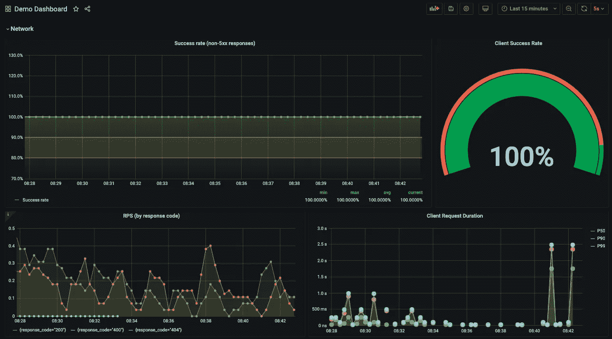
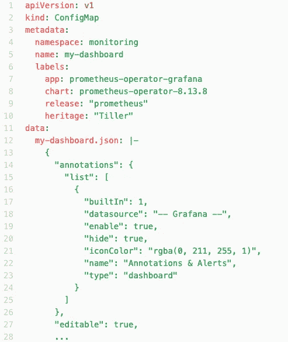

# 改进团队开发—确保通过 FluxCD IaC 对您的团队/w Grafana 仪表盘进行一致的监控

> 原文：<https://itnext.io/improve-team-devops-ensure-consistent-monitoring-for-your-team-w-grafana-dashboards-via-fluxcd-106dc51f9b48?source=collection_archive---------6----------------------->

任何使用过像 Prometheus 和 Grafana 这样的 OSS 监控工具的人都可以证明，这些工具是部署在**Kubernetes****containered****环境**中的 **#1** 最佳选择。

在配置监控堆栈以从其提供的所有功能中受益时，有一长串管理开销需要考虑，例如调整、定制和简单工作。

这需要时间，考虑到您在容器集群中获得的必备洞察力，监控的价值是毋庸置疑的。我就让它这样吧。事实。

普罗米修斯监控堆栈至少由几个组件组成，例如:
- **Prometheus** (核心)用于指标收集和保留，警报触发
-**alert manager**-用于向 Slack 和 Pagerduty 等其他服务发出警报的附加集成
-**Grafana**-用于所有应用程序监控仪表板的简单便捷的一站式可视化 UI 工具。这是我们旨在简化和民主化的一点

从 [Grafana 第 5 版开始，对支持预配仪表板进行了改进](https://grafana.com/docs/grafana/latest/administration/provisioning/)。此外，这些仪表板可以来自配置图，由 grafana 自动加载，无需进一步启动部署，即可在 Kubernetes 中重新读取配置图。

完整的 Prometheus 堆栈可以通过方便的 [Prometheus-Operator](https://github.com/helm/charts/tree/master/stable/prometheus-operator) 进行部署，后者可以从一开始就配置 Grafana 仪表板 UI。

演示应用仪表板，具有 istio 衍生的标题指标

另一方面， [FluxCD](https://github.com/fluxcd/flux) 是针对 Kubernetes 集装箱化环境的**连续交付(CD)** 应用。
我的同事[西恩·里格比](https://medium.com/u/4b4dc30319a3?source=post_page-----a39eb650576f----------------------)在这里对 GitOps 环境下的 [Flux 特性集进行了详细分析。这个 **fluxCD** 工具不断地轮询指定的 GitHub 存储库的变更，并有效地在清单上提取变更集`kubectl apply -f <all>`。这为任何数量的用例带来了非常简单和优雅的连续交付流程，从 GitOps CICD 发布管道下的完整应用程序堆栈到部分 Kubernetes YAML 清单交付，以及我们在配置图中的 Grafana 仪表板。](https://medium.com/contino-engineering/integrating-gitops-deployments-in-kubernetes-using-weave-flux-9a617ea17684)

[**Duedil**](https://www.duedil.com/) 热衷于通过自动化交付的 DevOps 实践，我们正在使用 **FluxCD** 部署监控仪表板，以实现团队范围的 DevOps 价值:

*   **开发团队**负责所有的监控仪表板和度量评估。团队**被授权**创建一个仪表板，自动检查并部署到所有需要的环境中。
*   仪表板有完整的审计跟踪，相关性可以随着时间的推移进行评估，从而改善**仪表板所有权** —“谁创建了该仪表板”和相关性—“该仪表板向我展示了什么”。
*   **无**多**失** **仪表盘**。它们都存储在 GitHub 存储库中。

My-Dashboard 示例:Kubernetes ConfigMap 包装器中的 Grafana Dashboard JSON

*   **一致性** —给定各个 Kubernetes 集群环境中的**普罗米修斯堆栈**版本奇偶校验。FluxCD 将轮询变更，将相同的仪表板拉入并部署到所有指定的环境中。
*   **Reduced Toil** —一旦合并到`master`分支中，所有仪表板自动释放。
    在一个环境中创建原型，并自动部署到其他环境中。不再从本地机器手动导入仪表板。这种自动 FluxCD 发布模式还可以根据需要扩展到其他环境。
*   **基础设施**团队减少的开销。监控仪表板没有专门的单一支持或管理人员。整个团队都有这个责任。特定于应用程序的仪表板归开发团队所有。每个人都参与质量监控解决方案、仪表板甚至应用程序警报配置的开发。

[迪迪尔](https://www.linkedin.com/in/mike-morley-011a7a79/?originalSubdomain=uk)的工程经理迈克·莫利说

> *由于大量的迁移工作，我们有许多不再适用的旧工具，将 flux 作为一个流程来实施非常简单，这使我们能够以标准的集中方式将其与我们的构建流程结合起来，GitOps 模型允许我们定义资产的状态，它还在应用程序和配置级别构建 BC/DR 流程，这为团队成员部署和配置测试环境节省了时间。*
> 
> 它还提供了一个“已知状态”,在没有版本控制的完整审计跟踪的情况下，防止任何小的变化和调整随着时间的推移而累积。

这就是了。

通往完全敏捷发布过程的道路，不管 CI/CD 过程，对每个组织来说都是独立的。监控仪表板的持续交付是如何实现无缝、敏捷交付的一个很好的例子。

紧挨着它的是剩余的监控堆栈组件，例如[Prometheus](https://prometheus.io/docs/prometheus/latest/configuration/alerting_rules/)`PrometheusRules`——也称为 Alerts，也属于应用程序团队，在应用程序发布生命周期中发布。

无论您决定为您的组织选择哪种模型，考虑使用 [FluxCD](https://fluxcd.io/) 来从您的 Kubernetes 环境中的自动化发布过程中获益。

我希望这篇文章能在你的敏捷交付之旅中启发你，实现 DevOps 实践。

# 接下来，

如果你是 FluxCD 的实际操作者，而 Kubernetes 的操作让你感到厌倦，考虑探索一下如何让 **#GitOps CI/CD** 发布管道更适合你。

自然，在这种技术兴奋的同时，它也带来了自己的一系列挑战。这里还有另一篇有趣的文章— [**使用云构建和 Kubernetes 引擎在 Google 云平台上构建云原生# GitOps**](https://medium.com/contino-engineering/building-cloud-native-gitops-on-google-cloud-platform-21e022904e94)

最后，如果您希望亲自参与这些不同范围的项目，请加入我们！我们一直在寻找这个领域聪明的头脑和伟大的专业人士。我们正在招聘，[请联系](https://www.linkedin.com/in/johas/)！