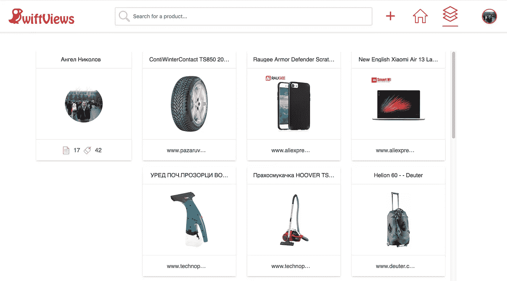

# 使用这个简单的可观察缓存装饰器来提高 Angular 应用程序的性能🎉

> 原文：<https://itnext.io/improve-your-angular-app-performance-by-using-this-simple-observable-cache-decorator-71e81dfa76ae?source=collection_archive---------0----------------------->

由[托因·卡尼尔](https://unsplash.com/@toineprojects?utm_source=medium&utm_medium=referral)在 [Unsplash](https://unsplash.com?utm_source=medium&utm_medium=referral) 拍摄的照片

当我们即将在 [SwiftViews](https://www.swiftviews.com) 中完成应用程序的开发时，我们注意到所有数据获取用户流中的一个模式。尽管这些应用程序都是数据驱动的，看起来非常动态，但在**同一个用户会话**中**真正改变**的并不是太多，但我们仍然对新内容发出 http 请求。

## 最简单的解决方案是缓存

缓存在哪里？在服务器上？我们已经有了，但这并不能阻止我们所有的应用程序访问我们的服务，从而增加它们的负载。

也许我们可以使用服务工人，因为它允许缓存 API 调用？
是的，这是选项之一，因为它已经与 Angular 进行了很好的[集成](https://angular.io/guide/service-worker-getting-started)，并允许一个简单的解决方案来选择性地缓存资源和 API。然而，我们想要的是不仅能够选择缓存什么，而且能够选择何时缓存。

举个简单的例子——我们基本上想缓存下面页面的所有 API 调用结果，但前提是我们确定数据源没有以某种方式改变。

由于这是我的个人库存页面，它实际上唯一可以改变的方式是如果我从这个平台添加一个项目(目前唯一可以这样做的方式)，所以我有关于**这个页面什么时候**会改变以及我可以返回缓存内容多长时间的信息。

**我们认为以选择性和可配置的方式应用这种缓存的最佳方式是使用平台已经提供给我们的东西**

因为我们使用 Angular 和 Typescript ❤️，并且我们所有的数据调用都通过 RxJs，所以我们认为我们可以创建一个缓存可观察装饰器，我们用它来只为某些方法提供缓存能力。

之前，这是我们的方法，它调用我们的服务器来获取上面页面上的产品:

这就变成了:

注意,@Cacheable()已经被应用于我们想要的方法，并且还被传递了`cacheBusterObserver`,这基本上是我们基于主题的机制，当流中发出任何值时，它告诉这个精确修饰的方法释放它所有的缓存。

例如，如果下面的方法返回的可观察对象发出一个值，那么它将“缓存爆炸”上面方法的缓存😵

这可能是我们拥有的最复杂的例子，但我们也有其他配置实现，如 **maxCacheCount、maxAge、slidingExpiration 和自定义缓存决策器和解析器**，它们为我们提供了对缓存内容、时间和方式的细粒度控制。参见那些在[的自述文件](## Deployment  Add additional notes about how to deploy this on a live system)。

在下面的两张 gif 图中，你可以看到我们的应用程序在没有缓存和有缓存时的性能差异。

不可缓存

可缓存装饰器还没有应用，所以每次页面加载实际上都将从服务器获取数据

已应用可缓存装饰器🎉

应用了可缓存装饰器，我们可以看到所有连续的页面加载都变得更快了。此外，用户资料页面会立即加载，因为我们已经在库存页面上调用了`/user/{id}`端点。此外，在我们添加一个新项目后，缓存会崩溃，因此我们的用户会获得新的数据

总而言之，这个简单的装饰器允许我们:

1.  选择性地缓存可观察的方法(不仅仅是端点，也可能是流中计算量大的计算)
2.  提高我们应用程序的性能，**而不需要**任何业务逻辑重构(感谢 TS decorators ❤️)
3.  大大降低我们服务器的负载

如果你想在你的项目中使用这个装饰器，就从 NPM 安装它吧！

`npm install ngx-cacheable`

如果你对此有任何问题或者想要贡献，不要介意打开一个 pull request @ [github](https://github.com/angelnikolov/ngx-cacheable) 或者在下面评论。

此外，如果您喜欢该应用程序，请注册并建立自己的库存@ [swiftviews](https://www.swiftviews.com) 。

谢谢大家！🐦

想找一份远程前端工作？
有空的时候通知我们！立即订阅[https://www.remotefrontendjobs.com/](https://www.remotefrontendjobs.com/)