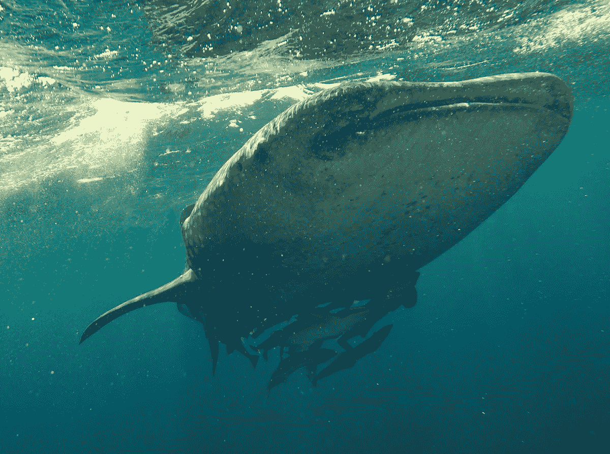
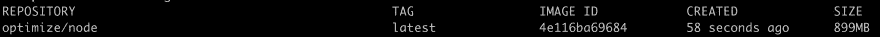
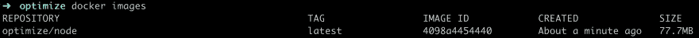

# 改进您的 docker 文件、最佳实践

> 原文：<https://itnext.io/improve-your-dockerfile-best-practices-33bf81defabf?source=collection_archive---------9----------------------->



在 [Twitter](https://twitter.com/chris_noring) 上关注我，很高兴接受您对主题或改进的建议/Chris

好吧，那么你知道你在码头附近的路。你可能在我的 [5 部分 Docker 系列](/docker-from-the-beginning-part-i-ae809b84f89f)或其他地方找到了它。无论如何，你正处于从理解基础到做得更好的阶段。这就是本文向您展示的内容，尤其是如何提高 Dockerfiles 的现有基础知识

# 资源

-[docker files 的最佳实践](https://docs.docker.com/develop/develop-images/dockerfile_best-practices/)这里有一个长长的提示列表。迟早你会想看看这里，改善你的设置。
- [将您的 Docker 映像推送到云中的容器注册表](https://docs.microsoft.com/en-us/azure/container-registry/container-registry-get-started-docker-cli?wt.mc_id=medium-blog-chnoring)您的 Docker 映像需要存储在 Docker Hub 的某个地方，这是一个只有您和您的同事才能访问的私有注册表，或者为什么不是云中的私有注册表。

# 我们对 Dockerfile 的了解

我们知道 Dockerfile 就像一个配方文件，我们可以在其中指定它所基于的操作系统映像、应该安装的库、环境变量、我们想要运行的命令等等。一切都在那里，在文件中指定，它超级清楚你正在得到什么。这是一个很大的进步，以前我们只是在机器上工作，或者花几个小时或几天来安装东西——这是进步。

# 我们的 docker 文件样本

我们创建了一个 docker 文件，让您了解它的样子。让我们讨论一下文件的各个部分，以便更好地理解它。这是:

```
// Dockerfile FROM node:latest WORKDIR /app COPY . . RUN npm install EXPOSE 3000 ENTRYPOINT ["node", "app.js"]
```

这是一个非常典型的文件。我们选择一个操作系统映像，设置一个工作目录，复制我们需要的文件，安装一些库，打开一个端口，最后运行应用程序。那有什么问题呢？

# 操作系统映像大小

乍一看，一切看起来都像我们期望的那样，但是仔细看，我们可以看到我们正在使用`node:latest`作为一个图像。让我们尝试使用以下命令将它构建到 Docker 映像中:

```
docker build -t optimize/node .
```

好了，现在让我们运行`docker images`来查看我们的图像并获取更多的统计数据:



它的重量为 **899 MB**
好了，我们没有什么可以比较的，但是让我们将图像更改为一个名为`node:alpine`的图像，并重建我们的图像:



**77.7 MB** ，哇！！！这是一个巨大的差异，我们的码头形象小十倍。这是为什么呢？

这张图片是基于 [Alpine Linux 项目](https://alpinelinux.org/)
的。一般来说，Alpine Linux 图片比正常的发行版要小得多。它带有一些限制，这里有一个阅读[的](https://github.com/nodejs/docker-node/tree/a8dbfa5c7cac9dca9145c6f429cd2c4f11176707#nodealpine)。总的来说，这是一个安全的选择。

# 缓存

对于您在 docker 文件中指定的每个命令，它都会创建另一个图像层。然而，Docker 所做的是，在尝试创建一个层之前，首先检查缓存以查看现有层是否可以重用。

当我们谈到像添加和复制这样的指令时，我们应该知道它们在缓存的上下文中是如何操作的。对于这两个命令，Docker 会计算每个文件的校验和，并将其存储在缓存中。在新构建 Docker 映像时，会比较每个校验和，如果由于文件中的更改而导致校验和不同，则会重新计算校验和并执行命令。此时，它会创建一个新的图像层。

# 秩序至关重要

Docker 的运营方式是尽量复用。我们能做的最好的事情是把指令放在 docker 文件中，从最不可能改变的到最可能改变的。

> *这是什么意思？*

让我们看看 docker 文件的顶部:

```
FROM node:alpine WORKDIR /app
```

这里我们可以看到 FROM 命令首先出现，然后是 WORKDIR。这两个命令都不太可能改变操作系统，它们被正确地放置在顶部。

> *什么可能会改变？*

嗯，你正在构建一个应用程序，所以你的应用程序的源文件，或者你意识到你可能突然需要的库，比如一个`npm install`，放在文件的更下面是有意义的。

> 这样做我们能得到什么？

速度，我们在构建 Docker 映像时获得了速度，并且尽可能高效地放置了命令。总之，添加、复制、运行是应该在 docker 文件中稍后执行的命令。

# 最小化图层

您输入的每个命令都会创建一个新的图像层。确保将命令数量保持在最低水平。如果可以的话，把他们分组。而不是写:

```
RUN command
RUN command2
```

像这样组织它们:

```
RUN command \
    command2
```

# 只包括你需要的东西

当你开发一个应用的时候。它很容易包含大量的文件，但是当你真正需要创建你的 Docker 图像时，它却是少量的文件。如果你创建了一个`.dockerignore`文件，你可以定义一些模式来确保当我们包含文件时，我们只得到我们需要的那些，用于我们的容器。

# 定义启动脚本

无论你使用命令 CMD 还是 ENTRYPOINT，你都应该像这样直接调用应用程序`node app.js`。相反，尝试像这样定义一个启动脚本`npm start`。

我们想确保我们是灵活的，不太可能改变这一指示。我们可能最终会改变我们开始应用程序的方式，逐渐地给它添加标记，就像这样。你知道，这是一个潜在的移动目标。然而，通过我们依靠启动脚本`npm start`，我们得到了更灵活的东西。

# 使用标签

使用命令标签是更好地描述 docker 文件的好方法。你可以用它来组织文件，帮助自动化和潜在的使用案例，你最清楚什么信息放在那里是有意义的，但它的存在是为了支持你把所有的图像整理得井井有条，所以要充分利用它。标签值是一个键值对，就像这样`LABEL [key]-[value]`。每个标签命令可以有多个标签。事实上，它被认为是在一个标签命令下收集所有的标签。您可以通过用空格字符或类似字符分隔每个键值对来做到这一点:

```
LABEL key=value \ 
      key2=value2
```

# 使用 EXPOSE 依赖默认端口

EXPOSE 是用来打开容器上的端口的。为了确保我们可以与该端口上的容器对话，我们可以结合使用`-p`命令和 Docker run `docker run -p [external]: [exposed docker port]`。将暴露的端口设置为您正在使用的默认端口被认为是最佳实践，比如 apache 服务器的端口 80 和 Mongo DB 数据库的端口 27017 等。

# 明确地说，使用复制而不是添加

乍一看，复制和添加做的是同样的事情，但是有区别。ADD 也能提取 TAR 文件，这是 COPY 做不到的。所以要明确，当你打算复制文件时使用 COPY，并确保只在你打算使用某些特定的特性时使用 ADD，比如前面提到的 TAR 提取。

# 摘要

说到 Dockerfile，还有很多最佳实践可以遵循，但我在这篇文章中提到的最大收获是使用尽可能小的图像，如 alpine。它可以为您的图像大小创造奇迹，特别是如果存储大小是您付费的。

请阅读 [Dockerfile 最佳实践文档](https://docs.docker.com/develop/develop-images/dockerfile_best-practices/)了解更多有用的技巧