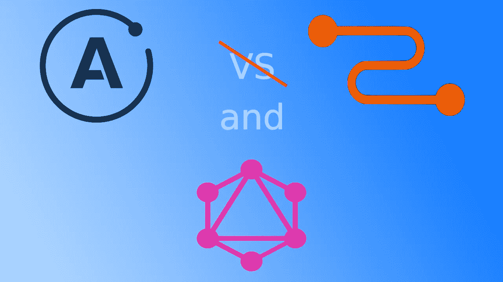

# 使用中继规范改进您的 GraphQL 模式

> 原文：<https://itnext.io/improve-your-graphql-schema-with-the-relay-specification-8952d06998eb?source=collection_archive---------2----------------------->

即使我们在客户端不使用中继，我们也需要遵循中继规范吗？

目前，GraphQL 的主要客户有两个:*阿波罗*和*接力*。Apollo 是一个非常灵活的非固执己见的框架，可以与任何类型的 GraphQL 模式一起工作。中继是脸书非常固执己见的框架，它要求你的服务器遵循中继规范。所以并不是任何一种 GraphQL 服务器都适合中继 GraphQL 客户端。这可能是 Apollo 成为大多数开发人员首选的原因之一。

但是当我们不使用 Relay 时，为什么我们的 GraphQL 服务器不支持这个规范呢？有时，我们可能认为我们不需要它，因为它看起来像是过度杀戮，或者也许有人只是不知道它。

在本文中，我们将试图理解为什么这个规范是有用的，它如何帮助避免破坏性的改变，甚至减少一些样板文件。我们将尝试浏览 Relay 规范的基本概念，并展示为什么它是您未来模式设计的一个好选择。

## 节点

那么什么是节点呢？节点是中继规范中具有 id 的基本构建块。每个有 id 的实体都需要实现这个接口。但是为什么有必要呢？该接口背后的思想是，每个具有 id 的实体都必须可以通过一个查询来访问:

但是怎么可能只根据 id 获取所需的实体呢？ID 通常是一个随机值。我们到底想要得到什么，是帖子还是评论，我们如何知道使用什么控制器来获取正确的数据？

其思想是在将数据发送给客户端之前，将实体类型直接存储在 id 中。然后根据这个扩展的 id，很容易知道它是什么类型的实体以及选择什么控制器。如果您在 GraphQL 服务器中使用 javascript，那么有一个包含实用程序的包来组合实体类型和实际 id。这个包叫做 [*graphql-relay*](https://www.npmjs.com/package/graphql-relay) 在那里你将需要**to global**和 **fromGlobalId** 函数。

为什么我们需要使用节点？这个界面使我们能够避免大量的查询，例如:

如果我们有一个节点实现，我们的查询可能如下所示:

在该查询中，我们将获得帖子的 id 和标题。

每个实现**节点**接口的类型都可以被同一个查询获取。您的模式保持整洁，易于其他用户使用，这不是很好吗？你可以在这里阅读更多关于节点接口[的内容。](https://relay.dev/docs/en/graphql-server-specification#object-identification)

## 连接

几乎每个 API 都返回一些数据列表。通常，这些字段直接返回数组。这是可以理解的，我们试图保持我们的 API 简单，也许我们想节省一些时间，如果我们需要一堆项目，我们只是把它们作为一个数组返回。

但是，如果以后我们需要对这些项目进行分页，该怎么办呢？我们还需要让消费者知道项目的总数，列表中是否有更多或之前的项目。这将需要一个突破性的变化来更新返回类型，使其具有分页信息和一组项。当我们设计一个 GraphQL 模式时，我们应该尽可能地避免破坏性的改变。

中继规范对如何处理它和避免中断更改(连接)有自己的看法。实现细节在[中继规范](https://relay.dev/docs/en/graphql-server-specification#connections)中有很好的描述。下面是一个连接实现的示例:

这是获取集合中第一篇文章的查询:

结果是 JSON:

即使我们不需要分页，我们也可以从一个基本的连接结果形状开始，然后用分页来调整它，而不会破坏对中继框架的更改和潜在支持。

## 突变结果

在我们使用 GraphQL 的日常工作中，我们经常使用突变。大多数时候我发现我们的突变直接返回结果。让我们举一个去除后突变的例子，通常，它看起来是这样的:

我们发送我们想要删除的文章的 id，并获得一个被删除的实体。听起来很简单，对吧。

主要问题还是潜在的突破性变化。通常，一个帖子不会单独存在，它会附带一些评论。当我们删除一个帖子时，我们可能希望删除所有相关的评论，并让客户知道什么已经被删除。

我们如何将这种灵活性存档在我们的模式中，并防止重大变化呢？

每个变异必须返回一个*有效载荷*类型。不要像我们在上面的例子中所做的那样，直接向突变响应返回一个动作结果。否则，很难扩展变异结果。

让我们改进我们的 *removePost* 变异，并通过向变异结果添加一个 *Payould* 类型来避免潜在的破坏性变化。

如果我们想要扩展这个突变结果，我们将向*有效载荷添加另一个字段。*

不错，我们的模式是可扩展的，并且仍然与以前的客户端版本兼容。

## 结论

Relay specification 是一套关于如何改进 GraphQL 模式的很好的说明。

在某些情况下，这看起来像是过度杀戮。这个规范不是随机出现的。脸书有很长的路要走来改进他们的 GraphQL 模式，避免破坏性的改变，使其更加灵活和可扩展。我们都知道更新一个错误设计的模式是多么昂贵和痛苦。

即使您不使用 Relay 作为您的客户机 GraphQL 框架，仍然值得检查该规范，并在您的日常模式设计中至少使用部分规则集。