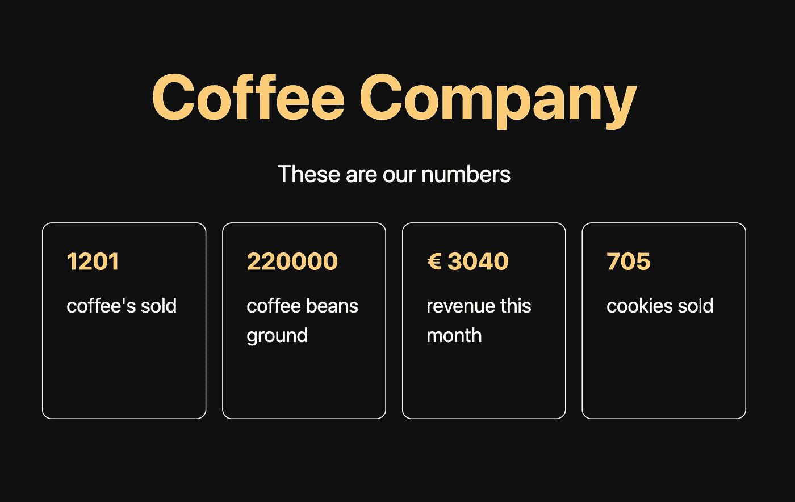

# 使用 React 提高初始负载

> 原文：<https://itnext.io/improve-your-initial-load-using-react-abfb27feb000?source=collection_archive---------2----------------------->

为什么客户会离开你的网站？

厌倦了装酒吧和纺车？你的网站是否挣扎于高跳出率？在这篇文章中，我将描述如何使用三种互补的方法来增强获取数据时的初始用户体验。

你网站的最初体验对访问者的再次访问至关重要。让我们想象一下，我们有一个咖啡公司的营销网站，在那里我们举例说明了一些指标，如销售的咖啡数量，研磨的咖啡豆数量等。

这是你的客户可能会感兴趣的非关键数据，也是为你的咖啡公司做广告的好方法。理想情况下，我们总是希望用户收到最新版本的数据。但是，如果数据更改的速度超过了服务器进行新构建的速度，用户将会看到过时的数据。另一方面，我们不希望我们的服务器一直进行新的构建。

对于这种数据，如果用户在几毫秒内看到一些过时的数据，这是可以接受的，至少如果它们分别是不同的。最终，构建版本数据将与实际的实时版本数据如此不同，以至于售出咖啡数量的计数器可能会飙升，使其看起来像一个假计数器。我们会用 Next.js 做一个网站，一个 React 上面的框架，来解决这个问题。Next.js 在服务器端渲染上很厉害。它提供了几种不同的获取数据的方式，这取决于你的网站的需求。对于这个特殊的用例，我们将使用增量静态再生。这个方法允许我们在 x 秒后重新生成构建版本，这取决于您的数据变化的程度。对于小咖啡公司来说，一分钟一次绰绰有余。

Next.js 中的 getStaticProps 方法将在构建时获取数据。将重新验证属性添加到返回对象，将使函数每分钟最多重新生成一次构建版本。第一个在一分钟内访问网站的用户会看到旧版本，但会触发新版本。

你可以用任何你喜欢的方式获取你的数据，但是这里我用的是 Firebase。Firebase 有一个 NoSQL 数据库，可以让你把数据传输到前端。因此，除了增量静态再生，我们还在初始加载后为用户提供实时数据流。

getStaticProps 函数:

```
export async function getStaticProps() { const statsRef = doc(firestore, 'stats', 'home'); const statsData = await getDoc(statsRef); return { props: statsData.data(), revalidate: 60, };}
```

这是我们想要实现的生命周期:


在接收到初始数据加载后，我们应该创建一个钩子，在客户端加载时为数据设置一个监听器。钩子应该有一个状态，每当 Firestore 中的数据发生变化时，这个状态就会更新。

钩子:

```
export function useStats() { const [stats, setStats] = useState(null); const statsReference = useMemo(() => doc(firestore, ‘stats’, ‘home’), []); useEffect(() => { onSnapshot(statsReference, snapshot => { setStats(snapshot.data()); }); }, [statsReference]); return stats;}
```

最后，将数据插入页面，如下所示:

```
<h2>{stats ? stats.coffeesSold : initialDataCoffeesSold}</h2><p>coffee&apos;s sold</p>
```

最终结果是:

