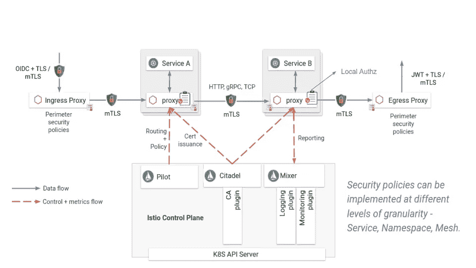

# 使用 Istio 提高 Kubernetes 集群的安全性

> 原文：<https://itnext.io/improving-the-security-of-kubernetes-clusters-using-istio-5f04c1dfdf55?source=collection_archive---------6----------------------->

[由](https://www.alcide.io/company/management/) [*阿尔西德*](https://www.alcide.io/) *联合创始人 CTO &加迪·纳尔撰写。*

使用 [Istio](https://istio.io/) 作为服务网格基础设施的目标和好处之一是提高它所嵌入的集群及其包含的服务的[安全性。Istio 的安全价值有以下几个方面:](https://www.alcide.io/service-mesh-security/)

*   Istio 验证工作负载的身份，并在创建网状连接时为其颁发和管理证书。
*   服务网格流量可以使用 mTLS 通过相互端点认证自动加密。
*   可配置的身份验证策略和安全的命名信息确保了传输层的流量授权。
*   应用层网络协议中基于角色的细粒度访问控制可用于微分段，进一步增强用户限制哪些服务交互以及交互方式的能力。
*   Istio 提供的流量可观察性与外部流量分析和分析工具相结合，支持安全相关的流量审计和监控，以检测和调查网络行为异常。

## [观看 Alcide 和 Giant Swarm 的点播网络研讨会](https://get.alcide.io/hubfs/Webinar%20Recordings/GS%20%3C%3E%20Alcide%20Webinar.mp4)“使用 Istio 保护&监控您的服务”。

# 安全架构

Istio 的安全特性涉及多个组件:

*   **Citadel** 用于密钥和证书管理。
*   **Sidecar 和外围代理**实现客户端和服务器之间的安全通信并实施策略。
*   **试点**向代理分发认证策略和安全命名信息。
*   **混合器**用于管理授权和审计。

# 身份、证书和认证

Istio 的 sidecar 代理使用 SPIFFE IDs 在工作负载之间建立 mTLS 连接。SPIFFE 是一组开源标准，用于在动态和异构环境中安全地识别软件系统。它以特制的 X.509 证书的形式为现代生产环境中的每个工作负载提供安全的身份。SPIFFE 消除了对应用级认证和复杂的网络级 ACL 配置的需求。SPIRE，即 SPIFFE 运行时环境，是一个可扩展的系统，它实现了 SPIFFE 标准中包含的原则。SPIRE 管理平台，工作负载证明提供 API 来控制证明策略，并协调证书颁发和轮换。

网格中的服务通过 Istio 与集群管理系统的集成进行识别和认证。例如，使用 Kubernetes，Citadel 组件从 apiserver 了解所有工作负载，并自动为每个工作负载发布一个 SPIFFE ID。它将为每个现有的和新的服务帐户创建的 SPIFFE 证书和密钥对存储为 Kubernetes 秘密。Kubernetes 根据其服务帐户通过 Kubernetes secret volume 将证书和密钥对安装到 pod。Citadel 还监视每个证书的生命周期，并通过重写 [Kubernetes secrets](https://blog.giantswarm.io/understanding-basic-kubernetes-concepts-iv-secrets-and-configmaps/) 来自动轮换证书。

# 安全服务连接和身份验证策略

Istio 的安全命名信息定义了哪个或哪些服务帐户可以运行某项服务。这是从证书中编码的服务器标识到发现服务或 DNS 所引用的服务名称的映射。从身份 A 到服务名 B 的映射意味着“允许并授权 A 运行服务 B”。

用户使用身份验证策略为接收请求的服务配置身份验证要求。Pilot 监视 Kubernetes apiserver，并通过将策略转换为 sidecar 代理的指令，为活动工作负载生成安全的命名信息。这些说明为每个服务指定了如何执行入站请求者所需的身份验证机制。Pilot 将这些验证指令安全地分发给边车代理。

sidecar 代理在代理的工作负载之间连接、验证和建立相互验证的 TLS 连接。客户端服务负责遵循必要的身份验证机制，例如通过获取适用的 JWT 凭据并将其附加到请求，或者通过客户端代理自动使用的 TLS 证书。

除了身份验证机制本身，身份验证策略还包括其他设置，如:

*   目标选择:策略适用于哪个服务
*   范围:网状范围、命名空间范围或特定于服务的范围
*   传输身份验证:mTLS
*   来源认证:对 JWT 使用的限制

# 基于角色的应用协议访问控制

微分段是一种安全技术，可在云部署中创建安全区域，并允许组织将工作负载相互隔离并单独保护它们。Istio 的基于角色的访问控制(RBAC)通过命名空间级、服务级和方法级的访问控制为 Istio 网格中的服务提供微分段。这些控制有效地决定了“谁被允许在什么条件下做什么”。例如，用户可以设置一个策略，允许服务 AccountAuditor 向 Payroll 服务的路径“/accounts/*”发送 HTTP Get 请求(读取权限)，同时拒绝访问其他服务。RBAC 配置与 HTTP、HTTPS、HTTP2 和普通 TCP 兼容。

为了实现这种分割，Istio 的 Pilot 监视授权策略的变化，并将这些策略分发给与服务实例位于同一位置的 sidecar 代理。每个 sidecar 代理运行一个授权引擎，在运行时授权请求。当请求到达代理时，授权引擎根据当前授权策略评估请求上下文，并返回授权结果“允许”或“拒绝”。

# 结论

Istio 的安全配置、自动化工具链和安全架构具有显著优势:

*   服务网格中的流量在相互认证的端点之间加密，并且仅在根据用户配置允许通信的服务之间加密。这些属性可以防止多种类型的攻击，如冒充、窃听和中间人。
*   根据最佳实践处理凭证的创建、分配和分发。凭据安全地存储在各自的工作负载旁边，因此不太可能被泄露。此外，凭据经常轮换，因此，即使在受到威胁的情况下，受威胁的凭据对攻击者的用途也非常有限。该设置由 Istio 自动完成，无需显式编码。
*   身份验证策略和 RBAC 为用户提供了不同的选项，允许或阻止服务之间的连接，并根据安全敏感性和其他考虑因素对网格的各个部分进行分段。

## [观看 Alcide 和 Giant Swarm 举办的点播网络研讨会](https://get.alcide.io/hubfs/Webinar%20Recordings/GS%20%3C%3E%20Alcide%20Webinar.mp4)“使用 Istio 保护&监控您的服务”。

# 关于作者:

*帖子* [*作者:Gadi Naor*](https://www.linkedin.com/in/gadinaor/) *，CTO&*[*al cide*](https://www.alcide.io/)*。*

*Alcide 通过强大的网络安全平台保护 Kubernetes 从代码到产品的部署。*

 [## Gadi Naor -联合创始人& CTO - Alcide.io | LinkedIn

### 联合创始人兼首席技术官 Alcide.io 特拉维夫 Alcide 是一家云原生安全领导者，其使命是增强开发运维服务和

www.linkedin.com](https://www.linkedin.com/in/gadinaor/)