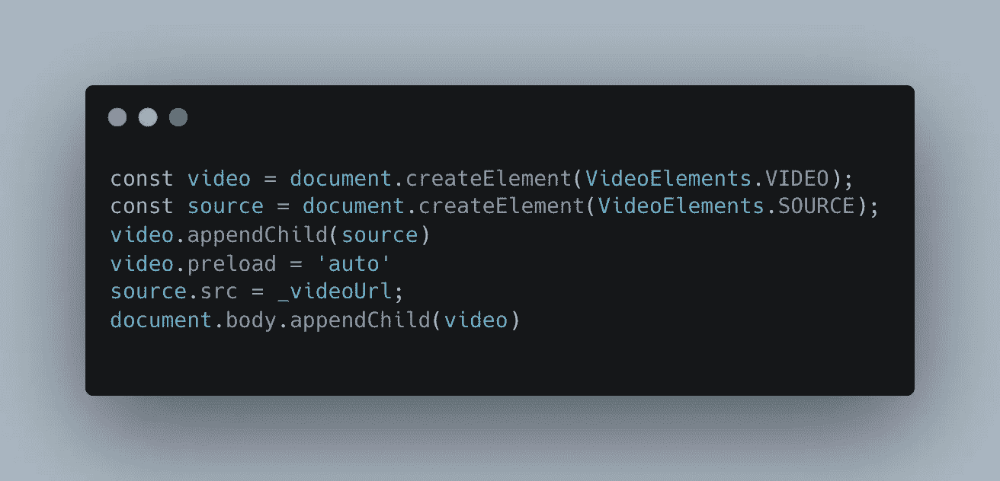

# 提高视频加载性能(JS)

> 原文：<https://itnext.io/improving-video-load-performance-js-8f24c7d6a85e?source=collection_archive---------0----------------------->

视频元素在网络上经常被使用，以允许存储在 s3 或任何其他替代设备中的视频流传输到您的网站。虽然我们不是 YouTube，也不想为视频创建许多小块以加快播放速度，但我们需要为我们更通用的用例找到一个解决方案。

```
<video>
  <source src="[https://link](https://link)"> </source>
</video
```

这是向我们的网站添加视频的简单方法，基本 html。在这种情况下，一旦在我们的源标签中设置了视频的 url，视频将开始加载，虽然这样做是可行的，但用户的行为非常缓慢，他们已经看到了视频元素，用户必须等待最长的时间才能观看视频。

那么我们能做些什么来改善这种情况呢？使用原生 JS(是的，原生)



所以我们一步一步来:
1。createElement('video ')将创建一个视频类型的 html 元素(拥有其所有属性
2。createElement('source ')将创建一个源元素。
3。将源附加到视频中(参考见上面的 html 片段)。
4。将视频预加载策略设置为“自动”(它将在获得 url 后立即开始构建视频缓冲区。
5。设置视频网址。由于预加载策略，视频将开始获取 url it(甚至在附加到我们的 HTML 之前。
6。将视频添加到 HTML(或任何其他元素)中，使视频播放器在屏幕上可见。

— — — — —

那么，为什么会这样呢？

追加到 DOM 是一件“昂贵”的事情，需要时间。我们可以利用这些时间来创造一种“感知性能”的感觉。我们想展示我们使用的两件东西。我们的网站加载速度越快越好。一旦某样东西可见，它就是可用的。

加载视频通常是页面上的第一件事，我们的用户已经知道这一点。但是拥有一个不可操作的界面是用户最糟糕的体验之一。因此，我们延迟了视频在我们的 DOM 中的设置时间，但至少当它在那里时，它就准备好了(或者在最坏的情况下，在更短的时间内)。

Youtube 是一个视频平台，它会尽其所能让加载时间尽可能快，在大多数网站上并非如此。因此，我们可以利用现有的工具，尽最大努力改进我们的网站。

这已经在一个相当大规模的平台上进行了生产测试，运行速度更快(遗憾的是我不能公布数字)