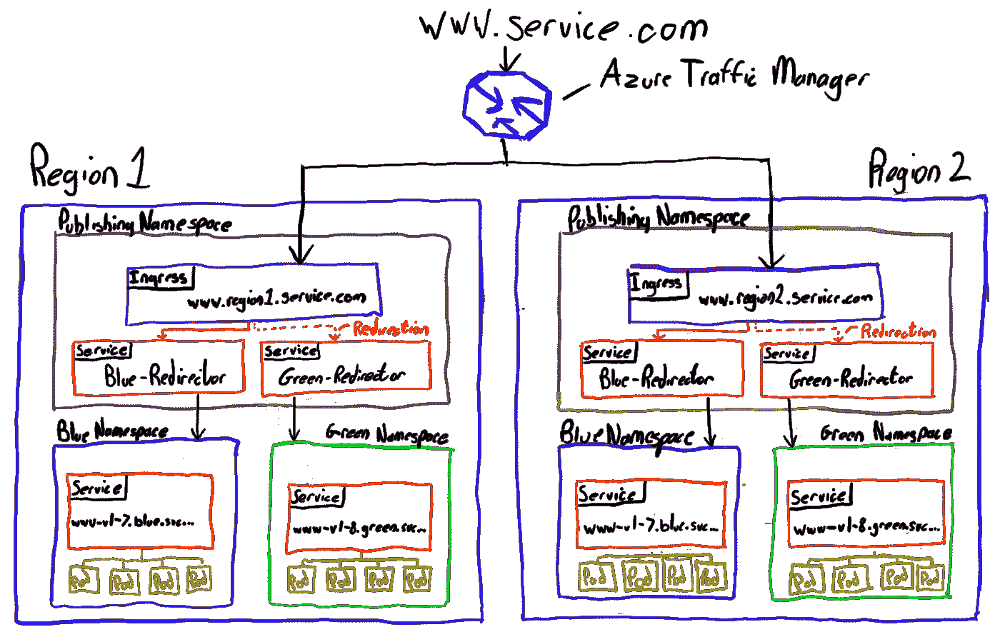
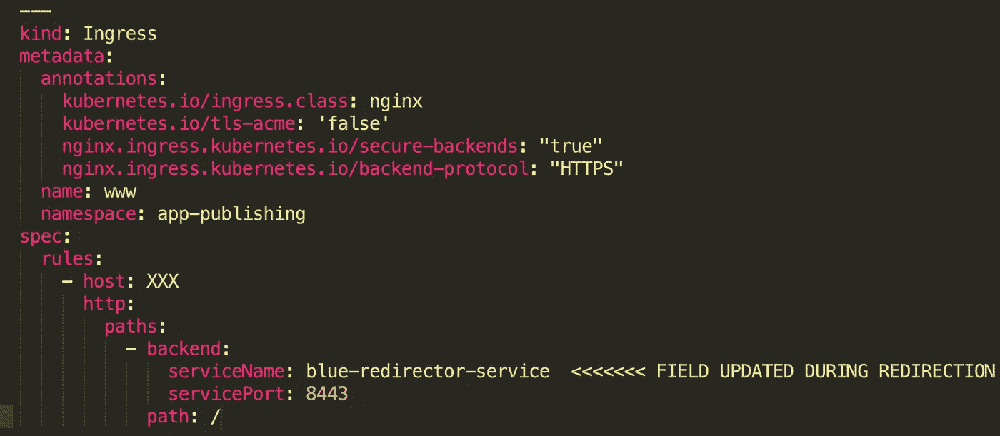
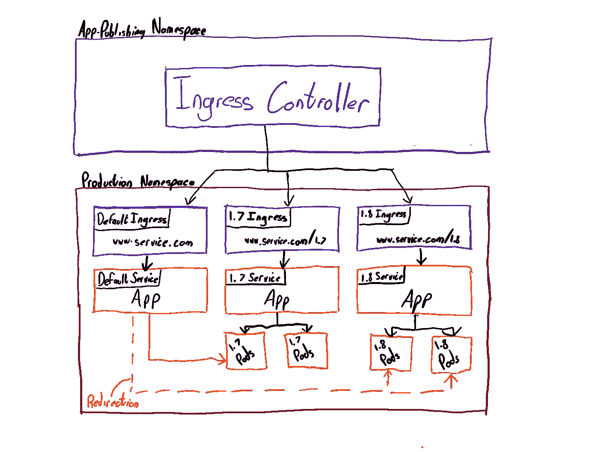

# 改善 Kubernetes 的零停机时间

> 原文：<https://itnext.io/improving-zero-downtime-on-kubernetes-95e3a2f623ba?source=collection_archive---------4----------------------->

几个月前，我们开始了我上一个项目的一部分工作，着手完成两件事:

**1。提高我们发布过程的速度
2。允许我们同时运行应用程序的多个版本**

这是我们最初的部署和发布设计的两个限制，所以在分享这篇博客时，我希望学到的教训能够帮助你避免同样的问题。

在进入解决方案之前，我将快速描述一下我们的起点。

**请注意:**这是基础设施的简化视图，我们将仅描述与该解决方案零停机相关的元素。

# **配置—在**之前

**设计决策**
—为 Web 层(应用发布)&应用层(蓝色&绿色)
—应用命名空间(蓝色/绿色)将是不可变的，因此将只包含一个版本
—通过单个头盔图
部署的应用——使用 [Nginx 入口控制器](https://github.com/kubernetes/ingress-nginx)管理 Kubernetes 入口资源

# **此配置的问题**

**1。入口控制器重载导致 1 秒钟的流量丢失**

在上图中以红色显示的重定向机制重定向了“蓝色”和“绿色”命名空间之间的实时流量，这意味着更新应用发布中的入口资源，以指向冷蓝色/绿色重定向器服务资源，如下所示。

更新入口资源以指向新服务意味着入口控制器将需要执行 Nginx 配置的重新加载，这导致平均**一** **秒**的掉线，导致 500 错误。(此处可找到这一原因及其他导致重新加载的原因)。

这意味着，为了执行零停机发布，我们必须从 Traffic Manager 中删除 Region1，在离线时更新它，将其添加回 Traffic Manager，并对 Region2 重复此操作。这导致了这个设置的下一个问题。

**2。无法支持多个版本**
应用程序需要能够在两种情况下路由用户流量:

1.  登录主页的新用户应该被路由到应用程序的最新稳定版本。
2.  请求版本特定资产的现有用户会话应该被路由到所请求的版本。

在当前的设计中，我们无法基于所请求的版本进行路由，并且对于两种流量场景只有一个入口流。

这意味着在 Region1 被更新并重新引入 Traffic Manager 期间，Region2 被清空(通常在 5-10 分钟之间)，Region2 上的现有用户会话将无法路由到 Region1 上的版本特定资产，从而导致 404。

**3。缓慢的发布过程**
这个设置的最后一个问题是执行一个发布所花费的时间。尽管上述发布过程中唯一的手动步骤是从 Traffic Manager 中删除/重新添加区域，但在切换到新版本之前等待连接耗尽会大大减慢我们的发布过程，这意味着重定向到一个新的、已经过测试的版本可能需要 20 分钟。

# **搞定**

解决这个问题的计划非常简单，可以总结为三个要点。

**1。重定向期间无需 Nginx 入口控制器重新加载。**

我们的重定向问题的根源是 Nginx 入口控制器重新加载的需要，以及由此导致的 1 秒停机时间。因此，我们需要确保所有入口资源保持静态，这意味着它们的下游配置在初始配置后不能改变。为此，我们需要找到另一种方法来重定向流量。这就是标签选择器的用武之地。

[标签选择器](https://kubernetes.io/docs/concepts/overview/working-with-objects/labels/#label-selectors)允许我们将流量路由到单个名称空间内的目标 pod，而不会导致连接中断。这是在没有流量管理员操作的情况下实现零停机部署的关键。

为了促进这一点，我们不得不从蓝/绿名称空间转移到单一的生产名称空间，这意味着我们的不可变发布组件不再是整个名称空间，而是掌舵发布。

**2。新的默认入口&服务资源**

我们将引入新的“默认”入口流来处理新的用户流量。该流内的入口资源将保持静态，并且我们将利用标签选择器来实现零停机时间重定向。

**3。重构入口资源**

为了促进流量路由的第二个用例，我们将利用基于 URL [路径的路由](https://kubernetes.io/docs/concepts/services-networking/ingress/#ingress-rules)为现有用户会话引入新版本特定的入口流。

# **配置—在**之后

**要点:**
—双区域&交通管理器仍然存在，上面没有显示，因为现在与零停机时间无关。
—单个生产命名空间
—简化设计，没有引用不同命名空间中的资源的服务
—默认入口流(左)处理路由流量登陆服务主页的第一个用例。
—版本特定入口处理路由流量的第二种使用情况，即基于 URL 路径请求版本特定资产。
—入口资源保持静态，在重定向期间不再更新
—重定向(红色)现在是通过 CI 作业使用 [kubectl patch](https://kubernetes.io/docs/reference/kubectl/cheatsheet/#patching-resources) 命令更改标签选择器(如下所示)

# **结果**

1.重定向过程中的手动步骤已被删除
2。重定向到新版本现在需要不到 **1 秒**的时间，并且没有连接中断**。**(运行该任务的 CI 作业不到 5 秒)
3。新版本可以随时部署到生产命名空间，并在任何实时流量定向到它们之前进行离线测试。
4。我们能够支持无限数量的并发版本