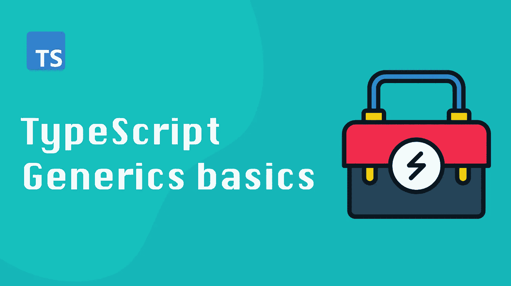

# 深入了解 TypeScript 泛型:第 1 部分——泛型介绍

> 原文：<https://itnext.io/in-depth-look-at-typescript-generics-part-1-intro-to-generics-7ddc72dcfcea?source=collection_archive---------6----------------------->



在这个由两部分组成的系列中，我们将深入了解 TypeScript 泛型。这第一篇文章将让你对泛型及其工作原理有一个基本的了解。在后面的文章中，我们将讨论高级推理和条件类型。

所以，事不宜迟，我们开始吧！

# 为什么我们需要泛型？

使用泛型可以让我们编写一个类型安全的代码，它可以处理各种各样的原语和对象。

如果没有泛型，我们将不得不为我们想要处理的每一种可能的数据组合创建一种新的类型。使用泛型，我们可以编写一次函数或方法，然后针对不同类型的输入重用它。

这听起来很棒，但是 TypeScript 泛型实际上是什么样子的呢？让我们来看看语法。

# 通用语法

TypeScript 使用尖括号`<>`和类型符号`T`来表示通用语法。在您的客户端代码中，TypeScript 将用您传递的类型替换类型`T`。如果我们看一个例子，这将更有意义:

```
function identifyType <T>(target: T) {
  console.log("Type of target is", typeof target);
}identifyType("LOL") // "Type of target is", "string"
identifyType({word: "LOL"}) // Type of target is", "object"
```

上面代码中的函数接受一个泛型类型的参数`T`。然后使用`typeof`操作符将参数的类型打印到控制台。

在第一个调用中，我们传入一个字符串，在第二个调用中，我们传入一个对象。因为它是通用的，所以这个函数可以处理任何数据，并且在两种情况下都能成功执行。

类和接口也可以使用泛型:

```
class Identifier<T> {
  seed: T;
  constructor(public newSeed: T) {
    this.seed = newSeed;
  }identifyType<T>(target: T) {
    console.log("Type of target is", typeof target);
  }
}
```

这里我们用构造函数和`identifyType`方法定义了一个泛型类。`identifyType`方法接受的参数类型必须与提供给构造函数的`newSeed` 参数相匹配。

换句话说，如果您将一个字符串传递给构造函数，`identifyType`将只接受字符串作为参数。

旁注:你没有*有*来使用`T`来表示泛型。`T`只是 TypeScript 中常用的约定。

默认情况下，TypeScript 试图根据参数推断类型，但是您可以使用括号语法`<>`使用显式类型转换来强制指定类型:

```
identifyType<string>(1); // Argument of type 'number' is not assignable to parameter of type 'string'
```

在本例中，函数`identifyType`需要一个字符串类型的参数，但收到的是一个数字。由于这种不匹配，TypeScript 将产生错误。

# 约束类型

通常，我们希望限制`T`的类型，以限制我们的通用代码接受的类型。我们可以使用`extends`关键字来实现。

假设我们想限制`identifyType`函数只接受字符串和数字。我们会这样做:

```
function identifyType<T extends string | number>(target: T) {
    console.log("Type of target is", typeof target);
  }identifyType(true) // Argument of type 'boolean' is not assignable to parameter of type 'string | number'
```

使用`extends`关键字，我们可以告诉 TypeScript 我们的函数或类应该接受哪些类型。在我们的例子中，`identifyType`只接受字符串或数字。当我们试图传递一个布尔值时，函数会产生一个错误。

# 使用 T 型

泛型代码只能引用任何类型的 t 所共有的对象的函数或属性。换句话说，你不能访问任何特定类型的特定内容。您只能访问我们指定的所有泛型类型中的方法和属性。

例如，如果我们有一个被约束为两种类型的泛型类型，我们只能使用同时存在于这两种类型中的函数和属性:

```
type birdGenerator = {
  generate: () => any[]
  birds: any[]
}type ponyGenerator = {
  generate: () => any[]
  ponies: any[]
}function generateAnimal<T extends birdGenerator | ponyGenerator> (generator: T) {
  generator.generate()
  generator.birds // ERROR: Property 'birds' does not exist on type 'ponyGenerator'.
}
```

在上面的例子中，如果试图访问我们的`generateAnimal`函数中的`birds`属性，我们会得到一个错误。然而，我们可以毫无问题地访问`generate`方法，因为它同时存在于`birdGenerator`和`ponyGenerator`类型中。

# 通用约束

您可以用另一个泛型类型构造一个泛型类型。一种方法是使用`keyof`关键字。

关键字`keyof`用于根据另一个类型的关键字生成一个新类型。

我们可以使用它来确保我们只能指定存在于我们的通用对象中的键，就像这样:

```
function getPropertyValue<T, B extends keyof T> (target: T, key: B) {
  return target[key];
}const myObj = {
  id: "0",
  name: "John Doe",
  age: 19
}getPropertyValue(myObj, "id")
getPropertyValue(myObj, SSN) // ERROR: Cannot find name 'SSN'.
```

这里我们使用`keyof`关键字创建一个新类型，并限制`getPropertyValue`函数第二个参数的可能值。现在它只接受与`myObj`对象中的键相匹配的字符串。

# 结论

在本文中，我们讨论了 TypeScript 泛型的基础。我们研究了如何使用泛型来约束代码接受的类型，并探索了使用泛型对象时的一些可用特性。

如果你想获得更多的网络开发、反馈和打字技巧，可以考虑[在 Twitter 上关注我，](https://twitter.com/IskanderSamatov)在那里我分享我学到的东西。
快乐编码！

*原载于 2022 年 2 月 14 日*[*https://isamatov.com*](https://isamatov.com/typescript-generics-in-depth-basics/)*。*