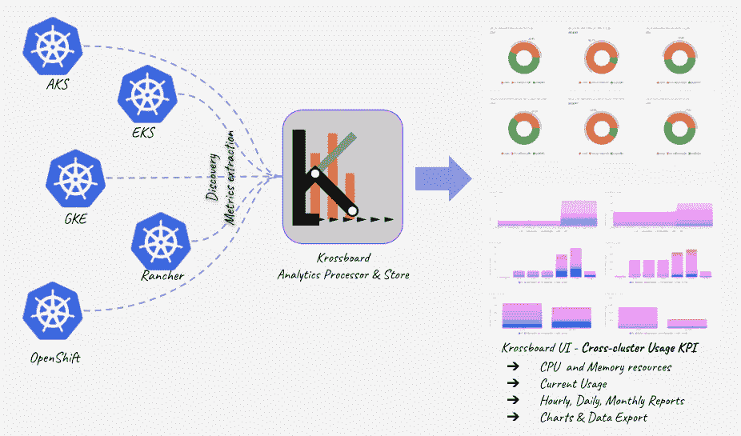
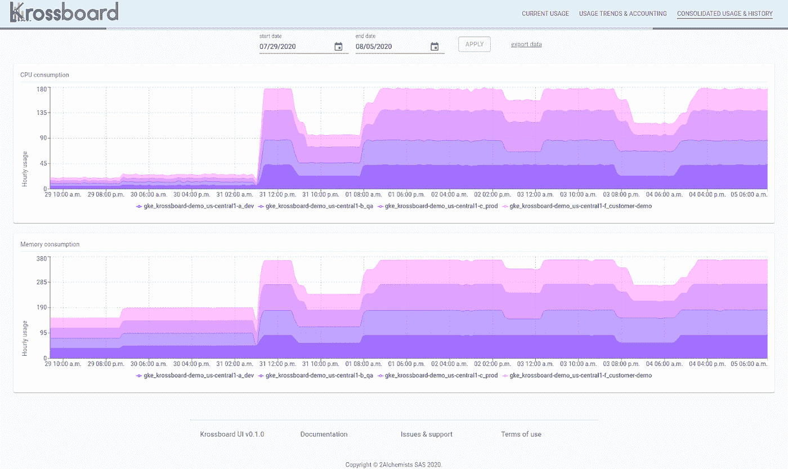
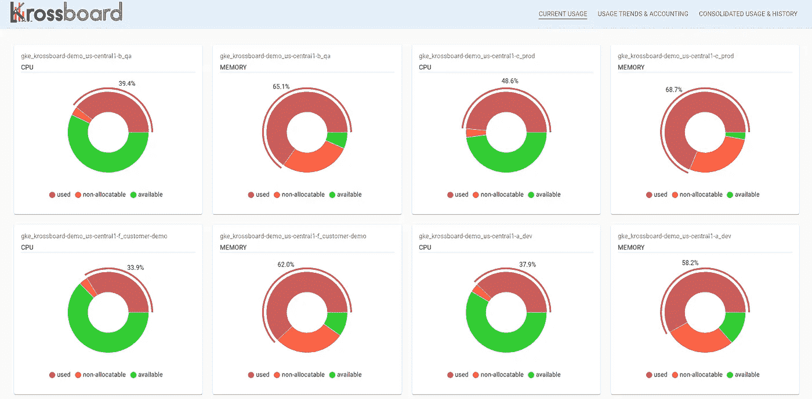
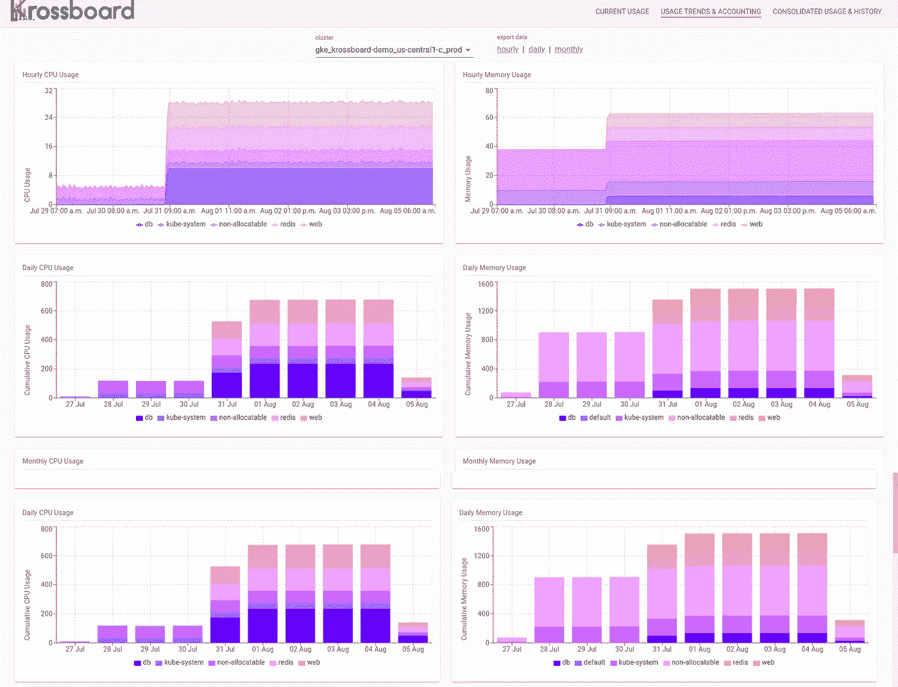
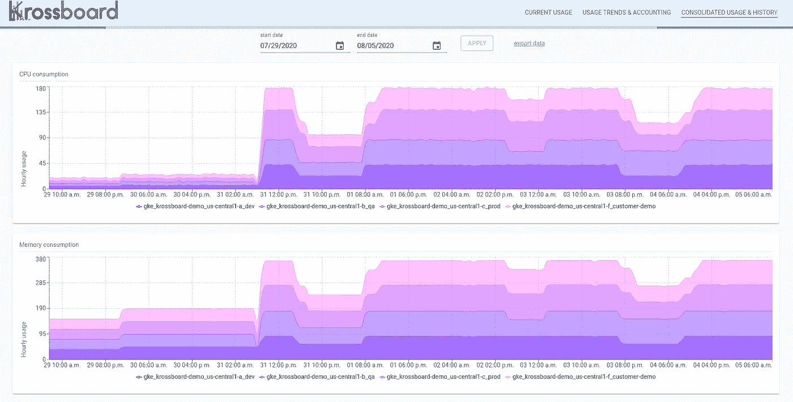

# Krossboard:针对多个 Kubernetes 的集中式使用分析

> 原文：<https://itnext.io/in-search-of-converged-usage-analytics-for-multiple-managed-kubernetes-c5108cb7f0e1?source=collection_archive---------5----------------------->

## 任何发行版——亚马逊 EKS、谷歌 GKE、微软 AKS、Redhat OpenShift、牧场主 RKE 等等。



*与亚马逊 EKS、微软 AKS、谷歌 GKE、红帽 OpenShift 和牧场主 RKE 的概念整合*

今天，让我们介绍一些概念和工具来解决这个用例，以获得一个 ***全面的可视化，来分析和了解具有许多 Kubernetes 集群*** 的环境中的资源使用情况。这种方法旨在帮助组织轻松做出成本分配和容量规划决策。我们的系统名为 [Krossboard](https://krossboard.app) ，正在与[亚马逊 EKS](https://aws.amazon.com/fr/eks/) 、 [](https://cloud.google.com/kubernetes-engine) [微软 AKS](https://azure.microsoft.com/en-us/services/kubernetes-service/) 、[谷歌 GKE](https://cloud.google.com/kubernetes-engine) 、[红帽 OpenShift](https://www.openshift.com/) 、[牧场主 RKE](https://rancher.com/docs/rke/latest/) 以及其他各种普通部署进行积极测试。当部署在托管的 Kubernetes 上时，Krossboard 被设计成能够自动发现和跟踪新的和现有的 Kubernetes 实例的使用情况。它的部署和一些截图将在后面的故事中演示。

**功劳:**这项工作是与 [Christophe Camel](https://www.linkedin.com/in/christophe-camel) 合作完成的，我与他共同开发了 Krossboard。这是一系列故事中的下一篇(见这里的[和那里的](https://medium.com/@rodrigue.chakode/kubernetes-resource-usage-analytics-for-cost-allocation-and-capacity-planning-416800e85d16)和[我将讨论实用的概念和工具来简化 Kubernetes 环境中的成本分配和容量规划。](https://medium.com/swlh/bringing-prometheus-metrics-and-grafana-dashboard-for-cost-allocation-on-kubernetes-clusters-1ee7f68cd677)

# 这项工作的目标

这项工作是因为需要为拥有多个 Kubernetes 集群的组织提供一种方法来轻松处理成本管理和容量规划决策。其目的是为资源使用分析带来一种全球一致的方法，在这个方法中，来自所有 Kubernetes 集群的指标都在一个地方进行收集、处理、汇总和可视化。由此产生的分析旨在涵盖会计的短期、中期和长期(小时、天、月甚至年)，并结合细粒度的探索能力。

> 所讨论方法的**要点之一是，我们希望超越传统方法，在 Kubernetes 集群内部部署分析组件。事实上，后一种方法会消耗生产资源并在使用报告中引入噪声，更不用说相关工具通常是 mono cluster 解决方案这一事实了。**

# 目标和优势

当前工作的核心目标是实现以下独特优势:

*   **整合后的单集群和跨集群使用 KPI—**我们希望在跨集群的情况下进行基于整合指标的分析。一方面，根据 [kube-opex-analytics](https://medium.com/@rodrigue.chakode/kubernetes-resource-usage-analytics-for-cost-allocation-and-capacity-planning-416800e85d16) 提出的方法，所有分析都基于统一的指标，以便与业务决策保持一致和相关。我们的标准分析确实从最近的亮点的最小 5 分钟整合间隔开始，主要焦点是每小时、每天和每月的报告。另一方面，应该在集群内视角的名称空间范围和/或多集群视角的集群范围提供分析。
*   **简化成本分配决策** —我们希望提供每个项目(名称空间)以及每个集群在给定会计期间(例如每小时、每天、每月)消耗的资源的详细报告。其目的是帮助组织在他们的项目或业务单元中分担基础设施和运营成本。
*   **帮助预测成本** —其理念是提供动态分析报告，显示资源如何随时间推移而消耗。这将有助于组织预测资源规模的扩大和缩小，从而预测相关成本。
*   **云成本降低战略的推动者** —最后但并非最不重要的一点是，我们的目的是为组织提供使用情况关键绩效指标，这些指标能够提供事实依据，从而做出集群整合决策。例如，此类洞察可用于激励和推动未充分利用的群集的整合决策，从而降低基础架构和运营成本。

在讨论了我们愿景的理论方面之后，下一节将向 Krossboard 展示我们当前实现的结果。



Krossboard —显示四个 GKE 集群综合使用情况的屏幕截图

# 简而言之，克罗斯板

Krossboard 建立在一些原则之上，这些原则使它非常易于理解，也易于部署和开始使用:

*   **跨云、跨分布、易于设置** —作为现成的云映像提供给流行的云平台(目前是亚马逊 EKS、微软 AKS 和谷歌 GKE)、OVF 虚拟机设备，作为安装包，Krossboard 的一个实例可以在几分钟内部署。当部署在云环境中时，它旨在无缝地发现和跟踪预定义范围内所有托管集群的使用情况(例如 AWS 上的一个区域、GCP 上的一个项目或 Azure 中的一个资源组)。
*   **一致分析** —对于每个集群，Krossboard 计算每个单独命名空间的资源使用情况，并每小时汇总一次(我们认为这是一致且相关的成本分配时间单位)。生成的分析以各种视角呈现，涵盖几天、几个月甚至一年。
*   **可视化的中心位置** —除了 Krossboard 提供的高级聚合和整合功能，它还为最终的使用 KPI 提供内置图表。Krossboard UI 实际上是一个单一的玻璃面板，可以快速洞察每个名称空间/项目或集群随着时间推移所消耗的资源(参见下面的示例截图)。



Krossboard —显示每个 GKE 集群最近 5 分钟的 CPU 和内存使用情况的屏幕截图示例

# 与任何 Kubernetes 集成

Krossboard 的一般部署需要一个 KUBECONFIG 文件。这将不包括在这个故事中，阅读相关文档了解更多细节。

本文的其余部分关注于与托管 Kubernetes 的集成，即与自动发现和跟踪的集成。

# 与托管 Kubernetes 的特定集成

Krossboard 旨在与托管 Kubernetes 进行简单集成。作为虚拟机部署在目标云环境中，每个实例都会发现并处理由给定范围定义的所有托管集群。

在当前实施中，默认发现范围如下:

*   **在 Amazon Web Services (AWS)** 上，Krossboard 的一个实例会自动发现并处理属于同一个 **AWS 区域**的所有 EKS 集群。
*   **在微软 Azure 上，**Krossboard 的一个实例确实会自动发现并处理属于同一个 **Azure 资源组**的所有 AKS 集群。
*   **在谷歌计算平台(GCP)上，**Krossboard 的一个实例确实自动发现并处理属于同一个 **GCP 项目**的所有 GKE 集群。

> **安全说明:** Krossboard 只需要对您管理的集群进行读取访问。在每个云平台上，合适的 IAM 策略在安装过程中应用于实例，以确保它只限于正常操作所需的读权限集。

# 入门指南

感谢 Krossboard 发布的发行版设置脚本，您可以在支持的平台上快速(几分钟)设置一个实例。**本节展示了如何在几分钟内将它安装到谷歌 GCP、微软 Azure 和亚马逊 AWS 上**。

**在谷歌 GCP** 上，以下命令将设置一个 Krossboard 实例，其中一个`g1-small` GCE 虚拟机位于`us-central1-a`区域(支持所有 GCP 区域)。该实例处理属于 ID 为`my-gke-project.`的项目的所有 GKE 集群

> 这些参数应该根据您的部署环境进行调整。

```
export GCP_PROJECT="my-gke-project"
export GCP_ZONE="us-central1-a"
export GCP_INSTANCE_TYPE="g1-small"
curl -so krossboard_gcp_install.sh \
[https://krossboard.app/artifacts/setup/krossboard_gcp_install.sh](https://krossboard.app/artifacts/setup/krossboard_gcp_install.sh) \
  && bash ./krossboard_gcp_install.sh
```

**在亚马逊 AWS** 上，以下命令将为`eu-central-1`地区建立一个带有`t2.small` EC2 虚拟机的 Krossboard 实例(参见[支持地区列表](https://krossboard.app/docs/releases/))。由变量`KB_AWS_KEY_PAIR`定义的密钥对必须存在。

> 这些参数应该根据您的部署环境进行调整。

```
export KB_AWS_KEY_PAIR="MyKeyPair"
export KB_AWS_REGION="eu-central-1"
export KB_AWS_INSTANCE_TYPE="t2.small"
curl -so krossboard_aws_install.sh \
[https://krossboard.app/artifacts/setup/krossboard_aws_install.sh](https://krossboard.app/artifacts/setup/krossboard_aws_install.sh) \
  && bash ./krossboard_aws_install.sh
```

在 Microsoft Azure 上，以下命令将使用位于`centralus` 的`Standard_B1m1` Azure 虚拟机建立一个 Krossboard 实例(参见[支持位置列表](https://krossboard.app/docs/releases/))。该实例处理属于由变量`AZURE_GROUP`设置的资源组的所有 AKS 集群。

> 这些参数应该根据您的部署环境进行调整。

```
export AZURE_GROUP="YOUR_AZURE_GROUP_WITH_AKS"
export KB_AZURE_VM_SIZE="Standard_B1ms"
export KB_AZURE_LOCATION="centralus"
curl -so krossboard_azure_install.sh \
[https://krossboard.app/artifacts/setup/krossboard_azure_install.sh](https://krossboard.app/artifacts/setup/krossboard_azure_install.sh) \
  && bash ./krossboard_azure_install.sh
```

# 分析图表示例

在设置脚本结束时，Krossboard UI 的 URL 应显示在终端中。在浏览器中打开它以访问 analytics web 界面。 ***注意:*** *您可能需要等待大约 15 分钟才能获得第一个合并分析。*

> **数据导出:**支持每份报表的数据可以以 CSV 格式导出。这样做，Krossboard 让用户可以自由地使用自己喜欢的数据分析工具来解锁额外的分析功能(仅举几个例子，[谷歌 BigQuery](https://cloud.google.com/bigquery) 、 [AWS Athena](https://aws.amazon.com/athena/) 、 [Azure Synapse](https://azure.microsoft.com/en-us/services/synapse-analytics/) 、 [Tableau](https://www.tableau.com/) 、[微软 Excel](https://www.microsoft.com/en-us/microsoft-365/excel#pivot-forPersonal) )。

# 最近合并使用

对于发现和处理的每个集群，此部分显示饼图，显示最新整合的 CPU 和内存使用情况。这些报告每 5 分钟更新一次，突出显示已用、可用和不可分配资源的份额。


Krossboard —显示最近 5 分钟 CPU 和内存综合使用情况的屏幕截图示例

# 每个集群的使用趋势和核算

对于每个群集(由用户按需选择)，此部分提供各种报告，显示每小时、每天和每月的 CPU 和内存资源使用情况分析。

支持数据可以使用图表顶部提供的链接导出为 CSV 格式。



Krossboard —每个集群的使用趋势和会计示例屏幕截图(每小时、每天、每月)

# 全球使用趋势和历史

此部分提供全面的使用情况报告，涵盖用户定义的时间段内的所有集群。这些报告的目的是提供一个直观的视图，以比较不同集群在任何时间段的使用情况。

支持数据可以使用图表顶部提供的链接导出为 CSV 格式。



Krossboard —显示集群范围的全球使用趋势和历史的示例屏幕截图

# 结论和下一步措施

在这个故事中，我们介绍了在多 Kubernetes 环境中处理资源使用分析的原始概念。通过自动发现和跟踪托管 Kubernetes 平台使用情况的特定功能，我们描述了架构方面，并展示了如何快速部署它来处理谷歌 GKE、亚马逊 EKS 和微软 AKS 集群。

kross board[免费提供和分发](https://krossboard.app/docs)。不要犹豫部署它，让我们知道你的反馈。如果您确实遇到了任何问题或者有改进的建议，请在项目的 [Github 页面](https://github.com/2-alchemists/krossboard)上提出请求。