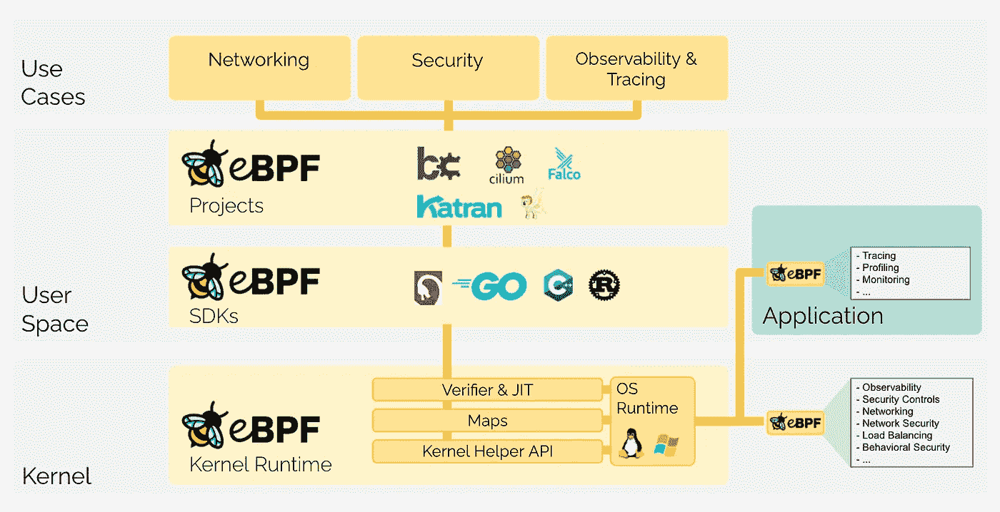
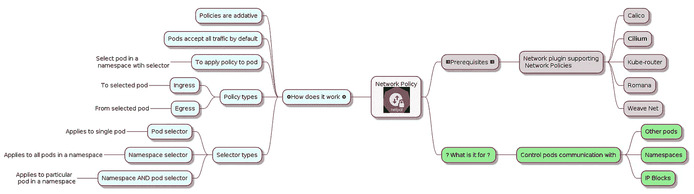

# 用纤毛增加 Kubernetes 网络安全性

> 原文：<https://itnext.io/increase-kubernetes-network-security-with-cilium-ba6af15c8f5f?source=collection_archive---------1----------------------->


由 [Unsplash](https://unsplash.com?utm_source=medium&utm_medium=referral) 上的 [Shubham Dhage](https://unsplash.com/@theshubhamdhage?utm_source=medium&utm_medium=referral) 拍摄的照片

## 微服务的承诺

使用微服务架构有两个主要好处。

1.  使分布式团队能够在分布式系统的各个部分独立工作，从而使[康威定律](https://en.wikipedia.org/wiki/Conway%27s_law)对我们有利。
2.  通过**将越来越多的横切关注点从应用程序代码转移到底层基础设施，降低分布式系统的复杂性。**

在一个面向服务器端工作负载的微服务架构成为主流模式、越来越多的计算在 Kubernetes 上运行的世界里，我们有机会真正实现微服务的技术和组织承诺。

本文将展示如何使用 Cilium 解决授权问题，并将其从应用程序代码推向底层平台。

如果您是使用 Kubernetes 的开发人员、Kubernetes 管理员或者只是想了解现代的云原生模式，您会发现这篇文章很有帮助。

## 纤毛是什么

Cilium 是一款开源软件，用于提供、保护和观察容器工作负载之间的网络连接——云原生，由革命性的内核技术 eBPF 提供支持。

来源:[https://cilium.io/](https://cilium.io/)

> *如果你想自己尝试一下 Cilium，可以去看看他们的优秀* [*互动教程*](https://play.instruqt.com/isovalent/tracks/cilium-getting-started)

## 什么是 eBPF

> *eBPF 是一项革命性的技术，起源于 Linux 内核，可以在操作系统内核中运行沙盒程序。它用于安全有效地扩展内核的功能，而无需更改内核源代码或加载内核模块。要了解更多关于 eBPF 的信息，请访问*[*eBPF 简介*](https://ebpf.io/what-is-ebpf/)

这里有一个[很棒的视频](https://www.youtube.com/watch?v=5t7-HM2jlTM&ab_channel=ContainerSolutions)，Liz Rice 详细解释了 eBPF。

下图显示了 eBPF 是如何在高层次上工作的



来源:[https://ebpf.io/what-is-ebpf/](https://ebpf.io/what-is-ebpf/)

## 用例:粒度授权控制

让我们设想一个场景，其中您的 REST API 由多个端点组成，公开与机票预订相关的资源。这个 REST API 被部署到一个托管的 K8s 集群，比如说 GKE (Google Kubernetes 引擎)，并且经常被集群中运行的其他微服务以及一些外部服务访问。

从安全的角度来看，你需要遵循零信任安全和最小特权的 T2 原则，为了实现这一点，你需要严格控制和验证对你的 API 的访问，只暴露那些调用服务所必需的端点。

Kubernetes 网络政策可以带我们走到一半。

# 网络策略

Kubernetes [网络策略](https://kubernetes.io/docs/concepts/services-networking/network-policies/)为集群中运行的 pod 定义网络流量规则。

> *我们将重点关注* [*纤毛*](https://cilium.io/) *并展示它如何提供增强的和更强大的策略*

下图显示了有关网络策略的更多信息。



来源:作者

但是，有一个问题。我们的航班预订服务公开了多个 REST 端点，而 Kubernetes 网络策略仅适用于 IP:PORT 组合。这意味着集群中运行的每个服务都可以访问所有端点，即使它不需要。**这显然违反了最小特权原则。**

## 网络策略得到改善

Cilium 通过引入[CRD](https://kubernetes.io/docs/tasks/extend-kubernetes/custom-resources/custom-resource-definitions/)*CiliumNetworkPolicy*解决了这个问题，它增加了缺失的功能，使我们能够有装饰性地创建规则来管理对我们的 API 的各个端点的访问。

> *顺便提一下，从架构的角度来看，同样的功能也可以通过 API 管理网关来实现，比如* [*孔*](https://konghq.com/kong/) *，但是这是一种不同的方法，只适用于 HTTP 服务，而 Cilium 是一种较低级别的解决方案，支持 Kafka、数据库等等。*

以下是一个示例 CiliumNetworkPolicy YAML 文件，该文件严格地只允许来自具有选定标签的 pod 的流量使用/flights 资源上的 GET 动词。

```
apiVersion: "cilium.io/v2"
kind: CiliumNetworkPolicy
metadata:
  name: "readflights"
spec:
  description: "Allow HTTP GET /flights from env=prod, app=flights_board to app=flights_service"
  endpointSelector:
    matchLabels:
      app: flights_service
  ingress:
  - fromEndpoints:
    - matchLabels:
        env: prod
        app: flights_board
    toPorts:
    - ports:
      - port: "80"
        protocol: TCP
      rules:
        http:
        - method: "GET"
          path: "/flights"
```

Cilium 还支持 [DNS 策略](https://docs.cilium.io/en/stable/policy/language/#dns-policy-and-ip-discovery)，例如，我们可以只允许来自负载平衡器地址或模式与外部托管的服务名称相匹配的外来流量。

## 有什么好处？

在 HTTP 层(第 7 层)设置规则可以将 API 的授权问题转移到 Kubernetes，而不是在应用程序本身中编码规则。这种方法的好处是:

*   独立于应用程序代码库开发更改授权规则的能力
*   将应用程序代码管道从规则管道中分离出来的可能性，使团队能够协作
*   能够在容器映像中部署同一 API 的另一个实例，但是具有不同的标签和规则，这可能取决于名称空间或不同的条件
*   标准化和集中控制的安全方面

# 演示场景

您可以在本地机器上不安装任何东西的情况下继续操作。该演示将展示如何使用 CiliumNetworkPolicy 来保护对我们的示例航班预订服务的访问。

## 先决条件

我们将在 Katacoda 上使用一个干净的 Ubuntu 20.04 实例，所以不需要在本地安装任何东西。

## #1 加速 Katacoda 环境

在 Katacoda 上激活 [Ubuntu 20.04 游乐场](https://www.katacoda.com/scenario-examples/courses/environment-usages/ubuntu-2004)并遵循以下步骤。

## #2 在 Ubuntu 实例上安装 k3s

我们将使用 Rancher 提供的名为 [k3s](https://k3s.io/) 的小型快速 Kubernetes 发行版。这将使我们能够快速构建新的 Kubernetes 集群，并继续下一步工作。

```
curl -sfL https://get.k3s.io | INSTALL_K3S_EXEC='--flannel-backend=none --disable-network-policy' sh -
```

将 KUBECONFIG 环境变量设置为指向 k3s 配置文件，这样我们就可以通过已经预安装在 Katacoda 环境中的`kubectl`与集群对话。

```
export KUBECONFIG=/etc/rancher/k3s/k3s.yaml
```

## #3 安装纤毛 CLI

> *如果你需要帮助安装纤毛，请参考他们的* [*优秀文档*](https://docs.cilium.io/en/stable/gettingstarted/k3s/) *。*

```
curl -L --remote-name-all https://github.com/cilium/cilium-cli/releases/latest/download/cilium-linux-amd64.tar.gz{,.sha256sum}
sha256sum --check cilium-linux-amd64.tar.gz.sha256sum
sudo tar xzvfC cilium-linux-amd64.tar.gz /usr/local/bin
rm cilium-linux-amd64.tar.gz{,.sha256sum}
```

## #4 在集群上安装纤毛

```
cilium install
```

Cilium 可能需要一段时间来激活，因此我们将使用此命令来等待 Cilium 完全启动。

```
cilium status --wait
```

## #5 部署样例 go API

让我们部署一个极简的 Go REST API，在这里我们可以轻松地测试 CiliumNetworkPolicy 的运行情况。

```
kubectl apply -f [https://raw.githubusercontent.com/Piotr1215/go-sample-api/master/k8s/deployment.yaml](https://raw.githubusercontent.com/Piotr1215/go-sample-api/master/k8s/deployment.yaml)
```

查看 Katacoda 终端的 API 开放端口 **31234**

该 API 有 3 个简单的 GET 端点

*   / returns "主页"
*   /version 返回“版本页”
*   /about 返回“关于页面”

## #6 检查服务连接

创建一个测试 [BusyBox](https://www.busybox.net/) pod 并检查 go-api 服务的连通性

```
kubectl run -it --rm debug \
        --image=radial/busyboxplus:curl \
        --restart=Never \
        -- curl -w "\n" [http://go-api-svc](http://go-api-svc)
```

让我们来分解这个命令:

*   `kubectl run` -开始一个新的 pod
*   `-it`标志确保我们可以与 pod 交互，并向内部运行的容器发送命令
*   `--rm`指示库伯内特公司在豆荚退出后立即将其移除
*   `curl -w "\n" http://go-api-svc`利用 Kubernetes DNS 和服务发现机制调用 go-api 服务

运行这个命令后，你应该看到`HOME Page`返回到终端。

## #7 应用网络策略

让我们应用只允许来自标签为 app:version_ready 的 pod 的流量到达 go-api pod 的端点的策略。

```
apiVersion: "cilium.io/v2"
kind: CiliumNetworkPolicy
metadata:
  name: "readflights"
spec:
  description: "Allow HTTP GET /version from app=version_reader to type=service"
  endpointSelector:
    matchLabels:
      type: service 
  ingress:
  - fromEndpoints:
    - matchLabels:
        app: version_reader
    toPorts:
    - ports:
      - port: "8080"
        protocol: TCP
      rules:
        http:
        - method: "GET"
          path: "/version"kubectl apply -f [https://raw.githubusercontent.com/Piotr1215/go-sample-api/master/k8s/cilium-policy.yaml](https://raw.githubusercontent.com/Piotr1215/go-sample-api/master/k8s/cilium-policy.yaml)
```

## #8 检查连接是否正常

如果我们的策略运行正常，我们应该不能再访问该服务了。

```
kubectl run -it --rm debug \
        --image=radial/busyboxplus:curl \
        --restart=Never \
        --timeout=15s \
        -- curl -w "\n" [http://go-api-svc](http://go-api-svc)
```

上述命令将导致超时。

> *如果您不想等待超时，您可以使用顶部的* `*+*` *图标创建一个新的终端会话。*

## #9 身份识别政策

为了向`/version`端点授予对 pod 的访问权，我们必须用`app=version_reader`对其进行适当的标记。这将启用身份识别策略，我们也可以使用 K8s 标签，而不是通过它们的 IP:PORT 组合来定位 pod。利用标签而不是 IP 可以很好地适应 Kubernetes 基础设施的短暂性。

```
kubectl run -it --rm debug2 \
        --image=radial/busyboxplus:curl \
        --labels app=version_reader \
        --restart=Never \
        -- curl -w "\n" [http://go-api-svc/version](http://go-api-svc/version)
```

这应该会打印出`VERSION Page`。让我们尝试从同一个 pod 访问`/about`端点。行得通吗？

```
kubectl run -it --rm debug2 \
        --image=radial/busyboxplus:curl \
        --labels app=version_reader \
        --timeout=15s \
        --restart=Never \
        -- curl -w "\n" [http://go-api-svc/about](http://go-api-svc/about)
```

# 结论

我们只是触及了纤毛功能的表面，但我相信专注于实际使用案例有助于我们学习使用纤毛的实际技能，而不是学习关于纤毛的知识。

云原生生态系统的当前趋势是在越来越多的场景中采用 eBPF。这项技术目前被谷歌、脸书、SUSE、AWS 和许多其他公司用作强大而灵活的底层解决方案，可以更好地解决现有的一系列挑战。

Cilium 弥合了低级 eBFP 原语和最终用户之间的抽象鸿沟，IMO 是最有前途的云原生项目之一。