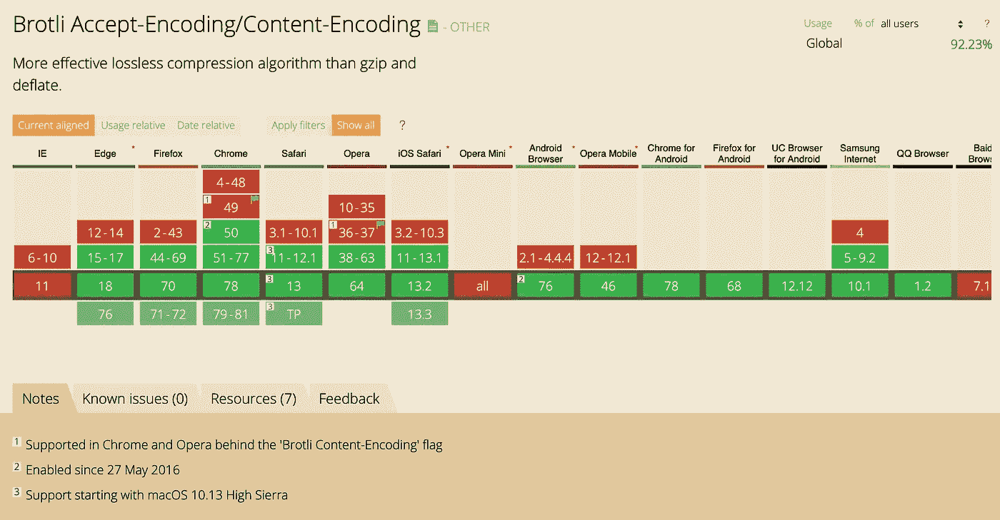

# 通过提供更小、更快的预压缩 Brotli 和 Gzipped 文件，提高 Node JS 服务器的性能

> 原文：<https://itnext.io/increase-node-js-server-performance-by-serving-smaller-faster-pre-compressed-brotli-gzipped-499c8da37f6c?source=collection_archive---------0----------------------->

## 使用一个简单的 NodeJS 脚本通过 Brotli & Gzip 压缩您的生产资产。为您的 JavaScript 应用程序提供(或不提供)Webpack 4 的后构建步骤。


图为:静止的服务器

## 谁不喜欢毫不费力的性能提升呢？

尤其是不需要 **10，000 行代码**和小时的**重构……**的性能提升更不用说 **9 杯咖啡**需要来识别那 10，000 行新代码中的哪一行导致你的应用程序**在你眼前燃烧**。

> 相信我，这是常有的事。

在我们进入代码之前，理解**为什么压缩是必要的**以及它能为你(和你的用户)做什么是很重要的。

# 为什么压缩你的文件？

随着一个应用程序的平均规模每年都在增长，压缩网络上的文件变得越来越重要。更大的应用捆绑包**需要浏览器**在解析源代码和资产方面做更多的工作，随着应用变得越来越复杂，浏览器需要更长的时间来为用户呈现内容。

通过提供压缩文件，您可以**减少向客户端(您用户的浏览器)的数据传输**，显著减少花费在**下载** & **处理**要显示的资源上的时间。压缩可以将资源的大小减少**到** [**72%**](https://www.thinkwithgoogle.com/marketing-resources/data-measurement/mobile-page-speed-new-industry-benchmarks/) 。

# 压缩在网络上的工作原理

超过 80%的网站使用压缩。几乎所有的现代**浏览器**和网络**服务器**，都支持 gzip。 **Chrome** 、 **Safari** 、 **Firefox** 、 **Edge** 都支持 Brotli，包括他们的移动同行，虽然**不是** Opera Mini。

> 然而，不支持 Brotli 的浏览器可以使用其他压缩算法。

 [## 我能用吗...HTML5、CSS3 等的支持表

### “我可以使用吗”提供了最新的浏览器支持表，以支持桌面和移动设备上的前端 web 技术…

caniuse.com](https://caniuse.com/#search=gzip) 

支持压缩的浏览器用 **Accept-Encoding HTTP 头**指定它期望的压缩标准，它使用这个头作为如何**解码**资源的指令。然后由服务器使用**内容编码 HTTP 头**来提供压缩资源。然后，浏览器**将内容解压缩为原始的未压缩版本**，然后在浏览器中呈现。

# 动态与静态压缩

您是使用**动态**还是**静态**压缩取决于您的需求。

## 动态的

动态压缩包括响应对资源的请求，按需压缩数据**。因此，对于经常变化或频繁修改的资源，它通常是首选。**动态。**例如，应用程序生成的资源**将被视为**动态**。****

****然而**，压缩是一项 CPU 密集型任务，每次压缩都会产生**性能成本**。可以指定压缩级别。例如，Gzip 的级别 1–9，级别 1 意味着**更快的压缩**，但是代价是它会导致**比级别 9 更大的文件大小**。因此，对于您的生产资产，**选择静态压缩可能是有利的，这就是我们将使用预压缩脚本**所做的事情。**

## **静态**

**静态压缩包括预先压缩每个文件**，并在请求原始文件时交付此**预压缩**版本。****

****例如，静态压缩的完美候选是在开发的**构建**阶段生成的文件和资产，例如 **JavaScript** 、 **CSS** 、 **HTML** 和**图像**。这将 **CPU 密集型**任务留给了负责**构建**生产资产的机器，不需要密集的服务器级处理。****

****由于压缩的**好处，静态压缩**减少了处理资源时浏览器和服务器之间的延迟**，此外**避免了按需压缩每个文件的速度损失**。******

## **什么是 Gzip(。gz)？**

**gzip 文件是一种压缩数据格式**的文件，是 gzip 实用程序的结果。****

> **Gzip 是一个单文件/流无损数据压缩实用程序，生成的压缩文件通常有[后缀。gz](https://www.gzip.org)**

## **什么是 Brotli(。br)？**

**Brotli 的压缩比可与目前最好的通用压缩方法相媲美。**

> **Brotli 是一种通用的无损压缩算法，它压缩带有后缀**的数据[。br](https://github.com/google/brotli)****

**[性能指标评测](https://certsimple.com/blog/nginx-brotli)展示了与 gzip 相当的优势。 **Javascript 文件通常比**小 14%， **HTML 文件通常比**小 21%，此外**CSS 文件的文件大小也减少了 17%。****

# **如何压缩资源(创建 compress.js)**

**我们将两者都生成**。br 和。gz 文件**以获得最广泛的兼容性，因为并非所有浏览器都支持 Brotli。我们将创建一个可以用作**后期构建**步骤的 **NodeJS 脚本**。**

## **属国**

**我们将依靠`brotli`和`zlib`来处理压缩。我们还将使用**内置的** `fs`模块来处理文件，并确定**哪些文件**需要压缩。**

**[](https://www.npmjs.com/package/zlib) [## zlib

### node-zlib——node . js 缓冲区的简单同步放气/充气。使用 npm 安装 zlib。var Buffer =…

www.npmjs.com](https://www.npmjs.com/package/zlib) [](https://www.npmjs.com/package/brotli) [## 布罗特利

### Brotli.js 是 Brotli 压缩算法(用于 WOFF2 字体格式)到 JavaScript 的端口。的…

www.npmjs.com](https://www.npmjs.com/package/brotli) 

## 首先，我们需要从节点包管理器安装依赖项

```
**$** npm install zlib brotli --save-dev
```

这将把依赖项作为开发依赖项添加到我们的`package.json`中。

## 接下来，我们创建新的 JavaScript 文件。

让我们称我们的剧本为`compress.js`。

所以…

```
**$** touch compress.js
```

或者使用 GUI 来创建文件。

# 内部压缩. js

## 导入依赖项

首先，我们需要在文件的顶部导入依赖项。

属国

## 压缩配置

我们还需要为 brotli 指定**配置。我们将使用**级别 10** 来实现这些目的，因为我们需要更高的压缩率，我们并不太关心压缩所花费的时间，因为这是一个构建步骤，将在本地**运行**。**

如果你对**比较压缩/解压缩速度**感兴趣，考虑到不同的压缩级别，那么你可以看看下面的**挤压压缩基准**。

 [## 挤压压缩基准

### 好吧，好吧，我是在发布网址之前写这篇文章的，所以与其说是“常见问题”，不如说是“我认为…

quixdb.github.io](https://quixdb.github.io/squash-benchmark/#results-table) 

布罗特利构型

> 出于这些目的，我们将让 zlib (gzip)配置为空，它默认使用**级别 6**(可能值为 1–9)。

## 指定要包含的目录

让我们指定需要压缩的目录。

指定要包含的目录

我们需要遍历每个目录和文件。我们使用`forEach`和`fs.readdirSync`来获得一个文件数组。

遍历目录

我们还需要一种方法来检查文件是否适合压缩。我们可以通过检查扩展来做到这一点，看看它是否是一个 **HTML(。html)、** **CSS(。css)或 JS(。js)文件**。我们可以使用字符串方法`endsWith`来检查字符串的结尾。

遍历目录时检查文件扩展名

## 现在压缩

对于每个符合上述`endsWith`检查的文件，我们用 **Brotli** 压缩，将 config 对象作为参数传递。我们阅读了通过`fs.readFileSync`传给 Brotli 的文件。然后我们写出结果。br 文件到相同的名称+的。br 分机。

对于 **zlib** (gzip)，我们需要创建一个`readStream`和一个`writeStream`，因为我们 [**用来自`zlib`模块的返回值`createGzip()`来管道`readStream`的内容，其中`pipe`为我们处理流。然后，我们使用产生的流通过。gz 扩展。**](https://www.sitepoint.com/basics-node-js-streams/)

在这个例子中，我们**通过对控制台的‘error’事件回调打印错误**，但是如果你愿意，你可以用不同的方式处理它们。

主压缩代码

你可以在下面看到完整的脚本…

完整 compress.js 文件

## 执行文件

这就像在你的 npm 项目脚本中添加`node compress.js`作为**构建步骤一样简单。**

```
"scripts": { "compress": "node compress.js"...
```

然后您可以使用`**$** npm run compress`执行脚本🚀。

让我们看看`main.js`(我拥有的一个生产构建文件)的结果，以确定最终的文件大小。咱们`**$** du -h ./server/main.js`吧。


原始文件


gzipped 文件


布罗特利的档案

如您所见，这是一笔**巨大的节省。**特别是与 **Brotli** 。压缩后的资源减少了 85%!

# 使用 Webpack

用 Webpack 创建同样的效果就像包含插件`compression-webpack-plugin`和`brotli-webpack-plugin`一样简单。

## 将依赖项作为开发依赖项安装。

```
**$** npm i compression-webpack-plugin brotli-webpack-plugin --save-dev
```

[](https://www.npmjs.com/package/compression-webpack-plugin) [## 压缩-web pack-插件

### 准备资产的压缩版本，通过内容编码为它们服务。该模块最少需要节点…

www.npmjs.com](https://www.npmjs.com/package/compression-webpack-plugin) [](https://www.npmjs.com/package/brotli-webpack-plugin) [## brot Li-web pack-插件

### 此插件使用 Brotli 压缩算法压缩资源，使用 zlib、iltorb 或 brotli.js 库提供…

www.npmjs.com](https://www.npmjs.com/package/brotli-webpack-plugin) 

这将使我们能够将插件包含到我们的`webpack.config.js`文件中。

## Webpack 配置

要注意的价值观是…

**阈值**

*   仅处理大于此大小的资产。以字节表示

**测试**

*   指定要包含的扩展名(通过正则表达式测试)。

**最小比率**

*   仅处理压缩率高于此比率的资产。

**级别**

*   指定压缩级别。

我们还没有指定压缩级别，因此我们将使用默认的进行演示。

这里是一个使用压缩插件的 Angular 项目的示例`webpack.config.js`文件，以查看它在**完整上下文**中的用法。

完整的 webpack.config.js

## 就是这样！

快速轻松地提升应用性能，改善用户体验。

# 一些有用的资源

[](https://www.opencpu.org/posts/brotli-benchmarks/) [## 压缩基准:brotli、gzip、xz、bz2

### 2015 年 11 月 27 日 Brotli 是一种新的压缩算法，针对 web 进行了优化，尤其是小型文本文档…

www.opencpu.org](https://www.opencpu.org/posts/brotli-benchmarks/) [](https://github.com/google/brotli) [## 谷歌/brotli

### Brotli 压缩格式。在 GitHub 上创建一个帐户，为 google/brotli 的发展做出贡献。

github.com](https://github.com/google/brotli) [](https://tools.keycdn.com/brotli-test) [## Brotli 测试-验证 Brotli 压缩支持| KeyCDN 工具

### 测试服务器是否支持 Brotli 压缩。Brotli 算法是 Gzip 的后继者，它允许更好的…

tools.keycdn.com](https://tools.keycdn.com/brotli-test) [](https://blog.cloudflare.com/results-experimenting-brotli/) [## Brotli 用于动态 web 内容的试验结果

### 压缩是 CloudFlare 提升网站性能的最重要工具之一。压缩内容…

blog.cloudflare.com](https://blog.cloudflare.com/results-experimenting-brotli/) 

## 如果您有任何问题，或任何与这里讨论的任何内容相关的问题，请随时评论或留言，我会尽全力帮助您！**