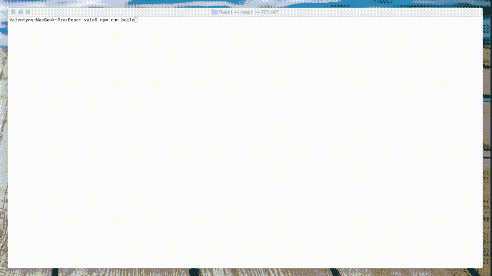
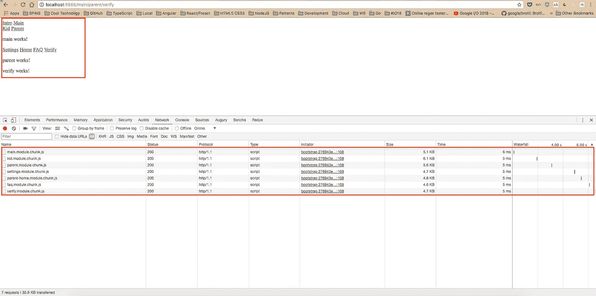

# 使用 Guess.js 提高 Angular、React 和 Gatsby 应用程序的性能

> 原文：<https://itnext.io/increase-performance-of-your-angular-react-and-gatsby-apps-with-guess-js-2214d4be0871?source=collection_archive---------6----------------------->

提高 **Angular、React** 和 **Gatsby** 应用程序的性能始终是一个重要的问题，尤其是如果你有非常复杂的应用程序或网站。

[**Guess.js**](https://github.com/guess-js/guess) 对 Webpack 使用**数据驱动捆绑**，对非 Webpack 使用**数据驱动加载**，这是一个新的令人兴奋的优化解决方案。它仍处于 **alpha** 阶段，但我希望一旦它稳定下来，它将成为庞大复杂的应用程序和网站的重要组成部分。

# 关于 Guess.js

js 提供了库和工具来简化预测数据分析驱动的方法，以改善用户的网络体验。这些数据可以来自任何数量的来源，包括分析或机器学习模型。Guess.js 旨在降低消费的摩擦，并将这种思维应用于所有现代网站和应用程序，包括为流行的工作流构建库和工具。

将预测性数据分析思想应用于网站可以应用于以下情况:

*   **预测下一页(或多页)**用户可能会访问并预取这些页面，从而提高感知的页面加载性能和用户满意度。
*   **预测下一条内容**(文章、产品、视频)用户可能想要查看并调整或过滤用户体验以解决这一问题。
*   **预测单个用户可能会与之进行更多互动的微件类型**(例如游戏)，并使用这些数据定制更加定制化的体验。

# 主要思想

主要想法是**通过内容的预测预取提高网页性能**。

通过建立用户可能访问的页面模型，给定一个任意的入口页面，解决方案可以计算用户访问给定的下一个页面或一组页面的可能性，并在用户仍在查看其当前页面时为其预取资源。这有可能提高后续页面访问的页面加载性能，因为页面很有可能已经在用户的缓存中。

# 如何使用

*   在您的 **React** 或 **Angular** 应用程序中安装 **Guess.js Webpack** 插件:

*   如果你正在使用 **Gatsby** 你需要安装`gatsby-plugin-guess-js`插件:

*   安装完成后，我们需要配置我们的**项目**。

**Angular:** 要在 Angular CLI 应用中配置 Angular webpack 配置文件，您需要**弹出**您的 Angular 应用`$ ng eject`。一旦文件被弹出，进入`config`目录并配置`webpack.config.js`

*注意:如果您正在使用 Angular CLI 版本 6，您可能需要降级到版本 1.7，因为目前 Angular CLI 不允许弹出。*

**React:** 如果你正在使用 **create-react-app** 你需要**弹出**你 **React App** `$ npm run eject`。一旦文件被弹出，进入`config`目录并配置`webpack.config.prod.js`

*   如果你正在使用 **Gatsby** 你需要配置`gatsby-config.js`插件:

[**高级配置选项**](https://github.com/guess-js/guess/tree/master/packages/webpack#advanced-usage) ，可以在`GuessPlugin`中配置。

*   完成配置后，我们需要构建我们的应用程序。当构建运行时，您需要使用您的 Google 帐户授权 **Guess.js** ，并提供对 Google Analytics 数据的访问。授予对 **Google Analytics** 的访问权限后，`GuessPlugin`将从 **Google Analytics** 获得一份报告，构建一个用于预测性预取的模型，并将一个小型运行时添加到您的应用程序的主捆绑包中。

构建完成！在路由更改时，运行时将查询生成的模型，查找接下来可能要访问的页面，并预取与它们相关联的 JavaScript 包。

app[https://github.com/mgechev/guess-js-angular-demo](https://github.com/mgechev/guess-js-angular-demo)的例子

# 民众

[**React 演示**](https://github.com/mgechev/guess-js-react-demo) -使用`GuessPlugin`和`create-react-app`的演示应用

[**盖茨比演示**](https://github.com/guess-js/gatsby-guess)——演示项目中使用`[gatsby-plugin-guess-js](http://gatsbyjs.org/packages/gatsby-plugin-guess-js/)`的应用。

[**角度演示**](https://github.com/mgechev/guess-js-angular-demo) -使用`GuessPlugin`和角度 CLI 的演示应用。

非常感谢由 [Minko Gechev](https://twitter.com/mgechev) 和 [Kyle Mathews](https://twitter.com/kylemathews?ref_src=twsrc%5Egoogle%7Ctwcamp%5Eserp%7Ctwgr%5Eauthor) 提供的演示！

# 结论

感谢 **Guess.js 团队**这个优秀的工具。Guess.js 是 Web 开发中一个新的革命性的步骤。我希望这篇文章能帮助你调查 **Guess.js** 并开始在你的项目中使用它。

更多详细信息，请查看[官方知识库](https://github.com/guess-js/guess)。

# 参考

 [## guess-js/guess

### guess - Libraries &在 web 上实现数据驱动的用户体验的工具

github.com](https://github.com/guess-js/guess)  [## 介绍 guess . js——一个在 Web 上实现数据驱动用户体验的工具包

### 大约两个月前，我发表了我对数据驱动捆绑的初步研究。几周后，我有了…

blog.mgechev.com](https://blog.mgechev.com/2018/05/09/introducing-guess-js-data-driven-user-experiences-web/)  [## 机器学习驱动的捆绑。JavaScript 工具的未来。

### 在本文中，我将介绍一些工具的早期实现，这些工具基于机器…

blog.mgechev.com](https://blog.mgechev.com/2018/03/18/machine-learning-data-driven-bundling-webpack-javascript-markov-chain-angular-react/)