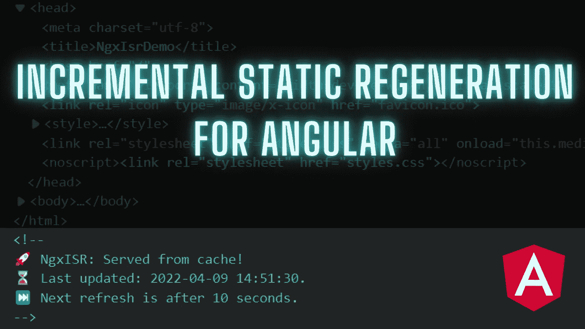
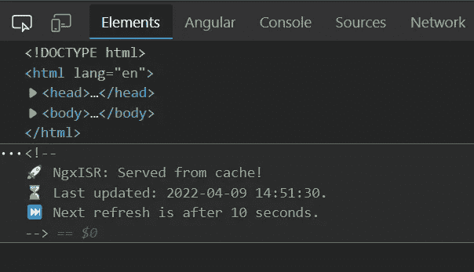

# 角度的增量静态再生

> 原文：<https://itnext.io/incremental-static-regeneration-for-angular-42b0a8440e53?source=collection_archive---------0----------------------->



如果你正在阅读这篇文章，你可能听说过 **SSR** (服务器端渲染)**(静态站点生成)和 **CSR** (客户端渲染)。**

**它们的简要概述如下:**

*   ****SSR** :使用服务器端呈现，每次页面被请求时都会被服务器呈现(可能会进行 api 调用)，然后提供给客户端。**
*   ****SSG** :使用静态站点生成，页面的呈现将在构建时完成，当页面被请求时，客户端将得到为该路径生成的静态文件。**
*   ****CSR** :使用客户端呈现，页面的呈现(以及该页面所需的 api 调用)将在运行时发生(在客户端设备上)。**

# **什么是 **ISR** ，它能解决什么问题？**

**我们以一个电子商务网站为例。这个电子商务网站有数以千计的客户和数以千计的产品，每个产品都有一个详细信息页面。**

**因为这是一个电子商务网站，它应该是服务器端呈现的(可能使用 Angular Universal ),以便爬虫读取 SEO 所需的内容。**

**现在，每次对产品详细信息页面发出直接请求时，服务器都必须进行 api 调用以从后端获取数据，然后呈现 HTML，然后将页面提供给客户端。**

**每当客户端打开该页面时，都会发生这一过程。**

**现在想象成千上万的用户同时打开产品页面。服务器可能会崩溃，我们需要增加服务器资源(也包括后端服务器资源)。**

**服务器需要为所有客户机做同样的工作，以便为它们提供相同的页面。**

## **迄今为止，SSG 提供了哪些帮助？**

**使用静态站点生成，我们在构建时生成每个产品详细信息页面，只提取一次数据，并向用户提供静态文件。**

**假设这在运行时对服务器资源帮助很大，因为我们只提供静态文件，仅此而已。**

**这很好，直到我们需要改变产品的细节，并从头开始做所有的工作。构建站点，生成所有页面，然后再次部署。这一切只是为了改变一个产品的价格。想象一下，每 1 小时改变 100 个产品价格。我们需要进行多少次构建、生成和部署？**

## **这就是 ISR 发挥作用的地方！**

**ISR 将 SSR 和 SSG 的意识形态合二为一。**

**通过 ISR，我们可以在页面第一次被请求时在服务器上呈现页面，将其保存在缓存中，并将缓存的页面提供给请求该页面的所有其他用户。**

**对于缓存刷新，我们使用时间间隔或按需再生。**

> **ISR 就像 SSG，但在运行时！**

# **一切都好吗？让我们按角度来做！**

**首先，我们需要一个应用程序来安装和配置 Angular Universal。**

**然后，我们安装 [ngx-isr](https://www.npmjs.com/package/ngx-isr) 包。**

****ngx-isr** 通过一个易于使用且可扩展的 API(受 Next.js 启发)帮助您管理所有 isr 事务。**

**`npm install ngx-isr`**

**我们安装好之后，需要做一些小的配置。**

*   **在`server.ts`中创建一个 **ISRHandler** 实例。**

```
*import* { ISRHandler } *from* 'ngx-isr';const isr = new ISRHandler({
  indexHtml, // <-- Is the path to the index.html
  invalidateSecretToken: 'MY_TOKEN', // replace with env secret key
  enableLogging: !environment.production
});
```

*   **用 ISR 渲染替换角度默认服务器端渲染。**

**替换这个:**

```
server.get('*',
  (req, res) => {
    res.render(indexHtml, { req, providers: [{ provide: APP_BASE_HREF, useValue: req.baseUrl }] });
  }
);
```

**有了这段代码:**

```
server.get('*',
  // Serve page if it exists in cache
  async (req, res, next) => await isr.serveFromCache(req, res, next),
  // Server side render the page and add to cache if needed
  async (req, res, next) => await isr.render(req, res, next),
);
```

> **注意:默认情况下，ISRHandler 提供了`APP_BASE_HREF`。如果您想将`providers`传递给 ISRHandler 的方法，您还必须提供`APP_BASE_HREF`令牌。**

*   **添加无效 URL 处理程序**

```
server.get(
  "/api/invalidate", 
  async (req, res) => await isr.invalidate(req, res)
);
```

*   **在 AppServerModule 导入中添加`NgxIsrModule`**

```
import { NgxIsrModule } from 'ngx-isr'; // <-- Import module

@NgModule({
  imports: [
    ...
    NgxIsrModule  // <-- Use it in module imports
  ]
})
export class AppServerModule {}
```

> **当导入模块时，`NgxIsrService`将被初始化并开始监听路由变化，只在服务器端，所以浏览器包不会包含任何额外的代码。**

****原来如此！****

## **怎么用？**

**在路线数据中添加`revalidate`键即可。**

```
{
  path: "example",
  component: ExampleComponent,
  data: { revalidate: 5 }
}
```

> **注意:ISR 不会处理数据中没有**重新验证键**的路线。它们将退回到角度默认的服务器端渲染管道。**

**要重新生成页面，我们需要向/revalidate 发出 get 请求。像这样:**

```
GET /api/invalidate?secret=MY_TOKEN&urlToInvalidate=/example
```

## **它是如何工作的？**

**通过使用路线数据中的“重新验证”键，我们定义了 ISR 处理器将使用的时间间隔
，以了解何时重新生成特定路线。

选项:**

*   ****不要指定任何东西**:路线不会被缓存，总是由服务器渲染。(比如 SSR)**
*   **第一次发球将由服务器提供，其他所有发球将由缓存提供。(比如 SSG)。**
*   ****大于 0** (例如:5):第一次服务将由服务器提供，并且每 5 秒重新生成一次缓存(在最后一次请求之后)。**

****高级例子****

```
*const* routes: *Routes* = [
  {
    path: "one",
    component: PageOneComponent,
  },
  {
    path: "two",
    component: PageTwoComponent,
    data: { revalidate: 5 },
  },
  {
    path: "three",
    component: PageThreeComponent,
    data: { revalidate: 0 },
  }
];
```

*   **路径“one ”:它不会被缓存，在提供给用户之前将始终由服务器呈现。**
*   **路径“two ”:第一个请求将由服务器呈现，然后将被缓存。在第二次请求时，将从第一次请求时保存的缓存中提供服务。该 URL 将被添加到重新生成队列中，以便在“5”秒后重新生成缓存。在第三次请求时，如果重新生成成功完成，将向用户提供重新生成的页面，否则，将向他们提供旧的缓存页面。**
*   **路径“三”:第一个请求将由服务器呈现，然后将被缓存。在第一个请求之后，所有其他请求都将从缓存中得到服务。因此，缓存永远不会自动刷新。刷新缓存的唯一方法是请求 API 路由/使其无效。**

## **结果**

**服务页面:`npm run dev:ssr`。**

**打开检查元件。**

**并根据您提供的重新验证密钥检查**最后更新的**时间和日期的变化。**

****

****ISR 问题？****

**每次我们更改源代码，我们都必须再次进行构建和部署。ISR 只在来自后端的数据发生变化时提供帮助(这没关系)。**

****原来如此！感谢阅读这篇长文！****

**如果你喜欢它，请竖起大拇指，给 Github 库[一个⭐。](https://github.com/eneajaho/ngx-isr)**