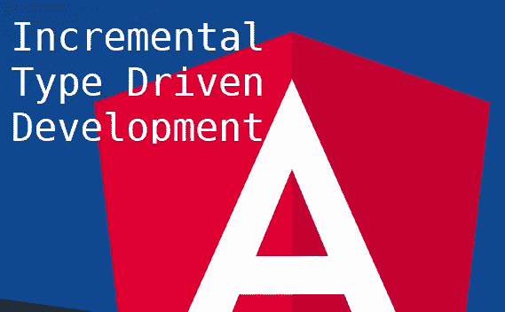
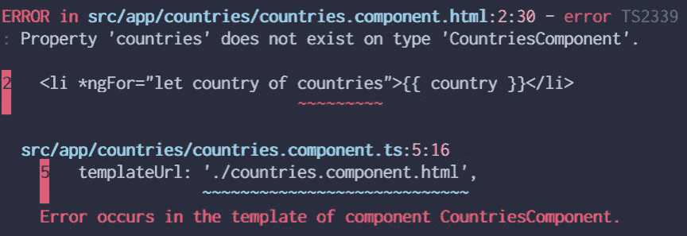
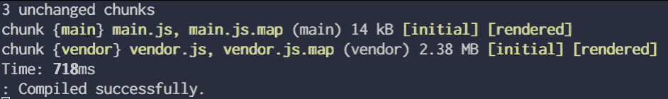
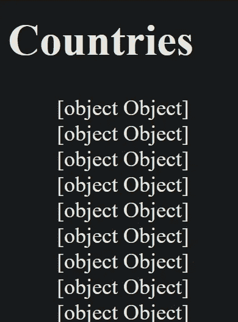
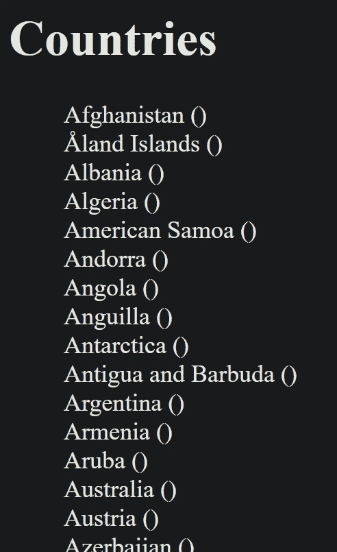
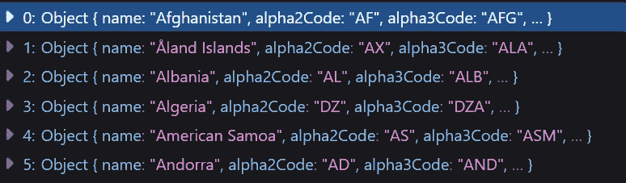
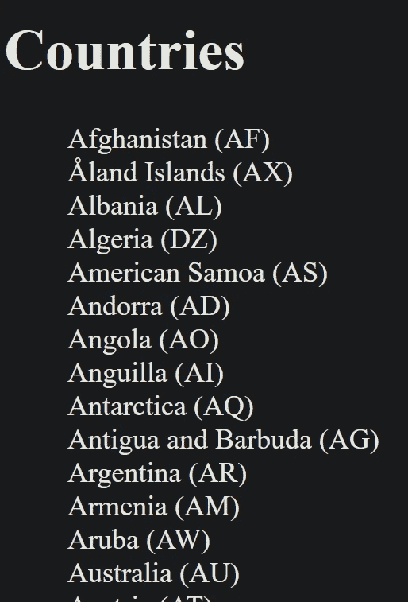
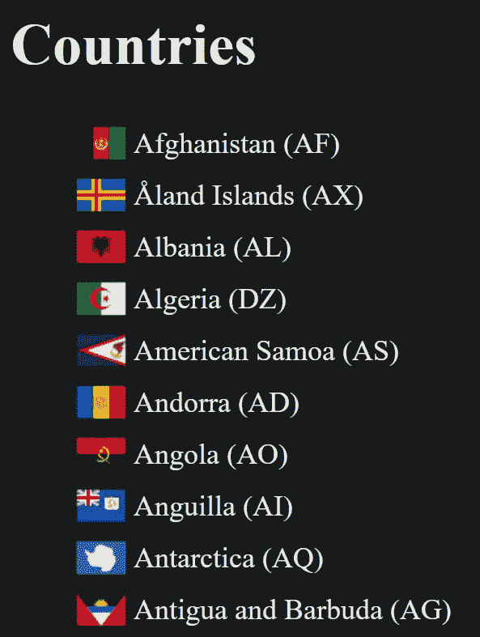

# 增量式驱动开发

> 原文：<https://itnext.io/incremental-type-driven-development-in-angular-2dfd8f062551?source=collection_archive---------2----------------------->



所有的软件工程师在日常工作中都依赖于两件重要的事情。

> 一门**编程语言**和大量**数据！**

例如，前端开发人员依赖于网络语言，即 JavaScript *(当然还有 Html)*。他们用它来**获取**、**转换**、**发送**来自任何来源或目的地的不同种类的数据。然而，为了有效地操作数据，开发人员依赖于类型系统，例如我们在 Typescript 语言中发现的类型系统。

# 使用类型化数据模型编程

我们都知道在代码和数据中有一个合适的结构是多么的重要，因此，我们将会看到一个非常有用的，但是有点非传统的，为产品开发新特性的方法

> 向后思考基本模型结构！

## 用例

让我们决定这个项目的目标。我们将构建一个 web 应用程序，显示国家及其国旗列表。

## 技术

我们将使用 [Angular](https://angular.io/) 和 2 个外部 API:

*   [restcountries.eu](http://restcountries.eu/)
*   [countryflags.io](https://www.countryflags.io/)

## 指导方针

让我们也使用 3 条规则，让我们朝着正确的方向前进:

1.  你许了什么愿？
2.  假装直到你成功。
3.  之后移除硬编码。

所以让我们继续…

## 起步

最初创建新的角度项目

```
ng new ng-itdd
```

## 第一步

然后，创建一个名为“Countries”的新组件

```
ng g c Countries
```

并在我们的应用中使用它

## 第二步

现在让我们记住我们的第一条规则:

> 你许了什么愿？

回答:

> 国家列表！

这就是我们将要做的，即画出一个国家的名单。

让我们更新我们的观点，即 countries.component.html

这才是有趣的地方！

看一下 console.log 错误



角度 Cli 误差

精彩！😁顺便说一句，当你决定那样工作时，你会看到很多这样的错误。

## 第三步

记住第二条规则:

> 假装直到你成功！

因此，让我们创建一个国家对象，并假设它以某种方式提供；)

我们给自己一个要显示的对象，即*国家*，并给它分配一个类型。**国**式是故意*留空*的，因为这是主旨。一旦我们发现我们实际上用它做什么和什么时候做，我们将用更多的属性填充它。

顺便说一句…没有错误！



编译成功

很好！

## 第四步

现在让我们“假装”一下，即通过 AppComponent 将它提供给 CountriesComponent

## 第五步

现在，记住第三条规则:

> 去掉硬编码！

为此，我们需要从某个地方检索国家列表。让我们使用 Angular 的 http 客户端，通过应用最佳实践，连接到远程 REST api。

这里发生了很多事情:

*   App 组件现在通过一个可注入的
*   CountriesService injectable 通过 REST api 异步提供列表

是啊。但是最终的结果并不是我们所期望的



# 🤔…

> 出问题了！

## 第六步

啊哈！💡我拿到了。

现在让我们从头开始…规则一！

> 我想要一个国家的列表，特别是一个带有代码的国家名称列表！

所以你去那里…

你知道这是怎么回事了。我们从最终结果开始，然后我们往回走，即创建我们的模型，定义它们的类型，然后我们伪造结果，直到我们找到获得它的方法。

就是这个想法！

现在看看我们得到了什么结果



这是什么()？

## 第七步

看起来 *county.code* 没有显示任何内容。

让我们看看 api 给了我们什么:



啊！我们有一个*名字*，但是我们有 *alpha2Code* 而不是 Code。而我们现在能做什么来解决这个问题。

答案是:

> 地图绘制者！

主要思想是创建一个期望的视图模型。然后，必须创建一个从原始模型到视图模型的映射器，在对提供者进行一些修改之后，结果是



完美！

## 第八步

现在，通过一次又一次地应用这 3 条规则重复同样的过程，我们最终使用了另一个提供美国国旗的 api，因此…

## 决赛成绩



有国旗的国家

# 最后的想法

从你想去的地方(特性)开始，通过更新模型，更新它的类型，并适当地调整代码库。实现最终目标的一种经过验证的有效且安全的方法，加上类型安全，以及适当的工具(cli、IDE intellisense ),我们开发人员可以确定最终产品的结果。

注意:项目的源代码可以在这里找到[。](https://github.com/margaris23/ng-itdd)

*感谢*[*Dillon Kearns*](https://www.youtube.com/watch?v=mrwn2HuWUiA)*对 Elm 中增量式驱动开发的见解*