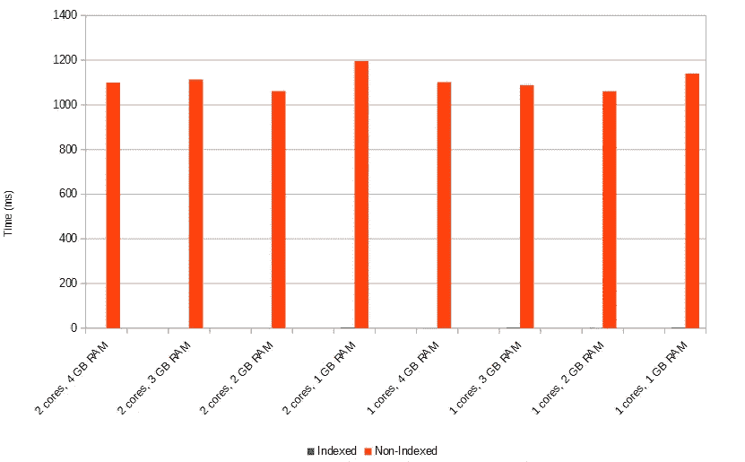

# 索引和 MongoDB 查询性能

> 原文：<https://itnext.io/indexing-and-mongodb-query-performance-a8a6a64c4308?source=collection_archive---------1----------------------->

这篇短文将研究在各种(虚拟)服务器硬件配置下，针对索引和非索引集合的 MongoDB 查询的性能。我们将研究通过索引可能获得的性能提升，并简要讨论它们的含义。这并不意味着对索引或 MongoDB 主题的明确处理。您的里程可能会有所不同。

我们几乎所有的时间都将在 mongo shell 中度过。本文假设读者已经在本地安装了 MongoDB，并且对 MongoDB 和 mongo shell 命令有基本的了解。mongo shell 是一个 JavaScript 环境；我们将在下面的例子中使用基本的 JavaScript。

要很好地介绍 MongoDB，请参考 Jim Medlock 的文章。

## 指数

[MongoDB 索引](https://docs.mongodb.com/manual/indexes/)是在集合级别定义的，可以在集合文档中的任何字段(或字段组合)上创建。默认情况下，MongoDB 在`_id`字段上创建一个索引。我们可以创建额外的索引来支持应用程序的访问模式。这仅仅意味着我们应该为通常包含在查询中的字段创建索引。[参见此处](https://docs.mongodb.com/manual/applications/indexes/)了解更多关于索引策略的信息。

## 设置

我们需要一个数据库。在 mongo shell 中，`use`命令创建(或切换到)一个指定的数据库。我们称我们的为`indexingdemo`:

`use indexingdemo`

现在我们需要一些文件。我们将在 mongo shell 中使用 JavaScript 来生成一个包含 300 万个文档的数组。然后，我们可以将数组批量插入数据库。我们的收集将包括递增的学生 id 和随机测验，考试和家庭作业的分数。

我使用一个嵌套的`for`循环来填充一个`docs`数组；1 百万次外部迭代* 3 次内部迭代=总共 3 百万个文档:

```
var docs = [];
for (var i = 0; i < 1000000; i++) {
  var types = ["quiz", "exam", "homework"];
  for (var j = 0; j < 3; j++) {
    docs.push({
      student : i,
      type    : types[j],
      score   : Math.round(Math.random()*100)
    });
  }
}
```


生成 300 万个文档…

然后`insert`将文档数组放入`scores`集合(将动态创建):

```
db.scores.insert(docs)
```

这可能需要几分钟的时间，取决于您的硬件速度。完成后，MongoDB 将返回一个`BulkWriteResult`。`nInserted`属性应该等于 3000000:


…以及插入结果。

我们现在可以查询我们的数据库。例如，我们可能想要查看某个学生的所有分数:

```
db.scores.find({ student: 585534 }).pretty()
```


锁住。格式化结果的 pretty()方法。

我们的查询返回 3 个文档——分别对应学生的`quiz`、`exam`和`homework`分数。

在创建我们的索引之前，让我们获得一个性能基线。我们可以将`.explain()`方法链接到查询的末尾，传入`"executionStats"`以返回详细的性能信息:

```
db.scores.find({ student: 585534 }).explain("executionStats")
```

这产生了大量的输出。向上滚动一点找到属性`executionTimeMillis`。在比较测试运行时，我们将使用这个执行时间。


执行时间:大约 1 秒

现在让我们创建我们的索引。假设查询通常包括`student`和`type`字段。我们将在`student`和`type`上创建一个[复合索引](https://docs.mongodb.com/manual/core/index-compound/)。这将支持仅针对`student`或`student`和`type`的高效查询。

```
db.scores.createIndex({ student: 1, type: 1 })
```


创建复合索引

注意`"numIndexesBefore" : 1`——之前的索引是 MongoDB 为`ObjectId`自动创建的。

现在让我们重新运行测试查询:

```
db.scores.find({ student: 585534 }).explain("executionStats")
```

您应该注意到查询*感觉*更快了——它应该几乎瞬间完成。因为——哈哈！—确实如此:


是的——零毫秒

现在，`executionTimeMillis`0 毫秒并不意味着*零*时间。如果我多次重新运行该查询，我偶尔会看到一些非零结果。无论哪种方式，索引查询都是*快*。

以上结果是在 VirtualBox 虚拟机中获得的。Windows 7 Pro x64 主机操作系统+ Ubuntu 16.04 来宾操作系统，使用 2 个 CPU 内核(英特尔酷睿 i5–3470)和 4GB 内存。以今天的标准来看不是精英硬件。

## 缩放比例

由于这是一台虚拟机，并且我可以控制系统资源，因此我可以通过调整虚拟机的设置来检查性能如何跨各种(虚拟)硬件配置进行扩展。在 VirtualBox 中，这就像移动滑块一样简单。我们来玩玩 CPU 核数和 RAM。



什么缩放？

每个配置的索引结果(蓝色)位于每个非索引结果(橙色)的左侧，不容易看到！图表中的每个条形代表以下每种 CPU/RAM 组合的 5 次运行的平均值:

```
 Indexed avg     Non-Indexed avg
--------------------------------------------------------
2 cores, 4 GB RAM         0 ms             1100 ms
2 cores, 3 GB RAM         0 ms             1113 ms
2 cores, 2 GB RAM         0 ms             1062 ms
2 cores, 1 GB RAM         2 ms             1196 ms1 cores, 4 GB RAM         1 ms             1102 ms
1 cores, 3 GB RAM         2 ms             1088 ms
1 cores, 2 GB RAM         1 ms             1061 ms
1 cores, 1 GB RAM         2 ms             1140 ms
```

这是怎么回事？首先，我们可以概括出，我们的示例查询的性能不受 CPU 内核数量或系统 RAM ≥ 1GB 的限制。在所有配置中，索引查询在*零点*的 1–2 毫秒内执行，非索引查询在 1 秒多一点的时间内完成。

## 为什么？

没有索引，MongoDB 必须执行完整的集合扫描，这意味着访问磁盘。我的主机系统有一个重要的 MX100 SATA3 固态硬盘。我怀疑非索引结果受到了磁盘 I/O 的限制。为了测试这一点，我创建了一个 150 万文档的集合(原始大小的一半),并重新运行了查询。除了上面使用的最小/最大配置之外，我没有测试虚拟机配置。以下结果是 5 次运行的平均值:

```
 Indexed avg      Non-Indexed avg
--------------------------------------------------------
2 cores, 4 GB RAM         0 ms              **497 ms**
1 cores, 1 GB RAM         1 ms              **552 ms**
```

针对 150 万个文档集合的非索引查询大约在半秒钟内执行。与 300 万文档集合相比:一半的文档=一半的时间。这支持了我的假设 re:在磁盘 I/O 受限的环境中进行完全收集扫描。

但是索引查询缺乏伸缩性怎么办？回想一下，不管硬件配置如何，我们的结果基本上都是 0 毫秒。要回答这个问题，我们先来看看指数的大小:

```
db.scores.totalIndexSize()
```


索引大小(字节)

我们的索引是 85，639，168 字节(81.67 MB)。为了获得最佳性能，[索引应该适合可用的 RAM](https://docs.mongodb.com/manual/tutorial/ensure-indexes-fit-ram/) 。即使只有 1 GB 的系统内存，也有足够的内存来保存我们的索引。

## 结论

主要的收获是显而易见的:**创建索引来支持您的查询**——好处是难以置信的！否则，查询需要完全收集扫描，这受到服务器的磁盘子系统 I/O 的限制。服务器 CPU 和 RAM 资源比预期的要少。对于那些使用像数字海洋和 OVH 这样的 VPS 主机提供商的廉价产品的人来说，这是令人鼓舞的。