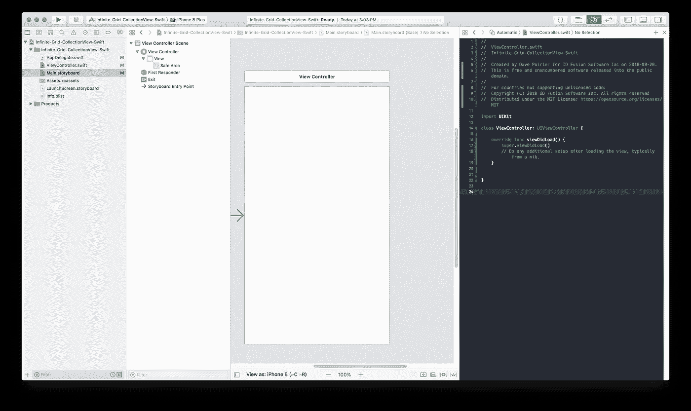
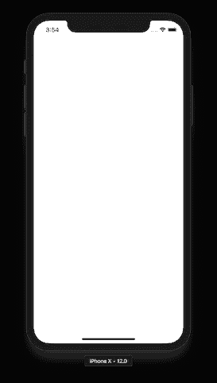
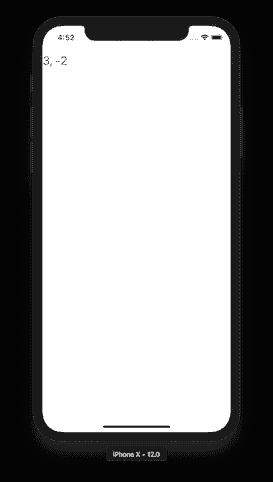
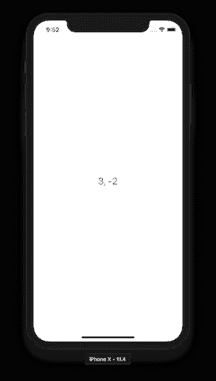
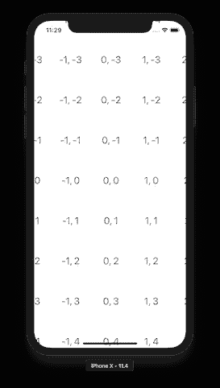
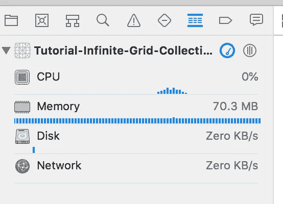

# 在 iOS 上创建无限网格—使用 UICollectionView

> 原文：<https://itnext.io/infinite-grid-using-uicollectionview-155801e4f7f4?source=collection_archive---------1----------------------->

作为我之前教程《在 iOS 上创建无限网格》的后续:[https://it next . io/Creating-an-infinite-grid-on-iOS-2 BD 6 db 28 c 581](/creating-an-infinite-grid-on-ios-2bd6db28c581)；根据用户的评论，我决定看看是否有可能使用 UICollectionView 来做同样的事情。

在一些华丽的失败之后(试图在 iPhone 上使用 50.5GB 的内存不可能顺利)，我设法让示例代码只使用 76MB 的内存运行。

# 重新定义要求:

*   必须只使用 UIKit 本机类
*   滚动应该有预期的滚动视图的感觉
*   用户必须有这样的印象，他们可以永远滚动
*   必须是内存高效的
*   内容必须以平铺方式生成，以便构建网格
*   初始坐标应该是可指定的
*   EXTRA:必须使用 UICollectionView
*   额外:每个网格图块必须是 UICollectionViewCell
*   EXTRA: UICollectionViewCell 分配/取消分配必须由 UICollectionView 管理，并且可重用

# 了解更新的约束条件:

根据之前的教程，我们有一些防止我们变得太野的因素:

*   UICollectionView 在必须“重新加载数据”之前，需要有限的一组节和每个节的项
*   指定大量的部分，每个部分包含大量的项目，这需要太多的内存，并且不适合无限网格实现
*   默认情况下，UICollectionView 将只水平或垂直滚动，在两个轴上滚动将需要一个自定义的 UICollectionViewLayout
*   UICollectionView 是 UIScrollView 的子类，因此当用户到达边缘时，视图会停止或反弹；我们需要无限滚动

# 入门，设置 UICollectionView

Xcode 项目—单视图应用程序

从一个“单一视图”iOS 应用程序开始，我们将创建一个名为 **InfiniteGrid** 的自定义 UICollectionView 类:

InfiniteGrid.swift —基本文件

然后更新基本视图控制器来初始化我们的空网格:

基本应用程序-还没有看到什么！

还没什么好看的。您可以通过更改 InfiniteGrid.swift 第 8 行中的背景颜色来确认 UICollectionView 是否正确托管。

# 注册和显示单元格

现在让我们来定义我们细胞的基础。为此，我们将匹配上一个教程的设计，它只是显示一个带有坐标的 UILabel。首先，让我们定义 **GridCoordinates** 数据类型:

GridCoordinates.swift —基础和最终实施

在我们的教程中， **GridCoordinates** 数据类型将被用来表示网格块的 x，y 坐标。接下来是 UICollectionViewCell 子类，它在标签上显示 GridCoordinates:

InfiniteGridCell.swift —基础和最终实施

这里有一些可能需要解释的代码。

*   **infinitegridcell . register(with:)**可用于向集合视图注册单元，以便我们稍后可以轻松地将其出队
*   **infinitegridcell . dequeue(…)**允许从集合视图中轻松地将单元出队，并设置坐标以显示在单元上。
*   **coordinatesLabel()** 函数用于在代码中实例化一个 UILabel 或访问一个先前创建的 UILabel。
*   **coordinates** 变量保存与该网格单元相关联的坐标，并在更新时用文本表示自动更新标签。

现在，让我们为集合视图创建一个临时数据源，这样我们就可以显示单元格并确认该部分工作。

InfiniteGridDataSource.swift 显示一个单元格

并更新 InfiniteGrid.swift 来定义数据源和注册单元:

InfiniteGrid.swift —更新了单元注册和数据源

运行我们的应用程序，我们现在可以确认单元格显示了一个标签，指示我们的数据源中指定的坐标:

应用程序屏幕截图-在左上角显示一个单元格

根据截图，我们可以看到在 InfiniteGridDataSource.swift 第 12 行中指定的坐标 3，-2。

# 引入自定义 UICollectionViewLayout

为了让我们的解决方案工作，我们需要提供一个自定义的 UICollectionViewLayout，它将允许用户垂直和水平滚动。作为第一步，让我们定义一个任意大的网格工作区，并在其中心放置一个单元格:

InfiniteGridLayout.swift 基本布局文件

我们现在将更新 **InfiniteGrid** 以使用我们的自定义布局:

InfiniteGrid.swift 使用 InfiniteGridLayout 更新

第 8 行通过用自定义的 **InfiniteGridLayout()** 替换 UICollectionViewFlowLayout()进行了更新。

我们还添加了一个 **scrollToCenter()** ，可以随时调用它来重新聚焦到网格工作区的中心。更新 ViewController 以确保网格以 viewDidAppear 为中心:

ViewController.swift —添加了 scrollToCenter()

应用程序屏幕截图-显示基础 InfiniteGridLayout 使用情况

# 添加我们的网格

到目前为止，我们使用 3，-2 作为坐标显示在我们的演示网格单元上，当我们开始构建完整的网格时，我们将使用 0，0 作为中心，因为这样更容易确认正确的实现。

作为第一步，让我们为无限网格定义一个中心坐标:

InfiniteGrid.swift 中心坐标

接下来，我们需要更新 **InfiniteGridDataSource** 来保存一个与 **GridCoordinates** 相匹配的 IndexPath 的本地缓存，以及将单元格出队并分配适当的坐标:

InfiniteGridDataSource.swift —网格坐标跟踪的索引路径

在第 4 行，我们为我们的 **pathsCacheSize** 赋值，虽然确切的值并不重要，但它应该大于 UICollectionView 在任何时间点缓存的单元格数。如果该值太小，某些单元格在滚动时将无法正常显示。

**assignPath(to:)** 函数为 IndexPath 记录一个 **GridCoordinates** ，这样就可以在**collection view(:cellForItemAt:)中检索它。**

第 27 行做了一些索引魔术，将 pathsCacheIndex 增加到下一个 IndexPath，并确保它在 pathsCacheSize 递增后换行到 0。%执行模除— *抱歉，我忍不住在这里做了一个小小的优化！*

接下来，我们需要实现 **InfiniteGridLayout** 计算:

InfiniteGridLayout.swift 网格布局计算

UICollectionView 调用**layoutAttributesForElements(in:)**函数，我们计算矩形原点和相对端的坐标，然后返回每个网格单元的 UICollectionViewLayoutAttributes 列表。

注意我们如何使用**data source . assign path(to:)**函数从 **InfiniteGridDataSource** 请求下一个可用的索引路径。

运行应用程序，我们现在看到一个网格！

应用程序截图，工作网格

让我们抽查一下我们的内存使用情况:

性能指标和内存要求

看起来不错！我们唯一要解决的问题是将我们相对较大的网格变成一个无限的网格。

# 让我们的网格变得无限

到目前为止，我们创建了一个有限的网格，如果用户足够坚持，拖动一段时间后，我们会碰到边缘并反弹。由于 UICollectionView 基于 UIScrollView，我们可以使用一些 UIScrollViewDelegate 函数来检测拖动何时结束，并重置 contentOffset 和 centerCoordinates:

InfiniteGridDelegate.swift —基础和最终实施

让我们也更新我们的 InfiniteGrid，以自动实例化和设置自定义委托:

InfiniteGrid.swift —最终实施

最终结果是，每当收藏视图不再活跃时，它就会被重置为居中。视觉上，唯一的变化是滚动视图指示器被重置为中间。

为了更容易地测试和确认实现是否正常工作，打开 InfiniteGridLayout.swift 并将 gridSize 更改为大约 2000 x 2000。当集合视图滚动时，滚动指示器将达到它们的极限，视图最终将反弹。一旦没有拖动操作发生，滚动指示器应该重置到中心，集合视图再次可拖动。 *—完成后不要忘记重置 gridSize！*

为了完成无限网格的实现，应该隐藏 scrollview 指示器。

# 源代码

这个项目的源代码托管在 GitHub 上:[https://GitHub . com/fresh code/Infinite-collection view grid-Swift](https://github.com/freshcode/Infinite-CollectionViewGrid-Swift)

# 关于作者

戴夫·普瓦里耶是一名高级软件开发人员，目前正在 [ID Fusion 软件公司](http://idfusion.com)开发一些真正有趣的 iOS 应用程序。

您的移动应用软件开发需要帮助吗？访问我们在 http://idfusion.com[的网站](http://idfusion.com)