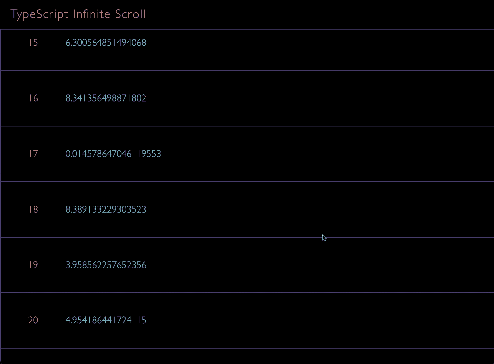

# 带打字稿的无限卷轴

> 原文：<https://itnext.io/infinite-scroll-with-typescript-6214537a4c87?source=collection_archive---------1----------------------->

## 如何在 HTML & TypeScript 中实现无限滚动



[示例项目](https://github.com/kenreilly/typescript-infinite-scroll)运行中的屏幕记录

## 介绍

在本文中，我们将研究使用 HTML 和 TypeScript 实现无限滚动列表的过程。无限滚动对于内容驱动的网站和应用程序很有用，通常比经典的分页方法更有吸引力。

有关示例项目的源代码，请参见[本报告](https://github.com/kenreilly/typescript-infinite-scroll)。

要编译 TypeScript，请参见[本页](https://www.typescriptlang.org/download)或用 node 安装，如下所示:

```
$ npm install -g typescript
```

## 超文本标记语言

这个项目的 HTML 在`<head>`中包含了一些标准标签，并定义了一个带有项目标题的`<header>`以及一个用于保存无限滚动内容的`<main>`元素。编译后的`.js`文件包含在`body`部分的末尾。

## 半铸钢ˌ钢性铸铁(Cast Semi-Steel)

CSS 将标题和项目高度定义为变量，以及`body`和内容的样式。`main`元素取全屏高度减去`header`高度。列表中的项目将属于类`main div`，并包含一些基于`--item-height`变量的格式。

## 以打字打的文件

`App`类没有构造函数，因为它应该是静态的，只包含静态方法和属性。`random_items` get 访问器将返回`0`和`10`之间的十个数字，这些数字将用于填充列表。

当调用`init`时，检索对可滚动容器的引用，为`onscroll`事件附加一个事件处理程序，并调用`load`，它获取接下来的 10 个项目并为每个项目调用`append_item`。

`append_item`方法为条目创建一个`div`,为条目索引创建一个`label`,并创建一个包含随机数的`span`。设置项目内容，然后将其添加到列表中。

滚动处理器`on_scroll`检索屏幕上一个项目的高度，然后根据容器`scrollHeight`减去`scrollTop`和`clientHeight`的值计算剩余的滚动距离。如果剩余的距离小于两个项目，调用`load`向列表中添加更多的项目。

## 结论

这就是使用 HTML、CSS 和 TypeScript 创建一个简单的无限滚动列表的全部内容。使用列表的`length`作为偏移量，可以很容易地通过 API 调用或其他方法修改来检索实际的项目。

感谢您的阅读，祝您的下一个项目好运！

~8 位黑客