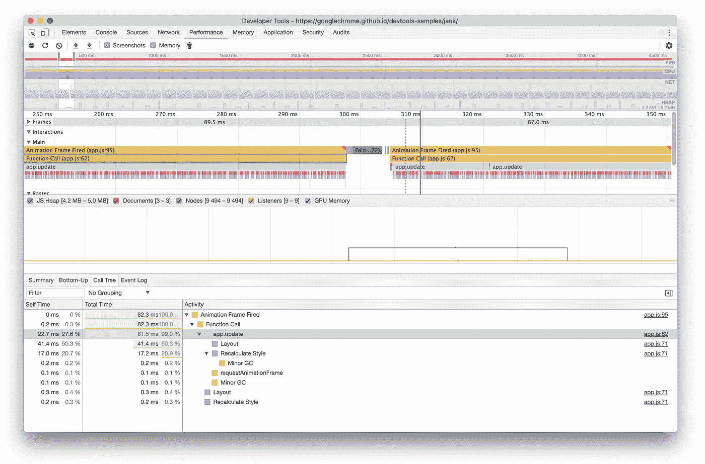

# 无限滚动、动态模块加载&交叉点观察器 API

> 原文：<https://itnext.io/infinite-scrolling-dynamic-module-loading-the-intersection-observer-api-1f17186c7a8d?source=collection_archive---------2----------------------->

我们都经历过。我们构建了一个令人惊叹的 web 应用程序，我们加入了一些视差，用一些动画 SVG 为它增添了趣味，通过延迟加载图像进行了优化，并对我们的大型数据集进行了分页，当我们启动[夜间现代浏览器选择]时，我们发现世界上一切都很好。🙌然后一个需求出现了，说我们需要使用 OS y 来支持 browser x，沮丧开始出现了。😔



一些严肃的玩笑的例子->[https://googlechrome.github.io/devtools-samples/jank/](https://googlechrome.github.io/devtools-samples/jank/)

因此，很自然地，人们可能会启动 devTools，抑制 cpu，运行性能审计和神圣的废话什么是所有那些强制[回流](https://developers.google.com/web/tools/chrome-devtools/rendering-tools/#layout)和 [jank](http://jankfree.org/) 。这不是一篇关于这两者的文章，但它有助于设置一个背景。

开发者可能知道也可能不知道的一件事是[强制同步布局](https://developers.google.com/web/fundamentals/performance/rendering/avoid-large-complex-layouts-and-layout-thrashing#avoid_forced_synchronous_layouts)是不好的，因为由于帧到屏幕的生命周期，它们会导致浏览器执行不必要的和昂贵的工作。用基本术语来说，这意味着在一个帧完成之前从 DOM 读回一个几何值将强制一个布局周期。反复读写会导致“布局抖动”，迫使浏览器一遍又一遍地重新计算布局。

# api 简介

首先，描述一下这个[实验 api](https://caniuse.com/#feat=intersectionobserver) 是什么可能是有意义的，这样我们就可以有效地研究它帮助解决的一些用例和问题。所以让我们开始吧…

[MDN 文档](https://developer.mozilla.org/en-US/docs/Web/API/Intersection_Observer_API)将 IntersectionObserver API 描述为:

> 提供一种异步观察目标元素与祖先元素或顶级文档的视口的交集变化的方法

以上本质上归结为检测主体何时越过给定目标的边界的能力。简单地说，当一个被观察的元素进入或退出另一个元素或视口的边界时，observer api 允许开发人员执行给定的回调函数。上面描述的真正关键是这个过程是一个**异步**过程。这使我们能够在不阻塞主线程的情况下监视元素之间的入口/出口/交叉点。

多年来，开发人员一直在以各种方式解决这个问题，但他们通常归结为以下步骤的变体:

*   向某个事件目标添加一个事件侦听器来侦听滚动事件
*   如果考虑到性能，那么对事件侦听器进行去抖/节流，并确保 passive 选项设置为 false，否则在每个事件通知时天真地触发处理程序
*   计算目标元素相对于另一个元素的位置，以确定是否满足指定的边界限制
*   所有这些都发生在主线程上，如果计算时间太长，那么你会开始注意到被跳过的帧。

> …如果你在一个类似滚动的动画中，你最好将你的 JavaScript 保持在大约**3-4 毫秒**的范围内。再久一点，你就有占用太多时间的危险。— [保罗·路易斯](https://developers.google.com/web/fundamentals/performance/rendering/optimize-javascript-execution#reduce_complexity_or_use_web_workers)

所以我想我们都同意我们需要一个更好的方法。这是 IntersectionObserver 真正出彩的地方，所以让我们来看看代码，好吗…

```
const element = document.createElement('div');
const observer = new IntersectionObserver(callback, options);observer.observe(element);
```

就是这样！👏👏👏

好的，请不要鼓掌，因为我肯定你想知道有哪些选项，有没有传递给回调的参数？我们来探索一下。

## 选择

```
**interface** options {
  root?: HTMLElement | null;
  rootMargin?: string;
  threshold?: number | number[];
}
```

options 对象的所有属性实际上都是可选的，如果没有设置，默认为特定的值。**根**属性定义了决定目标可见性的直接祖先元素，默认为浏览器视口。 **rootMargin** 指定根周围的任何边距，并在计算根和目标之间的交集时使用。**阈值**可以是[0，1]之间的单个数值，也可以是一组值，缺省值为 0，这意味着只要目标的任何部分可见，就触发回调。根据文档，阈值可以更正式地描述为以下值:

> 指示观察者的回调应该在目标可见性的多少百分比上执行。如果只想检测可见性何时超过 50%标记，可以使用值 0.5。如果您希望每次可见度超过 25%时都运行回调，那么您应该指定数组[0，0.25，0.5，0.75，1]

## 回收

```
const callback = function(entries, observer) {};
```

向提供的回调函数传递一个`entries`数组，其中每个条目对象具有以下形状:

```
{
  boundingClientRect
  intersectionRatio
  intersectionRect
  isIntersecting
  rootBounds
  target
  time
}
```

关于回调，有一点需要注意，默认情况下，**是在主线程上执行的，因此昂贵的计算可能会影响性能。如果您发现自己需要运行阻止其他交互的代码，那么可以利用[window . requestidlecallback()](https://developer.mozilla.org/en-US/docs/Web/API/Window/requestIdleCallback)。**

IntersectionObserver api 的简单演示

[*codepen demo*](https://codepen.io/shaunwallace/pen/xXNPZM)

从视频中，您可能会注意到，当顶行和底行正方形从视口外部移动到视口内部时，整数值会发生变化，反之亦然。这些变化是由于阈值设置引起的，在本例中，它们是通过回调来更新的。

这实际上提供了对屏幕上元素的入口/出口/交叉点的细粒度控制。为了更好地了解这是如何实现的，让我们看一下代码。

我们首先指定 options 对象的值。在上面的代码中，我们允许根默认为视口，并且不关心任何额外的边距。阈值是非常细粒度的，在大多数情况下，您不需要这种粒度级别。最棒的是，你可以开始看到它的实际应用。当满足交集阈值并且没有绑定到滚动事件或定位计算时，上面的代码可以容易地获取一些图像或内容。

文档中提到的一些其他使用案例包括:

*   捕捉某些元素在视图中的持续时间。例如，这可以用于分析或广告。
*   推迟动画或计算，直到元素实际可见。

api 还支持其他一些方法。即`disconnect() and unobserve()`。第一种方法将所有观察点从观察交叉点事件中移除。第二个停止观察指定的目标。

这个 api 允许我们轻松处理的一个有趣场景是动态模块加载。如果您在任何风格中使用过[动态导入](https://github.com/tc39/proposal-dynamic-import)，您可能会看到如何利用交集来乐观地加载额外的 javascript，比如说当用户到达页面上的最终元素时。

我相信社区会找到更多的用例，但是现在我希望你喜欢这个快速浏览和愉快的编码。⌨️ 👍