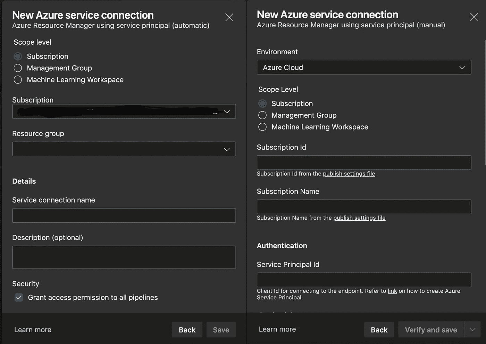
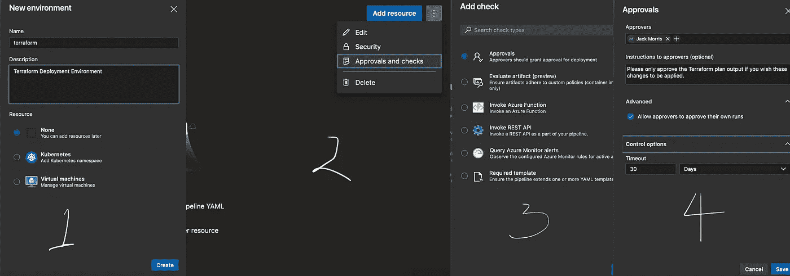

# 具有 Terraform 和 Azure DevOps 的基础设施即代码(IaC)

> 原文：<https://itnext.io/infrastructure-as-code-iac-with-terraform-azure-devops-f8cd022a3341?source=collection_archive---------2----------------------->


照片由 [JJ 英](https://unsplash.com/@jjying?utm_source=medium&utm_medium=referral)在 [Unsplash](https://unsplash.com?utm_source=medium&utm_medium=referral)

*本文是 Azure DevOps 和 Terraform 系列文章的第一部分。*

过去，我曾在不同的地点以不同的方式部署过 Terraform:

1.  从我的笔记本电脑😬
2.  从运行 Bash 步骤的 Jenkins 服务器😐
3.  从 Jenkins 服务器使用 Jenkinsfiles👍
4.  来自团队城市💩
5.  来自 Azure DevOps💯 👍 🔥

最近，我们的团队有了一个令人兴奋的机会，可以从头开始重新构建我们的管道，这意味着我们可以重新访问我们的 Terraform，并学习 Azure DevOps 中的 YAML 管道语法。如果你正在寻找将你的 Terraform 管道迁移到 Azure DevOps，或者你还没有将它们集成到 CI/CD 平台中，并且想知道如何集成，那么请继续阅读！在以后的博文中，我将介绍一些更高级的管道 YAML 语法，并展示我们是如何处理多区域部署、模板化任务和其他各种技巧的。

# 先决条件:首先对您的 Terraform 代码进行优化和重复数据删除

不言而喻:**如果您正在考虑将您的管道迁移到另一个平台，请抓住这个机会使您的代码更加精简和高效。花时间将臃肿、重复的代码转换成精简的组件和模块。迁移破损或笨拙的代码绝对没有价值。你的平台应该在运营成熟度等级 3 或 4 左右运行，相信我，如果你现在做这一步，开发管道将变得轻而易举。**

另外，我想借此机会澄清我在 Terraform 中提到*组件*时的意思，以及我正在使用的文件夹结构。我们在 Azure(或 AWS/GCP/etc)中部署的每个解决方案(通常是核心网络/存储、数据库和计算的组合)都可以在 Terraform 中拆分成相同的三个(ish)组件。下面是简化的文件夹结构示例:

```
terraform/src
├── backends
│   ├── dev
│   │   ├── common.tfvars
│   │   ├── core.tfvars
│   │   └── cluster.tfvars
│   └── production
│       ├── common.tfvars
│       ├── core.tfvars
│       └── cluster.tfvars
├── cluster
│   ├── main.tf
│   ├── remote.tf
│   ├── data.tf
│   ├── resource_locks.tf
│   ├── variables.tf
│   └── versions.tf
├── common
│   ├── cosmosdb.tf
│   ├── data.tf
│   ├── main.tf
│   ├── remote.tf
│   ├── resource_locks.tf
│   ├── variables.tf
│   └── versions.tf
├── core
│   ├── container_registry.tf
│   ├── main.tf
│   ├── dns.tf
│   ├── notification_hubs.tf
│   ├── outputs.tf
│   ├── remote.tf
│   ├── resource_groups.tf
│   ├── resource_locks.tf
│   ├── storage.tf
│   ├── variables.tf
│   └── versions.tf
└── environment
    ├── dev.tfvars
    └── production.tfvars
```

在上面的文件夹结构中，我们有以下顶级文件夹:

1.  **后端:**这个文件夹存放了填充 Terraform 远程状态文件的 tfvar 文件。我们没有硬编码这些，而是在运行管道时使用`-backend-config`参数来动态填充远程状态
2.  **组件集群、公共和核心:**这些是我们的组件。在部署之前，我们的环境需要一些核心基础设施；然后部署共享(公共)资源，接着是 AKS 集群本身。不需要用 AKS，也不总是需要三个组件。
3.  环境:最后一个文件夹包含我们的 tfvar 文件。每一个都是特定于环境的，包含满足开发或生产环境运行`terraform plan`和`terraform apply`所需的所有变量。

考虑到这一切，让我们建立一些管道！

# 1.在 Azure DevOps 中配置凭据以向 Azure 进行身份验证

这里你有两个选择，你如何实现它完全取决于你的组织想要在 Azure DevOps 中嵌入多深。您可以使用:

1.  一个 [AzureRM 服务连接](https://docs.microsoft.com/en-us/azure/devops/pipelines/library/service-endpoints?view=azure-devops&tabs=yaml#sep-azure-resource-manager)
2.  使用 a) Azure 密钥库或 b)变量组提供环境变量

我们选择使用服务连接，因为这可以确保我们的服务主体凭据永远无法从 Azure DevOps 或 Azure Key Vault 中访问或检索。

如果您在目标 Azure 订阅中拥有 Contributor 访问权限或更高权限，则可以选择自动方法。否则，您必须提供预先存在的服务主体的凭据，并选择手动选项。



两个服务连接设置选项。“自动”显示在左侧(如果您在订阅中拥有必要的权限，会容易得多)，而“手动”显示在右侧。

# 2.创建 Azure DevOps 环境

现在，我们创建一个 Azure DevOps 环境，并添加一个手动干预步骤。Azure DevOps 环境相当强大；它们跟踪您部署到的资源，并显示在这些环境中运行了哪些构建:

> 环境是资源的集合，可以通过管道中的部署作为目标。环境可以包括 Kubernetes 集群、Azure web 应用、虚拟机、数据库。环境名称的典型示例有开发、测试、QA、试运行和生产。

上面的环境名例子正是我们所使用的，但是在这个例子中，我创建了一个名为`terraform`的环境，只是为了说明环境是如何工作的。我们将在我们的 YAML 管道中参考这种环境，以确保每次运行`terraform plan`时，我们都会在运行`terraform apply`之前暂停，等待有人批准计划。



1.在 Azure DevOps 2 中使用环境刀片中的+图标创建环境。选择汉堡菜单，然后选择批准和检查 3。添加批准检查 4。输入批准人(您可以有任意多的批准人)，设置高级选项和超时。

# 3.创建一个基本的 YAML 管道

上周，我无意中发现了[James R Counts](https://medium.com/u/5629e51c3c01?source=post_page-----f8cd022a3341--------------------------------)‘优秀的博客文章，标题为[使用 Azure DevOps 安全铺设管道](http://jamesrcounts.com/2019/10/14/azdo-safe-terraform-pipelines.html)。在这里，我将效仿他的例子，做一些调整，使我们的管道*更加安全，*也许启动起来更快一点。我将在这里构建的管道将由一些简单的任务组成，这些任务由阶段分开。在后面的博客文章中，我将向您展示如何将所有这些任务模板化，以使 YAML 在管道之间更加可移植。

# 任务#1:缓存任务

当我们在本地运行 Terraform 时，我们通常会运行`terraform init`一次，然后`terrform plan`和`terraform apply`都在*相同的机器*上，具有*相同的文件系统*。Azure DevOps 将不同的阶段放在不同的代理上。这意味着我们丢失了包含提供者插件、后端和子模块的初始化的`.terraform`目录。我们将使用缓存任务来缓存整个工作目录并在以后恢复它，而不是在不同阶段之间重复这个过程。

我们不会在这里使用发布工件任务，因为任何登录 Azure DevOps 的人都可以访问工件。存储在我们的 tfvars 或 Terraform 存储库中的任何秘密或敏感数据都会被暴露，这是我们绝对要防止的。缓存任务的范围是当前正在运行的作业和分配给它的代理，因此不能被在任何其他代理上运行的其他作业或登录到 DevOps 控制台或 CLI 的任何用户访问。你可以在这里阅读更多关于安全和缓存任务的信息。

Azure DevOps 中的缓存任务

设置好缓存后，我们将在托管的 DevOps 代理上安装 Terraform 并运行`terraform init`，为任务提供服务连接和后端配置细节。这利用了 Microsoft DevLabs Terraform 扩展，您可以在您的组织中安装该扩展[这里](https://marketplace.visualstudio.com/items?itemName=ms-devlabs.custom-terraform-tasks)。

安装和初始化 Terraform

一旦我们的 Terraform 被初始化，我们就继续执行一个计划，确保指定了`-out` arg，这样这个计划就被保存到包含我们所有 Terraform 代码的目录中的一个文件中:

运行地形图

一旦计划被批准，我们所要做的就是运行`terraform apply`并提供我们在第一阶段生成的计划。但是，如果作业和阶段运行在具有不同文件系统的不同 DevOps 代理上，我们如何从另一个代理安全地访问计划呢？我们将恢复我上面提到的缓存，并简单地运行`terraform apply`。这样做的好处是整个目录都被缓存了；这包括`.terraform`目录以及我们之前创建的`.tfplan`文件，它就在根目录下。我们不需要再次`init`，我们可以轻松地向 terraform 提供计划文件，这意味着我们确切地知道将应用什么，并且我们可以保证没有人能够在管道中的任何点拦截数据。

# 把所有的放在一起

这是完整的 Azure DevOps 管道 yaml 文件。你可以看到总共还不到 100 行。让我们走一遍:

1.  我们正在设置一个名为`tfComponent`的变量，以针对位于`terraform/src/cluster`的集群组件运行 Terraform
2.  我们选择位于`terraform/src/environment/dev.tfvars`的 tfvar 文件。
3.  我们没有使用`terraform/src/backends`目录中的任何远程状态 tfvar 文件，因为 Terraform 任务为我们处理了所有这些！理论上，我们可以删除这个目录，但是我喜欢保留它以便在本地运行 Terraform，以防我们想在把它推上 g it 之前测试一些东西。
4.  第一阶段运行 Terraform Plan，缓存吞噬目录中的所有文件，并用唯一生成的密钥保存它们。
5.  第二阶段仅在有人批准作业后运行。批准后，使用相同的密钥恢复缓存，然后运行 Terraform Apply。

# 接下来

在我的下一篇博文中，我将详细介绍我们如何使用模板和参数来保持管道的整洁和可重复。敬请期待！