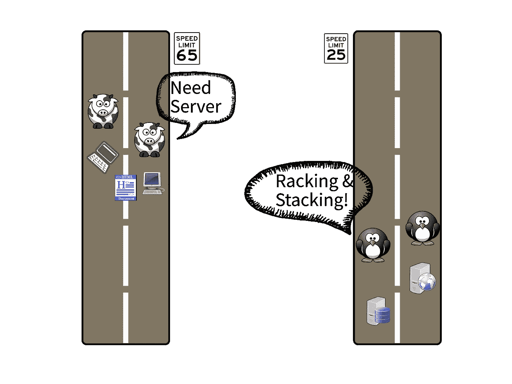
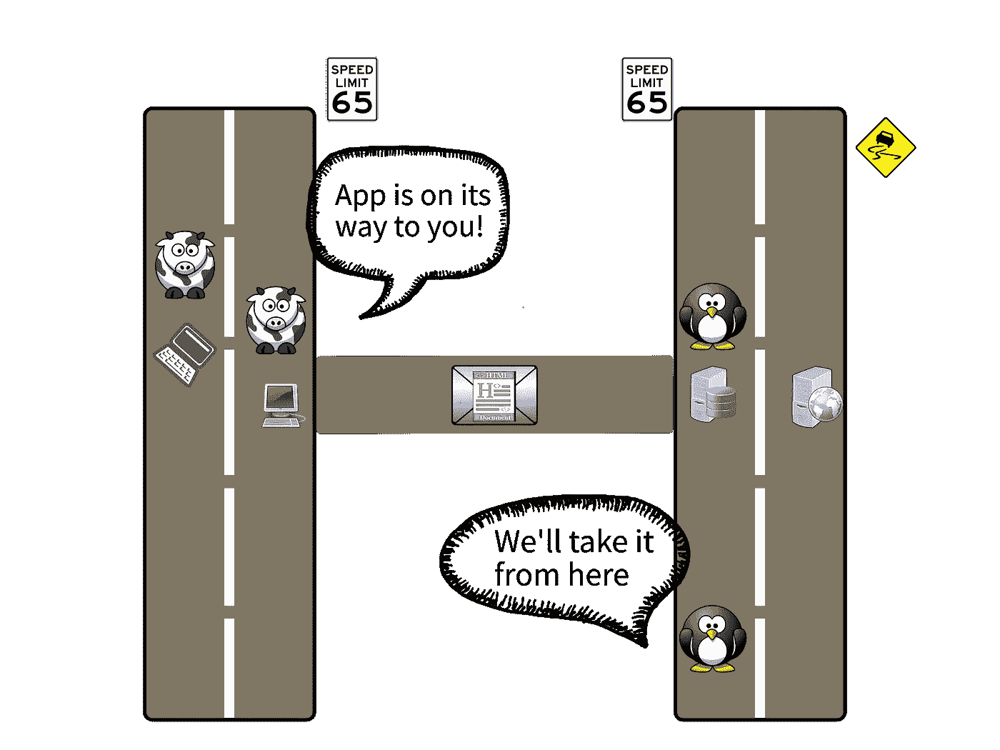
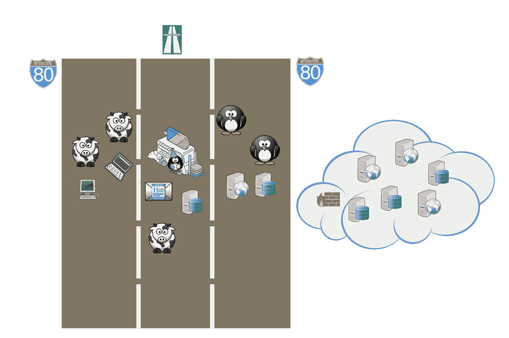
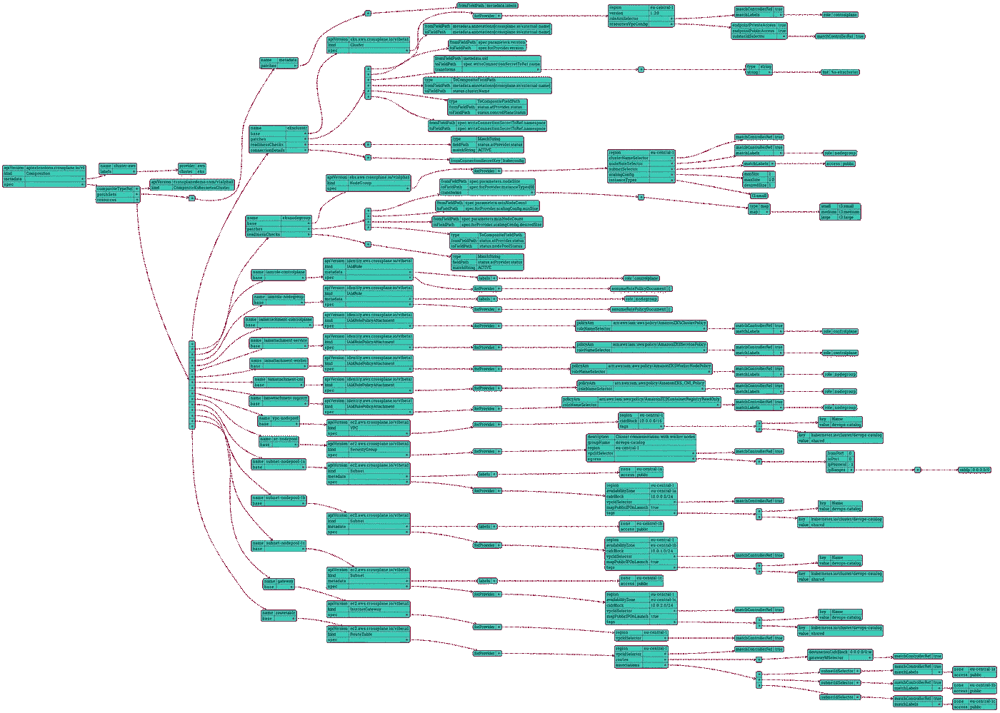
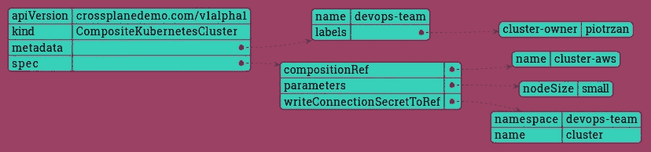
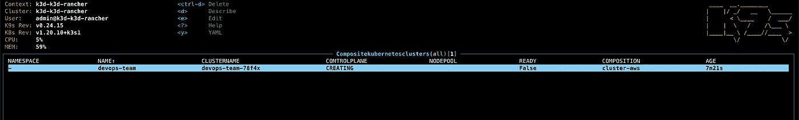

# 作为代码的基础设施:下一个大转变就在这里

> 原文：<https://itnext.io/infrastructure-as-code-the-next-big-shift-is-here-9215f0bda7ce?source=collection_archive---------0----------------------->


本在 [Unsplash](https://unsplash.com/?utm_source=unsplash&utm_medium=referral&utm_content=creditCopyText) 上的照片

# 介绍

在这个博客中，我们将着眼于软件基础设施的演变；供应、交付和维护。

如果你对现代 DevOps 和 SRE 实践感兴趣，这篇文章是给你的。

**基础设施即代码(IaC)** 是一种常见的模式，其中虚拟化基础设施和辅助服务可以使用几乎任何语言表达的配置来管理，通常托管在源代码库中。

每隔一段时间，软件行业都会受到被称为“范式转变”的重大事件的影响。下面是几个这样的事件，它们使得代码基础设施成为今天的样子:

*   虚拟化
*   集装箱化和集装箱编排
*   公共云基础架构
*   DevOps 文化

## 基础设施供应:发展

让我们来看看每一波变化是如何塑造软件景观的:

**#1 虚拟化**

在虚拟化的早期，开发人员会在漫长的瀑布式开发周期中开发软件，主要基于需求文档。与此同时，运营团队将安装和堆叠服务器，提供基础架构组件，安装所有的东西，进行配置等。通常两个团队会以一种不联系的方式工作，开罚单，通过长长的电子邮件链交流。那些是大时代。



**#2 敏捷和 DevOps 的开始**

接下来是敏捷革命，随之而来的是 DevOps 文化的开始。现在，开发人员会将应用程序连同多页配置手册一起发送给运营团队。更多进步的团队将开始在自动化工具上合作。在基础设施的早期，像 Chef 或 Puppet 这样的自动化工具非常流行。巨大的改进，但通常是非常孤立的环境和分散的职责。



**#3 公有云&容器编排**

随着公共云使用的增加和更强大的自动化，事情开始步入正轨。大多数运营团队选择的工具是 terraform。与几年前的情况相比，这是巨大的进步。创建的基础设施数量呈指数级增长。

很长一段时间，这张图几乎是完美的…几乎。那么缺少什么呢？嗯，开发人员和运营人员的经验都有所欠缺。精心创建的基础架构开始漂移，需要大量的工作和维护开销。另一方面，开发人员必须学习新的语言，努力将 Ops 工具集成到他们的工作流程中。社区聚集在一起，提出各种创造性的解决方案，漂移检测，更多的自动化，可观察性等。所有这些工具和项目都很棒，但不是标准化的。

如何改进已经很好的流程？如何再做一次飞跃，让事情变得好，变得伟大？像大多数好的答案一样，答案来自社区本身。还记得我们如何谈论范式转换吗？其中之一是容器化和容器编排，这在较小程度上实现了打包(容器映像)和运行时(Kubernetes pods)问题的标准化。现在，所有的标准和工具都唾手可得，只需最后一点努力，就能让它们无缝地协同工作。在我看来，[交叉平面](https://crossplane.io/)是基础设施中缺少的一环。

> *cross plane 的强大之处在于使用了云原生开放标准和最流行的工具，使开发人员(也就是应用团队)和运营人员(也就是平台团队)能够协同工作，而不互相依赖。*



*在我们进入博客的下一部分之前，先声明一点。选择奶牛和企鹅分别代表开发者和 ops，纯粹是基于动物的可爱程度。*

## 交叉平面架构

是什么让 Crossplane 如此特别？首先，它建立在 Kubernetes 之上，并利用了这样一个事实，即 Kubernetes 的真正强大之处在于其强大的 API 模型和控制平面逻辑(控制循环)。它也从作为代码的基础设施转移到作为数据的基础设施。不同之处在于，IaC 意味着编写代码来描述供应应该如何发生，而 IaD 意味着编写纯数据文件(在 Kubernetes YAML 的情况下)并将它们提交给控制组件(在 Kubernetes 是操作员的情况下)来封装和执行供应逻辑。

对我来说，Crossplane 最棒的部分是它通过利用 [Kubernetes Control](https://containerjournal.com/kubeconcnc/kubernetes-true-superpower-is-its-control-plane/) Plane 作为每个人相遇的汇聚点，无缝地支持应用程序团队和平台团队之间的协作。

## 成分

让我们看看交叉面板组件模型是什么样子的。一个警告的话，如果你是 Kubernetes 的新手，这可能是压倒性的，但努力理解它是有价值的。下图显示了交叉面板组件模型及其基本交互。


来源:作者基于 Crossplane.io

# 演示场景

演示场景突出了 Crossplane 的复合功能。通过将基础设施的复杂性转移到平台团队中，使用组合有助于将基础设施的复杂性从开发人员那里抽象出来。

场景流程:

*   部署 RDS
*   部署 EKS
*   突出创建和使用合成的主要步骤

## 先决条件

为了跟进，您需要在本地机器上配置一个 AWS 和 CLI 订阅。需要 AWS 的基本知识来理解正在部署的组件，并对 Kubernetes 资源模型有基本的了解。

用于访问云环境和部署基础架构的凭据将从装载的卷进行映射。

本地安装您将需要:

*   VS 代码与远程容器 devcontainer 插件
*   使用 Windows 时的 WSL2

## 演示设置

来自[交叉平面安装](https://crossplane.io/docs/v1.5/getting-started/install-configure.html#install-crossplane)的所有组件已经预先安装在这个项目的 devcontainer 中。

这些组件是:

*   Kubernetes minikube
*   舵
*   库贝特尔
*   交叉平面 CLI
*   AWS CLI

> *交叉板应该安装在*交叉板-系统*命名空间中，如果没有请运行* `*.devcontainer/library-scripts/setup-crossplane.sh*`

*这种设置有点笨拙，例如，由于从容器中读取文件，性能不是最佳的，并且整体设置不是我想要的。如果容器达到滥用的极限，这可能会变成基于流浪者的设置。*

## 可观察性

使用[八分圆](https://docs.vmware.com/en/VMware-vSphere/7.0/vmware-vsphere-with-tanzu/GUID-1AEDB285-C965-473F-8C91-75724200D444.html)可视化 CRDsVMWare 开源集群可视化工具，在浏览器中运行，因此不需要集群内安装。

如果你更喜欢终端工具， [k9s](https://k9scli.io/) 可以满足你。

## AWS 提供商

安装程序将根据从本地$HOME/挂载的默认概要文件自动生成 AWS 配置。aws 文件夹。

> *creds.conf 文件被添加到。gitignore 这样你就不会不小心把它提交给回购了！*

下一步是配置 Crossplane 以访问 AWS 并创建资源，我们将通过创建一个秘密来实现这一点:

`kubectl create secret generic aws-creds -n crossplane-system --from-file=creds=./creds.conf`

现在，在集群上安装 AWS provider

`kubectl apply -f [https://raw.githubusercontent.com/crossplane/crossplane/release-1.5/docs/snippets/configure/aws/providerconfig.yaml](https://raw.githubusercontent.com/crossplane/crossplane/release-1.5/docs/snippets/configure/aws/providerconfig.yaml)`

从那里开始，你应该能够跟随来自 [Crossplane 的网页](https://crossplane.io/docs/v1.5/getting-started/provision-infrastructure.html)的演示。

## 部署 RDS 实例

首先，让我们部署一个 RDS 实例，这是一个 AWS 托管资源，由 AWS 提供程序提供。参见[交叉板组件图](https://github.com/Piotr1215/crossplane-demo#crossplane-components)。

`kubectl create -f rds-instance.yaml`

RDSInstance 只是一个 Kubernetes 资源，如 pod、service 或 replicaSet。您可以在 Octant 或命令行中查看部署进度:`watch kubectl get RDSInstance`

用`kubectl delete -f rds-instance.yaml`删除实例

## 部署 EKS 集群

通过自动化部署 EKS 集群不是一项简单的任务，有许多组件需要创建，如 VPC、子网、IAM 角色、节点池、路由表、网关…这不是开发人员想要的体验，但这种复杂性必须存在，没有神奇的“消除复杂性”按钮！

正如我们在组件图中看到的，该过程从构建 XRD(复合资源定义)开始，我们可以在其中指定:

*   XR(复合资源)的模式
*   XRC 的模式(复合资源声明)

为了帮助理解配置的复杂程度，这里有一个表示 EKS 组成的图表。这种复杂性由平台团队来管理，平台团队是专门研究 Kubernetes 和云提供商的团队。



现在隐藏了这种复杂性，开发者得到了这个:



```
apiVersion: crossplanedemo.com/v1alpha1
kind: CompositeKubernetesCluster
metadata:
  name: devops-team
  labels:
    cluster-owner: piotrzan
spec:
  compositionRef:
    # Possible values cluster-google, cluster-azure, cluster-aws
    name: cluster-aws
  parameters:
    # Possible values small, medium, large
    nodeSize: small
    # version: "1.20"
    # minNodeCount: 2
  writeConnectionSecretToRef:
    namespace: devops-team
    name: cluster
```

部署集群非常容易，只需`kubectl create -f ./aws`

EKS 集群部署状态:



## 检索 kubeconfig 详细信息

```
kubectl get secrets --namespace devops-team cluster \
     --output jsonpath="{.data.kubeconfig}" \
     | base64 --decode | tee eks-config.yamlexport KUBECONFIG=$PWD/eks-config.yaml
```

从这里你可以像普通的 EKS 一样使用集群。

记得使用`unset KUBECONFIG`或 source bash/zshrc 来恢复您的旧配置。

## 清除

删除 EKS 和伴随的资源`kubectl delete -f ./aws`退出 VS 代码，这将停止容器。您可以通过`docker system prune --all`进一步清理未使用的容器和图像。

# 结论

以防有人想知道，这篇文章不是由 Upbound(cross plane 背后的公司)赞助的，我真诚地相信这个产品是革命性的。

我们已经看到了 Crossplane 如何帮助简化基础设施配置和管理。以下是我想强调的几个好处。

*   可组合的基础设施
*   自助服务
*   自动化程度提高
*   标准化协作
*   通用语言(K8s API)

我最喜欢 Crossplane 的一点是，它通过促进应用程序团队和平台团队之间的松散耦合协作，构建时考虑了 DevOps 文化。资源模型、打包、配置都是经过深思熟虑的。

还有一些挑战需要记住:

*   复杂性，这是为它提供的灵活性所付出的代价
*   YAML 扩散，这是好是坏取决于你对 YAML 的立场；)
*   你需要很了解 K8s

复杂性通过将它转移到专门的平台团队来解决。对 YAML 来说，我希望看到更多像 CDK8s 或其他人那样的 YAML 一代的融合。我认为依赖 K8s 是一个好处，但对于我们这些还不熟悉 Kubernetes 的人来说，这使得学习曲线有点陡峭。

总之，Crossplane 是一个伟大的产品，它出现在正确的时间，并以一种非常创新和面向未来的方式解决了几十年来的所有问题。去看看！