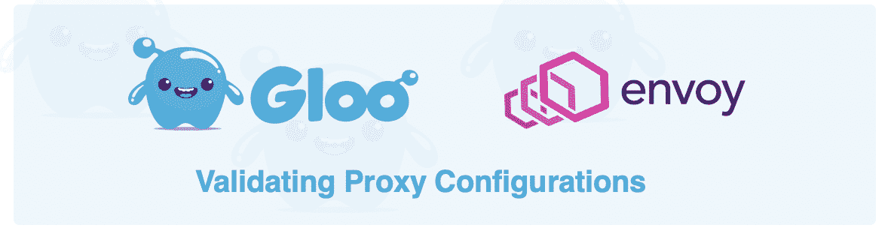
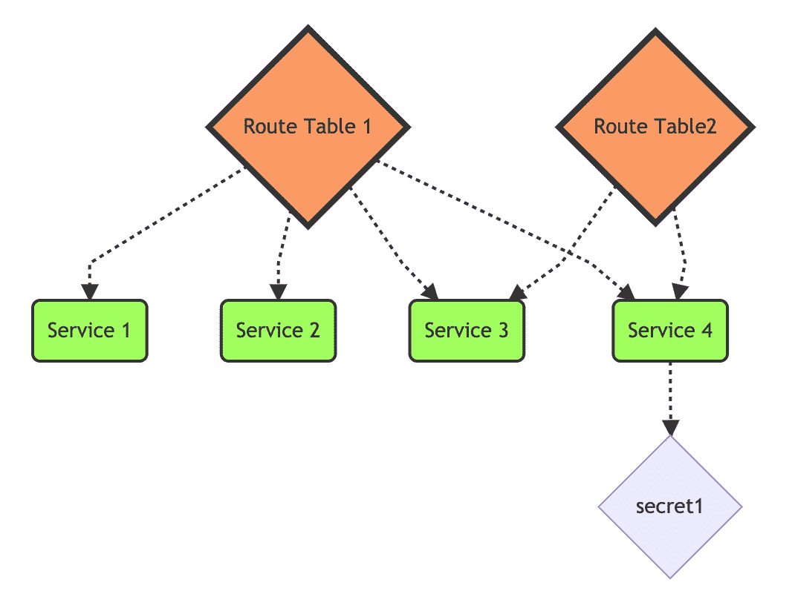
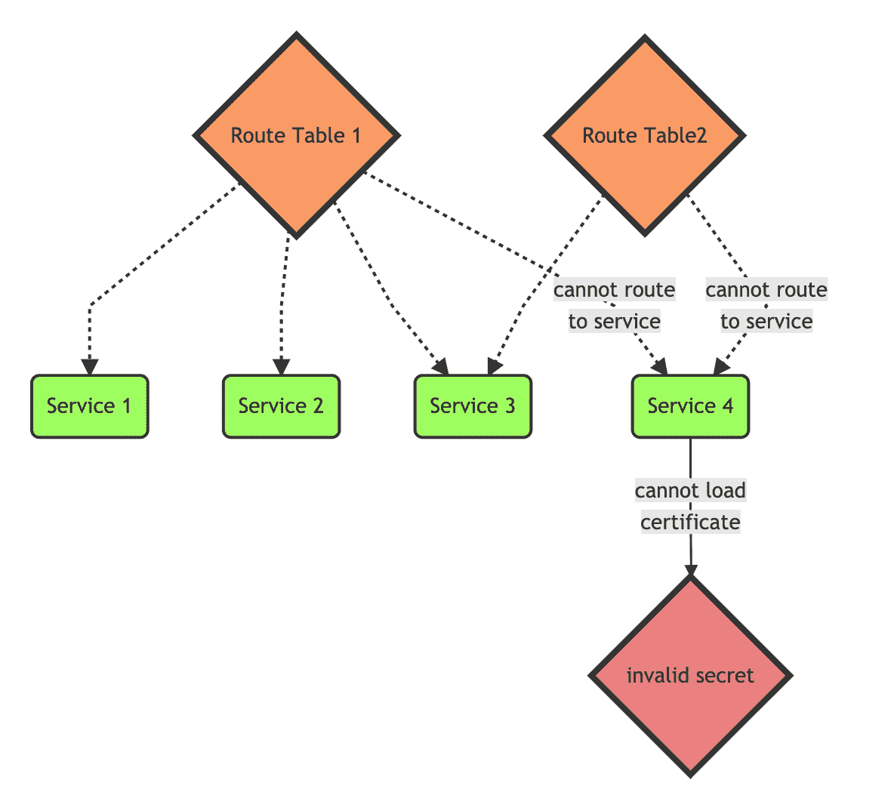

# 基础设施弹性:处理特使代理中的无效配置

> 原文：<https://itnext.io/infrastructure-resilience-handling-invalid-configuration-in-the-envoy-proxy-f20883eba8a7?source=collection_archive---------5----------------------->

随着微服务部署规模的增加，管理流量路由的问题变得越来越复杂。当配置出错时，可能会导致从控制面板停机到[服务中断](https://medium.com/@SkyscannerEng/misunderstanding-the-behaviour-of-one-templating-line-and-the-pain-it-caused-our-k8s-clusters-a420f30a99f1)的一切事情。

这篇简短的博文将介绍 Gloo(基于 Envoy 的 API 网关)如何应对管理 Envoy 的大规模配置的挑战，以防止无效配置中断服务。

API 网关和服务网格的用户经常处理必须被独立管理(即，每个服务)的大量配置对象，但是经常被合并到单个代理的配置中。这些配置包含大量跨对象的依赖关系，如下图所示:

用户经常使用 Helm 和 Jsonnet 等模板技术来管理大量路由配置(以及他们的服务、部署、配置映射和其他 CRD)。这有助于减少管理所有这些配置的痛苦，但对减少配置相互依赖的问题没有什么帮助。请注意当单个配置无效时会发生什么:

在提供的图表中，两个路由表都变得无效，因为 TLS 机密无效，它们无法再路由到服务 4。

对于运营商来说，配置的语法和功能验证变得越来越困难，尤其是对于可能跨越多个集群、云环境和 k8s 外工作负载的路由配置。资源之间通常存在依赖关系——服务、TLS 秘密、 [*、委托路由*](https://docs.solo.io/gloo/latest/gloo_routing/virtual_services/delegation/) ，而 kubernetes 服务需要不同配置之间的协调。

在大规模微服务环境中管理流量时，无效配置会导致漏洞和服务中断。因此，健壮的控制平面负责防止无效配置影响[数据平面](https://blog.envoyproxy.io/service-mesh-data-plane-vs-control-plane-2774e720f7fc)(代理)。

本文将探讨基于 Envoy 的 API 网关 [Gloo](https://docs.solo.io/gloo/latest/) 如何处理和防止无效路由配置。

# Gloo 如何防止配置错误

Gloo 是下一代 API 网关和 Kubernetes 入口控制器，构建于 Envoy 代理之上。Gloo 处理用户配置和环境数据，以动态配置 Envoy 中的路由和过滤器。在 Kubernetes 上运行 Gloo 时，这个用户配置是以[自定义资源](https://kubernetes.io/docs/tasks/access-kubernetes-api/custom-resources/custom-resource-definitions/) (CRDs)的形式提供的。

当用户请求创建或修改 Gloo 的定制资源之一时，该请求由 Gloo 的[验证准入 Webhook](https://kubernetes.io/docs/reference/access-authn-authz/extensible-admission-controllers/) 处理。Gloo 运行一个内部转换循环，以验证对整个集群配置的每个单独更新都会产生一个有效的特使配置。如果 Gloo 检测到请求的更改会产生无效的 Envoy 配置，它会在被*允许*到 Kubernetes 存储之前被拒绝，客户端(kubectl 或另一个与 Kubernetes API 交互的工具)会向用户返回一个错误。

管理员可以通过[设置 API](https://docs.solo.io/gloo/latest/api/github.com/solo-io/gloo/projects/gloo/api/v1/settings.proto.sk/#settings) 配置 Gloo 验证的严格程度，以及 Gloo 应该如何处理已经被接受的无效配置的选项(例如，在验证被禁用的情况下)。

试试 [**验证教程**](https://gloo.solo.io/gloo_routing/validation/) 看看 Gloo 如何保护 API 网关配置。

Gloo 是可用的开源或企业，我们邀请您尝试一下，并期待您的反馈。

*   了解更多关于 [Gloo](http://www.solo.io/gloo) 的信息，并尝试[教程](https://gloo.solo.io/gloo_routing/validation/)。
*   [加入我们的 Slack](https://slack.solo.io) ，分享您的问题和反馈。
*   [在 GitHub 中提出问题](https://github.com/solo-io/gloo)。

感谢阅读，敬请关注更多来自 [Solo.io](https://www.solo.io/) 的博客和令人兴奋的开源软件！