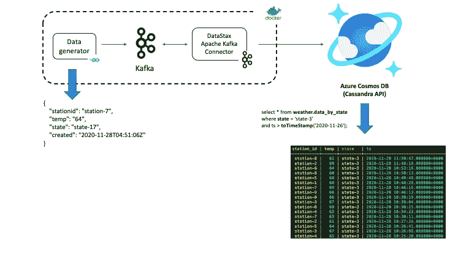
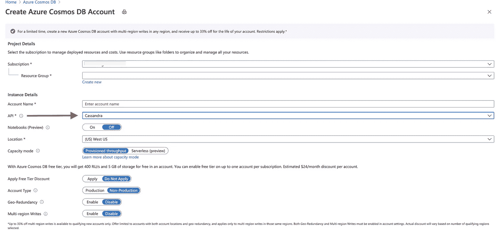
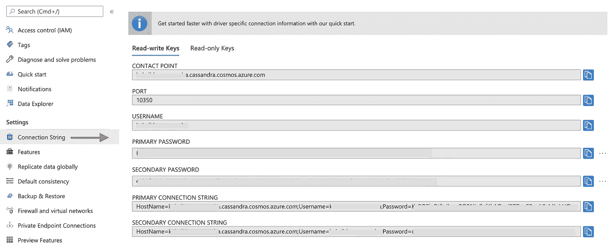
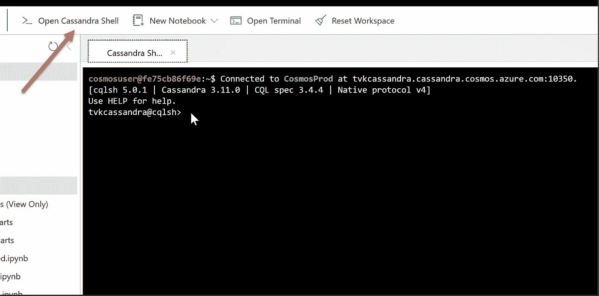

# 使用 Kafka Connect 将数据从 Apache Kafka 导入 Azure Cosmos DB Cassandra API

> 原文：<https://itnext.io/ingest-data-from-apache-kafka-into-azure-cosmos-db-cassandra-api-using-kafka-connect-11e054f82a05?source=collection_archive---------5----------------------->

## 本教程基于一个实际场景，以及一个可重用的 Docker Compose 设置，有助于迭代开发和实验

Azure Cosmos DB Cassandra API 是一个完全托管的云服务，兼容 Cassandra 查询语言(CQL)3.11 API。它没有运营开销，您可以从所有底层 [Azure Cosmos DB 功能](https://docs.microsoft.com/azure/cosmos-db/introduction?WT.mc_id=data-11341-abhishgu#key-benefits)中受益，如全球分发、自动横向扩展分区、可用性和延迟保证、静态加密、备份等。

*在写这篇博客的时候，*[*Azure Cosmos DB Cassandra API server less 在预览模式*](https://devblogs.microsoft.com/cosmosdb/azure-cosmos-db-cassandra-api-serverless-now-in-preview/) *！*

您现有的 Cassandra 应用程序可以与[Azure Cosmos DB Cassandra API](https://docs.microsoft.com/azure/cosmos-db/cassandra-introduction?WT.mc_id=data-11341-abhishgu)一起工作，因为它与 [CQLv4 兼容的驱动程序](https://cassandra.apache.org/doc/latest/getting_started/drivers.html?highlight=driver)一起工作(参见 [Java](https://docs.microsoft.com/azure/cosmos-db/create-cassandra-java-v4?WT.mc_id=data-11341-abhishgu) 、[的示例)。Net Core](https://docs.microsoft.com/azure/cosmos-db/create-cassandra-dotnet-core?WT.mc_id=data-11341-abhishgu) 、 [Node.js](https://docs.microsoft.com/azure/cosmos-db/create-cassandra-nodejs?WT.mc_id=data-11341-abhishgu) 、 [Python](https://docs.microsoft.com/azure/cosmos-db/create-cassandra-python?WT.mc_id=data-11341-abhishgu) 等。)但是，你还需要考虑用现有数据与其他系统集成，并将其引入 Azure Cosmos DB。一个这样的系统是 Apache Kafka，这是一个分布式流媒体平台。它在行业和组织中用于解决各种各样的问题，从传统的异步消息传递、网站活动跟踪、日志聚合、实时欺诈检测等等！它拥有丰富的技术生态系统，如用于流处理的 [Kafka Streams](https://kafka.apache.org/26/documentation/streams) 和用于实时数据集成的 [Kafka Connect](https://kafka.apache.org/documentation/#connect) 。

由于其[可扩展的设计](https://kafka.apache.org/documentation/#design)，Apache Kafka 经常充当整个数据架构的核心组件，其他系统将数据注入其中。这些可以是点击流事件、日志、传感器数据、订单、数据库变化事件等。你说吧！因此，可以想象，Apache Kafka(主题)中有很多数据，但只有在被其他系统消费或吸收时才有用。你可以通过使用 [Kafka 生产者/消费者](https://kafka.apache.org/documentation/#api)API[使用你选择的语言和客户端 SDK](https://cwiki.apache.org/confluence/display/KAFKA/Clients)编写优秀的老管道代码来实现这一点。但是你可以做得更好！

这篇博文展示了如何使用开源解决方案(基于连接器)将 Kafka 的数据接收到 Azure Cosmos DB Cassandra API 中。它使用一个简单而实用的场景，以及一个使用 Docker Compose 的可重用设置来帮助迭代开发和测试。您将了解到:

*   Kafka Connect 概述以及集成的详细信息
*   如何配置和使用连接器来使用 Azure Cosmos DB
*   使用连接器将数据从单个 Kafka 主题写入多个表

在这篇博客结束时，你应该有一个端到端的集成，并能够验证它。

与这篇博文相关的代码和配置可以在这个 GitHub 资源库中找到—[https://github.com/abhirockzz/kafka-cosmosdb-cassandra](https://github.com/abhirockzz/kafka-cosmosdb-cassandra)

# 你好，卡夫卡连线！

Kafka Connect 是一个平台，以可伸缩和可靠的方式在 Apache Kafka 和其他系统之间传输数据流。除了它只依赖于 Kafka 这一事实之外，它的伟大之处在于它提供了一套现成的连接器。这意味着您不需要编写定制的集成代码来将系统粘合在一起；没有代码，只有配置！如果现有的连接器不可用，您可以利用强大的 Kafka Connect 框架来构建自己的连接器。

Kafka Connect 提供两大类连接器:

*   源连接器:它用于从外部系统提取数据，并将其发送到 Apache Kafka。
*   接收器连接器:它用于将 Apache Kafka 中的现有数据发送到外部系统。

在这篇博文中，我们将使用开源的 [DataStax Apache Kafka 连接器](https://docs.datastax.com/en/kafka/doc/kafka/kafkaIntro.html)，这是一个基于 Kafka Connect 框架的接收连接器，用于将 Kafka 主题中的记录接收到一个或多个 Cassandra 表的行中。

# 解决方案概述

在高层次上，解决方案相当简单！尽管如此，图表应该是有帮助的。



样本天气数据不断生成到一个卡夫卡主题中。这由连接器获取并发送到 Azure Cosmos DB，并且可以使用任何 Cassandra 客户端驱动程序进行查询。

除了 Azure Cosmos DB，解决方案的其余组件作为 [Docker](https://docs.docker.com/get-started/overview/) 容器运行(使用 [Docker Compose](https://docs.docker.com/compose/reference/overview/) )。这包括 Kafka(和 Zookeeper)、Kafka Connect worker(Cassandra 连接器)以及样本数据生成器( [Go](https://golang.org/) )应用程序。话虽如此，只要所有组件都配置为根据需要相互访问和通信，这些指令将适用于任何 Kafka 集群和 Kafka Connect workers。例如，你可以在 Azure HD Insight 上拥有 Kafka 集群，在 Azure Marketplace 上拥有融合云。

## Docker 编写服务

下面是组件及其服务定义的分类——你可以参考 GitHub repo 中完整的 docker-compose 文件[。](https://github.com/abhirockzz/kafka-cosmosdb-cassandra/blob/master/docker-compose.yaml)

[debezium](https://hub.docker.com/r/debezium/kafka/) 图像用于运行 Kafka 和 Zookeeper。它们只是工作，而且对于快速反馈循环、演示等迭代开发非常有用。

```
zookeeper:
    image: debezium/zookeeper:1.2
    ports:
      - 2181:2181
  kafka:
    image: debezium/kafka:1.2
    ports:
      - 9092:9092
    links:
      - zookeeper
    depends_on:
      - zookeeper
    environment:
      - ZOOKEEPER_CONNECT=zookeeper:2181
      - KAFKA_ADVERTISED_LISTENERS=PLAINTEXT://localhost:9092
```

为了作为 Docker 容器运行，DataStax Apache Kafka 连接器构建在现有的 Docker 映像之上—[debezium/connect-base](https://github.com/debezium/docker-images/tree/master/connect-base/1.2)。这个图像包括 Kafka 及其 Kafka Connect 库的安装，因此添加定制连接器非常方便。

```
cassandra-connector:
    build:
      context: ./connector
    ports:
      - 8083:8083
    links:
      - kafka
    depends_on:
      - kafka
    environment:
      - BOOTSTRAP_SERVERS=kafka:9092
      - GROUP_ID=cass
      - CONFIG_STORAGE_TOPIC=cass_connect_configs
      - OFFSET_STORAGE_TOPIC=cass_connect_offsets
      - STATUS_STORAGE_TOPIC=cass_connect_statuses
```

[Dockerfile](https://github.com/abhirockzz/kafka-cosmosdb-cassandra/blob/master/connector/Dockerfile) 相当紧凑。它下载连接器并将其解压缩到文件系统(插件路径)中的适当目录，以便 Kafka Connect 框架检测它。

```
FROM debezium/connect-base:1.2
WORKDIR $KAFKA_HOME/connect
RUN curl -L -O https://downloads.datastax.com/kafka/kafka-connect-cassandra-sink.tar.gz
RUN tar zxf kafka-connect-cassandra-sink.tar.gz
RUN rm kafka-connect-cassandra-sink.tar.gz
```

最后，数据生成器服务将随机生成的(JSON)数据植入天气数据 Kafka 主题。可以参考[GitHub repo](https://github.com/abhirockzz/kafka-cosmosdb-cassandra/blob/master/data-generator/)中的代码和 Dockerfile

```
data-generator:
    build:
      context: ./data-generator
    ports:
      - 8080:8080
    links:
      - kafka
    depends_on:
      - kafka
    environment:
      - KAFKA_BROKER=kafka:9092
      - KAFKA_TOPIC=weather-data
```

让我们转到实际的方面！继续之前，请确保您已准备好以下内容。

# 先决条件

最后，克隆这个 GitHub repo:

```
git clone [https://github.com/abhirockzz/kafka-cosmosdb-cassandra](https://github.com/abhirockzz/kafka-cosmosdb-cassandra) 
cd kafka-cosmos-cassandra
```

接下来的部分将指导您完成:

*   设置 Azure Cosmos DB 帐户、Cassandra keyspace 和表
*   引导集成管道
*   了解配置并启动连接器实例
*   测试端到端的结果，并对 Azure Cosmos DB 表中的数据运行查询

## 设置和配置 Azure Cosmos DB

首先创建一个 [Azure Cosmos DB 帐户](https://docs.microsoft.com/azure/cosmos-db/create-cassandra-api-account-java?WT.mc_id=devto-blog-abhishgu#create-a-database-account)，选择 **Cassandra API** 选项



使用 Azure 门户，创建 Cassandra 密钥空间和演示应用程序所需的表。

```
CREATE KEYSPACE weather WITH REPLICATION = {'class' : 'NetworkTopologyStrategy', 'datacenter1' : 1};

CREATE TABLE weather.data_by_state (station_id text, temp int, state text, ts timestamp, PRIMARY KEY (state, ts)) WITH CLUSTERING ORDER BY (ts DESC) AND cosmosdb_cell_level_timestamp=true AND cosmosdb_cell_level_timestamp_tombstones=true AND cosmosdb_cell_level_timetolive=true;

CREATE TABLE weather.data_by_station (station_id text, temp int, state text, ts timestamp, PRIMARY KEY (station_id, ts)) WITH CLUSTERING ORDER BY (ts DESC) AND cosmosdb_cell_level_timestamp=true AND cosmosdb_cell_level_timestamp_tombstones=true AND cosmosdb_cell_level_timetolive=true;
```

数据库部分到此为止！是时候启动其他组件了。

# 开始集成管道

因为一切都是 Docker 化的，所以您只需要一个命令就可以在本地引导服务— Kafka、Zookeeper、Kafka Connect worker 和示例数据生成器应用程序。

```
docker-compose --project-name kafka-cosmos-cassandra up --build
```

下载和启动容器可能需要一段时间:这只是一个一次性的过程。

要确认是否所有容器都已启动:

```
docker-compose -p kafka-cosmos-cassandra ps

#output

                  Name                                Command             State                    Ports                  
--------------------------------------------------------------------------------------------------------------------------
kafka-cosmos-cassandra_cassandra-           /docker-entrypoint.sh start   Up      0.0.0.0:8083->8083/tcp, 8778/tcp,       
connector_1                                                                       9092/tcp, 9779/tcp                      
kafka-cosmos-cassandra_datagen_1            /app/orders-gen               Up      0.0.0.0:8080->8080/tcp                  
kafka-cosmos-cassandra_kafka_1              /docker-entrypoint.sh start   Up      8778/tcp, 0.0.0.0:9092->9092/tcp,       
                                                                                  9779/tcp                                
kafka-cosmos-cassandra_zookeeper_1          /docker-entrypoint.sh start   Up      0.0.0.0:2181->2181/tcp, 2888/tcp,
```

数据生成器应用程序将开始向 Kafka 中的天气数据主题输入数据。你也可以做快速检查来确认。查看运行 Kafka connect worker 的 Docker 容器:

```
docker exec -it kafka-cosmos-cassandra_cassandra-connector_1 bash
```

一旦您进入容器外壳，只需启动通常的 Kafka 控制台消费者进程，您应该会看到天气数据(JSON 格式)流入。

```
cd ../bin

./kafka-console-consumer.sh --bootstrap-server kafka:9092 --topic weather-data

#output

{"stationid":"station-7","temp":"64","state":"state-17","created":"2020-11-28T04:51:06Z"}
{"stationid":"station-9","temp":"65","state":"state-1","created":"2020-11-28T04:51:09Z"}
{"stationid":"station-3","temp":"60","state":"state-9","created":"2020-11-28T04:51:12Z"}
{"stationid":"station-8","temp":"60","state":"state-3","created":"2020-11-28T04:51:15Z"}
{"stationid":"station-5","temp":"65","state":"state-7","created":"2020-11-28T04:51:18Z"}
{"stationid":"station-6","temp":"60","state":"state-4","created":"2020-11-28T04:51:21Z"}
....
```

## Cassandra 水槽连接器设置

将下面的 JSON 内容复制到一个文件中(可以命名为`cassandra-sink-config.json`)。您需要根据您的设置更新它，本节的其余部分将围绕这个主题提供指导。

```
{
    "name": "kafka-cosmosdb-sink",
    "config": {
        "connector.class": "com.datastax.oss.kafka.sink.CassandraSinkConnector",
        "tasks.max": "1",
        "topics": "weather-data",
        "contactPoints": "<cosmos db account name>.cassandra.cosmos.azure.com",
        "port": 10350,
        "loadBalancing.localDc": "<cosmos db region e.g. Southeast Asia>",
        "auth.username": "<enter username for cosmosdb account>",
        "auth.password": "<enter password for cosmosdb account>",
        "ssl.hostnameValidation": true,
        "ssl.provider": "JDK",
        "ssl.keystore.path": "/etc/alternatives/jre/lib/security/cacerts/",
        "ssl.keystore.password": "changeit",
        "datastax-java-driver.advanced.connection.init-query-timeout": 5000,
        "maxConcurrentRequests": 500,
        "maxNumberOfRecordsInBatch": 32,
        "queryExecutionTimeout": 30,
        "connectionPoolLocalSize": 4,
        "topic.weather-data.weather.data_by_state.mapping": "station_id=value.stationid, temp=value.temp, state=value.state, ts=value.created",
        "topic.weather-data.weather.data_by_station.mapping": "station_id=value.stationid, temp=value.temp, state=value.state, ts=value.created",
        "key.converter": "org.apache.kafka.connect.storage.StringConverter",
        "value.converter": "org.apache.kafka.connect.json.JsonConverter",
        "value.converter.schemas.enable": false,
        "offset.flush.interval.ms": 10000
    }
}
```

以下是这些属性的摘要:

**基本连接**

*   **联系人**:输入 Cosmos DB Cassandra 的联系人
*   **localDc** :输入 Cosmos DB 账户的地区，如东南亚
*   **用户名**:输入用户名
*   **密码**:输入密码
*   **端口**:输入端口值(这里是`10350`，不是 9042)。让它保持原样)

您可以在 Azure 门户网站上访问这些信息:



**SSL 配置**

Azure Cosmos DB 通过 SSL 实施[安全连接，Kafka Connect connector 也支持 SSL。](https://docs.microsoft.com/azure/cosmos-db/database-security?WT.mc_id=data-11341-abhishgu)

*   **keystore . path**:JDK 密钥库的路径(在容器中是/etc/alternatives/JRE/lib/security/cacerts/)
*   **keystore.password** : JDK 密钥库(默认)密码
*   **主机名验证**:我们打开节点主机名验证
*   **提供者** : JDK 被用作 SSL 提供者

ssl.keystore.path 的值不应更新，因为它指向 Kafka Connect worker 的 Docker 容器内的路径。不言而喻，这对于生产级部署是不同的，在生产级部署中，您必须更新 Docker 容器来添加您的证书等。

**卡夫卡到卡珊德拉的映射**

要将数据从 Kafka 主题推送到 Cassandra，必须通过提供 Kafka 主题中的记录和 Cassandra 表中的列之间的映射来配置连接器。连接器的一个很好的功能是，它允许您使用来自单个 Kafka 主题的数据写入多个 Cassandra 表。这在你需要 Kafka 主题中事件的衍生表示(表格)的场景中非常有用。

看一下以下映射属性:

*   " topic . weather-data . weather . data _ by _ state . mapping ":" station _ id = value . station id，temp=value.temp，state=value.state，ts=value.created "
*   " topic . weather-data . weather . data _ by _ station . mapping ":" station _ id = value . station id，temp=value.temp，state=value.state，ts=value.created "

让我们来分解一下:

*   键(例如`weather-data.weather.data_by_state.mapping`)只不过是 Kafka 主题名称和 Cassandra 表(包括键空间)的组合。注意，使用单独的配置参数为两个表(`data_by_state`和`data_by_station`)定义映射。
*   该值是 Kafka 主题中事件的 Cassandra 列名和相应 JSON 属性的逗号分隔条目，例如，`station_id=value.stationid`指的是 *data_by_station* 表中的列`station_id`，而`value.stationid`指的是 JSON 有效负载中的属性`stationid`，如下所示:

```
{
    "stationid": "station-7",
    "temp": "64",
    "state": "state-17",
    "created": "2020-11-28T04:51:06Z"
}
```

详情请查看[https://docs . datastax . com/en/Kafka/doc/Kafka/kafkamaptopictable . html](https://docs.datastax.com/en/kafka/doc/kafka/kafkaMapTopicTable.html)

**通用参数**

*   **转换器**:我们使用字符串转换器`org.apache.kafka.connect.storage.StringConverter`
*   **转换器**:由于 Kafka topics 中的数据是 JSON，所以我们使用`org.apache.kafka.connect.json.JsonConverter`
*   **converter . schemas . enable**:这很重要——我们的 JSON 负载没有与之相关联的模式(出于演示应用程序的目的)。我们需要通过将此设置为 false 来指示 Kafka Connect 不要查找模式。不这样做将导致失败。

**通过 Java 驱动程序级配置**

```
datastax-java-driver.advanced.connection.init-query-timeout: 5000
```

尽管连接器提供了相同的默认值，但是您可以将 Java 驱动程序属性作为连接器配置参数传入。Java 驱动程序使用 500 毫秒作为`init-query-timeout`参数的默认值(在我看来这个值很低)，因为它被用作*“用于作为初始化过程的一部分运行的内部查询的超时”*(在这里阅读更多)

由于这个原因，我确实遇到了一些问题，并且很高兴看到它是可调的！将它设置为 5000 毫秒对我来说是可行的，但是它可能可以设置得稍微低一点，它仍然可以很好地工作，例如 2000 毫秒

请保持其他属性不变

关于配置的更多细节，请参考[文档](https://docs.datastax.com/en/kafka/doc/kafka/kafkaConfigTasksTOC.html)

使用 Kafka Connect REST 端点安装连接器:

```
curl -X POST -H "Content-Type: application/json" --data @cassandra-sink-config.json [http://localhost:8083/connectors](http://localhost:8083/connectors) # check status curl [http://localhost:8080/connectors/kafka-cosmosdb-sink/status](http://localhost:8080/connectors/kafka-cosmosdb-sink/status)
```

如果一切顺利，连接器应该开始编织它的魔法。它应该向 Azure Cosmos DB 认证，并开始从 Kafka 主题(`weather-data`)将数据摄取到 Cassandra 表- `weather.data_by_state`和`weather.data_by_station`

现在，您可以查询表中的数据。前往 Azure 门户网站，[为你的 Azure Cosmos DB 帐户打开托管的 CQL Shell](https://docs.microsoft.com/azure/cosmos-db/cassandra-support?WT.mc_id=data-11341-abhishgu#hosted-cql-shell-preview) 。



# 查询 Azure Cosmos DB

检查`data_by_state`和`data_by_station`工作台。以下是一些让您入门的示例查询:

```
select * from weather.data_by_state where state = 'state-1'; select * from weather.data_by_state where state IN ('state-1', 'state-2'); select * from weather.data_by_state where state = 'state-3' and ts > toTimeStamp('2020-11-26'); select * from weather.data_by_station where station_id = 'station-1'; select * from weather.data_by_station where station_id IN ('station-1', 'station-2'); select * from weather.data_by_station where station_id IN ('station-2', 'station-3') and ts > toTimeStamp('2020-11-26');
```

# [重要提示:删除资源]

要停止容器，您可以:

```
docker-compose -p kafka-cosmos-cassandra down -v
```

你可以[删除 keyspace/table 或者 Azure Cosmos DB 帐户](https://docs.microsoft.com/azure/cosmos-db/create-cassandra-go?WT.mc_id=data-11341-abhishgu#clean-up-resources)。

# 包裹

总之，您学习了如何使用 Kafka Connect 在 Apache Kafka 和 Azure Cosmos DB 之间进行实时数据集成。由于样品采用基于 Docker 容器的方法，您可以根据自己的独特要求轻松定制，冲洗并重复！

本文中演示的用例和数据流相对简单，但是丰富的 Kafka Connect 连接器生态系统允许您集成不同的系统，并将复杂的数据管道缝合在一起，而不必编写定制的集成代码。例如，要迁移/集成另一个 RDBMS(通过 Kafka ),您可能会使用 Kafka Connect JDBC 源连接器将数据库记录拉入 Kafka，使用 Kafka 流以流的方式转换或丰富它们，将它们重新写回到 Kafka 主题，然后使用本文中概述的方法将数据引入 Azure Cosmos DB。有很多可能性，解决方案将取决于使用案例和需求。

显然，您需要设置、配置和操作这些连接器。在最核心的地方，Kafka Connect 集群实例只是 JVM 进程，本质上是无状态的(所有的状态处理都被卸载给 Kafka)。因此，就整体架构和编排而言，您有很大的灵活性:例如，在 Kubernetes 中运行它们以实现容错和可伸缩性！

## 额外资源

如果您想进一步探索，我建议您参考以下资源:

*   [集成 Azure Cosmos DB Cassandra API 和 Apache Spark](https://docs.microsoft.com/azure/cosmos-db/cassandra-spark-generic?WT.mc_id=data-11341-abhishgu)
*   [使用 Azure Databricks 将数据从 Cassandra 迁移到 Azure Cosmos DB Cassandra API 帐户](https://docs.microsoft.com/azure/cosmos-db/cassandra-migrate-cosmos-db-databricks?WT.mc_id=data-11341-abhishgu)
*   [如何为 Kafka Connect 编写新的连接器](https://kafka.apache.org/documentation/#connect_development)
*   [了解 DataStax Apache Kafka 连接器的架构](https://docs.datastax.com/en/kafka/doc/kafka/kafkaArchitecture.html)
*   探索 [Debezium 连接器](https://debezium.io/documentation/reference/1.2/connectors/index.html)

*原载于 2020 年 12 月 14 日*[*【https://devblogs.microsoft.com】*](https://devblogs.microsoft.com/cosmosdb/integrating-azure-cosmos-db-cassandra-api-with-apache-kafka-using-kafka-connect/)*。*