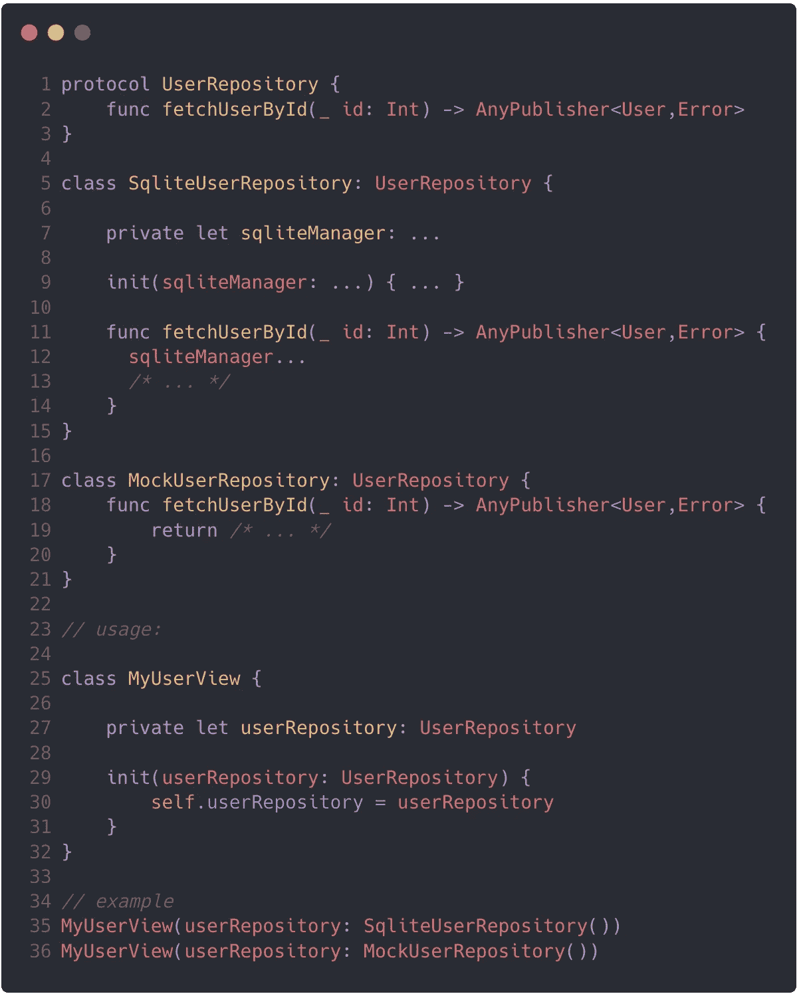
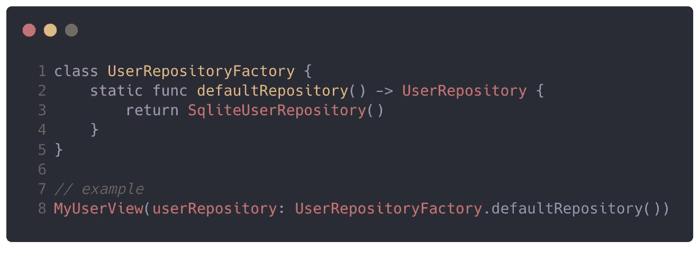
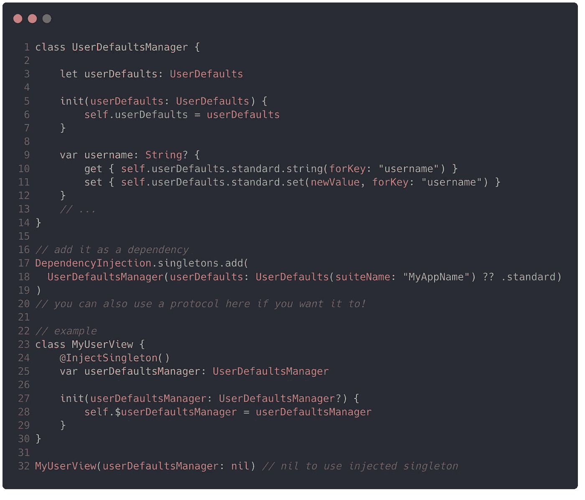
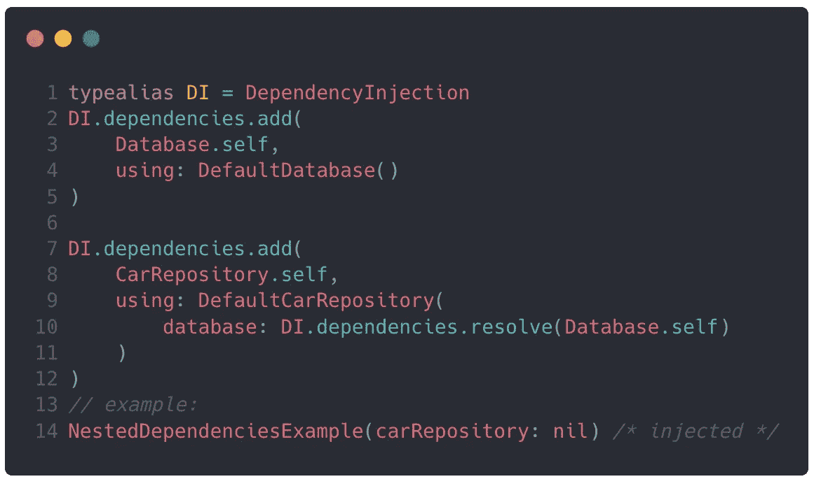

# 注入——可扩展的依赖注入，Swift +支持单例

> 原文：<https://itnext.io/inject-scalable-dependency-injection-with-swift-support-for-singletons-9aa1015d8342?source=collection_archive---------3----------------------->

使用注入进行依赖注入

**大家好！，感谢@** [**伊夫·辛克莱文**](https://medium.com/@Yves.sinkgraven?source=post_page-----204cb6374975----------------------) **给我写文章的机会** [**ITNEXT。IO**T12**。**](http://ITNEXT.IO)

Inject 是我几天前做的一个小程序库，它提供了一种使用依赖解析器注入依赖的简单方法。

# 这个想法

这个想法是在我阅读一篇 [medium 文章](https://link.medium.com/ZT3o3zkPD6)时产生的，这篇文章解释了依赖注入如何使用属性包装器为 Swift 工作。

我还在学习使用 C#的 ASP.NET 核心，我真的很喜欢向你的服务注入依赖关系是多么容易:

用 C#在 ASP.NET 核上进行依赖注入

带着这些想法，我决定为 Swift 设计一个图书馆。

但是首先，**什么是依赖注入？为此我需要使用任何外部库吗？这个图书馆提供什么？**

# 依赖注入

(这只是一个简单的解释，如果你已经知道是怎么回事，你可以跳过这一节)

基本上，假设您的应用程序中有一个视图/视图控制器，您想在其中检索从远程服务或数据库中获取的用户数据，这样您以后可以在标签或按钮等上使用它。您可能想要使用**存储库模式，**，在其中您创建不同的类来封装访问或修改数据源的逻辑。

您可以做的一件事是在您的视图中创建该存储库的一个实例，这样每当您想要使用一些数据(检索用户、修改等)时，您就可以使用该存储库。

对此的一个改进是不在视图类中实例化存储库，因为视图不应该知道存储库是如何实现或创建的，而只是想使用它。基本上，我们应该将 ***依赖倒置原则*** 付诸实践，在这种情况下，就像将依赖的实例化(我们的存储库)移动到视图构造函数中一样简单，类似于`MyView(userRepository: SomeUserRepository()).`

**另一项改进是在 Swift 中为您的存储库**(存储库或任何依赖关系)创建一个接口/协议。所以你可以用一个真实的实现或者一个模拟的实现来伪造一些数据。或者您可以有一个实现，现在使用本地数据库，但以后使用远程数据库或只是一些 web 服务。为您的依赖项提供一个公共接口是一个非常好的选择。

Swift 上简单的原生依赖注入

作为另一项改进，我们甚至可以使用**工厂模式**为我们的存储库创建一个工厂类，因此我们不用直接实例化回购，而是在一个集中的地方完成。**优点**:如果你想改变应用程序中使用的所有存储库实例，你只需要在一个地方改变它。

几乎同样的情况也适用于单例，但是需要一个共享实例。

# 注射

在解释*为什么*你可能想要使用我的库之前，首先让我给你介绍一个关于如何添加你的依赖项和使用它的小例子。这相当于我们之前讨论过的，但是使用了 inject。

使用注入添加依赖项

使用依赖项进行注入

我们**通过使用协议及其实现**来添加依赖关系。稍后**我们在我们想要使用它们的类上声明它们，并使用注入属性包装器**，从这一点开始，你可以正常地在你的类中使用你的依赖项(你只需要在你的 init 方法中使用$yourDependency，实际上这样做是可选的)。

**它是如何工作的？**

Inject 使用依赖解析器，您必须静态实例化它才能使用它。它基本上注册了你的依赖关系以及如何构建它们，以便以后可以解决它。

依赖关系解析器—注入

这就是注入属性包装器真正的工作方式，它使用在构造函数中传递的依赖解析器，稍后当您使用变量时，它解析依赖实现。

注入属性包装

如果你不想一直传递依赖解析器，你可以创建一个本地扩展，在一个空的构造函数中使用它。

**同样，单身者**

单身族呢？`Inject`支持他们。您只需要创建一个类(或者甚至是一个结构，并将其包装在一个`Box<T>`类型中)，创建一些方法，并使用一个单独的解析器添加它。您可以直接添加类型实现或使用协议，就像前面的例子一样。

带有注入的单例示例

你不需要一个静态变量，你也可以为你的 singleton 使用一个协议。

在这种情况下，单例解析器将在整个应用程序中存储单例实例的引用值。不像普通的解析器，它只保存一个函数来建立一个新的依赖关系。

**但是等等！还有更多**

嵌套依赖！

嵌套依赖示例—注入

在这种情况下，我们有一个存储库，它本身依赖于数据库管理器类或其他东西。多亏了 inject，我们只需添加所有的依赖项并神奇地使用注入的仓库:)

**更多的东西**

您也可以使用`@AutoWired`，它是另一个没有 setter 的属性包装器。我不太推荐它，因为你不能像使用 inject 那样轻易改变它的值，但是有些人可能更喜欢这样。

# 结论——优点、缺点、为什么您可能想使用注射

**缺点**:

*   对于有几个依赖项的简单/小型项目来说，可能有太多的东西。
*   这是一个项目依赖，它需要像 swift 一样更新(我希望它会更新)。

**优点**:

*   一旦设置好就很容易使用。
*   Swift 包管理器支持。
*   它使用某种工厂模式，但是在幕后，你只需要添加你的依赖项并使用它们。
*   特别支持**单线态**，不需要使用为它们创建更多的静态变量；**就把它们当做普通依赖吧！**
*   懒散地解决你的依赖。
*   强大的嵌套依赖支持。

好了，今天就到这里吧！如果你仍然感兴趣，并且认为 Inject 适合你，请在这里查看它的 github repo:

 [## illescasDaniel/Inject-Swift

### swift 的简单依赖注入，兼容结构和类。定义您的协议定义一个类(或…

github.com](https://github.com/illescasDaniel/Inject-Swift) 

下面是一个使用它的项目示例:

 [## illes cas Daniel/Inject-Swift-example

### 注入 Swift 示例。通过在 GitHub 上创建一个帐户，为 illescasDaniel/Inject-Swift-example 开发做出贡献。

github.com](https://github.com/illescasDaniel/Inject-Swift-example) 

感谢阅读！:D