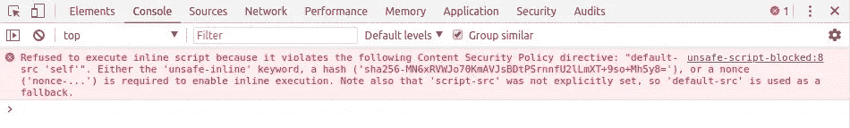

# 具有内容安全策略的内联数据

> 原文：<https://itnext.io/inline-data-with-a-content-security-policy-ab30dde2feb3?source=collection_archive---------3----------------------->

XSS 安全，即使是“旧”的应用程序。


照片由 [Ej Agumbay](https://unsplash.com/photos/OnkbHtk_S58?utm_source=unsplash&utm_medium=referral&utm_content=creditCopyText) 在 [Unsplash](https://unsplash.com/collections/945911/stock-photo?utm_source=unsplash&utm_medium=referral&utm_content=creditCopyText) 上拍摄

[*点击这里在 LinkedIn 上分享这篇文章*](https://www.linkedin.com/cws/share?url=https%3A%2F%2Fitnext.io%2Finline-data-with-a-content-security-policy-ab30dde2feb3)

# 加强安保

如果我告诉你一个简单的方法，可以让你的网站在跨站脚本(XSS)攻击中几乎不可战胜，你会使用它吗？

嗯，一个[内容安全策略](https://developer.mozilla.org/en-US/docs/Web/HTTP/CSP) (CSP)可以做到这一点！这就像从服务器提供 html 文件时添加一个额外的头一样简单。

我会在这篇文章的底部链接到更多关于如何为你的站点设置这个的信息。现在，这里有一个强大的 CSP 的例子。

```
Content-Security-Policy: default-src 'self'; form-action 'self';
```

基于这个例子，标题浏览器阻止任何内联脚本或样式运行，只允许脚本、样式、字体等资源。从我们自己的领域加载。

这就是问题所在:*没有内联 JavaScript*

# 用例

请允许我搭建舞台。我们正在构建一个 web 应用程序，我们需要来自服务器的一些数据。我们正在将现有的服务迁移到新世界的奇迹中。渐进式网络应用和所有的爵士乐。然而，我们需要的这些数据很难获得，因为它不能通过任何 web API 获得。

我们的服务器使用模板向用户显示动态内容，例如他们的姓名、年龄以及他们的狗早餐吃了什么！🐶

为了让页面在客户端脚本中使用来自服务器的数据，您可能以前见过这样的模式:

```
<!-- user-template.html - On the server -->
<script type="text/javascript">
  var firstName = "{{ user.firstName }}";
  var age = {{ user.age }};
  // the 'dump' filter calls JSON.stringify on the object
  var pet = {{ user.pet | dump }}; document.addEventListener("DOMContentLoaded", function() {
    //do work with the variables once the page is ready...
  });
</script>
```

但是现在，如果我们在 web 应用程序中使用如上 CSP 头提供上述代码，我们将在浏览器控制台中看到一条错误消息，说明该脚本未被执行。



被 CSP 阻止的脚本示例

> *注意:大多数情况下，这些数据可以(也可能应该)来自 API 调用，但是有些情况下我们会遇到这种情况。*

# 解决方案:内联 JSON

幸运的是，还有另一个简单、安全的解决方案。

代替内联 JavaScript，我们可以创建一个类型为`application/json`的`<script>`标签。浏览器不会将其视为 JavaScript，因此它会通过 CSP。

```
<!-- user-template.html -->
<script type="application/json" data-my-app-selector="user-data">
{
  "firstName": "{{ user.firstName }}",
  "age": {{ user.age }},
  "pet": {{ user.pet | dump }}
}
</script>
<script src="main.js"></script>
```

然后，在我们的主 JavaScript 文件中，我们将解析 JSON 并获取要在我们的应用程序中使用的值。

```
// main.js
function getData(dataSelect) {
  try {
    const inlineJsonElement = document.querySelector(
      `script[type="application/json"][data-my-app-selector="${dataSelect}"]`
    );
    const data = JSON.parse(inlineJsonElement.textContent);
    return data;
  } catch (err) {
    console.error(`Couldn't read JSON data from ${dataSelect}`, err);
  }
}document.addEventListener("DOMContentLoaded", function() {
  // do work with the variables once the page is ready
  const user = getData("user-data");
  console.log(user.name);
  // ...
});
```

这种模式允许我们有一个安全的 CSP，并且仍然从服务器内联数据！任务完成！

这篇文章中的所有代码都可以在[GitHub repo](https://github.com/Graham42/sample-csp-with-inline-data)中找到。您可以查看并尝试各种安全/不安全选项。

# 一些替代方案及其缺点

# 数据属性

我见过一些项目使用带有`data-xyz`属性的 html 标签来存储值。这种方法的缺点是我们会丢失数据类型信息。例如，值应该是数字`4`还是字符串`"4"`？因此，我觉得 JSON 是更好的方法。

# 基于随机数的 CSP

“Nonce”是“使用过一次的数字”的一个别出心裁的名字。它应该是随机的，不可预测的。在网页的上下文中，我们必须为每个请求生成一个新的 nonce *，否则绕过它是微不足道的。*

CSP 允许列出脚本标签可以指定的 nonce，如果脚本标签的 nonce 与 CSP 中的 nonce 匹配，它就可以运行。

有效使用随机数的关键是它们的不可猜测性。即使攻击者设法注入了脚本，他们也不知道 CSP 报头中的 nonce 是什么。浏览器将拒绝运行他们的脚本，因为 nonce 属性与标头中提供的属性不匹配。

这给我们带来了这种方法的主要问题。它被广泛误解，并且非常容易出错。我已经看到许多线程建议使用编译/构建/捆绑时生成的随机数。这比根本没有 CSP 更糟糕，因为人们认为他们得到了安全，但实际上他们是脆弱的。如果攻击者知道 nonce 是什么，他们可以将它作为一个有效属性提供给注入的脚本，浏览器会很高兴地运行它。

另一个缺点是 nonces 需要一个应用服务器。虽然上面的 JSON 示例都使用了服务器，但是也有一些用例，我们有一个静态生成的站点，并且我们想要内联一些数据，例如一个 webpack 清单。对于静态网站，应用服务器是不必要的开销。

使用 nonces 的一个更好的替代方法是使用 SHA 哈希。

# 基于 SHA 哈希的 CSP

CSP 的另一个选项是提供一个 SHA 散列列表，它与我们期望出现在页面中的内联脚本块的内容相匹配。浏览器根据提供的哈希验证脚本的内容。

这实际上是一个很好的选择。我看到的唯一缺点是，我们必须设置工具来为内联脚本块生成散列，并将这些散列提供给我们的服务器。消除所有内联 JavaScript 并对数据使用 JSON 更容易。

如果你想了解更多关于内容安全政策(CSP)的信息，我建议你查看一下 MDN 文档。

你可以使用[这个来自](https://report-uri.com/home/generate)[URI](https://report-uri.com/)的互动工具来构建你自己的 CSP

本帖回购示例:[https://github.com/Graham42/sample-csp-with-inline-data](https://github.com/Graham42/sample-csp-with-inline-data)

感谢阅读！如果你想以后看到更多我的帖子，在 Twitter 上关注我 [@graham42x](https://twitter.com/Graham42x) 。