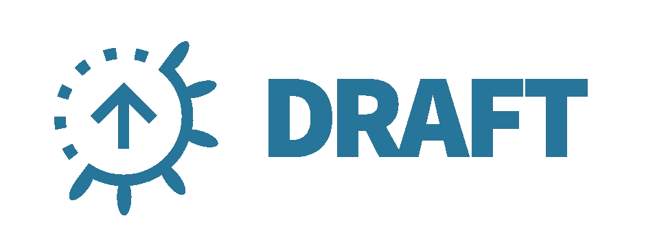

# 带草稿的内循环容器本机开发

> 原文：<https://itnext.io/inner-loop-container-native-development-with-draft-2f74f7c7f6a2?source=collection_archive---------2----------------------->


一种不同的草案

## 使用 Draft 简化内循环容器本机应用程序开发的构建、推送和部署过程

我正在探索一系列开源工具来简化容器原生开发工作流的内部循环。这描述了您正在编写代码，但是还没有将它推送到版本控制系统的一段时间。这些工具，[](https://draft.sh)**[**ska ffold**](http://skaffold.dev)和 [**Tilt**](https://tilt.dev/) 每一个都对手头的任务采取不同的方法。每个工具都可以用来构建项目的映像，将映像推送到您选择的注册服务，并将映像部署到 Kubernetes 集群上。采用这些工具将释放你的时间，让你专注于编写代码。你可以在我的第一篇[帖子](https://medium.com/@m.r.boxell/local-container-native-development-tools-ef4b1beb472c)中了解更多关于这个系列背后的动机。**

## **定义**

**[Draft](https://github.com/Azure/draft) 简化了开发人员开始将他们的应用部署到 Kubernetes 的过程。它通过为各种编程语言创建样板文件，并启用工作流来构建、推送和部署您的应用程序到 Kubernetes 集群。**

## **区分者**

**选秀因其低门槛而与众不同。大多数开发人员希望利用他们现有的编程知识快速测试如何使用 Kubernetes。他们可能不具备 Kubernetes 的专业知识或使用`kubectl`的实际经验。使用 Draft，开发人员可以用两个命令将他们的应用程序部署到 Kubernetes 集群上:`draft create`和`draft up`。**

**`draft create`用于检测您正在开发的应用程序的语言，并生成将应用程序部署到您的集群所需的工件。这是通过**草稿包**完成的，它提供了一个针对你所选语言的 Dockerfile 和 Helm chart。大多数流行的编程语言都有例子。这可以节省您从头开始编写 Dockerfile 或 Kubernetes 清单的时间。`draft up`读取您的配置，并为您处理构建、推送和部署步骤。**

**与 Skaffold 和 Tilt 不同，Draft 不会持续监视应用程序的变化。每次你想更新应用程序时，你都需要运行`draft up`。目前，Draft 仅支持根目录中的单个 docker 文件和图表，这使得使用 Draft 同时部署多个微服务成为一项挑战。Draft 依赖 Helm，这是 Kubernetes 的一个包管理工具。Helm 是一个用于将工件部署到 Kubernetes 集群的常用工具。如果它恰好是用于部署到您的生产集群的相同工具，这对于您在本地使用可能是有益的，但是拥有 Skaffold 的可插拔架构的灵活性会更好，它为您提供了使用其他工具进行部署的选项。与使用`kubectl`不同，Helm 必须单独安装，并且在许多情况下需要 RBAC 的配置。**

**值得注意的是，截至 2019 年 3 月，GitHub for Draft 的提交数和星级数约为 Skaffold 的一半，并且最近的提交数远远少于 Skaffold。**

****

## **要求**

**-[Docker For Desktop](https://www.docker.com/products/docker-desktop)
-[Kubectl](https://kubernetes.io/docs/tasks/tools/install-kubectl/)
-[Oracle Container Engine For Kubernetes(OKE)](https://docs.cloud.oracle.com/iaas/Content/ContEng/Concepts/contengoverview.htm)
-[Oracle Cloud infra structure Registry(OCIR)](https://docs.cloud.oracle.com/iaas/Content/Registry/Concepts/registryoverview.htm)
-[Helm](https://github.com/kubernetes/helm#install)**

## **装置**

**更详细的安装信息可以在[GitHub 草案页面](https://github.com/Azure/draft/blob/master/docs/install-cloud.md)上找到。**

**下载并安装草稿:**

**`brew tap azure/draft && brew install azure/draft/draft`**

**验证您的安装:**

**`draft version`**

**要安装默认插件并配置`$DRAFT_HOME`，请运行`draft init`。**

**安装将在您的主目录中创建一个`/.draft`文件夹来存储配置信息。**

## **本地配置**

**在 GitHub 上克隆[草稿库](https://github.com/Azure/draft)并切换到`/examples/example-go`目录。为了将`main.go`应用程序部署到 Kubernetes 集群，我们需要 Dockerfile、Helm chart 和 draft.toml。这些构件可以通过运行`draft create`轻松创建。Draft 检测目录中应用程序的语言，在本例中是 Go: `→ Draft detected Go (100.000000%)`并相应地创建支架:**

```
$ ls 
Dockerfile charts draft.toml glide.yaml main.go
```

*   **`Dockerfile`以默认的 Go 图像开始。它将在`requirements.txt`中安装依赖项，并将当前目录复制到`/usr/src/app`**
*   **Helm 图表包括用于将应用程序部署到集群的 Kubernetes 清单文件。在这种情况下，`/charts`和`Dockerfile`工件支持 Go 配置。**
*   **`draft.toml`文件包含应用程序配置细节:应用程序名称、图像存储库、Kubernetes 名称空间等..**

**使用本地上下文时，您可以绕过图像推送步骤。这将导致您直接从本地机器部署到 Docker for Desktop cluster。如果您没有配置图像注册表，您将在运行`draft up` : `WARNING: no registry has been set, therefore Draft will not push to a container registry`后收到此消息。**

**配置完注册中心后，就可以将应用程序部署到本地 Kubernetes 集群了。Draft 将使用您当前的 Kubernetes 上下文来确定您的应用程序将部署在哪个集群上。要找到您的上下文，请运行:`kubectl config current-context`。**

## **部署应用程序**

**运行命令`draft up`将一次处理多个动作。它将读取`draft.toml`中的配置细节，使用 Docker 构建映像，将映像推送到您的注册表，最后将`helm install`引用刚刚构建到您的 Kubernetes 集群上的映像的图表。**

```
$ draft up
Draft Up Started: ‘example-go’: 01D57NYWJ40ANYC6T2MGR6X8FR
example-go: Building Docker Image: SUCCESS ⚓ (189.0753s)
example-go: Pushing Docker Image: SUCCESS ⚓ (172.3998s)
example-go: Releasing Application: SUCCESS ⚓ (4.0052s)
```

## **验证您的部署**

**使用`kubectl get pods`验证您的应用程序是否已正确部署:**

```
$ kubectl get pods
NAME READY STATUS RESTARTS AGE
example-go-example-go-7754dd6665-trl6x 1/1 Running 0 5s
```

## **连接到应用程序**

**用`draft connect`连接到您的应用程序。这将创建到 pod 中运行的容器所公开的端口的代理连接。**

```
$ draft connect
Connect to example-go:8080 on localhost:63118$ curl localhost:63118
Hello World, I’m Golang!
```

## **修改应用程序**

**如果您修改并保存应用程序，下次运行`draft up`，Draft 将确定已经有一个现有的 Helm 版本，并将执行一个`helm upgrade`而不是另一个`helm install`，后者是您第一次部署时在后台运行的命令。**

## **删除应用程序**

**当您测试完应用程序后，通过运行`draft delete`将它从您的 Kubernetes 集群中删除:**

```
$ draft delete
app ‘example-go’ deleted
```

## **托管的 Kubernetes 和 Docker 注册表配置**

**Draft 也可以用于托管的 Kubernetes 解决方案。我的示例将使用[Oracle Container Engine for Kubernetes(OKE)](https://docs.cloud.oracle.com/iaas/Content/ContEng/Concepts/contengoverview.htm)作为 Kubernetes 集群，使用[Oracle Cloud infra structure Registry(OCIR)](https://docs.cloud.oracle.com/iaas/Content/Registry/Concepts/registryoverview.htm)作为容器映像注册表。可以按照类似的步骤用其他 Kubernetes 集群和注册服务配置 Draft。**

## **注册表配置**

**要使用云注册表服务，你需要用`draft config set registry`命令将注册表设置为草稿。要将 OCIR 设置为您的注册表，您需要提供注册表的服务器 URL。运行:`draft config set registry <region code>.ocir.io/<tenancy name>/<repo name>/<image name>:<tag>`**

*   **`Dockerfile`以默认的 Go 图像开始。它将在`requirements.txt`中安装依赖项，并将当前目录复制到`/usr/src/app`**
*   **`<region-code>`是您正在使用的 OCI 地区的代码。例如，凤凰城的区号是`phx`。参见[区域和可用性域](https://docs.cloud.oracle.com/iaas/Content/General/Concepts/regions.htm)。**
*   **`ocir.io`是 Oracle 云基础设施的注册名称。**
*   **`<tenancy-name>`是拥有您要将映像推送到的存储库的租赁的名称，例如`example-dev`。请注意，您的用户必须有权访问租赁。**
*   **`<repo-name>`(如果指定)是您要将映像推送到的存储库的名称。比如`project01`。请注意，指定存储库是可选的。如果选择指定资料档案库名称，映像的名称将用作 Oracle Cloud infra structure Registry 中的资料档案库名称。**
*   **`<image-name>`是您希望在 Oracle Cloud infra structure Registry 中为映像指定的名称，例如`helloworld`。**
*   **`<tag>`是您希望在 Oracle Cloud infra structure Registry 中赋予图像的图像标签，例如`latest`。**

**您需要使用以下信息登录注册表:**

**`docker login <region code>.ocir.io`**

*   **用户名:`<tenancy-name>/<oci-username>`**
*   **密码:`<oci-auth-token>`**

**您可能还需要与注册中心建立信任关系。例如，默认情况下，OCIR 注册表将被设置为私有。如果您想继续使用私有存储库，您将必须添加一个图像拉取秘密，它允许 Kubernetes 向容器注册中心认证以拉取私有图像。有关使用图像机密的更多信息，请参阅本指南。出于测试目的，一个更简单的选择是将注册表设置为 **public** 。**

## **Kubernetes 集群配置**

**因为 Draft 使用您当前的 Kubernetes 上下文来确定您的应用程序将部署在哪个集群上，所以您需要记住将您的上下文切换到 OKE。用`kubectl config current-context`验证你的上下文。**

**如前所述，草案部署到 Kubernetes 通过舵图表。如果您的集群启用了 RBAC，您可能需要创建一个新的服务帐户，以授予 Helm 的集群内组件 Tiller 部署到您的集群的额外权限。有关此操作的信息，请参考[舵文档](https://helm.sh/docs/using_helm/#role-based-access-control)。**

**配置完成后，运行`draft up`使用 Dockerfile 构建您的应用程序，将应用程序推送到 OCIR，并将应用程序部署到 OKE。正如您之前在本地所做的那样，您可以通过运行`kubectl get pods`来验证应用程序的成功部署。用`draft connect`连接到您的应用程序。**

## **摘要**

**对于第一次在 Kubernetes 上尝试应用程序的开发人员来说，Draft 是一个有用的工具。Draft 缺乏其他内循环开发工具的一些关键特性，包括当应用程序发生变化时自动重新部署的能力，但是 Draft packs 形式的样板文件的易用性和可用性使 Draft 成为一个有用的教育工具。**

## **参考**

**[草拟用户文档](https://draft.sh/)**

**[GitHub 草案](https://github.com/Azure/draft)**

**在 http://cloudnative.oracle.com 的[查看更多云原生和容器原生项目。](http://cloudnative.oracle.com)**