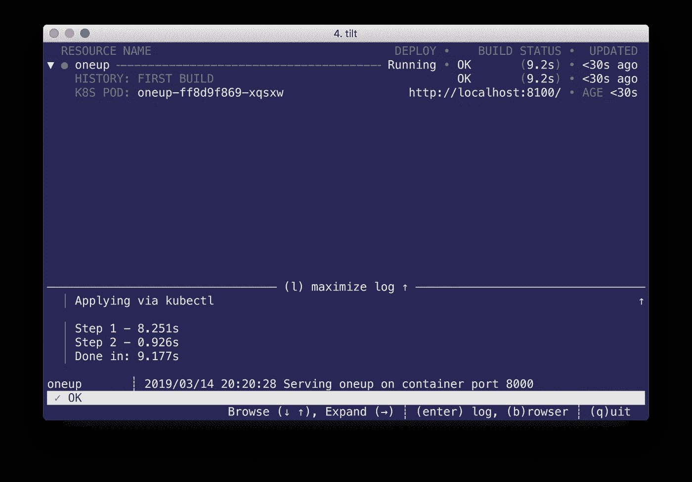

# 带 Tilt 的内循环容器本机开发

> 原文：<https://itnext.io/inner-loop-container-native-development-with-tilt-47c97fc31918?source=collection_archive---------7----------------------->


## 使用 Tilt 简化内循环容器本机应用程序开发的构建、推送和部署流程

我正在探索一系列开源工具来简化容器原生开发工作流的内部循环。这描述了您正在编写代码，但是还没有将它推送到版本控制系统的一段时间。这些工具，[](https://draft.sh)**[**ska ffold**](http://skaffold.dev)和[](https://tilt.dev/)**各自采取不同的方法来完成手头的任务。每个工具都可以用来构建项目的映像，将映像推送到您选择的注册服务，并将映像部署到 Kubernetes 集群上。采用这些工具将释放你的时间，让你专注于编写代码。你可以在我的[第一个帖子](https://medium.com/@m.r.boxell/local-container-native-development-tools-ef4b1beb472c) t 中，在我的[第二个帖子](https://medium.com/@m.r.boxell/inner-loop-container-native-development-with-draft-2f74f7c7f6a2)中使用 Draft，在我的[第三个帖子](https://medium.com/@m.r.boxell/inner-loop-container-native-development-with-skaffold-d954c8dfcda5)中使用 Skaffold 来了解这个系列背后的动机。****

## ****定义****

****[Tilt](https://github.com/windmilleng/tilt) 是一个命令行工具，用于微服务应用的本地持续开发。Tilt 使用`tilt up`监视您的文件进行编辑，然后自动构建、推送和部署任何更改，以实时更新您的环境。Tilt 通过命令行 UI 提供对微服务的可见性。除了监视部署成功，UI 还显示日志和其他关于部署的有用信息。****

## ****区分者****

****Tilt 可以轻松地同时部署多个微服务。您可以在您的`Tiltfile`中引用多个`Dockerfile`和多个 Kubernetes 清单。虽然 Tilt 和 Skaffold 都有助于开发多个互连的微服务，但 Tilt 以两个关键特性区分自己:平视显示器和[快速构建](https://docs.tilt.dev/fast_build.html)。****

****平视显示器通过 pod 名称旁边简单的绿色(成功)和红色(不成功)指示器来指示 pod 是否已成功部署到集群。它还包括关于使用 Tilt 在集群中部署的每个 pod 的名称、部署状态、部署历史和 pod 日志的信息:构建日志和运行容器日志。当您发现自己正在开发越来越多的相互关联的微服务时，这尤其有用。有些人可能会认为 UI 是多余的——当然，所有这些信息都可以使用基本的`kubectl`命令获得——但是，当 pod 问题像绿点变红一样清晰时，这无疑会让人们更难忽略它们。UI 是合理的，因为它帮助你关注重要的事情。****

****快速构建解决了本地开发的主要瓶颈之一:构建和更新过程。快速构建用于执行增量映像构建。快速构建使用构建缓存来跳过先前完成的步骤，并注入先前运行的构建缓存，而不是在每次代码更改时重新下载所有依赖项并从头重新编译。Tilt 还通过在与现有 pod 相同的节点上运行的 sidecar“Synclet”来加快部署过程。Synclet 将更新的文件添加到现有的 pod 中，并在代码发生变化时重新启动容器，而不是从头开始部署新的 pod。Synclet 允许您绕过注册表直接向 Synclet 发送代码更新，还允许您直接在集群中运行构建命令，从而进一步加快构建和部署过程。快速构建从您的`Dockerfile`手中接管了大部分构建责任。因此，您的`Dockerfile`不能包含任何添加或复制行，所以您可能需要对它做一些小的修改。****

********

## ****要求****

****-[Docker For Desktop](https://www.docker.com/products/docker-desktop)
-[Kubectl](https://kubernetes.io/docs/tasks/tools/install-kubectl/)
-[Oracle Container Engine For Kubernetes(OKE)](https://docs.cloud.oracle.com/iaas/Content/ContEng/Concepts/contengoverview.htm)
-[Oracle Cloud infra structure Registry(OCIR)](https://docs.cloud.oracle.com/iaas/Content/Registry/Concepts/registryoverview.htm)****

## ****装置****

****更详细的安装信息可以在 [Tilt GitHub 页面](https://github.com/windmilleng/tilt/)上找到。****

****下载并安装 Tilt:****

****`brew tap windmilleng/tap && brew install windmilleng/tap/tilt`****

****验证您的安装:****

****`tilt version`****

## ****本地配置****

****在 GitHub 上克隆 [Tilt 库](https://github.com/windmilleng/tilt)，转到`/integration/oneup`目录。该目录包含:****

```
**$ ls
Dockerfile	Tiltfile	main.go		oneup.yaml**
```

*   ****倾斜通过`Tiltfile`进行配置。在资源库中，您将看到一个将用于部署`oneup.yaml`的示例`Tiltfile`****
*   ****`Dockerfile`包含了关于如何构建你的`main.go`应用的信息****
*   ****`oneup.yaml`Kubernetes 清单用于构建 Dockerfile 创建的图像****

****当部署到本地集群时，如果在您的`tiltfile`中没有指定注册表，Tilt 将绕过将您的映像推送到注册表的步骤。Tilt 使用您当前的 Kubernetes 上下文来确定您的应用程序将部署在哪个集群上。要找到您的上下文运行:`kubectl config current-context`。****

## ****部署应用程序****

****运行`tilt up`来构建和部署应用程序。Tilt UI 将通过绿色指示器和部署状态`running`指示部署成功。****

********

## ****验证您的部署****

****Tilt 在 Kubernetes 清单中指定的名称空间`tilt-integration`中部署了应用程序。通过切换到该名称空间并运行`kubectl get pods`来验证您的应用程序是否被正确部署****

```
**$ kubectl get pods
NAME                     READY   STATUS    RESTARTS   AGE
oneup-7f7d69bd66-ckhct   1/1     Running   0          5s**
```

## ****连接到应用程序****

****通过键入`B`连接到您的应用程序。这将打开您的浏览器，并根据`Tiltfile`中指示的端口转发连接到“OneUp”应用程序。在本例中，浏览器将打开至`[http://localhost:8100](http://localhost:8100.)`。****

## ****修改应用程序****

****当`tilt up`运行时，构建、推送和部署应用程序将在每次代码发生变化时重新出现。您可以对您的应用进行更改、保存，并实时观察 Tilt 通过管道重新部署您更新的应用。****

## ****应用程序日志****

****从应用程序获取日志不需要额外的步骤。构建日志和运行容器日志都可以在平视显示中看到。****

## ****删除应用程序****

****当您完成应用程序的测试后，您可以通过键入`Q`退出 UI，并使用`tilt down`从您的集群中删除应用程序:****

```
**$ tilt down
Deleting via kubectl: Namespace/tilt-integration
Deleting via kubectl: Deployment/oneup**
```

## ****托管的 Kubernetes 和 Docker 注册表配置****

****Tilt 还可以与托管的 Kubernetes 解决方案一起使用。我的示例将使用[Oracle Container Engine for Kubernetes(OKE)](https://docs.cloud.oracle.com/iaas/Content/ContEng/Concepts/contengoverview.htm)作为 Kubernetes 集群，使用[Oracle Cloud infra structure Registry(OCIR)](https://docs.cloud.oracle.com/iaas/Content/Registry/Concepts/registryoverview.htm)作为容器映像注册表。可以遵循类似的步骤，用其他 Kubernetes 集群和注册服务配置 Tilt。****

## ****注册表配置****

****要使用云注册表服务，您需要将注册表的 URL 添加到您的`tiltfile`中，或者在个人设置文件中指定一个注册表。要使用 OCIR 作为您的注册中心，您需要按照以下格式提供注册中心的服务器 URL:`<region code>.ocir.io/<tenancy name>/<repo name>/<image name>:<tag>`****

*   ****`<region-code>`是您正在使用的 OCI 地区的代码。例如，凤凰城的区号是`phx`。有关更多信息，请参见[区域和可用性域](https://docs.cloud.oracle.com/iaas/Content/General/Concepts/regions.htm)。****
*   ****`ocir.io`是注册表名称。****
*   ****`<tenancy-name>`是拥有您想要将映像推送到的存储库的租赁的名称，例如`example-dev`。请注意，您的用户必须有权访问租赁。****
*   ****如果指定了`<repo-name>`，这是您要将映像推送到的存储库的名称。比如`project01`。请注意，指定存储库是可选的。如果选择指定资料档案库名称，映像的名称将用作 Oracle Cloud infra structure Registry 中的资料档案库名称。****
*   ****`<image-name>`是您希望在 Oracle Cloud infra structure Registry 中为映像指定的名称，例如`helloworld`。****
*   ****`<tag>`是您希望在 Oracle Cloud infra structure Registry 中赋予图像的图像标签，例如`latest`。****

****使用以下格式用注册表 URL 更新`tiltfile`中的`default_registry`:****

```
**default_registry('ocir.io/my-personal-project')**
```

****即使没有创建`tilt_option.json`，这个设置也会用你的注册表设置修改`tiltfile`的`docker_build`部分和`app.yaml`。****

****如果您选择使用个人注册表，那么使用 JSON 中指定的注册表创建一个`tilt_option.json`文件:****

```
**{
  "default_registry": "ocir.io/my-personal-project"
}**
```

****您需要更新您的`tiltfile`来引用该文件:****

```
**settings **=** read_json('tilt_option.json', default**=**{})
default_registry(settings**.**get('default_registry', 'ocir.io/shared-project-registry'))**
```

****您还需要使用以下信息登录注册表:****

****`docker login <region code>.ocir.io`****

*   ****用户名:`<tenancy-name>/<oci-username>`****
*   ****密码:`<oci-auth-token>`****

****您可能还需要与注册中心建立信任关系。例如，默认情况下，OCIR 注册表将被设置为私有。如果您想继续使用私有存储库，您将必须添加一个图像拉取秘密，它允许 Kubernetes 向容器注册中心认证以拉取私有图像。有关使用图像机密的更多信息，请参阅本指南。出于测试目的，一个更简单的选择是将注册表设置为 **public** 。****

## ****Kubernetes 集群配置****

****因为 Tilt 使用您当前的 Kubernetes 上下文来确定将在其上部署您的应用程序的集群，所以您需要记住切换到您的上下文来 OKE。用`kubectl config current-context`验证你的上下文。****

****配置完成后，运行`tilt up`使用 Dockerfile 构建您的应用程序，将应用程序推送到 OCIR，并将应用程序部署到 OKE。正如您之前在本地所做的那样，您可以通过更改到适当的名称空间并运行`kubectl get pods`来验证应用程序的成功部署。用`B`连接到您的应用程序。****

## ****摘要****

****Tilt 工具使部署和管理多个微服务变得简单。平视显示器通过包含日志和其他有用信息的中央仪表板简化了同时监控多个部署的过程。Tilt GitHub 页面上提供的 [Servantes](https://github.com/windmilleng/servantes) 示例微服务应用是了解 Tilt 第一手优势的绝佳方式。****

## ****参考****

****[倾斜用户文档](https://docs.tilt.dev/)****

****[倾斜 GitHub](https://github.com/windmilleng/tilt)****

****在 http://cloudnative.oracle.com 的[查看更多云原生和容器原生项目。](http://cloudnative.oracle.com)****