# 检查和了解 k8s 服务网络

> 原文：<https://itnext.io/inspecting-and-understanding-service-network-dfd8c16ff2c5?source=collection_archive---------0----------------------->

# 服务带来稳定

一个 ***Kubernetes 服务对象*** 创建了一个稳定的网络端点，它位于一组 pod 的前面，并对它们之间的流量进行负载平衡。

您总是将一个 [*服务*](https://kubernetes.io/docs/concepts/services-networking/service/) 放在一组做相同工作的 pod 前面(它们运行相同的容器映像)。例如，您可以将一个服务放在 web 前端组件的前面，将另一个放在身份验证组件的前面。你永远不要把一个服务放在做不同工作的 pod 前面(有不同的容器映像在其中运行)。

客户端与服务对话，服务负载平衡到 pod 的流量。

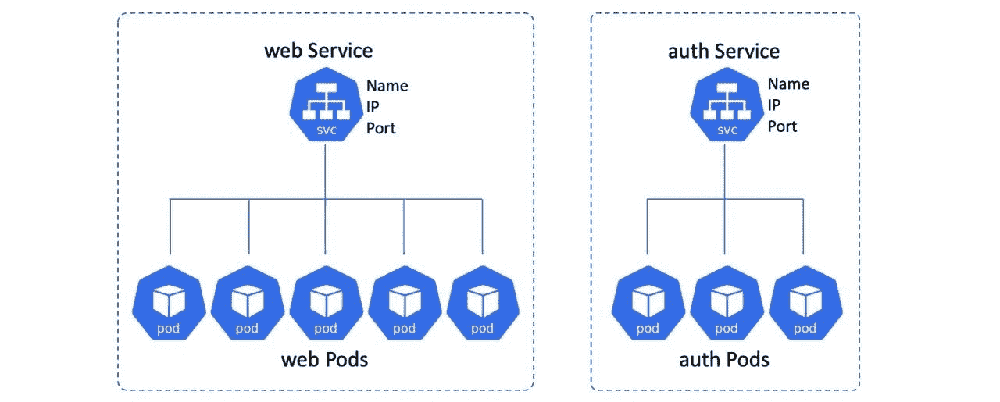

图一

在上图中，**底部的窗格可以随着*缩放*、*更新*、*故障*以及其他事件的发生而来去，并且服务保持跟踪。但是，服务的名称、IP 和端口永远不会改变。**

## 剖析 Kubernetes 服务

将 Kubernetes 服务想象成具有前端和后端是很有用的:

*   前端:名称、IP、永不改变的端口
*   后端:与标签选择器匹配的窗格

前端**稳定**和**可靠**。这意味着*名称*、 *IP、*和*端口号*保证在服务的整个生命周期内不会改变。服务前端的稳定特性也意味着您无需担心客户端上的陈旧条目，这些条目缓存 DNS 结果的时间超过了标准建议的时间。

后端是高度动态的，它将对集群中与服务被配置为寻找的一组*标签*相匹配的所有 pod 进行流量负载平衡。

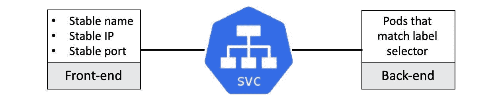

图 2

*负载平衡*在这种情况下是简单的 L4 循环负载平衡。这在“连接”级别起作用，在此级别，通过同一*连接*的所有请求都发送到同一个 Pod。这意味着两件事:

1.  来自同一个浏览器的多个请求将总是命中同一个*窗格*。这是因为浏览器通过单个*连接*发送所有请求，该连接使用 keepalives 保持打开。通过像 **curl** 这样的工具发出的请求会为每个请求打开一个新的*连接*，因此会命中不同的 pod。
2.  负载平衡不知道*应用层* (L7)概念，如 HTTP 头和基于 cookie 的会话相似性。

## 概述介绍

应用程序在*容器*中运行，容器又在*容器*中运行。Kubernetes 集群中的所有 Pod 都有自己的 IP 地址，并连接到同一个平面 [*Pod 网络*](/steps-to-emulate-pod-network-1c34209d0f53) 。这意味着所有的 pod 可以直接与所有其他的 pod 对话。但是，pod 是不可靠的，会随着扩展操作、滚动更新、回滚、故障和其他事件的发生而变化。幸运的是，Kubernetes 提供了一个稳定的网络端点，称为 ***服务*** ，它位于一组相似的 *Pods* 的前面，并提供一个稳定的名称、IP 和端口。客户端连接到*服务*并且服务负载平衡到 pod 的流量。

# 服务注册和发现

当一个新的**服务**被创建时，它被分配一个虚拟 IP 地址，称为*集群 IP* 。这是根据集群内部 DNS 中的服务名称自动注册的，并且会创建相关的端点对象(或端点片)来保存健康 pod 的列表，服务将对这些健康 pod 进行负载平衡。

同时，集群中的所有节点都配置有[iptables](https://phoenixnap.com/kb/iptables-tutorial-linux-firewall)/[IPVS](https://kubernetes.io/blog/2018/07/09/ipvs-based-in-cluster-load-balancing-deep-dive/)规则，这些规则侦听到该集群 IP 的流量，并将其重定向到真正的 Pod IPs。下图总结了该流程，尽管某些事件的顺序可能略有不同。

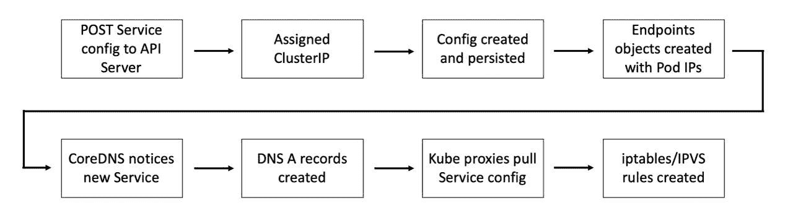

图 3

当一个单元需要连接到另一个单元时，它通过服务来完成。它向群集 DNS 发送查询以将服务名称解析为其 ClusterIP，然后向 ClusterIP 发送流量。这个集群 IP 位于一个叫做*服务网络的特殊网络上。*然而，没有到*服务网络*的路由，因此 Pod 将流量发送到其默认网关。这被转发到 Pod 正在运行的节点上的接口，并最终转发到该节点的默认网关。作为此操作的一部分，节点的内核捕获地址并重写数据包报头中的目的 IP 字段(使用 iptables/ipv ),以便它现在转到健康 Pod 的 IP。

下图对此进行了总结。

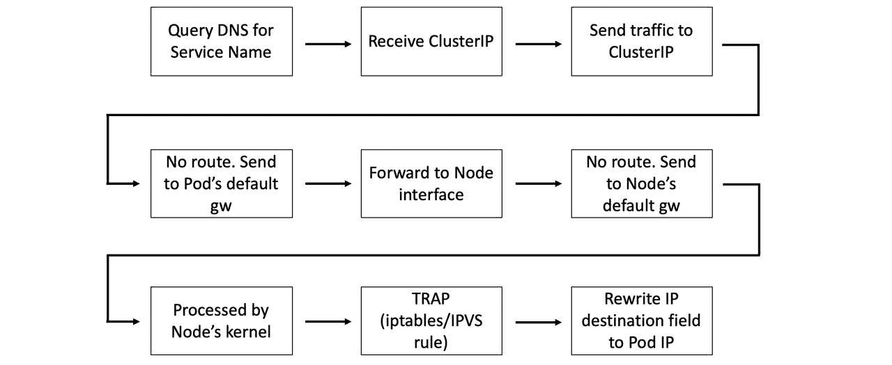

图 4

# 测试配置

我们学习了很多理论来理解服务网络，现在让我们检查一个 Kubernetes 集群的实际服务网络。

为此，请配置一个 3 节点 GKE 集群。Pod 和服务网络配置:

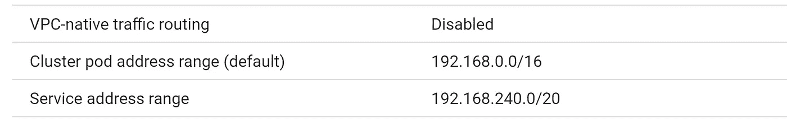

图 5

然后使用 cloud shell 上的 *kubectl* 连接到集群。授权并检查集群配置。

```
kubectl get pods -A
kubectl get nodes
kubectl get node -o custom-columns=NAME:'{.metadata.name}',\
PrivateIP:'{.status.addresses[?(@.type == "InternalIP")].address}'
```

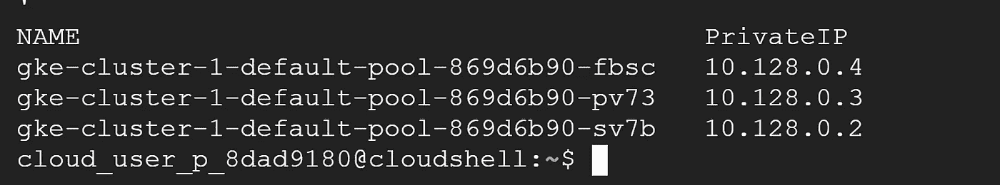

图 6

我们将通过 ssh 连接到 GKE 的 worker 节点，并查看当创建服务或扩展与服务相关的部署时，kube-proxy 如何更新 iptables/ipvs 规则。

首先，我们必须创建一个部署和一个服务来公开部署的容器。

让我们创建一个包含 3 个副本的部署

```
#on cloudshell with kubectl access
kubectl apply -f [https://k8s.io/examples/controllers/nginx-deployment.yaml](https://k8s.io/examples/controllers/nginx-deployment.yaml)kubectl get deployment -o wide
kubectl get pods -o wide
kubectl get pods -o custom-columns=NAME:'{.metadata.name}',\
HOSTIP:'{.status.hostIP}',PODIP:'{.status.podIP}'
```

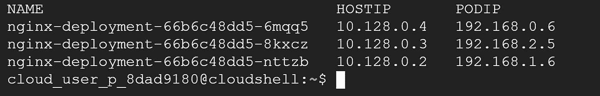

图 7

pod 由 IP 192 . 168 . 0 . 6、192.168.1.6 和 192.168.2.5 的所有 3 个不同工作节点创建

**现在让我们创建一个集群 IP 类型的服务**

```
kubectl expose deployment nginx-deployment  --name=nginx-svc  --port=80 --target-port=80 --selector='app=nginx'
kubectl get service
```


图 8

使用集群 IP 192.168.251.24 创建的服务

## **查看 Kube-proxy 配置**

Kube-Proxy 在 [GKE](https://cloud.google.com/kubernetes-engine) 中作为[静态吊舱](https://kubernetes.io/docs/tasks/configure-pod-container/static-pod/)运行。

到任何工作节点的 ssh(连接到 IP 为 10.128.0.4 的节点)。部署 nginx-deployment 的 pod 是否在该节点上运行并不重要。


图 9

在查看 kube-proxy 日志时，我们看到由于 kube-proxy 启动命令中没有提到代理模式，因此默认(iptables)被认为是代理模式。

```
# grep "proxy mode"  /var/log/kube-proxy.log
W0802 20:09:49.428959       1 server_others.go:565] Unknown proxy mode "", assuming iptables proxy
```

**所以我们将研究 iptables 规则**，因为这是 kube-proxy 使用的默认模式。

# **通过**查看**iptables 规则**了解服务网络

## **普通集群 IP 服务**

> **在群集内部 IP 上公开服务。选择该值将使服务只能从集群内部访问。这是默认的`ServiceType`。**

**在一个 worker 节点(对于我来说是 IP 10.128.0.4)上，尝试下面的命令来搜索与我们创建的服务相关的规则。让我们检查 iptables“NAT”表并搜索“nginx-svc”(服务名)。**

```
iptables -t nat -L | grep -i nginx-svc
```

**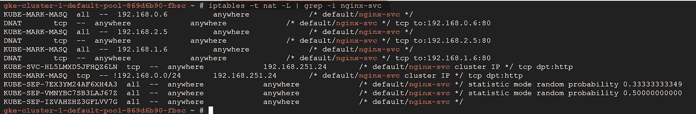**

**图 10**

**我们看到很多信息，但是很难理解它们(尤其是当你不熟悉 iptables 的时候)**

**从**预路由和输出**的链中我们可以看到，所有进入或离开 Pods 的数据包进入链**KUBE-服务**作为起点。**

**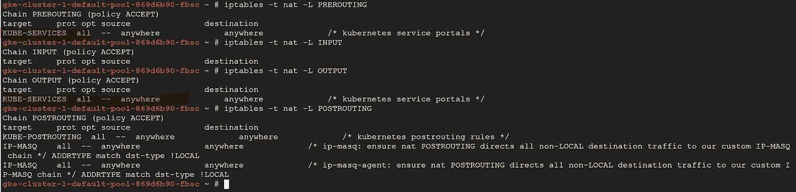**

**图 11.1**

**让我们首先看一下 **KUBE 服务链**，因为它是服务包的入口点，匹配目的 IP:端口并将包分派到相应的 KUBE-SVC-*链。**

**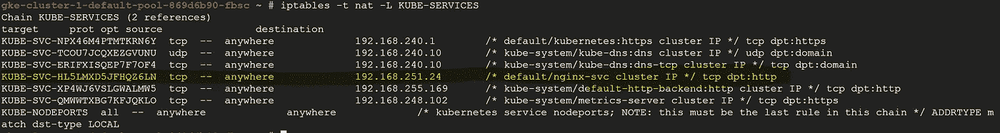**

**图 11.2**

**由于**KUBE-SVC-HL 5 lmxd 5 jfhqz 6 ln**是下一个链条，我们将对其进行检查。**

**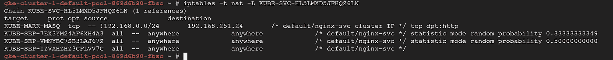**

**图 12**

**在这个特殊的**KUBE-SVC-HL 5 lmxd 5 jfhqz 6 ln**链条中我们看到有四条规则:**

*   **第一种方法是，如果**任何流量来自与“this”节点相关联的 podCIDR 外部，并且目的地是端口 80 (http)** 处的 nginx 服务，则在数据包中添加一个 Netfilter 标记，带有此标记的数据包将在 KUBE-邮政路由链的规则中被更改，以使用源网络地址转换(SNAT)，将节点的 IP 地址作为其源 IP 地址。考虑图 12 和图 13。**

**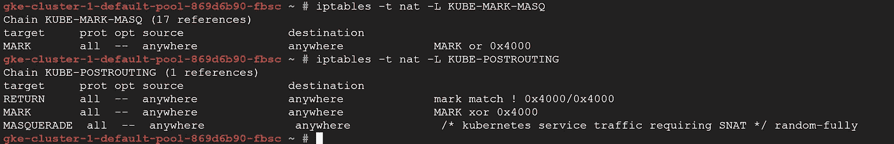**

**图 13**

*   ****KUBE-SVC-*** 充当负载平衡器，将数据包分发到 KUBE-SEP-*链。**KUBE-SEP-*的数量等于服务背后的端点数量(即运行 pod 的数量)，即三个**。选择哪个 KUBE-SEP-*是随机确定的。我们可以在图 12 中看到同样的情况。KUBE-SEP*规则是相似的，所以我们将只讨论一个。我们将在本文后面讨论“**统计模式随机概率**”。**

****KUBE-SVC-HL 5 lmxd 5 jfhqz 6 ln**会随机向**KUBE-SEP-7 ex 3 ym 24 af 6 H4 a 3 和另外 2 条链调度数据包。****

******每个 KUBE-SEP-*链分别代表一个荚或终点。******

****KUBE-SEP-7 ex 3 ym 24 af 6 H4 a 3 有两条规则:****

1.  ****向数据包添加网络过滤器标记，带有此标记的数据包将在 KUBE-后路由链的规则中被更改。KUBE-马克-MASQ 将数据包标记为稍后伪装(SNAT，因此该数据包看起来来自节点 IP) **用于离开在同一节点上调度的 pod 的数据包。******
2.  ****第二个规则将所有数据包重定向到在目标端口(本例中为 80)的同一节点上调度的 pod 的 podIP****

****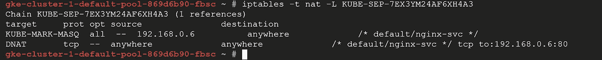****

****图 14****

****类似的规则也适用于其他两个 **KUBE-SEP-*链(图 15)******

****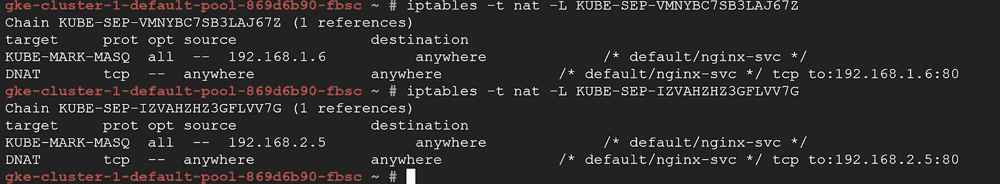****

****图 15****

******如果我们扩展部署并使副本计数从 3 变为 4，将创建另一个 KUBE-SEP-*链，并且对应于该链的规则将被添加到 KUBE-SVC-HL5LMXD5JFHQZ6LN。******

## ****节点端口服务****

> ****在一个静态端口上公开每个节点的 IP 上的服务(`NodePort`)。一个`ClusterIP`服务，`NodePort`服务路由被自动创建。您将能够通过请求`<NodeIP>:<NodePort>`从集群外部联系`NodePort`服务。****

****有两种类型的节点端口服务:****

*   ****默认服务(externalTrafficPolicy: Cluster)****
*   ****外部流量策略:本地****

****我们将讨论默认的节点端口服务(externalTrafficPolicy: Cluster)****

****为了进行测试，我更新了现有的服务，并使它的类型为“node port ”, node port 为 30010。****

```
**kubectl edit service nginx-svc**
```

****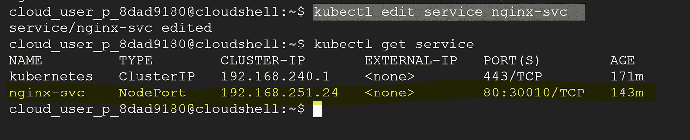****

****图 16****

****从 iptables 的角度来看，两组链和规则分别添加到链 rules 服务和 rules 节点端口:****

****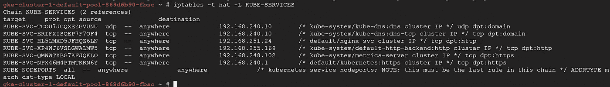****

****图 17****

****关于 KUBE 服务链，如果在该链中没有类似 KUBE-SVC*的匹配规则用于分组，则它退回到链中的最后一个规则，即 KUBE 节点端口。****

******KUBE-节点端口表示所有访问端口 30010 的数据包进入 KUBE-SVC-HL5LMXD5JFHQZ6LN 链，在那里它们首先被 SNAT-ed(目标 KUBE-马克-MASQ ),然后被转发到 KUBE-SEP*链以选择要路由到的 pod。******

****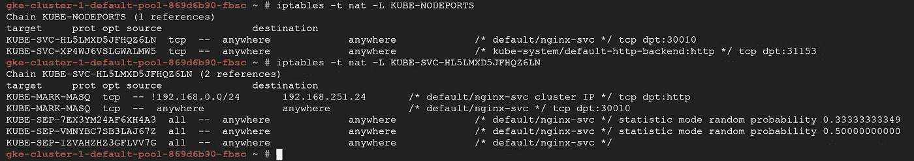****

****图 18****

## ****负载平衡器服务****

> ****使用云提供商的(GCP)负载平衡器对外公开服务。外部负载平衡器路由到的`NodePort`和`ClusterIP`服务是自动创建的。****

****如果我们将服务类型从 NodePort 更改为 LoadBalancer，则 iptables 级别没有变化。**它使用相同的 iptables 链，只是在“节点端口”前添加了一个 OSI 第 4 层(TCP)负载平衡器。******

# ****统计模式随机概率****

****为了平衡可用端点之间的流量负载，iptables 为 KUBE-SVC*链中的每个 KUBE-SEP*规则包含一个“统计模式随机概率 xx.xxx”条款。****

****iptables 引擎是确定性的，将始终使用第一个匹配规则。在本例中，KUBE-SEP-7 ex 3 ym 24 af 6 H4 a 3(图 18)将获得所有连接，但我们希望在可用端点之间实现负载平衡。****

****为了解决这个问题，iptables 包含了一个名为 **statistic** 的模块，它可以根据一些统计条件跳过或接受一个规则。统计模块支持两种不同的模式:****

*   ****`random`:根据概率跳过规则****
*   ****`nth`:基于循环算法跳过规则****

******随机平衡******

****查看图 18，**请注意，定义了 3 种不同的概率，并非处处都是 0.33。原因是规则是按顺序执行的。******

****在概率为 0.33 的情况下，第一个 KUBE-SEP*规则将在 33%的时间里被执行，而在 66%的时间里被跳过。****

****概率为 0.5 时，第二个规则将有 50%的时间被执行，50%的时间被跳过。但是，由于这个规则被放在第一个规则之后，所以它只在剩余的 66%的时间里被执行。因此，该规则将仅应用于(剩余 66%=33%中的 50%)请求。****

****由于只有 33%的流量达到最后一条规则，因此必须始终应用该规则。****

******如果我们将此部署的副本从 3 个扩展到 4 个，iptables 层的服务配置端会有什么变化？******

****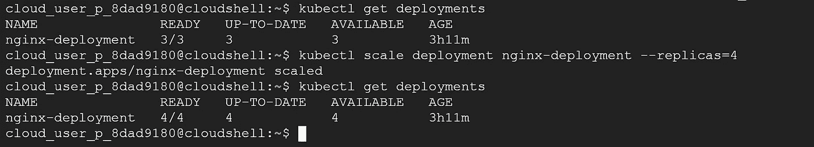****

****图 19****

****pod 的数量增加意味着端点对象的数量增加。因此，KUBE-SVC*链中 KUBE-SEP*规则的数量也将增加。****

****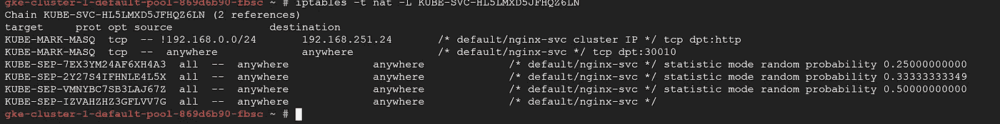****

****图 20****

****比较图 20 和图 18，现在第一 KUBE-SEP*规则将在所有分组的 25%上执行，第二规则将在剩余的 75%时间的 33%上执行，这也是总时间的 25%。第三个将执行剩余 50%次数的 50%,最后一个将执行总次数的 25%。****

# ****我们没有涵盖的事情****

****本文中没有讨论某些服务配置:****

1.  ****外部 IP 服务- *如果有路由到一个或多个集群节点的外部 IP，Kubernetes 服务可以在这些外部 IP 上公开。通过服务端口上的外部 IP(作为目标 IP)进入集群的流量将被路由到其中一个服务端点。*****
2.  ****会话相似性服务- *Kubernetes 支持基于客户端的会话相似性，会话相似性使得来自同一个客户端的请求总是被路由回同一个 pod。*****
3.  ****没有端点服务-*cluster IP 服务总是与后端 pod 相关联，它使用一个"* ***选择器*** *"来选择后端 pod，如果基于一个* ***选择器*** *找到后端 pod，Kubernetes 将创建一个端点对象来映射到 pod 的 IP: Port，否则，该服务将没有任何端点。*****
4.  ****无头服务— *有时您不需要或不想要负载平衡和单个服务 IP。在这种情况下，您可以通过为集群 IP 指定*`*"None"*`*(*`*.spec.clusterIP*`*)来创建“无头”服务。*****
5.  ****使用“externalTrafficPolicy: Local”的节点端口服务将保留源 IP，并丢弃来自没有本地端点的工作节点的数据包。****

****请阅读我的其他文章，并分享您的反馈。如果你喜欢分享的内容，请点赞、评论并订阅新文章。****