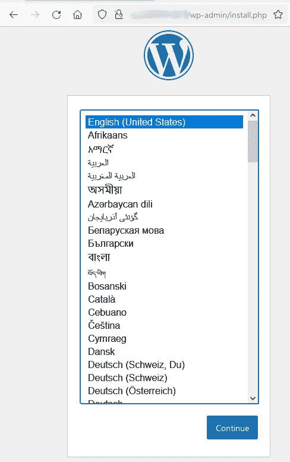

# 安装和配置 MySQL 服务器和 MySQL InnoDB 集群

> 原文：<https://itnext.io/install-and-configure-mysql-server-and-mysql-innodb-cluster-c2777cc25b29?source=collection_archive---------3----------------------->


[该角色](https://github.com/garutilorenzo/ansible-role-linux-mysql)将使用 [MySQL InnoDB 集群](https://dev.mysql.com/doc/refman/8.0/en/mysql-innodb-cluster-introduction.html)或 [GTID 复制](https://dev.mysql.com/doc/mysql-replication-excerpt/5.6/en/replication-gtids.html)安装和配置 MySQL 服务器或高可用性模式下的 MySQL

# 角色变量

角色接受[这个](https://garutilorenzo.github.io/ansible-role-linux-mysql/#role-variables)变量

# 流浪起来，建立测试基础设施

为了测试这个角色，我们使用了[vagger](https://www.vagrantup.com/)和 [Virtualbox](https://www.virtualbox.org/) ，但是如果您愿意，您也可以使用自己的虚拟机或裸机。

第一步是下载[这个](https://github.com/garutilorenzo/ansible-role-linux-mysql) repo 并刷新所有虚拟机。但是首先在这个流浪者文件中，将你的公共 ssh 密钥粘贴到变量 *CHANGE_ME* 中。您还可以通过更改 NNODES 变量来调整部署的虚拟机数量(在本例中，我们将使用 5 个节点)。现在，我们准备好调配机器了:

```
git clone [https://github.com/garutilorenzo/ansible-role-linux-mysql.git](https://github.com/garutilorenzo/ansible-role-linux-mysql.git)cd ansible-role-linux-mysql/vagrant up
Bringing machine 'my-ubuntu-0' up with 'virtualbox' provider...
Bringing machine 'my-ubuntu-1' up with 'virtualbox' provider...
Bringing machine 'my-ubuntu-2' up with 'virtualbox' provider...
Bringing machine 'my-ubuntu-3' up with 'virtualbox' provider...
Bringing machine 'my-ubuntu-4' up with 'virtualbox' provider...[...]
[...]my-ubuntu-4: Inserting generated public key within guest...
==> my-ubuntu-4: Machine booted and ready!
==> my-ubuntu-4: Checking for guest additions in VM...
    my-ubuntu-4: The guest additions on this VM do not match the installed version of
    my-ubuntu-4: VirtualBox! In most cases this is fine, but in rare cases it can
    my-ubuntu-4: prevent things such as shared folders from working properly. If you see
    my-ubuntu-4: shared folder errors, please make sure the guest additions within the
    my-ubuntu-4: virtual machine match the version of VirtualBox you have installed on
    my-ubuntu-4: your host and reload your VM.
    my-ubuntu-4:
    my-ubuntu-4: Guest Additions Version: 6.0.0 r127566
    my-ubuntu-4: VirtualBox Version: 6.1
==> my-ubuntu-4: Setting hostname...
==> my-ubuntu-4: Configuring and enabling network interfaces...
==> my-ubuntu-4: Mounting shared folders...
    my-ubuntu-4: /vagrant => C:/Users/Lorenzo Garuti/workspaces/simple-ubuntu
==> my-ubuntu-4: Running provisioner: shell...
    my-ubuntu-4: Running: inline script
==> my-ubuntu-4: Running provisioner: shell...
    my-ubuntu-4: Running: inline script
    my-ubuntu-4: hello from node 5
```

# 可行的设置和飞行前检查

现在，如果您没有安装 Ansible，请安装 ansible 并满足所有要求:

```
apt-get install python3 python3-pip uuidgen openssl
pip3 install pipenvpipenv shell
pip install -r requirements.txt
```

现在安装了 Ansible，我们可以直接从 GitHub 下载角色:

```
ansible-galaxy install git+https://github.com/garutilorenzo/ansible-role-linux-mysql.git
```

安装 Ansible 和角色后，我们可以设置我们的清单文件(hosts.ini):

```
[mysql]
my-ubuntu-0 ansible_host=192.168.25.110
my-ubuntu-1 ansible_host=192.168.25.111
my-ubuntu-2 ansible_host=192.168.25.112
my-ubuntu-3 ansible_host=192.168.25.113
my-ubuntu-4 ansible_host=192.168.25.114
```

和 vars.yml 文件:

```
---

disable_firewall: yes
disable_selinux: yes
mysql_resolv_mode: hosts
mysql_subnet: 192.168.25.0/24
mysql_listen_all_interfaces: yes

mysql_root_pw: '<CHANGE_ME>' # <- openssl rand -base64 32 | sed 's/=//'
mysql_replication_mode: 'InnoDB Cluster'
mysql_gr_name: '<CHANGE_ME>' # <- uuidgen
mysql_gr_vcu: '<CHANGE_ME>' #  <- uuidgen
mysql_innodb_cluster_name: 'cluster_lab'
```

**注意** mysql_gr_name 和 mysql_gr_vcu 是不同的 uuid，所以运行两次 uuidgen。对于此 var，我们将在高可用性模式下部署 MySQL 和 MySQL InnoDB 集群，该集群将从现有的[组复制](https://dev.mysql.com/doc/refman/8.0/en/group-replication.html)配置中创建。

继续安装之前的最后一步是创建 site.yml 文件:

```
---
- hosts: mysql
  become: yes
  remote_user: vagrant
  roles: 
    - role: ansible-role-linux-mysql
  vars_files:
    - vars.yml
```

# 部署 MySQL InnoDB 集群

我们终于可以使用 ansible 部署 MySQL InnoDB 集群了:

```
export ANSIBLE_HOST_KEY_CHECKING=False # Ansible skip ssh-key validationansible-playbook -i hosts.ini site.yml -e mysql_bootstrap_host=my-ubuntu-0TASK [ansible-role-linux-mysql : render mysql.conf.d/mysqld.cnf] *******************************************************************************************
ok: [my-ubuntu-0]
ok: [my-ubuntu-2]
ok: [my-ubuntu-1]
ok: [my-ubuntu-3]
ok: [my-ubuntu-4]TASK [ansible-role-linux-mysql : render mysql.conf.d/gtid.cnf] *********************************************************************************************
ok: [my-ubuntu-1]
ok: [my-ubuntu-0]
ok: [my-ubuntu-3]
ok: [my-ubuntu-2]
ok: [my-ubuntu-4]TASK [ansible-role-linux-mysql : ansible.builtin.fail] *****************************************************************************************************
skipping: [my-ubuntu-0]
skipping: [my-ubuntu-1]
skipping: [my-ubuntu-2]
skipping: [my-ubuntu-3]
skipping: [my-ubuntu-4]TASK [ansible-role-linux-mysql : ansible.builtin.fail] *****************************************************************************************************
skipping: [my-ubuntu-0]
skipping: [my-ubuntu-1]
skipping: [my-ubuntu-2]
skipping: [my-ubuntu-3]
skipping: [my-ubuntu-4]TASK [ansible-role-linux-mysql : render innodb_cluster.cnf] ************************************************************************************************
ok: [my-ubuntu-0]
ok: [my-ubuntu-1]
ok: [my-ubuntu-3]
ok: [my-ubuntu-2]
ok: [my-ubuntu-4]RUNNING HANDLER [ansible-role-linux-mysql : reload systemd] ************************************************************************************************
ok: [my-ubuntu-3]
ok: [my-ubuntu-0]
ok: [my-ubuntu-2]
ok: [my-ubuntu-4]
ok: [my-ubuntu-1]PLAY RECAP *************************************************************************************************************************************************
my-ubuntu-0               : ok=69   changed=27   unreachable=0    failed=0    skipped=12   rescued=0    ignored=0   
my-ubuntu-1               : ok=71   changed=28   unreachable=0    failed=0    skipped=10   rescued=0    ignored=0   
my-ubuntu-2               : ok=71   changed=28   unreachable=0    failed=0    skipped=10   rescued=0    ignored=0   
my-ubuntu-3               : ok=71   changed=28   unreachable=0    failed=0    skipped=10   rescued=0    ignored=0   
my-ubuntu-4               : ok=71   changed=28   unreachable=0    failed=0    skipped=10   rescued=0    ignored=0
```

现在已经安装了集群，但是我们必须保留一些配置。由于该集群是一个新集群，Ansible 已经在[引导](https://dev.mysql.com/doc/refman/8.0/en/group-replication-bootstrap.html)模式下启动了组复制。这意味着第一个实例(在本例中为 my-ubuntu-0)的 te 值*group _ replication _ bootstrap _ group*在设置为*，而*group _ replication _ group _ seeds*设置为空值。随着 Ansible 的第二次运行，这些变量将被设置为正确的值:*

```
ansible-playbook -i hosts.ini site.ymlTASK [ansible-role-linux-mysql : ansible.builtin.fail] *****************************************************************************************************
skipping: [my-ubuntu-0]
skipping: [my-ubuntu-1]
skipping: [my-ubuntu-2]
skipping: [my-ubuntu-3]
skipping: [my-ubuntu-4]TASK [ansible-role-linux-mysql : ansible.builtin.fail] *****************************************************************************************************
skipping: [my-ubuntu-0]
skipping: [my-ubuntu-1]
skipping: [my-ubuntu-2]
skipping: [my-ubuntu-3]
skipping: [my-ubuntu-4]TASK [ansible-role-linux-mysql : render innodb_cluster.cnf] ************************************************************************************************
ok: [my-ubuntu-2]
ok: [my-ubuntu-4]
ok: [my-ubuntu-1]
ok: [my-ubuntu-3]
changed: [my-ubuntu-0]PLAY RECAP *************************************************************************************************************************************************
my-ubuntu-0               : ok=30   changed=1    unreachable=0    failed=0    skipped=18   rescued=0    ignored=0   
my-ubuntu-1               : ok=30   changed=0    unreachable=0    failed=0    skipped=18   rescued=0    ignored=0   
my-ubuntu-2               : ok=30   changed=0    unreachable=0    failed=0    skipped=18   rescued=0    ignored=0   
my-ubuntu-3               : ok=30   changed=0    unreachable=0    failed=0    skipped=18   rescued=0    ignored=0   
my-ubuntu-4               : ok=30   changed=0    unreachable=0    failed=0    skipped=18   rescued=0    ignored=0
```

在本指南中，mysqlsh 用于在 MySQL InnoDB 集群上进行操作。在这里，你可以找到更多关于 mysqlsh 的信息。

现在我们终于可以检查我们的集群了:

```
root@my-ubuntu-0:~# mysqlsh root@my-ubuntu-0
Please provide the password for 'root@my-ubuntu-0': ******************************************
MySQL  localhost:33060+ ssl  JS > clu = dba.getCluster()
MySQL  localhost:33060+ ssl  JS > clu.status()
{
    "clusterName": "cluster_lab", 
    "defaultReplicaSet": {
        "name": "default", 
        "primary": "my-ubuntu-0:3306", 
        "ssl": "DISABLED", 
        "status": "OK", 
        "statusText": "Cluster is ONLINE and can tolerate up to 2 failures.", 
        "topology": {
            "my-ubuntu-0:3306": {
                "address": "my-ubuntu-0:3306", 
                "memberRole": "PRIMARY", 
                "mode": "R/W", 
                "readReplicas": {}, 
                "replicationLag": "applier_queue_applied", 
                "role": "HA", 
                "status": "ONLINE", 
                "version": "8.0.30"
            }, 
            "my-ubuntu-1:3306": {
                "address": "my-ubuntu-1:3306", 
                "memberRole": "SECONDARY", 
                "mode": "R/O", 
                "readReplicas": {}, 
                "replicationLag": "applier_queue_applied", 
                "role": "HA", 
                "status": "ONLINE", 
                "version": "8.0.30"
            }, 
            "my-ubuntu-2:3306": {
                "address": "my-ubuntu-2:3306", 
                "memberRole": "SECONDARY", 
                "mode": "R/O", 
                "readReplicas": {}, 
                "replicationLag": "applier_queue_applied", 
                "role": "HA", 
                "status": "ONLINE", 
                "version": "8.0.30"
            }, 
            "my-ubuntu-3:3306": {
                "address": "my-ubuntu-3:3306", 
                "memberRole": "SECONDARY", 
                "mode": "R/O", 
                "readReplicas": {}, 
                "replicationLag": "applier_queue_applied", 
                "role": "HA", 
                "status": "ONLINE", 
                "version": "8.0.30"
            }, 
            "my-ubuntu-4:3306": {
                "address": "my-ubuntu-4:3306", 
                "memberRole": "SECONDARY", 
                "mode": "R/O", 
                "readReplicas": {}, 
                "replicationLag": "applier_queue_applied", 
                "role": "HA", 
                "status": "ONLINE", 
                "version": "8.0.30"
            }
        }, 
        "topologyMode": "Single-Primary"
    }, 
    "groupInformationSourceMember": "my-ubuntu-0:3306"
}
```

# 集群高可用性检查

为了测试集群，我们可以使用一个示例 Docker 组合堆栈，该示例使用:

*   Wordpress 作为前端
*   mysqlrouter 将 WP 连接到 MySQL

要运行该测试，您必须安装[对接器](https://docs.docker.com/get-docker/)和[对接器组合](https://docs.docker.com/compose/install/)。

## 用户和数据库创建

我们需要为 wordpress 创建一个数据库和一个用户，为此我们必须找到主服务器(检查集群状态，并使用-> "mode": "R/W "找到节点)

```
root@my-ubuntu-0:~# mysqlsh root@localhost
Please provide the password for 'root@localhost': ******************************************MySQL  localhost:33060+ ssl  JS > \sql # <- SWITCH TO SQL MODE
Switching to SQL mode... Commands end with ;create database wordpress;
create user 'wordpress'@'%' identified by 'wordpress';
grant all on wordpress.* TO 'wordpress'@'%';
flush privileges;
```

## 示例 Dokcer 合成堆栈

示例堆栈可以在[示例](https://garutilorenzo.github.io/ansible-role-linux-mysql/examples/)文件夹中找到，这是合成文件:

```
version: '3.4'
services:
  wordpress:
    image: wordpress:latest
    ports:
      - 80:80
    restart: always
    environment:
      - WORDPRESS_DB_HOST=mysqlrouter:6446
      - WORDPRESS_DB_USER=wordpress
      - WORDPRESS_DB_PASSWORD=wordpress
      - WORDPRESS_DB_NAME=wordpressmysqlrouter:
    image: garutilorenzo/mysqlrouter:8.0.30
    volumes:
      - type: volume
        source: mysqlrouter
        target: /app/mysqlrouter/
        volume:
          nocopy: true
    environment:
     - MYSQL_HOST=my-ubuntu-0
     - MYSQL_PORT=3306
     - MYSQL_USER=root
     - MYSQL_PASSWORD=<CHANGE_ME> # <- the same password in the vars.yml file
     - MYSQL_ROUTER_ACCOUNT=mysql_router_user
     - MYSQL_ROUTER_PASSWORD=<CHANGE_ME> # <- openssl rand -base64 32 | sed 's/=//'
    extra_hosts:
      my-ubuntu-0: 192.168.25.110
      my-ubuntu-1: 192.168.25.111
      my-ubuntu-2: 192.168.25.112
      my-ubuntu-3: 192.168.25.113
      my-ubuntu-4: 192.168.25.114volumes:
 mysqlrouter:
```

现在，我们可以启动堆栈并检查日志了:

```
docker-compose -f mysql-router-compose.yml up -d
docker-compose -f mysql-router-compose.yml logs mysqlrouterexamples-mysqlrouter-1  | Succesfully contacted mysql server at my-ubuntu-0\. Checking for cluster state.
examples-mysqlrouter-1  | Check if config exist
examples-mysqlrouter-1  | bootstrap mysqlrouter with account mysql_router_user
examples-mysqlrouter-1  | Succesfully contacted mysql server at my-ubuntu-0\. Trying to bootstrap.
examples-mysqlrouter-1  | Please enter MySQL password for root: 
examples-mysqlrouter-1  | # Bootstrapping MySQL Router instance at '/app/mysqlrouter'...
examples-mysqlrouter-1  | 
examples-mysqlrouter-1  | Please enter MySQL password for mysql_router_user: 
examples-mysqlrouter-1  | - Creating account(s) (only those that are needed, if any)
examples-mysqlrouter-1  | - Verifying account (using it to run SQL queries that would be run by Router)
examples-mysqlrouter-1  | - Storing account in keyring
examples-mysqlrouter-1  | - Adjusting permissions of generated files
examples-mysqlrouter-1  | - Creating configuration /app/mysqlrouter/mysqlrouter.conf
examples-mysqlrouter-1  | 
examples-mysqlrouter-1  | # MySQL Router configured for the InnoDB Cluster 'cluster_lab'
examples-mysqlrouter-1  | 
examples-mysqlrouter-1  | After this MySQL Router has been started with the generated configuration
examples-mysqlrouter-1  | 
examples-mysqlrouter-1  |     $ mysqlrouter -c /app/mysqlrouter/mysqlrouter.conf
examples-mysqlrouter-1  | 
examples-mysqlrouter-1  | InnoDB Cluster 'cluster_lab' can be reached by connecting to:
examples-mysqlrouter-1  | 
examples-mysqlrouter-1  | ## MySQL Classic protocol
examples-mysqlrouter-1  | 
examples-mysqlrouter-1  | - Read/Write Connections: localhost:6446
examples-mysqlrouter-1  | - Read/Only Connections:  localhost:6447
examples-mysqlrouter-1  | 
examples-mysqlrouter-1  | ## MySQL X protocol
examples-mysqlrouter-1  | 
examples-mysqlrouter-1  | - Read/Write Connections: localhost:6448
examples-mysqlrouter-1  | - Read/Only Connections:  localhost:6449
examples-mysqlrouter-1  | 
examples-mysqlrouter-1  | Starting mysql-router.
examples-mysqlrouter-1  | 2022-08-30 12:03:57 io INFO [7f794f1e0bc0] starting 4 io-threads, using backend 'linux_epoll'
examples-mysqlrouter-1  | 2022-08-30 12:03:57 http_server INFO [7f794f1e0bc0] listening on 0.0.0.0:8443
examples-mysqlrouter-1  | 2022-08-30 12:03:57 metadata_cache_plugin INFO [7f794a606700] Starting Metadata Cache
examples-mysqlrouter-1  | 2022-08-30 12:03:57 metadata_cache INFO [7f794a606700] Connections using ssl_mode 'PREFERRED'
examples-mysqlrouter-1  | 2022-08-30 12:03:57 metadata_cache INFO [7f7948602700] Starting metadata cache refresh thread
examples-mysqlrouter-1  | 2022-08-30 12:03:57 routing INFO [7f790e7fc700] [routing:bootstrap_rw] started: routing strategy = first-available
examples-mysqlrouter-1  | 2022-08-30 12:03:57 routing INFO [7f790e7fc700] Start accepting connections for routing routing:bootstrap_rw listening on 6446
examples-mysqlrouter-1  | 2022-08-30 12:03:57 routing INFO [7f790dffb700] [routing:bootstrap_x_ro] started: routing strategy = round-robin-with-fallback
examples-mysqlrouter-1  | 2022-08-30 12:03:57 routing INFO [7f790dffb700] Start accepting connections for routing routing:bootstrap_x_ro listening on 6449
examples-mysqlrouter-1  | 2022-08-30 12:03:57 routing INFO [7f790effd700] [routing:bootstrap_ro] started: routing strategy = round-robin-with-fallback
examples-mysqlrouter-1  | 2022-08-30 12:03:57 routing INFO [7f790effd700] Start accepting connections for routing routing:bootstrap_ro listening on 6447
examples-mysqlrouter-1  | 2022-08-30 12:03:57 metadata_cache INFO [7f7948602700] Connected with metadata server running on my-ubuntu-2:3306
examples-mysqlrouter-1  | 2022-08-30 12:03:57 routing INFO [7f790d7fa700] [routing:bootstrap_x_rw] started: routing strategy = first-available
examples-mysqlrouter-1  | 2022-08-30 12:03:57 routing INFO [7f790d7fa700] Start accepting connections for routing routing:bootstrap_x_rw listening on 6448
examples-mysqlrouter-1  | 2022-08-30 12:03:57 metadata_cache INFO [7f7948602700] Potential changes detected in cluster 'cluster_lab' after metadata refresh
examples-mysqlrouter-1  | 2022-08-30 12:03:57 metadata_cache INFO [7f7948602700] Metadata for cluster 'cluster_lab' has 5 member(s), single-primary: (view_id=0)
examples-mysqlrouter-1  | 2022-08-30 12:03:57 metadata_cache INFO [7f7948602700]     my-ubuntu-2:3306 / 33060 - mode=RO 
examples-mysqlrouter-1  | 2022-08-30 12:03:57 metadata_cache INFO [7f7948602700]     my-ubuntu-1:3306 / 33060 - mode=RO 
examples-mysqlrouter-1  | 2022-08-30 12:03:57 metadata_cache INFO [7f7948602700]     my-ubuntu-0:3306 / 33060 - mode=RW 
examples-mysqlrouter-1  | 2022-08-30 12:03:57 metadata_cache INFO [7f7948602700]     my-ubuntu-3:3306 / 33060 - mode=RO 
examples-mysqlrouter-1  | 2022-08-30 12:03:57 metadata_cache INFO [7f7948602700]     my-ubuntu-4:3306 / 33060 - mode=RO
```

## 测试前端

现在如果你试图访问本地主机，你可以看到 Wordpress 安装页面:



安装并配置 WP，现在我们已经准备好一些[混沌猴](https://netflix.github.io/chaosmonkey/)

## 模拟灾难

为了测试 WP 的可达性，我们可以开始这个简单的测试:

```
while true; do curl -s -o /dev/null -w "%{http_code}" http://localhost; echo; sleep 1; done
200
200
```

现在关闭 RW 节点(在本例中是 my-ubuntu-0):

```
root@my-ubuntu-0:~# sudo halt -p
Connection to 192.168.25.110 closed by remote host.
Connection to 192.168.25.110 closed.
```

并检查测试脚本的输出:

```
while true; do curl -s -o /dev/null -w "%{http_code}" [http://localhost](http://localhost); echo; sleep 1; done
200
500 # <- my-ubuntu-0 shutdown and MySQL primary switch
200
200
```

现在，我们从第二个节点检查群集状态，我们看到该群集仍然*在线*，并且可以再容忍一个故障:

```
root@my-ubuntu-1:~# mysqlsh root@localhost
Please provide the password for 'root@localhost': ******************************************MySQL  localhost:33060+ ssl  JS > clu = dba.getCluster()
MySQL  localhost:33060+ ssl  JS > clu.status()
{
    "clusterName": "cluster_lab", 
    "defaultReplicaSet": {
        "name": "default", 
        "primary": "my-ubuntu-2:3306", 
        "ssl": "DISABLED", 
        "status": "OK_PARTIAL", 
        "statusText": "Cluster is ONLINE and can tolerate up to ONE failure. 1 member is not active.", 
        "topology": {
            "my-ubuntu-0:3306": {
                "address": "my-ubuntu-0:3306", 
                "memberRole": "SECONDARY", 
                "mode": "n/a", 
                "readReplicas": {}, 
                "role": "HA", 
                "shellConnectError": "MySQL Error 2003: Could not open connection to 'my-ubuntu-0:3306': Can't connect to MySQL server on 'my-ubuntu-0:3306' (110)", 
                "status": "(MISSING)"
            }, 
            "my-ubuntu-1:3306": {
                "address": "my-ubuntu-1:3306", 
                "memberRole": "SECONDARY", 
                "mode": "R/O", 
                "readReplicas": {}, 
                "replicationLag": "applier_queue_applied", 
                "role": "HA", 
                "status": "ONLINE", 
                "version": "8.0.30"
            }, 
            "my-ubuntu-2:3306": {
                "address": "my-ubuntu-2:3306", 
                "memberRole": "PRIMARY", 
                "mode": "R/W", 
                "readReplicas": {}, 
                "replicationLag": "applier_queue_applied", 
                "role": "HA", 
                "status": "ONLINE", 
                "version": "8.0.30"
            }, 
            "my-ubuntu-3:3306": {
                "address": "my-ubuntu-3:3306", 
                "memberRole": "SECONDARY", 
                "mode": "R/O", 
                "readReplicas": {}, 
                "replicationLag": "applier_queue_applied", 
                "role": "HA", 
                "status": "ONLINE", 
                "version": "8.0.30"
            }, 
            "my-ubuntu-4:3306": {
                "address": "my-ubuntu-4:3306", 
                "memberRole": "SECONDARY", 
                "mode": "R/O", 
                "readReplicas": {}, 
                "replicationLag": "applier_queue_applied", 
                "role": "HA", 
                "status": "ONLINE", 
                "version": "8.0.30"
            }
        }, 
        "topologyMode": "Single-Primary"
    }, 
    "groupInformationSourceMember": "my-ubuntu-2:3306"
}
 MySQL  localhost:33060+ ssl  JS >
```

如果您检查 WP 在 [localhost](http://localhost) 仍然可用，那么主节点现在是 *my-ubuntu-2* 节点。现在，如果我们再次启动 *my-ubuntu-0* 节点，该节点将重新加入集群，并从其他节点获取更新:

```
root@my-ubuntu-1:~# mysqlsh root@localhost
Please provide the password for 'root@localhost': ******************************************MySQL  localhost:33060+ ssl  JS > clu = dba.getCluster()
MySQL  localhost:33060+ ssl  JS > clu.status()
{
    "clusterName": "cluster_lab", 
    "defaultReplicaSet": {
        "name": "default", 
        "primary": "my-ubuntu-2:3306", 
        "ssl": "DISABLED", 
        "status": "OK", 
        "statusText": "Cluster is ONLINE and can tolerate up to 2 failures.", 
        "topology": {
            "my-ubuntu-0:3306": {
                "address": "my-ubuntu-0:3306", 
                "memberRole": "SECONDARY", 
                "mode": "R/O", 
                "readReplicas": {}, 
                "replicationLag": "applier_queue_applied", 
                "role": "HA", 
                "status": "ONLINE", 
                "version": "8.0.30"
            }, 
            "my-ubuntu-1:3306": {
                "address": "my-ubuntu-1:3306", 
                "memberRole": "SECONDARY", 
                "mode": "R/O", 
                "readReplicas": {}, 
                "replicationLag": "applier_queue_applied", 
                "role": "HA", 
                "status": "ONLINE", 
                "version": "8.0.30"
            }, 
            "my-ubuntu-2:3306": {
                "address": "my-ubuntu-2:3306", 
                "memberRole": "PRIMARY", 
                "mode": "R/W", 
                "readReplicas": {}, 
                "replicationLag": "applier_queue_applied", 
                "role": "HA", 
                "status": "ONLINE", 
                "version": "8.0.30"
            }, 
            "my-ubuntu-3:3306": {
                "address": "my-ubuntu-3:3306", 
                "memberRole": "SECONDARY", 
                "mode": "R/O", 
                "readReplicas": {}, 
                "replicationLag": "applier_queue_applied", 
                "role": "HA", 
                "status": "ONLINE", 
                "version": "8.0.30"
            }, 
            "my-ubuntu-4:3306": {
                "address": "my-ubuntu-4:3306", 
                "memberRole": "SECONDARY", 
                "mode": "R/O", 
                "readReplicas": {}, 
                "replicationLag": "applier_queue_applied", 
                "role": "HA", 
                "status": "ONLINE", 
                "version": "8.0.30"
            }
        }, 
        "topologyMode": "Single-Primary"
    }, 
    "groupInformationSourceMember": "my-ubuntu-2:3306"
}
```

# 从完全中断中恢复

如果由于任何原因，所有服务器都停止运行，集群必须从[完全中断](https://dev.mysql.com/doc/mysql-shell/8.0/en/troubleshooting-innodb-cluster.html)中恢复。

为此，我们必须连接到一个实例，编辑/etc/MySQL/MySQL . conf . d/innodb _ cluster . CNF，并将*group _ replication _ bootstrap _ group*设置为上的*，并注释*group _ replication _ group _ seeds*。我们现在必须重启 MySQL:*

```
vagrant@my-ubuntu-0:~$
vi /etc/mysql/mysql.conf.d/innodb_cluster.cnfgroup_replication_bootstrap_group=on
#group_replication_group_seeds=my-ubuntu-0:33061,my-ubuntu-1:33061,my-ubuntu-2:33061,my-ubuntu-3:33061,my-ubuntu-4:33061systemctl restart mysqld
```

对于所有其他(四个)成员，我们必须启动组复制:

```
vagrant@my-ubuntu-4:~$ mysqlsh root@localhost
Please provide the password for 'root@localhost': ******************************************MySQL  localhost:33060+ ssl  JS > \sql # <- SWITCH TO SQL MODE
Switching to SQL mode... Commands end with ;
MySQL  localhost:33060+ ssl  SQL > start group_replication;
Query OK, 0 rows affected (1.7095 sec)
```

如果群集上的流量较低或不存在，群集将处于在线状态:

```
MySQL  localhost:33060+ ssl  SQL > \js
Switching to JavaScript mode...
MySQL  localhost:33060+ ssl  JS > clu = dba.getCluster()
MySQL  localhost:33060+ ssl  JS > clu.status()
{
    "clusterName": "cluster_lab", 
    "defaultReplicaSet": {
        "name": "default", 
        "primary": "my-ubuntu-0:3306", 
        "ssl": "DISABLED", 
        "status": "OK", 
        "statusText": "Cluster is ONLINE and can tolerate up to 2 failures.", 
        "topology": {
            "my-ubuntu-0:3306": {
                "address": "my-ubuntu-0:3306", 
                "memberRole": "PRIMARY", 
                "mode": "R/W", 
                "readReplicas": {}, 
                "replicationLag": "applier_queue_applied", 
                "role": "HA", 
                "status": "ONLINE", 
                "version": "8.0.30"
            }, 
            "my-ubuntu-1:3306": {
                "address": "my-ubuntu-1:3306", 
                "memberRole": "SECONDARY", 
                "mode": "R/O", 
                "readReplicas": {}, 
                "replicationLag": "applier_queue_applied", 
                "role": "HA", 
                "status": "ONLINE", 
                "version": "8.0.30"
            }, 
            "my-ubuntu-2:3306": {
                "address": "my-ubuntu-2:3306", 
                "memberRole": "SECONDARY", 
                "mode": "R/O", 
                "readReplicas": {}, 
                "replicationLag": "applier_queue_applied", 
                "role": "HA", 
                "status": "ONLINE", 
                "version": "8.0.30"
            }, 
            "my-ubuntu-3:3306": {
                "address": "my-ubuntu-3:3306", 
                "memberRole": "SECONDARY", 
                "mode": "R/O", 
                "readReplicas": {}, 
                "replicationLag": "applier_queue_applied", 
                "role": "HA", 
                "status": "ONLINE", 
                "version": "8.0.30"
            }, 
            "my-ubuntu-4:3306": {
                "address": "my-ubuntu-4:3306", 
                "memberRole": "SECONDARY", 
                "mode": "R/O", 
                "readReplicas": {}, 
                "replicationLag": "applier_queue_applied", 
                "role": "HA", 
                "status": "ONLINE", 
                "version": "8.0.30"
            }
        }, 
        "topologyMode": "Single-Primary"
    }, 
    "groupInformationSourceMember": "my-ubuntu-0:3306"
}
```

如果集群在[完全中断](https://dev.mysql.com/doc/mysql-shell/8.0/en/troubleshooting-innodb-cluster.html)时具有高流量。你可能需要运行 mysqlsh:

```
MySQL  localhost:33060+ ssl  JS > var clu = dba.rebootClusterFromCompleteOutage();
```

# 打扫

完成后，您最终可以使用以下命令销毁集群:

```
vagrant destroymy-ubuntu-4: Are you sure you want to destroy the 'my-ubuntu-4' VM? [y/N] y
==> my-ubuntu-4: Forcing shutdown of VM...
==> my-ubuntu-4: Destroying VM and associated drives...
    my-ubuntu-3: Are you sure you want to destroy the 'my-ubuntu-3' VM? [y/N] y
==> my-ubuntu-3: Forcing shutdown of VM...
==> my-ubuntu-3: Destroying VM and associated drives...
    my-ubuntu-2: Are you sure you want to destroy the 'my-ubuntu-2' VM? [y/N] y
==> my-ubuntu-2: Forcing shutdown of VM...
==> my-ubuntu-2: Destroying VM and associated drives...
    my-ubuntu-1: Are you sure you want to destroy the 'my-ubuntu-1' VM? [y/N] y
==> my-ubuntu-1: Forcing shutdown of VM...
==> my-ubuntu-1: Destroying VM and associated drives...
    my-ubuntu-0: Are you sure you want to destroy the 'my-ubuntu-0' VM? [y/N] y
==> my-ubuntu-0: Forcing shutdown of VM...
==> my-ubuntu-0: Destroying VM and associated drives...
```