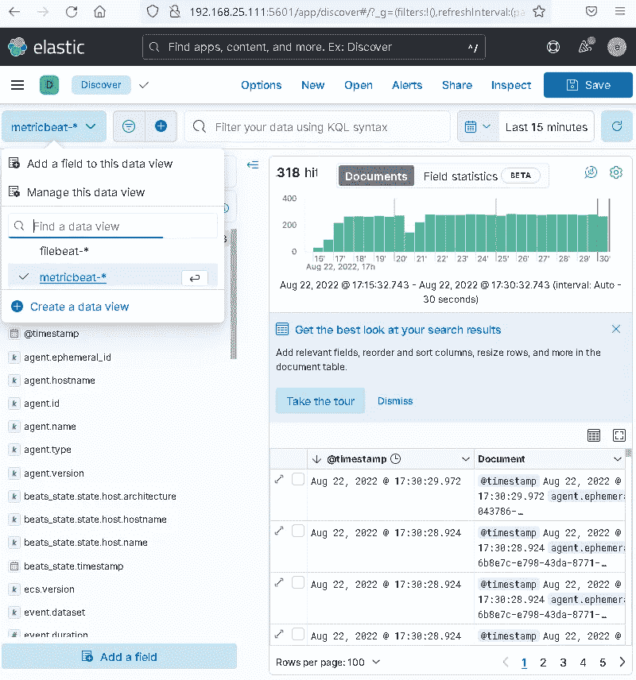
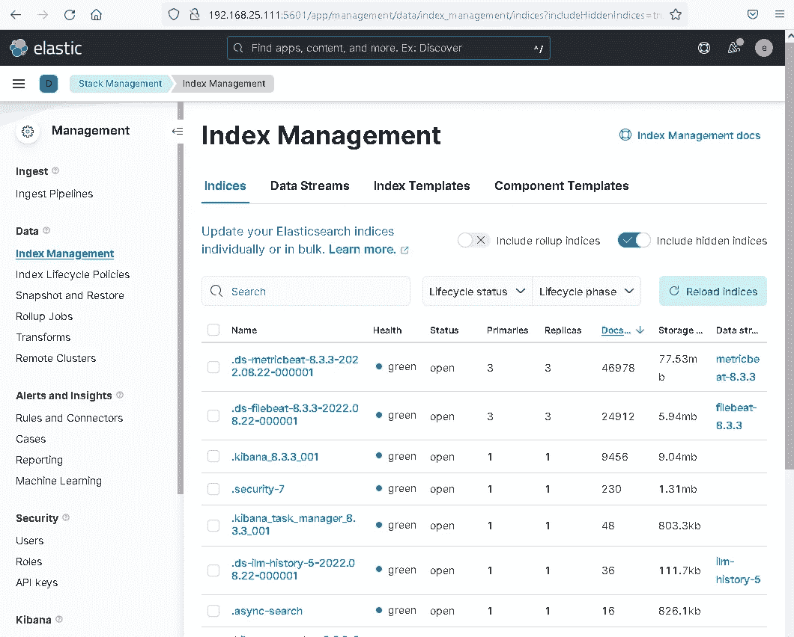
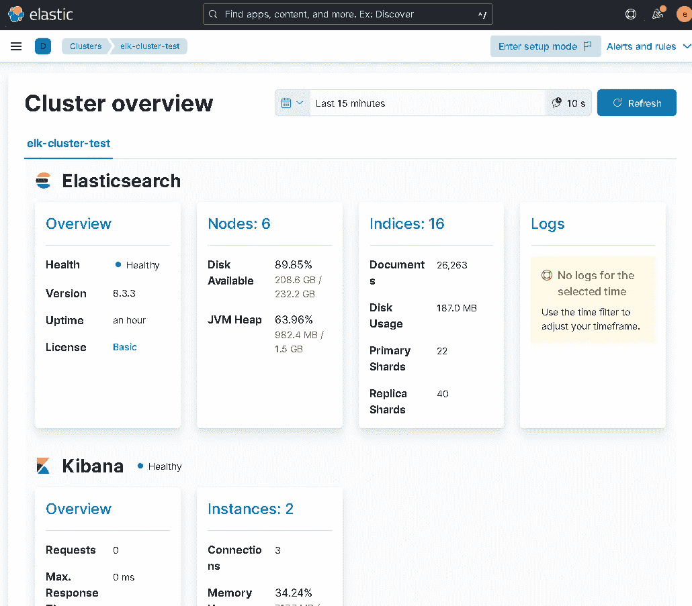

# 用 Ansible 安装和配置 ELK 堆栈

> 原文：<https://itnext.io/install-and-configure-the-elk-stack-with-ansible-aa7c1494477a?source=collection_archive---------4----------------------->


这个[可行集合](https://github.com/garutilorenzo/ansible-collection-elk)将安装和配置一个高可用的[弹性搜索集群](https://www.elastic.co/elasticsearch/)。

使用此集合，您还可以安装和配置:

*   [Logstash](https://www.elastic.co/logstash/) 是一个免费开放的服务器端数据处理管道，它从大量来源获取数据，对其进行转换，然后将其发送到您最喜欢的“stash”
*   Kibana 是一个免费开放的用户界面，可以让你可视化你的 Elasticsearch 数据并浏览 Elastic Stack。做任何事情，从跟踪查询负载到了解请求通过应用程序的方式

还有弹性拍子:

*   [filebeat](https://www.elastic.co/beats/filebeat) —无论您是从安全设备、云、容器、主机还是 OT 收集数据，filebeat 都通过提供一种轻量级的方法来转发和集中日志和文件，帮助您让简单的事情变得简单。
*   [指标测试](https://www.elastic.co/beats/metricbeat)从您的系统和服务中收集指标。从 CPU 到内存，从 Redis 到 NGINX，等等，Metricbeat 是一种发送系统和服务统计信息的轻量级方式。
*   [heartbeath](https://www.elastic.co/beats/heartbeat) 通过主动探测监控服务的可用性。给定一个 URL 列表，Heartbeat 会问一个简单的问题:你还活着吗？Heartbeat 将这些信息和响应时间发送给弹性堆栈的其余部分，以供进一步分析。

在大多数情况下，你可能更喜欢 [ECK](https://www.elastic.co/guide/en/cloud-on-k8s/current/k8s-quickstart.html) 或[弹性云](https://www.elastic.co/cloud/),但是如果 Kubernetes 对你来说就像超人的氪石，或者如果你对你的数据很好奇，或者甚至如果你不信任任何云提供商，这就是正确的地方。

# 流浪起来，建立测试基础设施

为了测试这个集合，我们使用了[流浪者](https://www.vagrantup.com/)和 [Virtualbox](https://www.virtualbox.org/) ，但是如果你喜欢，你也可以使用你自己的虚拟机或者你的裸机。

第一步是下载这个 [repo](https://github.com/garutilorenzo/ansible-collection-elk) 并启动所有虚拟机。但是首先在这个流浪汉文件中把你的公共 ssh 密钥粘贴到 *CHANGE_ME* 变量中。您还可以通过更改 NNODES 变量来调整部署的虚拟机数量(在本例中，我们将使用 6 个节点)。现在，我们准备好调配机器了:

```
git clone https://github.com/garutilorenzo/ansible-collection-elk.git

cd nsible-collection-elk/

vagrant up
Bringing machine 'elk-ubuntu-0' up with 'virtualbox' provider...
Bringing machine 'elk-ubuntu-1' up with 'virtualbox' provider...
Bringing machine 'elk-ubuntu-2' up with 'virtualbox' provider...
Bringing machine 'elk-ubuntu-3' up with 'virtualbox' provider...
Bringing machine 'elk-ubuntu-4' up with 'virtualbox' provider...
Bringing machine 'elk-ubuntu-5' up with 'virtualbox' provider...

[...]
[...]

    elk-ubuntu-5: Inserting generated public key within guest...
==> elk-ubuntu-5: Machine booted and ready!
==> elk-ubuntu-5: Checking for guest additions in VM...
    elk-ubuntu-5: The guest additions on this VM do not match the installed version of
    elk-ubuntu-5: VirtualBox! In most cases this is fine, but in rare cases it can
    elk-ubuntu-5: prevent things such as shared folders from working properly. If you see
    elk-ubuntu-5: shared folder errors, please make sure the guest additions within the
    elk-ubuntu-5: virtual machine match the version of VirtualBox you have installed on
    elk-ubuntu-5: your host and reload your VM.
    elk-ubuntu-5:
    elk-ubuntu-5: Guest Additions Version: 6.0.0 r127566
    elk-ubuntu-5: VirtualBox Version: 6.1
==> elk-ubuntu-5: Setting hostname...
==> elk-ubuntu-5: Configuring and enabling network interfaces...
==> elk-ubuntu-5: Mounting shared folders...
    elk-ubuntu-5: /vagrant => C:/Users/Lorenzo Garuti/workspaces/simple-ubuntu
==> elk-ubuntu-5: Running provisioner: shell...
    elk-ubuntu-5: Running: inline script
==> elk-ubuntu-5: Running provisioner: shell...
    elk-ubuntu-5: Running: inline script
    elk-ubuntu-5: hello from node 5
```

# 可行的设置和飞行前检查

现在，如果您没有安装 Ansible，请安装 ansible 并满足所有要求:

```
apt-get install python3 python3-pip
pip3 install pipenv

pipenv shell
pip install -r requirements.txt
```

现在安装了 Ansible 之后，我们可以直接从 GitHub 下载这个集合:

```
ansible-galaxy collection install git+https://github.com/garutilorenzo/ansible-collection-elk
```

安装 Ansible 和集合后，我们可以设置库存文件(hosts.ini):

```
[elasticsearch_master]
elk-ubuntu-0 ansible_host=192.168.25.110
elk-ubuntu-1 ansible_host=192.168.25.111
elk-ubuntu-2 ansible_host=192.168.25.112

[elasticsearch_data]
elk-ubuntu-3 ansible_host=192.168.25.113
elk-ubuntu-4 ansible_host=192.168.25.114
elk-ubuntu-5 ansible_host=192.168.25.115

[elasticsearch_ca]
elk-ubuntu-0 ansible_host=192.168.25.110

[kibana]
elk-ubuntu-1 ansible_host=192.168.25.111
elk-ubuntu-4 ansible_host=192.168.25.114

[logstash]
elk-ubuntu-2 ansible_host=192.168.25.112
elk-ubuntu-5 ansible_host=192.168.25.115

[elasticsearch:children]
elasticsearch_master
elasticsearch_data
```

和 vars.yml 文件:

```
---disable_firewall: yes
disable_selinux: yeselasticsearch_version: 8.3.3
kibana_version: 8.3.3
logstash_version: 8.3.3
beats_version: 8.3.3elasticsearch_resolv_mode: hosts
elasticsearch_install_mode: local
elasticsearch_local_tar_path: ~/elk_tar_path
elasticsearch_monitoring_enabled: yes
elasticsearch_master_is_also_data_node: yeskibana_install_mode: local
kibana_local_tar_path: ~/elk_tar_path
setup_kibana_dashboards: yes
kibana_url: [http://elk-ubuntu-1:5601](http://elk-ubuntu-1:5601)heartbeat_number_of_shards: 3
heartbeat_number_of_replicas: 3metricbeat_number_of_shards: 3
metricbeat_number_of_replicas: 3filebeat_number_of_shards: 3
filebeat_number_of_replicas: 3elasticsearch_hosts:
  - elk-ubuntu-0 
  - elk-ubuntu-1
  - elk-ubuntu-2 
  - elk-ubuntu-3 
  - elk-ubuntu-4 
  - elk-ubuntu-5
```

最后一组将包括:

*   6 个弹性搜索节点(主节点也是数据节点)
*   2 个基巴纳实例
*   2 个 logstash 实例

并且:

*   所有虚拟机都将受到弹性节拍的监控
*   所有的索引模板都有 3 个碎片和 3 个副本
*   由于我们没有任何可用的 DNS，Ansible 将在/etc/hosts 文件中插入所有的节点名
*   防火墙和 selinux 将被禁用

为了节省带宽，我们将 elasticsearch 和 kibana 下载到我们的 Ansible 机器上:

```
mkdir -p ~/elk_tar_path # <- you can customize this path by changing elasticsearch_local_tar_path variable
curl  -o ~/elk_tar_path/kibana-8.3.3-linux-x86_64.tar.gz https://artifacts.elastic.co/downloads/kibana/kibana-8.3.3-linux-x86_64.tar.gz
curl  -o ~/elk_tar_path/elk_tar_path/elasticsearch-8.3.3-linux-x86_64.tar.gz https://artifacts.elastic.co/downloads/elasticsearch/elasticsearch-8.3.3-linux-x86_64.tar.gz
```

我们必须创建证书目录，弹性证书将存储在该目录中:

```
mkdir -p ~/very_secure_dir # <- you can customize this path by changing elasticsearch_local_certs_dir variable
```

继续安装前的最后一步是创建 site.yml 文件:

```
---
- hosts: elasticsearch 
  become: yes
  remote_user: vagrant
  collections:
    - garutilorenzo.ansible_collection_elk
  vars_files:
    - vars.ymltasks:
    - import_role:
        name: elasticsearch- hosts: kibana 
  become: yes
  remote_user: vagrant
  collections:
    - garutilorenzo.ansible_collection_elk
  vars_files:
    - vars.ymltasks:
    - import_role:
        name: kibana- hosts: logstash 
  become: yes
  remote_user: vagrant
  collections:
    - garutilorenzo.ansible_collection_elk
  vars_files:
    - vars.ymltasks:
    - import_role:
        name: logstash- hosts: elasticsearch 
  become: yes
  remote_user: vagrant
  collections:
    - garutilorenzo.ansible_collection_elk
  vars_files:
    - vars.ymltasks:
    - import_role:
        name: beats
```

# 用 Ansible 部署 ELK

我们终于准备好用 ansible 安装 ELK 堆栈了，因为我们没有任何 CA 证书，我们将一个额外的变量 *generateca* 传递给我们的剧本:

```
export ANSIBLE_HOST_KEY_CHECKING=False # Ansible skip ssh-key validation
ansible-playbook site.yml -i hosts.ini -e "generateca=yes"ansible-playbook site.yml -i hosts.iniPLAY [elasticsearch] ***************************************************************************************************************************************TASK [Gathering Facts] *************************************************************************************************************************************
ok: [elk-ubuntu-0]
ok: [elk-ubuntu-1]
ok: [elk-ubuntu-2]
ok: [elk-ubuntu-3]
ok: [elk-ubuntu-4]
ok: [elk-ubuntu-5]TASK [garutilorenzo.ansible_collection_elk.elasticsearch : setup] ******************************************************************************************
ok: [elk-ubuntu-2]
ok: [elk-ubuntu-0]
ok: [elk-ubuntu-3]
ok: [elk-ubuntu-1]
ok: [elk-ubuntu-4]
ok: [elk-ubuntu-5]TASK [garutilorenzo.ansible_collection_elk.elasticsearch : include_tasks] **********************************************************************************
included: /home/lorenzo/workspaces-local/ansible-test-collection/elk/collections/ansible_collections/garutilorenzo/ansible_collection_elk/roles/elasticsearch/tasks/preflight.yml for elk-ubuntu-0, elk-ubuntu-1, elk-ubuntu-2, elk-ubuntu-3, elk-ubuntu-4, elk-ubuntu-5TASK [garutilorenzo.ansible_collection_elk.elasticsearch : Put SELinux in permissive mode, logging actions that would be blocked.] *************************
skipping: [elk-ubuntu-0]
skipping: [elk-ubuntu-1]
skipping: [elk-ubuntu-2]
skipping: [elk-ubuntu-3]
skipping: [elk-ubuntu-4]
skipping: [elk-ubuntu-5]TASK [garutilorenzo.ansible_collection_elk.elasticsearch : Disable SELinux] ********************************************************************************
skipping: [elk-ubuntu-0]
skipping: [elk-ubuntu-1]
skipping: [elk-ubuntu-2]
skipping: [elk-ubuntu-3]
skipping: [elk-ubuntu-4]
skipping: [elk-ubuntu-5]TASK [garutilorenzo.ansible_collection_elk.elasticsearch : disable firewalld] ******************************************************************************
skipping: [elk-ubuntu-0]
skipping: [elk-ubuntu-1]
skipping: [elk-ubuntu-2]
skipping: [elk-ubuntu-3]
skipping: [elk-ubuntu-4]
skipping: [elk-ubuntu-5]TASK [garutilorenzo.ansible_collection_elk.elasticsearch : disable ufw] ************************************************************************************
changed: [elk-ubuntu-3]
changed: [elk-ubuntu-0]
changed: [elk-ubuntu-2]
changed: [elk-ubuntu-4]
changed: [elk-ubuntu-1]
changed: [elk-ubuntu-5][...]
[...]
```

这可能需要一段时间，但是如果一切顺利，最终可能的输出将是:

```
[...]
[...]TASK [garutilorenzo.ansible_collection_elk.beats : enable and start heartbeat] *****************************************************************************
changed: [elk-ubuntu-0]
changed: [elk-ubuntu-1]
changed: [elk-ubuntu-3]
changed: [elk-ubuntu-4]
changed: [elk-ubuntu-5]
changed: [elk-ubuntu-2]RUNNING HANDLER [garutilorenzo.ansible_collection_elk.beats : reload systemd] ******************************************************************************
ok: [elk-ubuntu-4]
ok: [elk-ubuntu-0]
ok: [elk-ubuntu-3]
ok: [elk-ubuntu-1]
ok: [elk-ubuntu-2]
ok: [elk-ubuntu-5]RUNNING HANDLER [garutilorenzo.ansible_collection_elk.beats : reload filebeat] *****************************************************************************
changed: [elk-ubuntu-0]
changed: [elk-ubuntu-4]
changed: [elk-ubuntu-1]
changed: [elk-ubuntu-2]
changed: [elk-ubuntu-5]
changed: [elk-ubuntu-3]RUNNING HANDLER [garutilorenzo.ansible_collection_elk.beats : reload heartbeat] ****************************************************************************
changed: [elk-ubuntu-2]
changed: [elk-ubuntu-1]
changed: [elk-ubuntu-0]
changed: [elk-ubuntu-3]
changed: [elk-ubuntu-4]
changed: [elk-ubuntu-5]RUNNING HANDLER [garutilorenzo.ansible_collection_elk.beats : reload metricbeat] ***************************************************************************
changed: [elk-ubuntu-1]
changed: [elk-ubuntu-4]
changed: [elk-ubuntu-0]
changed: [elk-ubuntu-3]
changed: [elk-ubuntu-5]
changed: [elk-ubuntu-2]PLAY RECAP *************************************************************************************************************************************************
elk-ubuntu-0               : ok=119  changed=61   unreachable=0    failed=0    skipped=12   rescued=0    ignored=1   
elk-ubuntu-1               : ok=135  changed=68   unreachable=0    failed=0    skipped=15   rescued=0    ignored=1   
elk-ubuntu-2               : ok=136  changed=72   unreachable=0    failed=0    skipped=14   rescued=0    ignored=1   
elk-ubuntu-3               : ok=114  changed=58   unreachable=0    failed=0    skipped=12   rescued=0    ignored=1   
elk-ubuntu-4               : ok=135  changed=68   unreachable=0    failed=0    skipped=15   rescued=0    ignored=1   
elk-ubuntu-5               : ok=136  changed=72   unreachable=0    failed=0    skipped=14   rescued=0    ignored=1
```

现在我们使用 Kibana 来分析我们的弹性搜索数据:


密码是默认的引导密码 *changeme* 。你可以在 elasticsearch 角色中自定义这个变量，你要修改*elastic search _ bootstrap _ password*变量。**记住**在 vars.yml 文件中设置相同的值格式 *elasticsearch_password* 和*elastic search _ bootstrap _ password*。

这是默认的 Kibana 仪表板:


现在我们可以*发现*我们在分析中的数据- >发现:



在这里，我们可以使用 KQL 语法过滤我们的数据，或者使用许多 Kibana 特性中的一个。

我们还可以使用各种 Beats 提供的众多仪表板中的一个来检查我们的数据(分析->仪表板)。例如，我们可以检查 metricbeat 系统仪表板:


在管理->堆栈管理->索引管理中，我们可以看到所有的索引。我们必须启用*Include hidden indexes*，因为在我们全新的集群中，所有索引都是隐藏的(filebeat、heartbeat、metricbeat)



在管理->堆栈监控中，我们可以启用*自我监控*功能:


现在，我们可以检查集群状态:



这只是对 ELK Stack 的一个简短介绍，你可以在 [Elastic Docs](https://www.elastic.co/guide/index.html) 上阅读更多内容。为了获得最佳形式的麋鹿栈阅读也[弹性可观性](https://www.elastic.co/observability)。

# 打扫

完成后，您最终可以使用以下命令销毁集群:

```
vagrant destroy
    elk-ubuntu-5: Are you sure you want to destroy the 'elk-ubuntu-5' VM? [y/N] y
==> elk-ubuntu-5: Forcing shutdown of VM...
==> elk-ubuntu-5: Destroying VM and associated drives...
    elk-ubuntu-4: Are you sure you want to destroy the 'elk-ubuntu-4' VM? [y/N] y
==> elk-ubuntu-4: Forcing shutdown of VM...
==> elk-ubuntu-4: Destroying VM and associated drives...
    elk-ubuntu-3: Are you sure you want to destroy the 'elk-ubuntu-3' VM? [y/N] y
==> elk-ubuntu-3: Forcing shutdown of VM...
==> elk-ubuntu-3: Destroying VM and associated drives...
    elk-ubuntu-2: Are you sure you want to destroy the 'elk-ubuntu-2' VM? [y/N] y
==> elk-ubuntu-2: Forcing shutdown of VM...
==> elk-ubuntu-2: Destroying VM and associated drives...
    elk-ubuntu-1: Are you sure you want to destroy the 'elk-ubuntu-1' VM? [y/N] y
==> elk-ubuntu-1: Forcing shutdown of VM...
==> elk-ubuntu-1: Destroying VM and associated drives...
    elk-ubuntu-0: Are you sure you want to destroy the 'elk-ubuntu-0' VM? [y/N] y
==> elk-ubuntu-0: Forcing shutdown of VM...
==> elk-ubuntu-0: Destroying VM and associated drives...
```